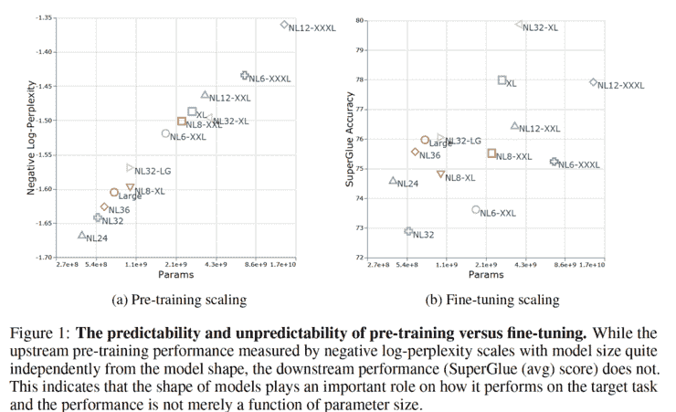
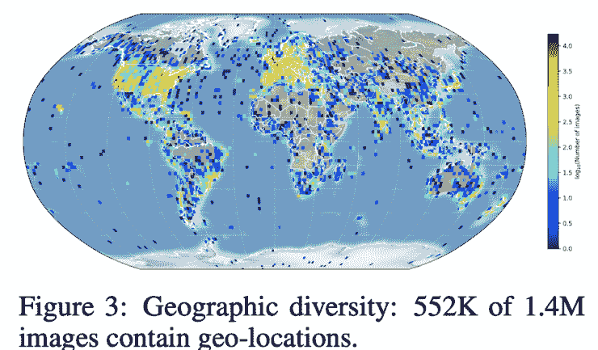
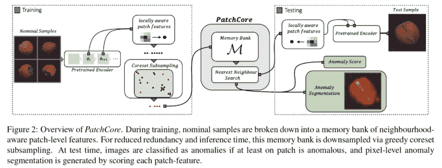
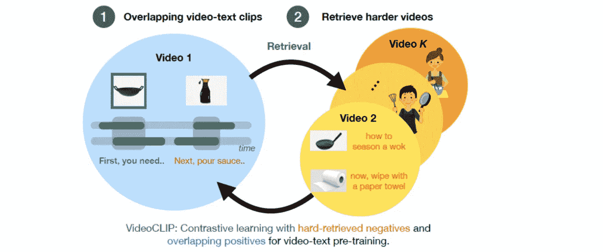
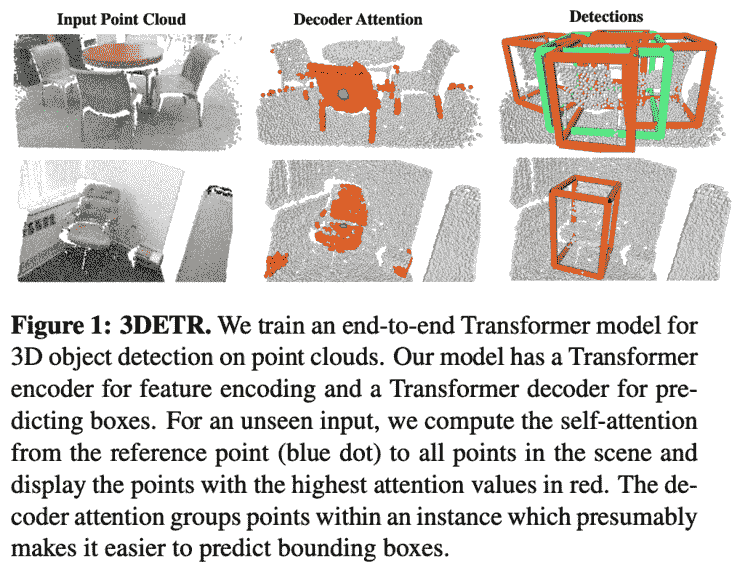
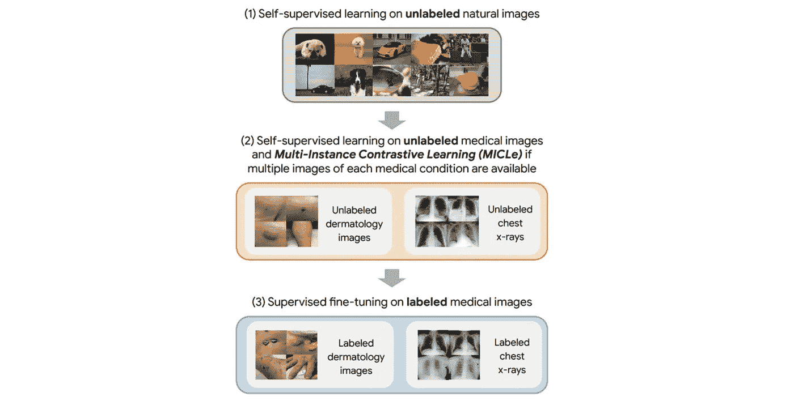
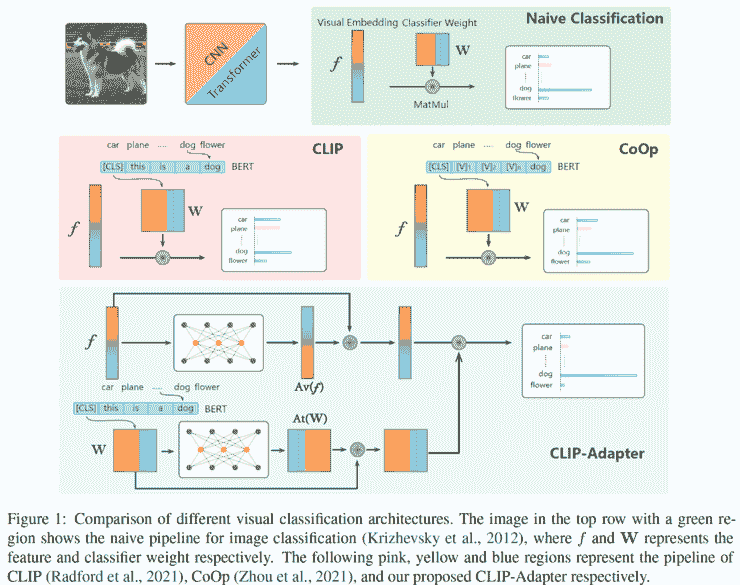
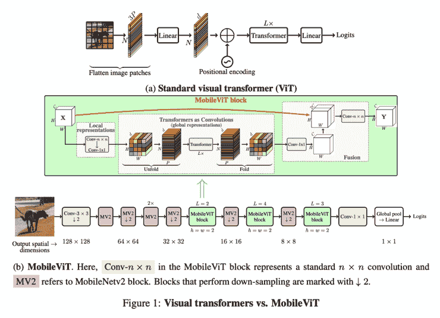

# Akira 的机器学习新闻—第 33 期

> 原文：<https://medium.com/analytics-vidhya/akiras-machine-learning-news-issue-33-a9866e366a0e?source=collection_archive---------15----------------------->

本周特稿/新闻。

*   [一个新的自我监督学习数据集](https://arxiv.org/abs/2109.13228)已经发布，可以用于商业目的，并且是肖像权友好的。作为业界的一员，我非常感谢这样的数据集，因为学术界经常使用的 ImageNet 这样的大规模数据通常是没有商用的！
*   [似乎前期训练的精度越高，下游任务的精度也不一定会变得越高](https://arxiv.org/abs/2109.10686)。因此，似乎下游任务的扩展策略需要与预培训的扩展策略分开考虑。

— — — — — — — — — — — — — — — — — — –

在下面的章节中，我将介绍各种文章和论文，不仅仅是关于上述内容，还包括以下五个主题。

1.  本周特稿/新闻
2.  机器学习用例
3.  报纸
4.  机器学习技术相关文章

— — — — — — — — — — — — — — — — — — –

# 1.本周特稿/新闻

[**培训前的绩效不一定与下游任务的绩效相匹配。**](https://arxiv.org/abs/2109.10686?utm_campaign=Akira%27s%20Machine%20Learning%20News%20%20%20&utm_medium=email&utm_source=Revue%20newsletter)**——**[**arxiv.org**](https://arxiv.org/abs/2109.10686)

[2109.10686]高效扩展:来自预训练和微调变压器的见解
这是一项关于模型规模和下游任务准确性之间关系的研究。随着模型变大，预训练性能变得更好，但它不一定与下游任务的性能相匹配。作者提出了 DeepNarrow 策略，对模型进行了缩小和深化，成功地将训练速度提高了 40%，同时保持了下游任务的性能。

[**140 万张图片的数据集，避免了版权和肖像权等问题**](https://arxiv.org/abs/2109.13228?utm_campaign=Akira%27s%20Machine%20Learning%20News%20%20%20&utm_medium=email&utm_source=Revue%20newsletter)**——**[**arxiv.org**](https://arxiv.org/abs/2109.13228)

[2109.13228]PASS:ImageNet 替代了没有人参与的自我监督预训练
ImageNet 等大型数据集在未经人们同意的情况下许可和使用他们的照片方面存在问题。为了解决这个问题，作者收集了 CC-BY 许可证下可用的数据，并发布了 PASS，这是一个用于自我监督学习的数据集，将人排除在数据之外。他们证实，它避免了版权等问题，可以用 MoCo、迪诺等进行训练。

— — — — — — — — — — — — — — — — — — –

# 2.机器学习用例

[**可持续人工智能系统**](https://thegradient.pub/sustainable-ai/?utm_campaign=Akira%27s%20Machine%20Learning%20News%20%20%20&utm_medium=email&utm_source=Revue%20newsletter)

 [## 可持续人工智能系统的必要性

### 这件作品赢得了首届渐变奖。简介人工智能系统是计算密集型的:人工智能…

thegradient.pub](https://thegradient.pub/sustainable-ai/) 

一篇讨论如何实现可持续的人工智能系统的文章。虽然计算量目前正在增加，但文章建议使用更小的模型，分散计算区域(碳排放区域)，并优化软件和硬件能源。

— — — — — — — — — — — — — — — — — — –

# 3.机器学习论文

[**异常检测方法使用计算效率高的预训练模型**](https://arxiv.org/abs/2106.08265?utm_campaign=Akira%27s%20Machine%20Learning%20News%20%20%20&utm_medium=email&utm_source=Revue%20newsletter)**—**[**arxiv.org**](https://arxiv.org/abs/2106.08265)

[2106.08265]针对工业异常检测中的全面召回
提出了 PatchCore，它使用学习模型进行异常检测。其特征在于具有一个核心集，该核心集聚集了每一片训练样本的特征信息。在 MVTech 数据集上实现了 SotA 性能。

[**用文字和视频对比学习**](https://arxiv.org/abs/2109.14084?utm_campaign=Akira%27s%20Machine%20Learning%20News%20%20%20&utm_medium=email&utm_source=Revue%20newsletter)**——【arxiv.org】**

****

**【2109.14084】VideoCLIP:零镜头视频文本理解对比预训练
提出 Video clip，对文本和视频进行对比学习。视频的采样围绕采样文本的时间而变化，通过聚类对高难度样本进行对比学习。该方法在下游任务中的零镜头推理性能优于监督学习。**

******—**[**【arxiv.org】**](https://arxiv.org/abs/2109.08141)****

********

****【2109.08141】用于 3D 对象检测的端到端转换器模型
作者提出了一种 3D 对象检测方法，3DETR，可以通过端到端进行训练。3DETR 像 DETR 一样将点云的对象检测作为一个集对集的问题来处理，但与 DETR 不同，它只使用变压器，并消除了需要手动调整的参数。****

****[**医学影像自学学习**](https://arxiv.org/abs/2101.05224?utm_campaign=Akira%27s%20Machine%20Learning%20News%20%20%20&utm_medium=email&utm_source=Revue%20newsletter)**——**[**arxiv.org**](https://arxiv.org/abs/2101.05224)****

********

****[2101.05224]大型自我监督模型推进医学图像分类
这是一项关于如何在 ImageNet 上进行自我监督学习，然后再次在医学图像上进行自我监督学习，以提高后续分类任务的性能的研究。由于医学图像通常是从多个角度拍摄的，作者提出了多示例对比学习，将它们视为相同的数据。****

****[**微调剪辑通过添加小网络和残余连接**](https://arxiv.org/abs/2110.04544?utm_campaign=Akira%27s%20Machine%20Learning%20News%20%20%20&utm_medium=email&utm_source=Revue%20newsletter)**——**[**【arxiv.org】**](https://arxiv.org/abs/2110.04544)****

********

****[2110.04544] CLIP-Adapter:具有功能适配器的更好的视觉语言模型
他们提出了 CLIP-Adapter，可以使用更少的数据来微调剪辑。它在每个图像和语言分支的最后一层之后添加一个小网络，并对其进行微调。该结构的另一个特点是通过残留连接很容易保留原最终层的信息。用更少的数据就能获得好的性能。****

****[**结合 Transformer 和 CNN 构建高速运行的网络**](https://arxiv.org/abs/2110.02178?utm_campaign=Akira%27s%20Machine%20Learning%20News%20%20%20&utm_medium=email&utm_source=Revue%20newsletter)**——**[**arxiv.org**](https://arxiv.org/abs/2110.02178)****

********

****[2110.02178] MobileViT:轻量级、通用型和移动友好型视觉转换器
作者提出了 MobileViT，这是一种结合了转换器和 CNN 的移动设备高速网络。首先，CNN 捕获本地信息，然后 Transformer 处理全局信息。比 MobileNetv3 精确 5.7%。它可以用于分类、对象检测和分割。****

****— — — — — — — — — — — — — — — — — — –****

# ****4.技术文章****

****[**Pytorch 实现的著名算法**](https://nn.labml.ai/?utm_campaign=Akira%27s%20Machine%20Learning%20News%20%20%20&utm_medium=email&utm_source=Revue%20newsletter)**——**[**nn . labml . ai**](https://nn.labml.ai/)****

**** [## labml.ai 注释 PyTorch 论文实现

### 这是神经网络和相关算法的简单 PyTorch 实现的集合。这些实现…

nn.labml.ai](https://nn.labml.ai/) 

这个网站介绍了许多论文的核心技术的 pytorch 实现，包括 gMLP、GAN 和强化学习等新技术。如果你对某项技术感兴趣，你可以在这里查看一下。

— — — — — — — — — — — — — — — — — — –

# 5.其他主题

【aijourn.com】**20 艾人观看****——**

** [## 你需要关注的 20 个人工智能影响者——人工智能杂志

### “人工智能将在 2029 年左右达到人类水平。如果继续这样下去，比如说，到 2045 年，我们将会…

aijourn.com](https://aijourn.com/20-ai-influencers-you-need-to-be-following) 

这是一篇介绍人工智能领域 20 位有影响力的人的文章，并附有对他们的 Twitter 和 LinkedIn 账户的描述。** 

## **— — — — — — — — — — — — — — — — — — –**

# **其他博客**

** [## 机器学习 2020 摘要:84 篇有趣的论文/文章

### 在这篇文章中，我总共展示了 2020 年发表的 84 篇我觉得特别有趣的论文和文章…

towardsdatascience.com](https://towardsdatascience.com/machine-learning-2020-summary-84-interesting-papers-articles-45bd45c0d35b)  [## 计算机视觉 x 变形金刚的最新发展和看法

### 《变形金刚》和 CNN 的区别，为什么《变形金刚》很重要，它的弱点是什么。

towardsdatascience.com](https://towardsdatascience.com/recent-developments-and-views-on-computer-vision-x-transformer-ed32a2c72654)  [## 超大质量模型 GPT-3 的到达和极限

### 在这篇博文中，我将从技术上解释 GPT 3 号，GPT 3 号取得了什么，GPT 3 号没有取得什么…

medium.com](/analytics-vidhya/reach-and-limits-of-the-supermassive-model-gpt-3-5012a6ddff00)  [## 视觉变形器看起来像卷积神经网络吗？(论文解释)

### 我将仔细研究 CNN 和变形金刚之间的差异

towardsdatascience.com](https://towardsdatascience.com/do-vision-transformers-see-like-convolutional-neural-networks-paper-explained-91b4bd5185c8) 

## — — — — — — — — — — — — — — — — — — –

# 关于我

制造工程师/机器学习工程师/数据科学家/物理学硕士/[http://github.com/AkiraTOSEI/](https://t.co/hjHHbG24Ph?amp=1&utm_campaign=Akira%27s%20Machine%20Learning%20News%20%20%20&utm_medium=email&utm_source=Revue%20newsletter)

推特，我贴一句纸评论。******