# Akira 的机器学习新闻—第 34 期

> 原文：<https://medium.com/analytics-vidhya/akiras-machine-learning-news-issue-34-55111a45fef7?source=collection_archive---------3----------------------->

本周特稿/新闻。

*   过去曾有[的一项研究](https://arxiv.org/abs/2105.07197)表明，ViT 的分类行为比 CNN 更像人类，但现在[发表了一项新的研究](https://arxiv.org/abs/2110.07858)表明，即使在逐个补丁的基础上受到干扰，ViT 也能正确分类。CNN 靠的是纹理，ViT 靠的是贴片，两者似乎都与人的感知不同。
*   [提出了一种将矩阵乘积加速 100 倍的方法](https://arxiv.org/abs/2106.10860)。由于矩阵乘积在深度学习的总计算量中占很大比例，这种技术可能更容易在社会上实现大规模模型。

— — — — — — — — — — — — — — — — — — –

在下面的章节中，我将介绍各种文章和论文，不仅仅是关于上述内容，还包括以下五个主题。

1.  本周特稿/新闻
2.  机器学习用例
3.  报纸
4.  机器学习技术相关文章

— — — — — — — — — — — — — — — — — — –

# 1.本周特稿/新闻

[**即使旋转或混洗补丁，ViT 也不会失去精度**](https://arxiv.org/abs/2110.07858?utm_campaign=Akira%27s%20Machine%20Learning%20News%20%20%20&utm_medium=email&utm_source=Revue%20newsletter)**——**[**arxiv.org**](https://arxiv.org/abs/2110.07858)

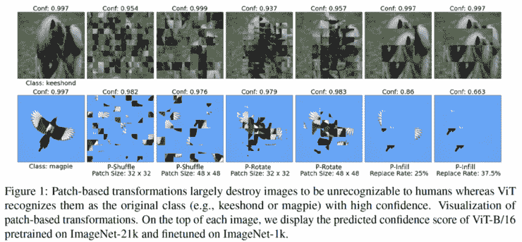

*【2110.07858】通过基于补丁的负增强了解和提高视觉转换器的鲁棒性*
由于 ViT 通过将图像划分为补丁来对图像进行分类，因此作者发现，即使图像在每个补丁中被错误地混洗或旋转，ViT 的准确性也不会下降。为了防止这种情况，他们提出了一种数据扩充方法，这种方法通过混合的补丁数据来惩罚正确的分类。

【arxiv.org】****——****通过使用查找表的加法来加速矩阵乘积****

****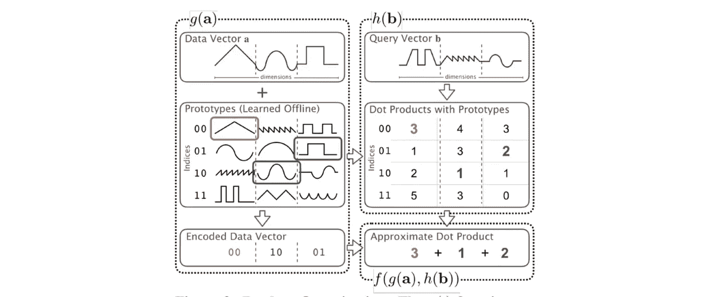****

*****【2106.10860】乘矩阵不乘* 研究加快矩阵乘法。将一个向量分成若干子部分，并有一个子部分的查找表。通过搜索目标向量的最近邻，将它们求和来计算矩阵乘积。这比通常的矩阵乘积快 100 倍，而且精度不打折扣。****

****— — — — — — — — — — — — — — — — — — –****

# ****2.机器学习用例****

****Photoshop 中使用的****——**[**【thenextweb.com】**](https://thenextweb.com/news/ai-driving-powerful-photoshop-features-and-shaping-adobe-product-strategy-syndication)******

**** [## 人工智能如何塑造 Adobe 的产品战略

### 像每年一样，Adobe 的 Max 2021 活动展示了世界领先的产品展示和其他创新…

thenextweb.com](https://thenextweb.com/news/ai-driving-powerful-photoshop-features-and-shaping-adobe-product-strategy-syndication) 

这是一篇介绍 Adobe 的 Photoshop 中使用的机器学习功能的文章，其中使用了机器学习技术来自动遮罩复杂的形状，并使用样式转移来转换背景。虽然许多公司都在努力采用机器学习技术，但 Adobe 的例子可能是一个很好的案例研究。**** 

****— — — — — — — — — — — — — — — — — — –****

# ****3.机器学习论文****

****[**AST 模型，即使当讲话的长度变化很大时也能使用相同的模型**](https://arxiv.org/abs/2104.01778?utm_campaign=Akira%27s%20Machine%20Learning%20News%20%20%20&utm_medium=email&utm_source=Revue%20newsletter)**——**[**arxiv.org**](https://arxiv.org/abs/2104.01778)****

****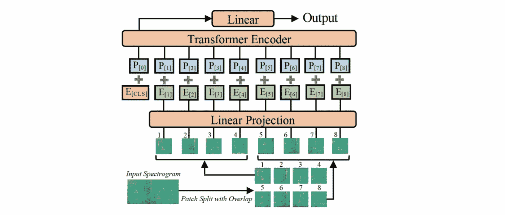****

*****【2104.01778】AST:音频声谱图变换器* 提出了一种使用变换器的音频用 AST(音频声谱图变换器)。声谱图作为面片输入到变换器。即使当音频长度相差很大(1~10s)时，也可以使用相同的模型，并且在三个数据集上实现了 SotA 性能。****

****[**激活功能调查**](https://arxiv.org/abs/2109.14545?utm_campaign=Akira%27s%20Machine%20Learning%20News%20%20%20&utm_medium=email&utm_source=Revue%20newsletter)**——**[**arxiv.org**](https://arxiv.org/abs/2109.14545)****

****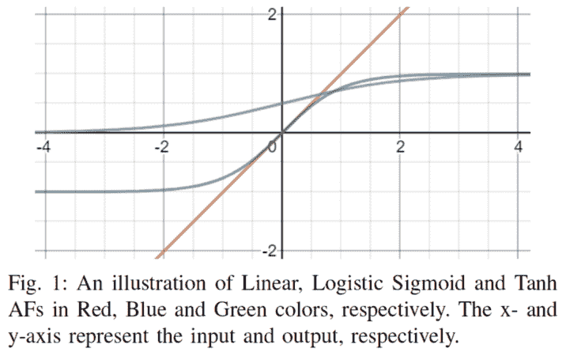****

*****【2109.14545】深度学习中激活函数的综合调查与性能分析* 这是对激活函数的综合调查:ReLU LReLU 等。在残差网络中工作良好，并且参数化激活函数具有快速收敛。****

****[**课程学习提高预学语言模型效率**](https://arxiv.org/abs/2108.06084?utm_campaign=Akira%27s%20Machine%20Learning%20News%20%20%20&utm_medium=email&utm_source=Revue%20newsletter)**——**[**arxiv.org**](https://arxiv.org/abs/2108.06084)****

****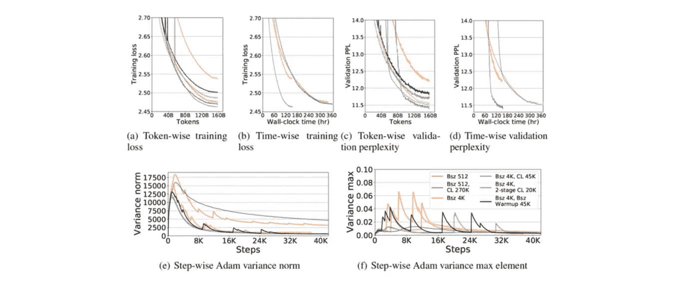****

*****【2108.06084】课程学习:高效稳定的亿级 GPT 模型预训练的正则化方法* 一篇声称课程学习在预训练 GPT-2 这样的大规模自回归语言模型中有效的论文。使用序列长度作为难度指标，用逐渐变长的序列训练模型。它能够实现稳定的学习并提高学习效率。****

****[**在 12 层深度的 ImageNet 中达到 top-1 80%的准确率**](https://arxiv.org/abs/2110.07641?utm_campaign=Akira%27s%20Machine%20Learning%20News%20%20%20&utm_medium=email&utm_source=Revue%20newsletter)**——**[**arxiv.org**](https://arxiv.org/abs/2110.07641)****

****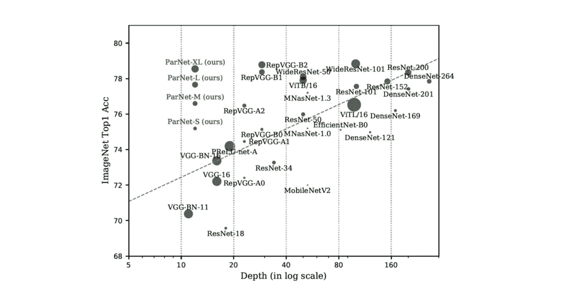****

****[2110.07641]非深度网络
通过增加子网而不是加深来提高准确性的研究。通过创建一个仅共享输入和输出的子网，作者可以在只有 12 层深度的 ImageNet 中实现最高 80%的准确性。****

****[**提供数学问题数据集**](https://arxiv.org/abs/2110.14168?utm_campaign=Akira%27s%20Machine%20Learning%20News%20%20%20&utm_medium=email&utm_source=Revue%20newsletter)**——**[**arxiv.org**](https://arxiv.org/abs/2110.14168)****

****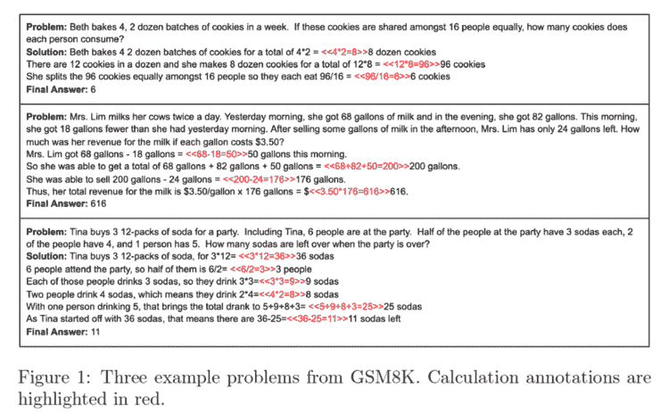****

*****【2110.14168】训练验证者解决数学应用题* 作者提供了一个 8500 个小学水平算术的数据集 GSM8K，并开发了一个求解方法。由于简单的微调会导致过拟合，所以他们使用了一种叫做 verifier 的方法，这种方法使用一种模型，这种模型会沿途生成计算，直到得出最终答案，然后对其进行验证。****

****— — — — — — — — — — — — — — — — — — –****

# ****4.技术文章****

****[**自动微分的解释**](https://pytorch.org/blog/overview-of-pytorch-autograd-engine/?utm_campaign=Akira%27s%20Machine%20Learning%20News%20%20%20&utm_medium=email&utm_source=Revue%20newsletter)**——**[**pytorch.org**](https://pytorch.org/blog/overview-of-pytorch-autograd-engine/)****

**** [## PyTorch

### 由 Preferred Networks，Inc .撰写。这篇博文基于 PyTorch 版本，尽管它应该适用于旧版本…

pytorch.org](https://pytorch.org/blog/overview-of-pytorch-autograd-engine/) 

PFN 解释自动微分的文章。易于理解的代码和图表解释。**** 

****[**deep mind**](https://www.youtube.com/playlist?list=PLqYmG7hTraZDVH599EItlEWsUOsJbAodm&utm_campaign=Akira%27s%20Machine%20Learning%20News%20%20%20&utm_medium=email&utm_source=Revue%20newsletter)**——**[**www.youtube.com**](https://www.youtube.com/playlist?list=PLqYmG7hTraZDVH599EItlEWsUOsJbAodm)****

****DeepMind 解释强化学习的视频列表。有 13 段视频，每段大约 1 到 2 小时。****

****— — — — — — — — — — — — — — — — — — –****

# ****5.其他主题****

****[【blogs.microsoft.com】](https://blogs.microsoft.com/ai/new-azure-openai-service/?utm_campaign=Akira%27s%20Machine%20Learning%20News%20%20%20&utm_medium=email&utm_source=Revue%20newsletter)****——[GPT-3 现在可供更多的人使用](https://blogs.microsoft.com/ai/new-azure-openai-service/?utm_campaign=Akira%27s%20Machine%20Learning%20News%20%20%20&utm_medium=email&utm_source=Revue%20newsletter)********

**** [## 新的 Azure OpenAI 服务将对强大的 GPT-3 语言模型的访问与 Azure 的企业…

### 自从人工智能研究和部署公司 OpenAI 推出其开创性的 GPT-3 自然语言模型以来…

blogs.microsoft.com](https://blogs.microsoft.com/ai/new-azure-openai-service/) 

微软已经宣布，它将把 GPT-3 作为 AzureOpenAI 服务发布，扩展 OpenAI 提供的有限访问权限，让更多人看到它。价格尚未确定。**** 

## ****— — — — — — — — — — — — — — — — — — –****

# ****其他博客****

****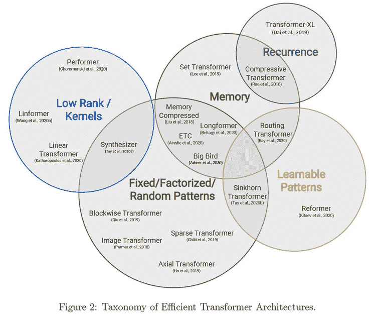****

****[**机器学习 2020 总结:84 篇有趣的论文/文章|作者藤井昭弘|走向数据科学**](https://towardsdatascience.com/machine-learning-2020-summary-84-interesting-papers-articles-45bd45c0d35b?gi=c93267109140&utm_campaign=Akira%27s%20Machine%20Learning%20News%20%20%20&utm_medium=email&utm_source=Revue%20newsletter)**——**[**towardsdatascience.com**](https://towardsdatascience.com/machine-learning-2020-summary-84-interesting-papers-articles-45bd45c0d35b?utm_campaign=Akira's%20Machine%20Learning%20News%20%20%20&utm_medium=email&utm_source=Revue%20newsletter&gi=c93267109140)
在这篇文章中，我一共呈现了 84 篇我发现特别有趣的发表于 2020 年的论文和文章。为了清楚起见，我将它们分成 12 个部分。我个人对…的总结****

****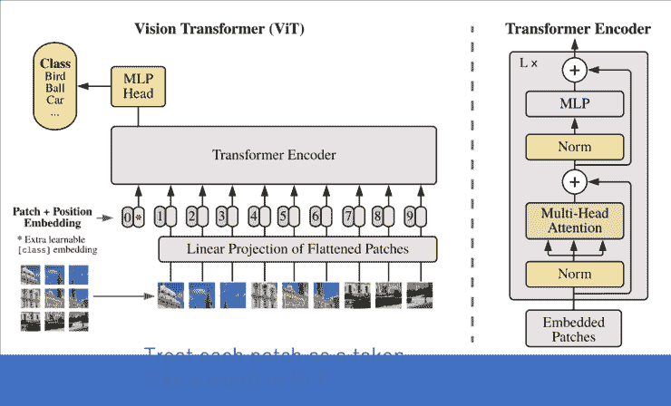****

****[**关于计算机视觉 x Transformer 的最新发展和观点|作者 Akihiro FUJII |走向数据科学**](https://towardsdatascience.com/recent-developments-and-views-on-computer-vision-x-transformer-ed32a2c72654?gi=5e36973da6db&utm_campaign=Akira%27s%20Machine%20Learning%20News%20%20%20&utm_medium=email&utm_source=Revue%20newsletter)**——**[**towardsdatascience.com**](https://towardsdatascience.com/recent-developments-and-views-on-computer-vision-x-transformer-ed32a2c72654?utm_campaign=Akira's%20Machine%20Learning%20News%20%20%20&utm_medium=email&utm_source=Revue%20newsletter&gi=5e36973da6db)
本文讨论了自视觉变形金刚问世以来，Transformer x 计算机视觉研究中的一些有趣的研究和见解。本文的四个主题如下…****

****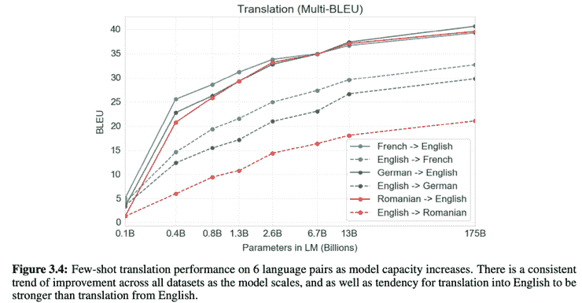****

****[**medium.com**](/analytics-vidhya/reach-and-limits-of-the-supermassive-model-gpt-3-5012a6ddff00?utm_campaign=Akira%27s%20Machine%20Learning%20News%20%20%20&utm_medium=email&utm_source=Revue%20newsletter)
超大质量模型 GPT-3 的到达和极限|藤井昭弘|分析 vid hya | Medium**——**[**超大质量模型 GPT-3 的到达和极限。在这篇博文中，我将从技术角度解释 GPT 3 号、GPT 3 号取得的成就以及 GPT 3 号没能做到的事情..**](/analytics-vidhya/reach-and-limits-of-the-supermassive-model-gpt-3-5012a6ddff00?utm_campaign=Akira%27s+Machine+Learning+News+++&utm_medium=email&utm_source=Revue+newsletter)****

****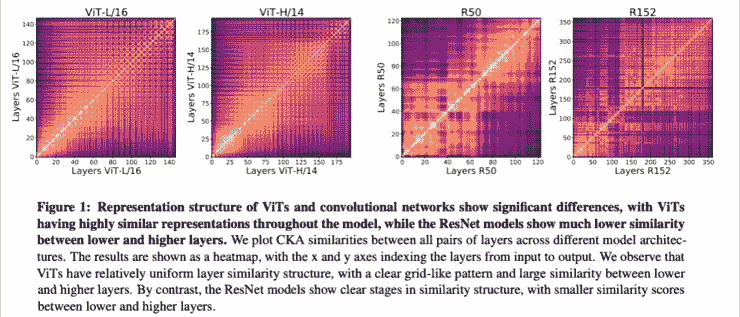****

****[**视觉变形金刚看起来像卷积神经网络吗？(论文解释)| by Akihiro FUJII | 2021 年 10 月|走向数据科学**](https://towardsdatascience.com/do-vision-transformers-see-like-convolutional-neural-networks-paper-explained-91b4bd5185c8?gi=c70696d9d536&utm_campaign=Akira%27s%20Machine%20Learning%20News%20%20%20&utm_medium=email&utm_source=Revue%20newsletter)**——**[**towardsdatascience.com**](https://towardsdatascience.com/do-vision-transformers-see-like-convolutional-neural-networks-paper-explained-91b4bd5185c8?gi=c70696d9d536)
视觉变压器(ViT)近年来势头越来越猛。本文将解释“视觉变形器看起来像卷积神经网络吗？”(Raghu 等人，2021 年)发表了…****

## ******—————******

# ****🌟我每周发布时事通讯！请订阅！🌟****

**** [## 阿基拉的机器学习新闻- Revue

### 由 Akira 的机器学习新闻-由 Akihiro FUJII:制造工程师/机器学习工程师/硕士…

www.getrevue.co](https://www.getrevue.co/profile/akiratosei) 

## — — — — — — — — — — — — — — — — — — –

# 关于我

制造工程师/机器学习工程师/数据科学家/物理学硕士/[http://github.com/AkiraTOSEI/](https://t.co/hjHHbG24Ph?amp=1&utm_campaign=Akira%27s%20Machine%20Learning%20News%20%20%20&utm_medium=email&utm_source=Revue%20newsletter)

[LinkedIn 个人资料](https://www.linkedin.com/in/%E4%BA%AE%E5%AE%8F-%E8%97%A4%E4%BA%95-999868122/)

推特，我贴一句纸评论。****