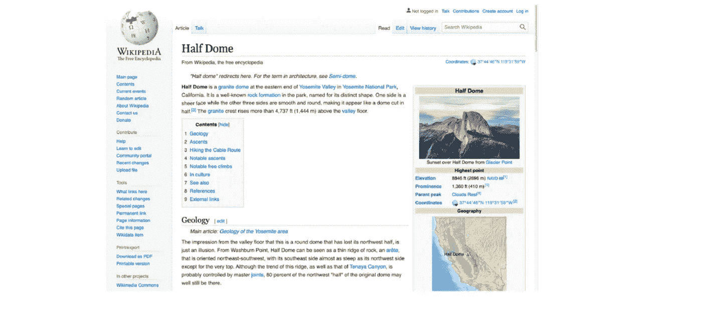
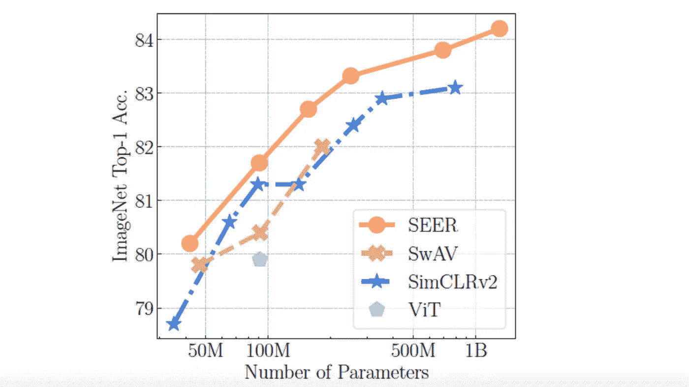
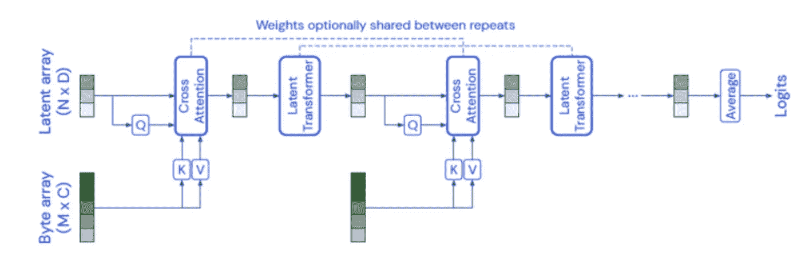
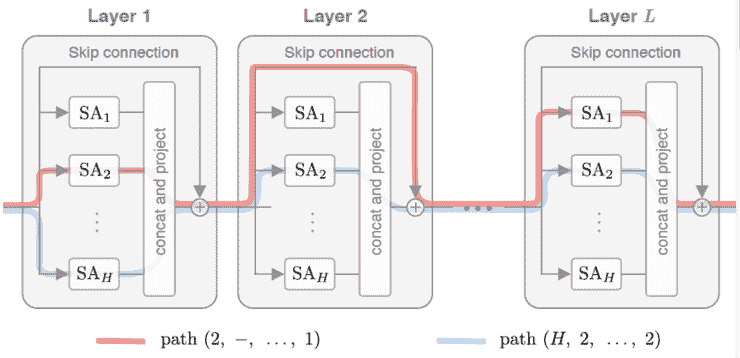
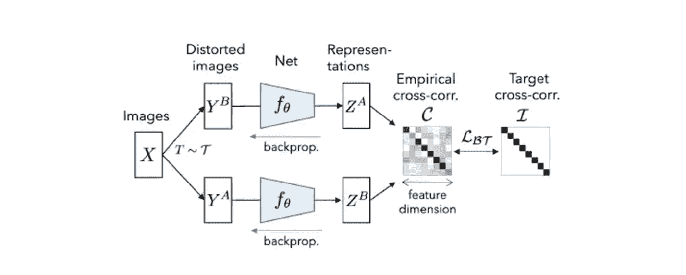
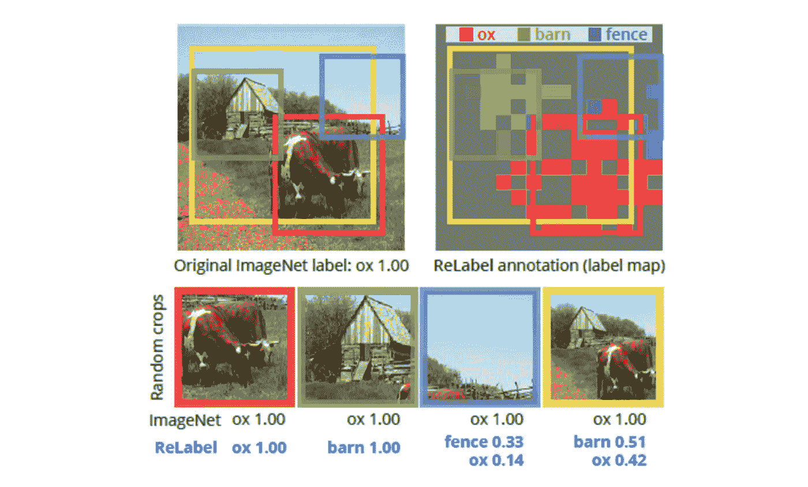

# Akira 的机器学习新闻—2021 年第 10 周

> 原文：<https://medium.com/analytics-vidhya/akiras-machine-learning-news-week-10-2021-68fb77aab933?source=collection_archive---------14----------------------->

## 本周特稿/新闻。

*   [看起来一个基于维基百科的多语言和图像数据集](https://arxiv.org/abs/2103.01913)要发布了。自 Vision Transformer 推出以来，视觉领域&语言的研究一直在不断发展，如此庞大的数据集的发布可能会进一步加快研发的步伐。
*   [*从 Instagram 上收集的十亿级无标签数据集上的自我监督学习研究出现了*](https://arxiv.org/abs/2103.01988) 。由此产生的表示采集网络已被证实在 ImageNet 中是有用的。个人认为 Instagram 偏向于风景、人物、动物等。，但我很好奇这些对于不同领域的效果如何，比如工业数据。
*   Pytorch 现在提供了支持 GPU 和自动微分的快速傅立叶变换， [Pytroch Lightning 还能够利用量化、修剪和深度速度](/pytorch/pytorch-lightning-v1-2-0-43a032ade82b)，因此 Pytorch 部队可能会继续大步前进。

## 机器学习用例

*   [脸书误判不当广告的故事](https://www.nytimes.com/2021/02/11/style/disabled-fashion-facebook-discrimination.html)显示了机器学习完全自动化的危险。现阶段的机器学习模型还不具备人类的认知能力，所以我认为它们在一段时间内需要适当的人类支持。
*   [物联网和 AI 可以结合起来，让很多事情自动化](https://techhq.com/2021/02/ai-and-iot-5-use-cases-where-its-gathering-pace/)。随着机器学习的快速发展和 5G 的广泛使用，我们可能会来到一个结合物联网和人工智能的全自动化和优化系统将成为常态的社会。
*   我觉得自动驾驶系统对攻击的[脆弱性](https://venturebeat.com/2021/02/22/eu-report-warns-that-ai-makes-autonomous-vehicles-highly-vulnerable-to-attack/)是一个主要问题。就汽车而言，被攻击与人的死亡直接相关，因此在自动驾驶变得普遍之前，对策将是必要的。

## 报纸

*   本周我们有一些关于变压器的论文。首先有一个[研究一个可以处理高维数据的 Transformer 模型用于多模态数据](https://arxiv.org/abs/2103.03206)。transformer 模型很容易将不同类型的数据关联起来，因此可以用于多模态数据。如果能处理高维数据就更有用了。此外，在《变形金刚》中，人们倾向于关注自我注意机制，但有[研究显示，跳过结和 MLPs 扮演着重要角色](https://arxiv.org/abs/2103.03404)。许多应用实例的出现可能会推动变压器的理论分析。
*   有两篇关于提高 GAN 效率的论文:[一篇关于使用瘦身后的 GAN 用少量数据生成高质量数据](https://arxiv.org/abs/2103.00397)，另一篇关于通过同时更新生成器和鉴别器来提高学习速度。gan 需要大量的数据，并且网络往往很大，因此研究如何提高现实世界应用的效率是非常受欢迎的。

— — — — — — — — — — — — — — — — — — –

在下面的章节中，我将介绍各种文章和论文，不仅仅是关于上述内容，还包括以下五个主题。

1.  本周特稿/新闻
2.  机器学习用例
3.  报纸
4.  机器学习技术相关文章
5.  其他主题

— — — — — — — — — — — — — — — — — — –

# 1.本周特稿/新闻

[**多语种的大型数据集和图像**](https://arxiv.org/abs/2103.01913?utm_campaign=Akira%27s%20Machine%20Learning%20News%20%20%20&utm_medium=email&utm_source=Revue%20newsletter)**——**[**arxiv.org**](https://arxiv.org/abs/2103.01913)

*【2103.01913】WIT:基于维基百科的多模态多语言机器学习图像文本数据集*
提出了基于维基百科的多语种和图像数据集 WIT。它是目前最大的多模态数据集，包含 108 种语言的总共 3760 万个实体和 1150 万个图像。该数据集将于 3 月 20 日发布。

[**用从互联网上收集的十亿张图片进行自我监督学习。**](https://arxiv.org/abs/2103.01988?utm_campaign=Akira%27s%20Machine%20Learning%20News%20%20%20&utm_medium=email&utm_source=Revue%20newsletter)**——**[**arxiv.org**](https://arxiv.org/abs/2103.01988)

*【2103.01988】野外视觉特征的自我监督预训练*
他们提出了 SEER，一种对从互联网上收集的十亿级数据进行自我监督表示学习的方法。结果优于现有的方法，表明即使使用真实数据，表征学习也是有效的。他们将 SwAV 用于自我监督方法，将 RegNet 用于网络。

[**快速傅立叶变换现已在 Pytorch v1.8 中可用**](https://pytorch.org/blog/the-torch.fft-module-accelerated-fast-fourier-transforms-with-autograd-in-pyTorch/?utm_campaign=Akira%27s%20Machine%20Learning%20News%20%20%20&utm_medium=email&utm_source=Revue%20newsletter)

 [## PyTorch

### 快速傅立叶变换(FFT)计算离散傅立叶变换…

pytorch.org](https://pytorch.org/blog/the-torch.fft-module-accelerated-fast-fourier-transforms-with-autograd-in-pyTorch/?utm_campaign=Akira%27s%20Machine%20Learning%20News%20%20%20&utm_medium=email&utm_source=Revue%20newsletter) 

*【原标题:The torch.fft 模块:PyTorch | PyTorch 中带亲笔签名的加速快速傅立叶变换】*
Pytorch v1.8 增加了对快速傅立叶变换的支持。它支持 GPU 和自动微分。

— — — — — — — — — — — — — — — — — — –

# 2.机器学习用例

[**具备端到端学习的自动驾驶**](https://wayve.ai/blog/driving-intelligence-with-end-to-end-deep-learning/?utm_campaign=Akira%27s%20Machine%20Learning%20News%20%20%20&utm_medium=email&utm_source=Revue%20newsletter)**——**[**way ve . ai**](https://wayve.ai/blog/driving-intelligence-with-end-to-end-deep-learning/)

 [## 我们驾驶智能的新兴行为与端到端深度学习| Wayve

### 这段视频显示了我们在伦敦国王十字车站总部附近的一个十字路口完成了一次无保护的右转。这个…

wayve.ai](https://wayve.ai/blog/driving-intelligence-with-end-to-end-deep-learning/) 

*【原标题:我们的驾驶智能与端到端深度学习的新兴行为| Wayve】*
Wayve 正在使用端到端学习进行自动驾驶。这种方法的优点包括降低学习成本和保持中间输出的丰富高维特征的能力，并且它使用端到端的强化学习和模仿学习来学习从摄像机、位置信息和汽车的状态来操作汽车。

[**基于计算机视觉技术的创业公司**](https://www.forbes.com/sites/robtoews/2021/02/28/a-wave-of-billion-dollar-computer-vision-startups-is-coming/?sh=69bbffe13f4c&utm_campaign=Akira%27s%20Machine%20Learning%20News%20%20%20&utm_medium=email&utm_source=Revue%20newsletter)**——**[**www.forbes.com**](https://www.forbes.com/sites/robtoews/2021/02/28/a-wave-of-billion-dollar-computer-vision-startups-is-coming/?sh=69bbffe13f4c)

 [## 一波十亿美元的计算机视觉初创公司正在到来

### 计算机视觉是现代人工智能中技术最成熟的领域。这就要翻译了…

www.forbes.com](https://www.forbes.com/sites/robtoews/2021/02/28/a-wave-of-billion-dollar-computer-vision-startups-is-coming) 

*【原标题:一波十亿美元计算机视觉创业公司来了】*
本文介绍一家专注于计算机视觉技术机器学习方法的创业公司。例如，它介绍了使用无人机自动施用有机肥、农业中的疾病检测、零售业中的无收银员购物以及保险业中的自动损害评估。

[**亚马逊推出制造业异常检测服务**](https://aws.amazon.com/lookout-for-vision/?nc1=h_ls&utm_campaign=Akira%27s%20Machine%20Learning%20News%20%20%20&utm_medium=email&utm_source=Revue%20newsletter)**——**[**aws.amazon.com**](https://aws.amazon.com/lookout-for-vision/?nc1=h_ls)

 [## 亚马逊视觉了望台

### 使用计算机视觉检测产品缺陷以实现质量检测自动化亚马逊视觉了望台是一台机器…

aws.amazon.com](https://aws.amazon.com/lookout-for-vision/?nc1=h_ls&utm_campaign=Akira%27s%20Machine%20Learning%20News%20%20%20&utm_medium=email&utm_source=Revue%20newsletter) 

*【原标题:亚马逊瞭望视觉】*
亚马逊在 AWS 上为制造业推出了一项服务，可以从大约 30 张图像中进行学习，并检测产品中的凹痕和裂缝等缺陷。这项服务有一个按小时收费的收费结构。

— — — — — — — — — — — — — — — — — — –

# 3.报纸

[**甘那更新 G/D 同时进行**](https://arxiv.org/abs/2103.00430v2?utm_campaign=Akira%27s%20Machine%20Learning%20News%20%20%20&utm_medium=email&utm_source=Revue%20newsletter)**——**

****

***【2103.00430 v2】一阶段训练生成对抗网络*
GANs 通常是一边固定一边单独更新 D/G，但是他们提出了一种不固定一边一次更新 D/G 的方法。所提出的方法可以应用于许多现有的 GANs，并且可以将学习过程加速 1.5 倍，而不损害准确性。**

**[**可以处理音频、视频、点云的变形金刚模型，可以处理超过 10 万个特征的高维输入**](https://arxiv.org/abs/2103.03230?utm_campaign=Akira%27s%20Machine%20Learning%20News%20%20%20&utm_medium=email&utm_source=Revue%20newsletter)**

****

***【2103.03230】Barlow Twins:通过冗余减少的自我监督学习*
在基于图像的自我监督表示学习中使用相关矩阵的研究。为了消除表示中的冗余，训练网络，使得从具有不同数据扩充的两幅图像获得的特征的相关矩阵成为同一性。**

**[**跳过连接和 MLP 在变压器中起很大作用**](https://arxiv.org/abs/2103.03404?utm_campaign=Akira%27s%20Machine%20Learning%20News%20%20%20&utm_medium=email&utm_source=Revue%20newsletter)**

****

**注意力并不是你所需要的全部:纯粹的注意力随着深度成倍地下降。他们从理论和实验上表明，当自我注意机制不伴随跳跃连接或 MLPs 时，它更有可能收敛到秩 1 矩阵，并且它们在变压器的学习中起着重要作用。虽然论文的标题很有煽动性，“注意力不是你需要的全部”，但这并不意味着他们在否认变形金刚的有效性。相反，这项研究的动机始于这样一个问题，“它为什么有效？**

**[**用变细的 GAN 和少量数据生成高质量图像**](https://arxiv.org/abs/2103.00397?utm_campaign=Akira%27s%20Machine%20Learning%20News%20%20%20&utm_medium=email&utm_source=Revue%20newsletter)**

****

***【2103.00397】超数据高效的 GAN 训练:先抽一张彩票，再对其进行强硬训练*
利用 GAN 生成高质量小数据量图像的研究。他们使用基于彩票假设的瘦网络和强大的数据增强，如 GANs 的对抗性学习。采用彩票假设的精简网络往往在数据较少的情况下表现更好，仅用 CIFAR10 的 10%就实现了 FID 14.38。据 diff aug([https://arxiv.org/abs/2006.10738](https://arxiv.org/abs/2006.10738))报道，精简后的网络往往表现更好，这可能是因为当模型很大但数据很少时，有过度拟合的趋势。**

******——**[**arxiv.org**](https://arxiv.org/abs/2103.03230)****

********

*****【2103.03230】Barlow Twins:通过冗余减少的自我监督学习*
在基于图像的自我监督表示学习中使用相关矩阵的研究。为了消除表示中的冗余，训练网络，使得从具有不同数据扩充的两幅图像获得的特征的相关矩阵成为同一性。****

****[**将单个标签转换为带有位置信息的多个标签**](https://arxiv.org/abs/2101.05022?utm_campaign=Akira%27s%20Machine%20Learning%20News%20%20%20&utm_medium=email&utm_source=Revue%20newsletter)****

********

*****【2101.05022】重新标记 ImageNet:从单标签到多标签，从全局标签到本地化标签*
他们提出了重新标记，一种将单标签转换为位置信息多标签的策略。通过将最终的 FC 层应用于在不同数据集上训练的强大分类器的预间隙 Conv 层中的每个像素，单个标签被转换为多个位置信息标签。他们证实了它在图像识别和物体检测方面的有效性。****

****— — — — — — — — — — — — — — — — — — –****

# ****4.机器学习技术相关文章****

****[**机器学习中使用的距离度量的概述、使用示例和缺点**](https://towardsdatascience.com/9-distance-measures-in-data-science-918109d069fa?gi=aeefd3d2cf4f&utm_campaign=Akira%27s%20Machine%20Learning%20News%20%20%20&utm_medium=email&utm_source=Revue%20newsletter)****

**** [## 数据科学中的 9 种距离度量

### 常见距离测量的优点和缺陷

towardsdatascience.com](https://towardsdatascience.com/9-distance-measures-in-data-science-918109d069fa) 

*【原标题:数据科学中的 9 种距离度量|走向数据科学】*
一篇解释机器学习中使用的距离度量的文章。很好理解，有图有解释。不仅如此，还提到了它们在什么样的场合下使用，使用这些距离会产生什么问题。**** 

****[**使用深度学习做机器学习项目时要检查的事情**](https://huggingface.co/blog/simple-considerations?utm_campaign=Akira%27s%20Machine%20Learning%20News%20%20%20&utm_medium=email&utm_source=Revue%20newsletter)****

**** [## 简单的人构建奇特的神经网络的简单考虑

### 随着机器学习不断渗透到行业的方方面面，神经网络也从未如此炒作过。对于…

huggingface.co](https://huggingface.co/blog/simple-considerations) 

【*原标题:🚧简单的人建立花哨的神经网络的简单考虑]*
这篇文章描述了当使用深度学习模型做机器学习项目时，你应该首先做什么。它谈到仔细查看数据，从简单的模型开始而不是构建复杂的模型，并通过使用小模型来检查错误。**** 

****— — — — — — — — — — — — — — — — — — –****

# ****5.其他主题****

****[**Pytorch Lightning v1.2 发布**](/pytorch/pytorch-lightning-v1-2-0-43a032ade82b?utm_campaign=Akira%27s%20Machine%20Learning%20News%20%20%20&utm_medium=email&utm_source=Revue%20newsletter)****

**** [## PyTorch Lightning V1.2.0-深度速度，修剪，量化，SWA

### 包括与 DeepSpeed、PyTorch profiler、修剪、量化、SWA、PyTorch Geometric 等的新集成。

medium.com](/pytorch/pytorch-lightning-v1-2-0-43a032ade82b) 

*【原标题:py torch Lightning v 1 . 2 . 0-deep speed、剪枝、量化、SWA】*
py torch Lightning v 1.2 已经发布。它支持量化、修剪和使用 DeepSpeed 库来加速学习。**** 

****— — — — — — — — — — — — — — — — — — –****

# ****过去的时事通讯****

**** [## Akira 的机器学习新闻-# 2021 年第 9 周

### 本周特稿/新闻。研究表明，变压器的改进方法是可行的

www.getrevue.co](https://www.getrevue.co/profile/akiratosei/issues/akira-s-machine-learning-news-week-9-2021-437385)  [## Akira 的机器学习新闻-2021 年 2 月

### 2020 年 2 月特稿/新闻。机器学习用例物联网和人工智能可以结合起来自动化很多事情…

www.getrevue.co](https://www.getrevue.co/profile/akiratosei/issues/akira-s-machine-learning-news-february-2021-419853)  [## 机器学习 2020 摘要:84 篇有趣的论文/文章

### 在这篇文章中，我总共展示了 2020 年发表的 84 篇我觉得特别有趣的论文和文章…

towardsdatascience.com](https://towardsdatascience.com/machine-learning-2020-summary-84-interesting-papers-articles-45bd45c0d35b) 

# 关于我

制造工程师/机器学习工程师/数据科学家/物理学硕士/exa wizards/[http://github.com/AkiraTOSEI/](https://t.co/hjHHbG24Ph?amp=1)

推特，我贴一句纸评论。****