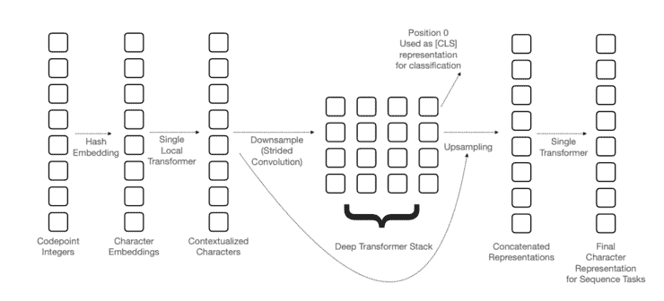

# Akira 的机器学习新闻—2021 年第 11 周

> 原文：<https://medium.com/analytics-vidhya/akiras-machine-learning-news-week-11-2021-171c7f25acc8?source=collection_archive---------22----------------------->

论文或文章的发表日期不一定是同一周。※。

## 本周特稿/新闻。

*   一项关于通过字符而不是通过单词进行标记化的研究已经发表。与英语不同，日语和阿拉伯语在分钟内没有明确的划分，因此有必要设计一种方法来标记它们，但这在未来可能变得没有必要。作为一个说日语的人，我期待着未来的发展。
*   [斯坦福大学发布了一份关于 AI](https://aiindex.stanford.edu/report/) 的广泛而大规模的报告，可以免费阅读。这是一份非常高质量的报告，不仅在研究方面，而且在行业、政治趋势和道德方面。
*   [介绍了一项关于改进扩展策略以将 ResNet 扩展到 EfficientNet 之上的研究](https://arxiv.org/abs/2103.07579)。唯一使用的架构变化是 ResNet-D 和挤压激励，这可能表明最近的趋势是增加参数数量以实现更高的精度，而不是对架构进行微小的改变。

## 机器学习用例

*   有一篇文章说脸书正在考虑给他们的智能眼镜增加面部识别功能。面部识别技术是有用的，但由于道德问题和被用于犯罪目的的可能性，它也是困难的。此外，正如斯坦福大学的报告所示，包括面部识别在内的计算机视觉技术正变得越来越便宜，因此我们可能会看到许多公司，即使它们不是脸书这样的科技巨头，也在制造具有面部识别功能的产品。
*   有一篇文章说边缘设备有利于可持续发展。当然，降低电信成本的能力是一件好事，但具有廉价计算机视觉技术的边缘设备的可用性也可能促进人工智能的实际使用。

## 报纸

*   本周，我将介绍[一项研究，该研究消除了视觉&语言预训练模型](https://arxiv.org/abs/2102.03334)中的 CNN，报告了由于模型规模减小而导致的加速。我个人认为取消 CNN 让图像的低抽象特征直接与文本交互是一件好事。
*   [一篇关于深度打假的调查论文已经发表](https://arxiv.org/abs/2103.00484)。有许多检测技术和生成技术，对这一领域的兴趣程度令人惊讶。许多用于检测的数据集现在是可用的，因此我们可以期待检测技术的改进。

— — — — — — — — — — — — — — — — — — –

在下面的章节中，我将介绍各种文章和论文，不仅仅是关于上述内容，还包括以下五个主题。

1.  本周特稿/新闻
2.  机器学习用例
3.  报纸
4.  机器学习技术相关文章
5.  其他主题

— — — — — — — — — — — — — — — — — — –

# 1.本周特稿/新闻

## [**以字为词，而不是以词为词**](https://arxiv.org/abs/2103.06874?utm_campaign=Akira%27s%20Machine%20Learning%20News%20%20%20&utm_medium=email&utm_source=Revue%20newsletter)

*【2103.06874】canie:预训练一个高效的无标记化语言表示编码器*
canie 不是像传统语言模型中那样对每个单词进行标记化，而是对每个 Unicode 字符进行标记化。即使是没有明确划界的阿拉伯语和日语，也可以不用形态切分就能学会。超越多语言 BERT (mBERT)的结果。

## [**斯坦福大学关于 AI 的海量报告**](https://aiindex.stanford.edu/report/?utm_campaign=Akira%27s%20Machine%20Learning%20News%20%20%20&utm_medium=email&utm_source=Revue%20newsletter)

 [## 人工智能指数报告-人工智能指数

### 今年，我们显著扩展了报告中可用的数据量，与更广泛的外部…

aiindex.stanford.edu](https://aiindex.stanford.edu/report/) 

斯坦福大学关于人工智能的大型报告。你可以看到大约 50 页的免费报告，涉及七个主题，包括 R&D、经济和国家战略。焦点是监视技术的发展，多样性的问题，对人工智能企业的投资没有被疫情减缓，等等。

## [**用规模战略和 ResNet 超越效率网**](https://arxiv.org/abs/2103.07579?utm_campaign=Akira%27s%20Machine%20Learning%20News%20%20%20&utm_medium=email&utm_source=Revue%20newsletter)

*【2103.07579】重温 ResNet:改进的训练和缩放策略*
他们通过使用两种策略来改进 ResNet:(1)在模型可能过度拟合时加深模型，以及(2)缓慢增加分辨率，以实现速度和精度之间的折衷，从而超过 EfficietnNet。这种缩放策略对于 EfficientNet 和动作识别模型也是有效的，我们证实了所获得的表示优于 SimCLRv2。

— — — — — — — — — — — — — — — — — — –

# 2.机器学习用例

## [**脸书考虑在智能眼镜中进行面部识别**](https://www.buzzfeednews.com/article/ryanmac/facebook-considers-facial-recognition-smart-glasses?utm_campaign=Akira%27s%20Machine%20Learning%20News%20%20%20&utm_medium=email&utm_source=Revue%20newsletter)

 [## 脸书正在考虑为其即将推出的智能眼镜进行面部识别

### 使用 cookies，prios 和 de terceiros，可以识别和识别用户的身份。

www.buzzfeednews.com](https://www.buzzfeednews.com/article/ryanmac/facebook-considers-facial-recognition-smart-glasses) 

脸书正在考虑将面部识别融入其智能眼镜产品，并正在调查这样做的法律利弊。虽然面部识别技术可以让用户在看到一张脸时立即想起名字，但它也有明显的缺点，如隐私问题和被用于犯罪目的的可能性。

## [**边缘处理将创造一个可持续发展的社会**](https://www.techrepublic.com/article/how-edge-computing-can-help-save-the-environment/?utm_campaign=Akira%27s%20Machine%20Learning%20News%20%20%20&utm_medium=email&utm_source=Revue%20newsletter)

 [## 边缘计算如何帮助拯救环境

### 一位专家表示，在边缘和更靠近用户的地方缓存内容可以防止更多的碳排放。TechRepublic 的…

www.techrepublic.com](https://www.techrepublic.com/article/how-edge-computing-can-help-save-the-environment/) 

这是一篇采访文章，指出边缘处理，即通过配备机器学习模型的设备直接在现场进行处理，对可持续发展的社会非常有用，避免了将图像和其他数据发送到服务器的集中处理。可以通过将数据发送到服务器来避免电力损失，这对于可持续发展的社会是有用的。

— — — — — — — — — — — — — — — — — — –

# 3.报纸

## [**压缩并存储图像作为小网络的参数**](https://arxiv.org/abs/2103.03123?utm_campaign=Akira%27s%20Machine%20Learning%20News%20%20%20&utm_medium=email&utm_source=Revue%20newsletter)

*【2103.03123】COIN:采用隐式神经表示的压缩*
通过在目标图像上过度拟合小网络进行图像压缩的研究。通过量化训练过的网络并利用其权重，可以恢复目标图像。

## [**利用聚类的自我监督学习**](https://arxiv.org/abs/2006.09882?utm_campaign=Akira%27s%20Machine%20Learning%20News%20%20%20&utm_medium=email&utm_source=Revue%20newsletter)

*【2006.09882】通过对比聚类分配进行视觉特征的无监督学习* 他们提出了 SwAV(视图间交换分配)，通过对变换后的图像执行在线聚类分配并进行比较，而不是直接比较潜在表示，来进行自监督表示学习。即使批量相对较小，它也可以学习。

## [**预先训练好的固定重量的变形金刚可以用来执行各种任务。**](https://arxiv.org/abs/2103.05247?utm_campaign=Akira%27s%20Machine%20Learning%20News%20%20%20&utm_medium=email&utm_source=Revue%20newsletter)

*【2103.05247】将变形金刚预先训练为通用计算引擎*
研究表明，即使在大多数参数固定的情况下进行微调，例如在自然语言处理任务中训练的变形金刚的自我注意和 FFN，在图像分类等非语言任务中也能实现完整模型的性能。

## [**深度调查**](https://arxiv.org/abs/2103.00484?utm_campaign=Akira%27s%20Machine%20Learning%20News%20%20%20&utm_medium=email&utm_source=Revue%20newsletter)

*【2103.00484】deep fakes 生成和检测:最新技术、公开挑战、对策和前进方向* deep fakes 生成和检测方法综述。焦点通常在视频上，但是也提到了音频+视频，并且提到了用于 DeepFake 检测的数据集。

## [**用 CGAN 去噪**](https://arxiv.org/abs/2103.04192?utm_campaign=Akira%27s%20Machine%20Learning%20News%20%20%20&utm_medium=email&utm_source=Revue%20newsletter)

后验采样 CGAN 的高感知质量图像去噪研究 CGAN 框架在图像去噪中的应用。将含噪图像作为 CGAN 的约束来生成图像。重点不是产生良好的峰值信噪比(PSNR)，而是在 GAN 的框架内产生视觉上良好的峰值信噪比。

— — — — — — — — — — — — — — — — — — –

# 4.机器学习技术相关文章

## [**变压器备自投**](https://huggingface.co/blog/long-range-transformers?utm_campaign=Akira%27s%20Machine%20Learning%20News%20%20%20&utm_medium=email&utm_source=Revue%20newsletter)

 [## 拥抱脸写道，2021 年 2 月-远程变压器

### 由 Teven Le Scao，Patrick Von Platen，Suraj Patil，Yacine Jernite 和 Victor Sanh 共同编写。每个月，我们将…

huggingface.co](https://huggingface.co/blog/long-range-transformers) 

介绍了一种改进的 Transformer 模型，该模型可以更有效地利用资源来处理拥抱面部的远程交互，包括 Longformer、Transformer-XL 和其他模型的技术和结果的简要总结。

## Yann LeCun 博士对自我监督学习的解释

 [## 自我监督学习:智能的暗物质

### 如何才能造出具有人类水平智能的机器？人工智能领域能走多远是有限度的…

ai.facebook.com](https://ai.facebook.com/blog/self-supervised-learning-the-dark-matter-of-intelligence) 

这是 Yann LeCun 博士解释自我监督学习的一篇文章。他解释了对比学习，自我监督学习基本上是学习预测不完整的部分，NLP 比成像更高级，因为它更难表示不确定性，等等。

— — — — — — — — — — — — — — — — — — –

# 5.其他主题

## [**一大堆只是老调重弹的机器学习论文**](https://www.reddit.com/r/MachineLearning/comments/lvwt3l/d_some_interesting_observations_about_machine/?utm_campaign=Akira%27s%20Machine%20Learning%20News%20%20%20&utm_medium=email&utm_source=Revue%20newsletter)

一个指出并讨论有许多机器学习论文只是老调重弹的帖子。他们指出了数学障碍，即只引用了过去几年的研究(所以他们不能说这是老调重弹)，并且评论者不理解。

— — — — — — — — — — — — — — — — — — –

# 过去的时事通讯

 [## Akira 的机器学习新闻-# 2021 年第 10 周

### Akira 的机器学习新闻-2021 年第 10 周

www.getrevue.co](https://www.getrevue.co/profile/akiratosei/issues/akira-s-machine-learning-news-week-10-2021-453505)  [## Akira 的机器学习新闻-# 2021 年第 9 周

### 本周特稿/新闻。研究表明，变压器的改进方法是可行的

www.getrevue.co](https://www.getrevue.co/profile/akiratosei/issues/akira-s-machine-learning-news-week-9-2021-437385)  [## Akira 的机器学习新闻-2021 年 2 月

### 2020 年 2 月特稿/新闻。机器学习用例物联网和人工智能可以结合起来自动化很多事情…

www.getrevue.co](https://www.getrevue.co/profile/akiratosei/issues/akira-s-machine-learning-news-february-2021-419853)  [## 机器学习 2020 摘要:84 篇有趣的论文/文章

### 在这篇文章中，我总共展示了 2020 年发表的 84 篇我觉得特别有趣的论文和文章…

towardsdatascience.com](https://towardsdatascience.com/machine-learning-2020-summary-84-interesting-papers-articles-45bd45c0d35b) 

# 关于我

制造工程师/机器学习工程师/数据科学家/物理学硕士/【http://github.com/AkiraTOSEI/ 

推特，我贴一句纸评论。