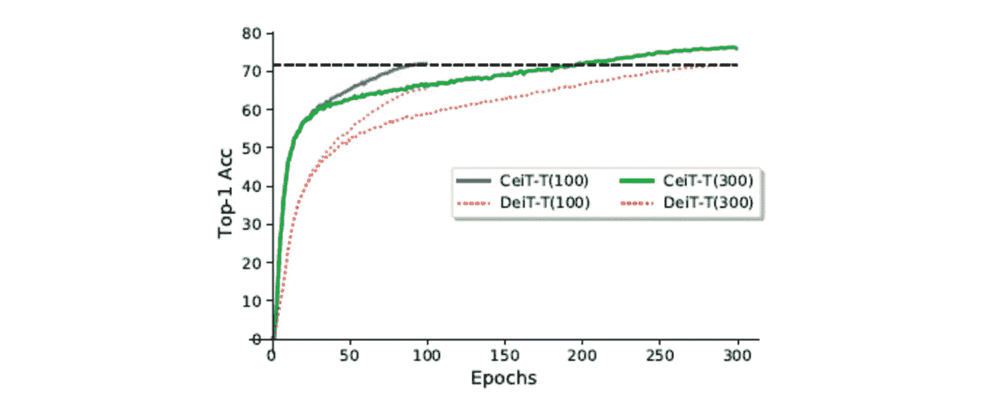
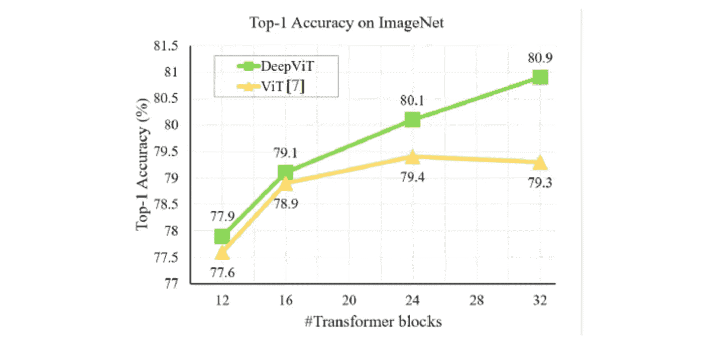
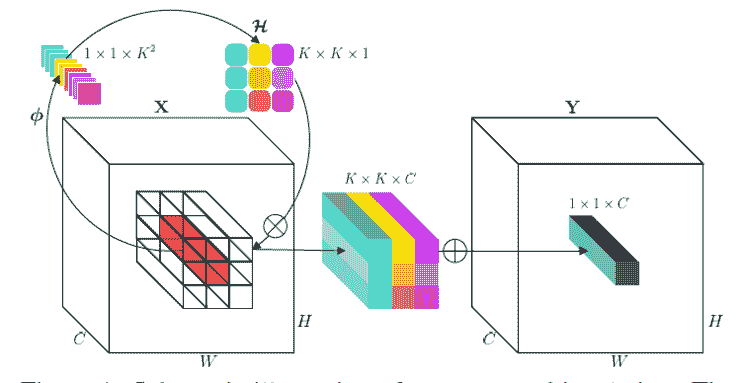
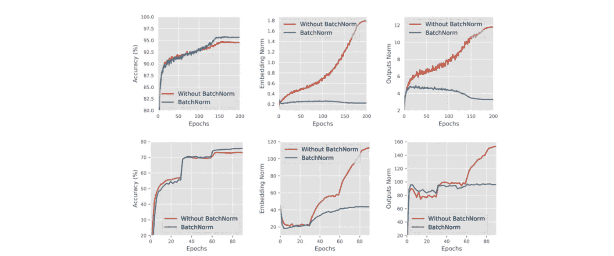
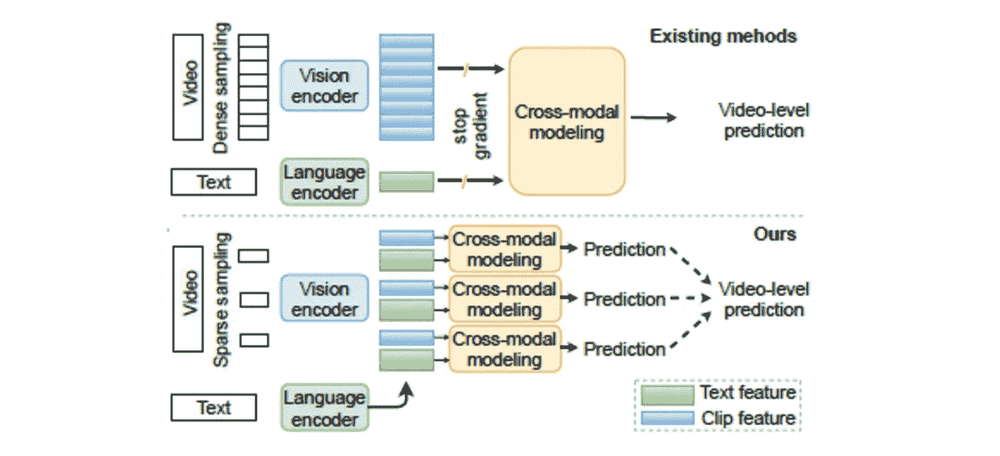
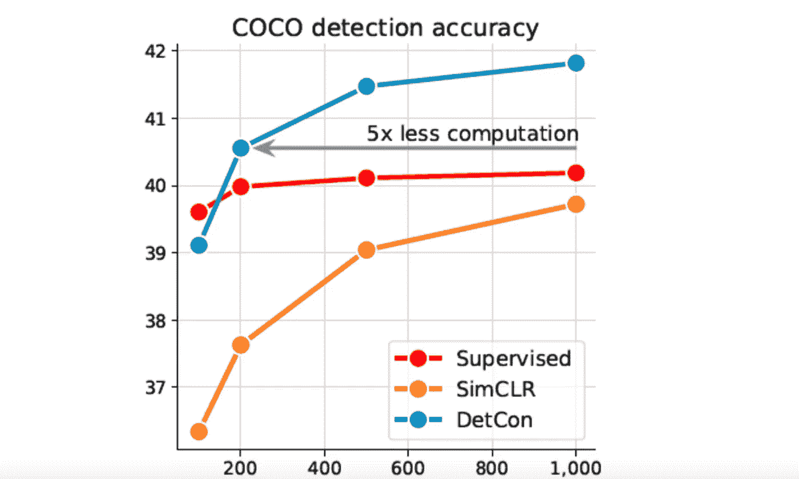
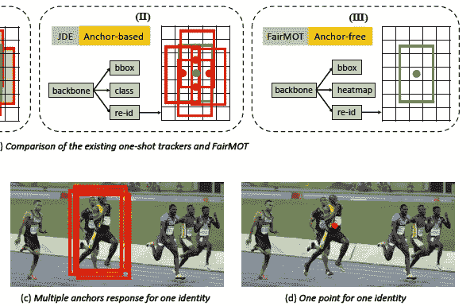

# Akira 的机器学习新闻—2021 年第 12 周

> 原文：<https://medium.com/analytics-vidhya/akiras-machine-learning-news-week-12-2021-c7072495c544?source=collection_archive---------21----------------------->

2021 年第 12 周

论文或文章的发表日期不一定是同一周※

## 本周特稿/新闻。

*   有一项研究表明，将 CNN 整合到基于变压器的模型中可以提高精确度。这可能是研究趋势的转折点，因为迄今为止的主流是通过将自我关注(Transformer 的核心技术之一)纳入基于 CNN 的模型来提高准确性。另外，Vision Transformer 只是把图像分成小块放入模型，但我认为这里使用的方法，即在放入 Transformer 之前使用 CNN 获取更多本地化信息，可以通用于 Vision &语言。
*   [有一项研究表明，深化变压器模型不会提高准确性，因为注意力图都是相似的](https://arxiv.org/abs/2103.11886)。这很好的解决了《视觉变压器》中稍微描述的“只靠自我关注，感应偏差小，所以用 ImageNet 的数据量无法达到精度”的问题。供您参考，CNN(ResNet)报道了一个类似的[现象，在那里共同的表征被学习到多个层次](https://arxiv.org/abs/2010.15327)。
*   [在 Pytorch 1.8.1 中，实现了一个可视化显示计算状态的工具](https://pytorch.org/blog/introducing-pytorch-profiler-the-new-and-improved-performance-tool/)，它可以在 Tensorboard 中可视化，并允许您检查网络每层的计算时间和内存使用情况。它非常有用。

## 现实世界中的机器学习

*   [亚马逊正在使用一种工具来监控送货司机的危险迹象。虽然这有助于防止事故和提高安全性，但它也带来了隐私问题(例如，当打私人电话时，它可以被关闭)。如](https://www.cnbc.com/2021/02/03/amazon-using-ai-equipped-cameras-in-delivery-vans.html)[斯坦福大学报告](https://aiindex.stanford.edu/report/?utm_campaign=Akira%27s%20Machine%20Learning%20News%20%28ja%29&utm_medium=email&utm_source=Revue%20newsletter)所示，自动监控系统越来越便宜，所以我觉得“隐私与实用性”的问题需要进一步讨论，包括法律的制定。
*   脸书似乎正在开发一项服务，它可以生成并读出一份绘制照片的文档，以便视障人士可以欣赏照片。自从 CLIP 和 [DALL E](https://openai.com/blog/dall-e/) 问世以来，Vision &语言系统的发展已经令人瞩目，因此它很可能是一项高质量的服务。此外，自从 Vision Tranformer 问世以来，文本和图像都可以由 Transformer 处理，这可能有助于该领域的发展。

## 报纸

*   [已经发表了一篇论文，研究为什么批处理规范化是有效的](https://openreview.net/forum?id=d-XzF81Wg1)。这方面的研究已经有好几个了，但是本文提出了一个简单的假设“因为它抑制了最后一层的输出所以是好的”，并且得到了实验验证。另据了解，当加入 Dropout 时，批量归一化的网络的精度会下降，其原因(很可能)被广泛认为是“Dropout 对通过批量归一化计算的方差和均值的计算产生不利影响”。但是，此处提出的假设是，由于剔除和批量正规化之间的相似性，在已经具有这种效果的批量正规化模型中包含剔除不会提高准确性。
*   [这项研究表明，当使用为每个像素分配不同值并跨通道共享值的层时，准确性更好，这与卷积不同，卷积将固定值过滤器应用于每个通道的每个像素](https://arxiv.org/abs/2103.06255)，因为它就像自我关注的简化版本，作者说，“我们可以凭经验确认自我关注是视觉最近发展的重要驱动力。

— — — — — — — — — — — — — — — — — — –

在下面的章节中，我将介绍各种文章和论文，不仅仅是关于上述内容，还包括以下五个主题。

1.  本周特稿/新闻
2.  机器学习用例
3.  报纸
4.  机器学习技术相关文章
5.  其他主题

— — — — — — — — — — — — — — — — — — –

# 1.本周特稿/新闻

## [**将 CNN 导入变压器**](https://arxiv.org/abs/2103.11816?utm_campaign=Akira%27s%20Machine%20Learning%20News%20%20%20&utm_medium=email&utm_source=Revue%20newsletter)

*【2103.11816】将卷积设计纳入视觉变形器*
一项将 CNN 纳入 ViT 的研究，旨在通过显式纳入来捕获局部成分。提出了将 CNN 抽象应用到图像修补的图像到令牌，将 CNN 结合到 FFN 的 LeFF 模块，等等。超出 EfficientNet-B4 和 DeiT 的结果。

## [**解决深化变形金刚**](https://arxiv.org/abs/2103.11886?utm_campaign=Akira%27s%20Machine%20Learning%20News%20%20%20&utm_medium=email&utm_source=Revue%20newsletter) 时产生类似注意力地图的问题

*【2103.11886】deep ViT:走向更深层次的视觉转换者*
用 ImageNet 训练的 vit 不会从深化中受益，因为生成了类似的注意力地图。从头部注意力高度多样性的角度来看，他们能够通过引入一个可学习的参数来混合头部注意力以提高注意力的多样性，从而通过加深来提高准确性。

## [**Pytorch 可以让你直观的检查计算量。**](https://pytorch.org/blog/introducing-pytorch-profiler-the-new-and-improved-performance-tool/?utm_campaign=Akira%27s%20Machine%20Learning%20News%20%20%20&utm_medium=email&utm_source=Revue%20newsletter)

 [## PyTorch

### 微软首席项目经理华微软首席工程经理吉塔

pytorch.org](https://pytorch.org/blog/introducing-pytorch-profiler-the-new-and-improved-performance-tool/) 

官方博客介绍 torch.profiler，在 Pytrorch 1.8.1 中改进。通过此次更新，您可以通过 Tensorboard 直观地测量数据加载时间等。还可以可视化网络每一层的计算时间，并查看瓶颈层在哪里。

— — — — — — — — — — — — — — — — — — –

# 2.机器学习用例

## [**亚马逊使用系统监控送货司机的冒险行为**](https://www.cnbc.com/2021/02/03/amazon-using-ai-equipped-cameras-in-delivery-vans.html?utm_campaign=Akira%27s%20Machine%20Learning%20News%20%20%20&utm_medium=email&utm_source=Revue%20newsletter)

 [## 亚马逊正在送货车上使用配备人工智能的摄像头，一些司机担心隐私

### 一些美国工厂的亚马逊司机很快就会有一双额外的眼睛看着他们上路…

www.cnbc.com](https://www.cnbc.com/2021/02/03/amazon-using-ai-equipped-cameras-in-delivery-vans.html) 

亚马逊正在使用一个系统来监控送货司机的危险行为，如斜眼、打哈欠和使用安全带。虽然该系统可以监控危险行为并提高安全性，但它也存在一些问题，如隐私问题和向送货司机发送你不信任他们的信息。

## [**为视障人士提供准确的替代文字**](https://tech.fb.com/how-facebook-is-using-ai-to-improve-photo-descriptions-for-people-who-are-blind-or-visually-impaired/?utm_campaign=Akira%27s%20Machine%20Learning%20News%20%20%20&utm_medium=email&utm_source=Revue%20newsletter)

 [## 脸书如何使用人工智能来改善盲人或视觉障碍者的照片描述…

### 2016 年，我们推出了自动替代文本，这是一种计算机视觉技术，通过描述照片让脸书变得更容易访问…

tech.fb.com](https://tech.fb.com/how-facebook-is-using-ai-to-improve-photo-descriptions-for-people-who-are-blind-or-visually-impaired/?utm_campaign=Akira%27s%20Machine%20Learning%20News%20%20%20&utm_medium=email&utm_source=Revue%20newsletter) 

如果照片有描述其外观的替代文本，您可以不用看照片就能阅读照片中的内容，但大多数照片没有该替代文本。脸书自动生成高度准确的替代文本，并使用文本到语音来解释文本，以便视障人士可以享受脸书饲料。

— — — — — — — — — — — — — — — — — — –

# 3.报纸

【arxiv.org】**通过反转卷积过程提高精度****——**

****

***【2103.06255】对合:反转卷积的固有特性用于视觉识别*
与卷积不同，卷积将固定值的滤波器应用于每个通道中的每个像素，他们提出了对合，为每个像素分配不同的值，并在通道之间共享该值。它被认为是一种自我关注，是卷积的相反运算，而且不像卷积，从一开始就有很宽的视野。他们证实了图像分类、对象检测和分割的性能改进。**

## **[**批量正规化为什么有效？**](https://openreview.net/forum?id=d-XzF81Wg1&utm_campaign=Akira%27s%20Machine%20Learning%20News%20%20%20&utm_medium=email&utm_source=Revue%20newsletter)**

****

***解构 BatchNorm 的正则化| OpenReview*
一项旨在检验批处理正则化为何有效的研究。他们通过实验证实，批量归一化通过抑制最终图层(就在分类图层之前)的输出来提高精度，并通过添加具有类似效果的正则化来提高概化性能。他们还指出，作为一个正则化术语，Dropout 与 batch 正则化具有相同的效果。**

**[**几帧足以代表一部电影。**](https://arxiv.org/abs/2102.06183?utm_campaign=Akira%27s%20Machine%20Learning%20News%20%20%20&utm_medium=email&utm_source=Revue%20newsletter)**

****

***【2102.06183】少即是多:通过稀疏采样进行视频和语言学习的 ClipBERT*
基于少量帧足以表示视频的思想，我们通过在 Conv2D 系统中仅处理少量帧来研究视频和文本的预训练。通过 E2E 训练，结果超过了现有的研究。**

## **[**无监督分割信息对比学习**](https://arxiv.org/abs/2103.10957?utm_campaign=Akira%27s%20Machine%20Learning%20News%20%20%20&utm_medium=email&utm_source=Revue%20newsletter)**

****

***【2103.10957】采用对比检测的高效视觉预处理*
他们提出了一种无监督的对比学习 DetCon，根据无监督分割生成的掩模，将相同掩模类别的特征聚集在一起。在保持对比学习的计算成本为 1/5 的同时，他们在预训练中获得了超过传统方法和监督表示的对象检测的有用表示。**

## **[**一种跟踪方法，不仅关注对象检测，还关注 Re-id**](https://arxiv.org/abs/2004.01888?utm_campaign=Akira%27s%20Machine%20Learning%20News%20%20%20&utm_medium=email&utm_source=Revue%20newsletter)**

****

**FairMOT:关于多目标跟踪中检测和再识别的公平性这是一项不仅关注目标检测而且关注再识别的跟踪研究。在跟踪中，当使用基于锚点的对象检测时，多个锚点被分配给一个对象，这导致与附近的对象混淆，但是它们可以使用 CenterNet 来避免这个问题，CenterNet 是没有锚点的对象检测方法。**

**— — — — — — — — — — — — — — — — — — –**

# **4.机器学习技术相关文章**

**[**语言模式的微调**](https://ruder.io/recent-advances-lm-fine-tuning/?utm_campaign=Akira%27s%20Machine%20Learning%20News%20%20%20&utm_medium=email&utm_source=Revue%20newsletter)**

** [## 语言模型微调的最新进展

### 微调预先训练的语言模型(LM)已经成为在自然语言环境中进行迁移学习的事实标准

ruder.io](https://ruder.io/recent-advances-lm-fine-tuning/?utm_campaign=Akira%27s%20Machine%20Learning%20News%20%20%20&utm_medium=email&utm_source=Revue%20newsletter) 

一篇详述语言模型微调的文章。文章引用了几篇论文，介绍了自适应微调、行为微调和以低学习率和大量时期进行稳定微调的训练。** 

**[**用 Unet 进行多类分割**](https://towardsdatascience.com/a-machine-learning-engineers-tutorial-to-transfer-learning-for-multi-class-image-segmentation-b34818caec6b?gi=70d64eee7d82&utm_campaign=Akira%27s%20Machine%20Learning%20News%20%20%20&utm_medium=email&utm_source=Revue%20newsletter)**

** [## 一个机器学习工程师的教程，以转移学习的多类图像分割…

### 分割模型最佳参数化的调试指南

towardsdatascience.com](https://towardsdatascience.com/a-machine-learning-engineers-tutorial-to-transfer-learning-for-multi-class-image-segmentation-b34818caec6b) 

一篇带有代码的文章，解释了一个使用 Unet 的例子，Unet 常用于语义分割，用于分割医学图像中的异常区域。解释详细，通俗易懂。** 

**— — — — — — — — — — — — — — — — — — –**

# **5.其他主题**

**[**Snapchat 用收购来提振 AR？**](https://heartbeat.fritz.ai/full-body-deepfakes-3d-human-filters-and-more-new-enhanced-ar-features-round-the-corner-for-7154e51814be?gi=221b55f4b60b&utm_campaign=Akira%27s%20Machine%20Learning%20News%20%20%20&utm_medium=email&utm_source=Revue%20newsletter)**

** [## 全身 Deepfakes、3D 人体滤镜等等:增强的 AR 新功能即将推出…

### 在 Snap 收购初创公司 Ariel AI 之后，让我们来看看 Snapchat 的 AR 产品会有什么

heartbeat.fritz.ai](https://heartbeat.fritz.ai/full-body-deepfakes-3d-human-filters-and-more-new-enhanced-ar-features-round-the-corner-for-7154e51814be) 

这篇文章预测了最近收购 Snap Inc .将如何增强 Snap chat 的 AR 功能。文章介绍了被收购公司拥有的一些技术，如智能手机上的实时人体合成、语音交互等。它还提到了一种可以从单幅 RGB 图像中重建人体 3D 模型的技术。** 

**— — — — — — — — — — — — — — — — — — –**

# **你可以得到每周的时事通讯。请订阅！**

**过去的时事通讯**

** [## Akira 的机器学习新闻-# 2021 年第 11 周

### Akira 的机器学习新闻-2021 年第 11 周。(论文或文章的发表日期不一定是…

www.getrevue.co](https://www.getrevue.co/profile/akiratosei/issues/akira-s-machine-learning-news-week-11-2021-474227)  [## Akira 的机器学习新闻-# 2021 年第 10 周

### Akira 的机器学习新闻-2021 年第 10 周

www.getrevue.co](https://www.getrevue.co/profile/akiratosei/issues/akira-s-machine-learning-news-week-10-2021-453505)  [## Akira 的机器学习新闻-2021 年 2 月

### 2020 年 2 月特稿/新闻。机器学习用例物联网和人工智能可以结合起来自动化很多事情…

www.getrevue.co](https://www.getrevue.co/profile/akiratosei/issues/akira-s-machine-learning-news-february-2021-419853) 

— — — — — — — — — — — — — — — — — — –

# 关于我

制造工程师/机器学习工程师/数据科学家/物理学硕士/[http://github.com/AkiraTOSEI/](https://t.co/hjHHbG24Ph?amp=1&utm_campaign=Akira%27s%20Machine%20Learning%20News%20%20%20&utm_medium=email&utm_source=Revue%20newsletter)

推特，我贴一句纸评论。**