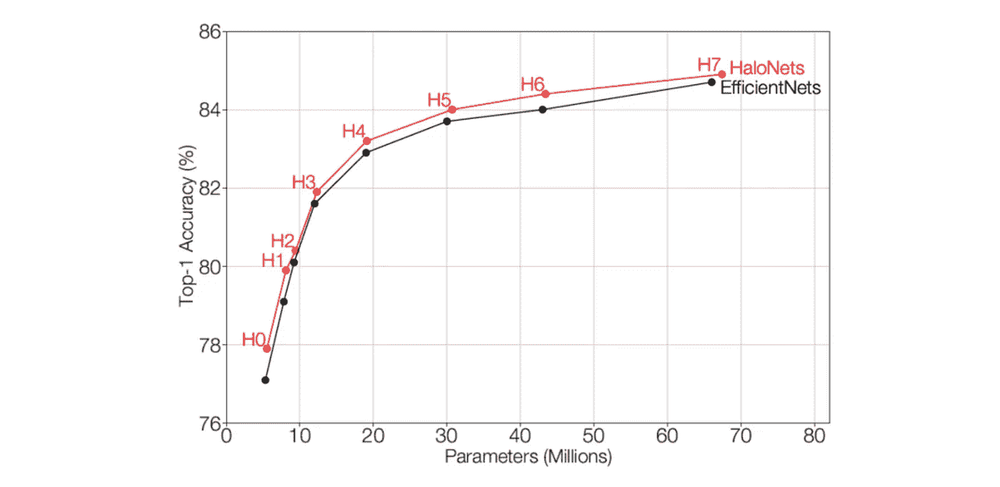
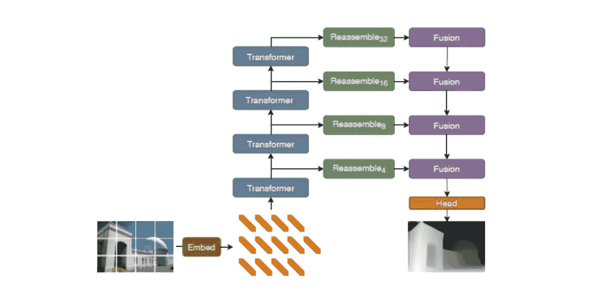
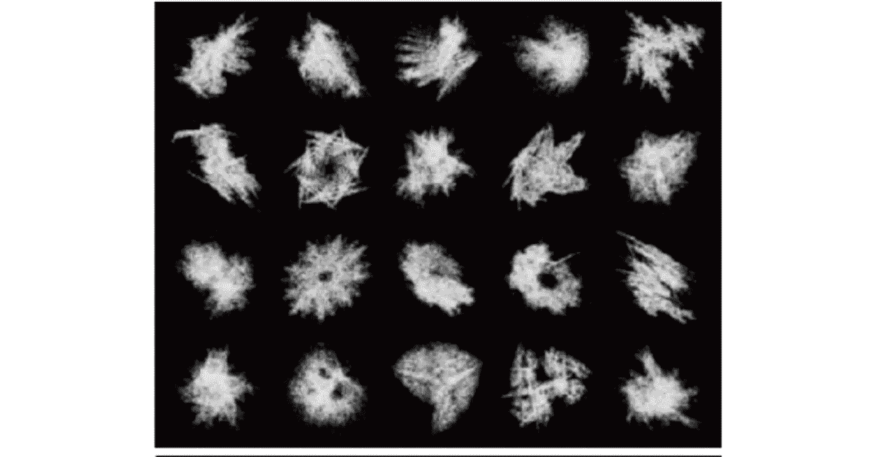
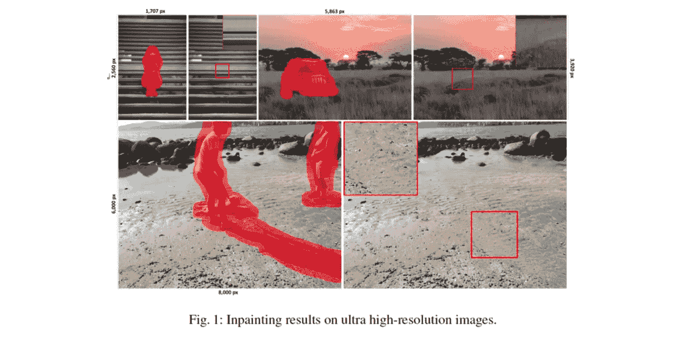
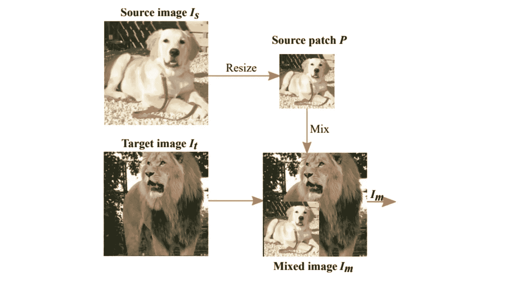

# Akira 的机器学习新闻—2021 年第 13 周

> 原文：<https://medium.com/analytics-vidhya/akiras-machine-learning-news-week-13-2021-9de2c66ce34?source=collection_archive---------32----------------------->

2021 年第 13 周(3 月 28 日~)

论文或文章的发表日期不一定是同一周※

## 本周特稿/新闻。

*   [在 EfficientNet 上使用基于 Transformer 的模型(带有一点 CNN)的模型现已推出](https://arxiv.org/abs/2103.12731)。它被设计成通过使用自我注意而具有比 CNN 更宽的感受野，同时保持尽可能小的内存。
*   [基于变压器的模型现已上市，可在深度估计等密集预测任务中实现 SotA 性能](https://arxiv.org/abs/2103.13413)。它是基于这样一种想法，即变压器对于这样的任务是有用的，因为它可以向前传播，同时保持不同于 CNN 的分辨率。
*   [有个博客是关于 OpenAI 的 CLIP 实现](https://sachinruk.github.io/blog/pytorch/pytorch%20lightning/loss%20function/gpu/2021/03/07/CLIP.html)，用的是 Pytorch 闪电和抱抱脸，实现起来还是比较容易的。

## 现实世界中的机器学习

*   [GPT-3 每天产生 45 亿个单词](https://openai.com/blog/gpt-3-apps/)，大约有 300 个应用程序使用 GPT-3，尽管它们是付费的，但似乎相当成功。似乎一个草根[团队正在致力于开发一个免费的 GPT-3](https://venturebeat.com/2021/01/15/ai-weekly-meet-the-people-trying-to-replicate-and-open-source-openais-gpt-3/) ，如果这个被开发出来，使用 GPT-3 的应用数量将会进一步扩大。
*   [有一篇关于用深度假代替配音演员的文章](https://openai.com/blog/gpt-3-apps/)。技术上是可以的，但是法律好像还没跟上。面部识别等基于图像的任务的立法也仍处于起步阶段，所以立法者可能会很忙。

## 报纸

*   [已经发表的一项研究表明，该方法的准确性超过了传统方法，只有 0.3%的数据](https://arxiv.org/abs/2103.11955)。“大数据集 x 大模型- >高精度”公式现在已经很好地建立起来了，所以作为一个实业家，我很好奇一个可以用小数据集学习的机制会发展到什么程度。
*   有人研究了 CutMix 的改进版本，这是一种数据增强方法，通过剪切和粘贴图像并将它们混合在一起来提高准确性。这与上面的故事有关，我认为对于应用程序来说，找到使用小数据集提高准确性的方法很重要。

— — — — — — — — — — — — — — — — — — –

在下面的章节中，我将介绍各种文章和论文，不仅仅是关于上述内容，还包括以下五个主题。

1.  本周特稿/新闻
2.  机器学习用例
3.  报纸
4.  机器学习技术相关文章
5.  其他主题

— — — — — — — — — — — — — — — — — — –

# 1.本周特稿/新闻

## [**变压器型高效网**](https://arxiv.org/abs/2103.12731?utm_campaign=Akira%27s%20Machine%20Learning%20News%20%20%20&utm_medium=email&utm_source=Revue%20newsletter)

[2103.12731]为参数高效的视觉骨干缩放局部自我关注

建议 HaloNet 使用自我关注(和几个 CNN)在 EfficientNet 上进行权衡。通过阻止局部自我注意，HaloNet 可以处理高分辨率图像，比传统方法具有更宽的视野和更少的内存。基本思想是一种局部注意力机制，该机制使用划分图像(sizd=b)及其邻域(size=h)的块。图像类似于卷积，在大小为 b 的块图像及其邻域 h 中取局部注意，感受野的大小为(b+2h)，在与 ResNet(表 5)比较的实验中，b=32，h=3，感受野为 38x38 像素，相当大。与 EfficientNetB7 相当的 H7 模型使用 b=10，h=3。然而，它不是一个纯粹的自我关注模型，而是在第一层使用 Conv，它遵循[独立自我关注](https://arxiv.org/abs/1906.05909)。

## [**深度估计和语义分割的精度大大提高**](https://arxiv.org/abs/2103.13413?utm_campaign=Akira%27s%20Machine%20Learning%20News%20%20%20&utm_medium=email&utm_source=Revue%20newsletter)

[2103.13413]用于密集预测的视觉转换器

他们使用基于转换器的模型 ViT 来计算高精度的预测地图，用于语义分割和深度估计等任务。它显然是基于这样的想法，即 ViT 对于这些任务是有利的，因为它不像 CNN 那样在不损失分辨率的情况下传播。在深度估计和语义分割中实现了 SotA 性能，并且计算了精确的预测图。基本模型是基于 ViT (DPT-Base，DPT-Large)的，但也有一种模型是使用 ResNet50 进行特征提取(DPT-Hybrid)，而不是直接排列斑块分割的 RGB 特征。让 CNN 进行初始特征提取的想法类似于[将卷积设计并入视觉变形金刚](https://arxiv.org/abs/2103.11816)。

## [实施剪辑](https://sachinruk.github.io/blog/pytorch/pytorch%20lightning/loss%20function/gpu/2021/03/07/CLIP.html?utm_campaign=Akira%27s%20Machine%20Learning%20News%20%20%20&utm_medium=email&utm_source=Revue%20newsletter)

 [## 多语言剪辑，带 Huggingface + PyTorch Lightning🤗 ⚡

### 对于像我这样没有经历过对比损失的人来说，这是最有趣的部分。我们知道我们…

sachinruk.github.io](https://sachinruk.github.io/blog/pytorch/pytorch%20lightning/loss%20function/gpu/2021/03/07/CLIP.html) 

本文描述了 [OpenAI 的 CLIP](https://cdn.openai.com/papers/Learning_Transferable_Visual_Models_From_Natural_Language_Supervision. pdf)) 的实现，它可以获取特定语言的图像表示。本文解释了如何实现 CLIP(。使用 Huggingface 和 Pytorch Lightning。实现起来似乎相当简单。

— — — — — — — — — — — — — — — — — — –

# 2.机器学习用例

[**脸书打击恶意信息传播的行动史**](https://www.technologyreview.com/2021/03/11/1020600/facebook-responsible-ai-misinformation/?utm_campaign=Akira%27s%20Machine%20Learning%20News%20%20%20&utm_medium=email&utm_source=Revue%20newsletter)

 [## 他让脸书迷上了人工智能。现在，他无法修复它的错误信息瘾

### 该公司的人工智能算法给了它一个永不满足的谎言和仇恨言论的习惯。现在这个建造了…

www.technologyreview.com](https://www.technologyreview.com/2021/03/11/1020600/facebook-responsible-ai-misinformation/?utm_campaign=Akira%27s%20Machine%20Learning%20News%20%20%20&utm_medium=email&utm_source=Revue%20newsletter) 

这篇文章叙述性地解释了脸书在美国国会大厦骚乱等相关事件中对其社交网站上的许多虚假和恶意信息采取的行动。

## [**有没有可能用深假代替配音演员？**](https://www.wired.com/story/simpsons-voice-actors-ai-deepfakes/?utm_campaign=Akira%27s%20Machine%20Learning%20News%20%20%20&utm_medium=email&utm_source=Revue%20newsletter)

 [## 《辛普森一家》会用人工智能代替配音演员吗？

### 2015 年 5 月,《辛普森一家》的配音演员哈里·谢尔——他扮演了许多关键角色，包括，非常不可思议的…

www.wired.com](https://www.wired.com/story/simpsons-voice-actors-ai-deepfakes/) 

这是一篇从技术和法律上考察在存储大量《辛普森一家》等配音演员数据的情况下，是否可以用 Deep Fake 来代替配音演员的文章。技术上是可以的，但是法律上，有一些模糊之处。

**GPT-3 用例**

** [## GPT-3 驱动下一代应用

### 自从我们的第一个商业产品 OpenAI API 发布以来的九个月里，已经有超过 300 个…

openai.com](https://openai.com/blog/gpt-3-apps/) 

一个关于 GPT-3 在 OpenAI 中的商业应用的博客。它描述了 GPT-3 目前如何在大约 300 个应用程序中使用，以及由于 GPT-3 的产生，人物现在如何能够进行自然对话。GPT 3 号每天产生 45 亿个单词。

— — — — — — — — — — — — — — — — — — –

# 3.报纸

## [**训练 ViT 带不带自然图像**](https://arxiv.org/abs/2103.13023?utm_campaign=Akira%27s%20Machine%20Learning%20News%20%20%20&utm_medium=email&utm_source=Revue%20newsletter)

[2103.13023]视觉变形金刚可以在没有自然图像的情况下学习吗？

在人造图像数据集 FractalDB 上对 ViT 进行预训练的研究。它产生的可视化结果不同于在 ImageNet 上训练的结果，但与在自然图像(如 CIFAR10)上的 ImageNet 预训练模型一样准确。人工数据集的优点是没有隐私或其他问题。** 

## **[**用常规数据量的 0.3%学习**](https://arxiv.org/abs/2103.11955?utm_campaign=Akira%27s%20Machine%20Learning%20News%20%20%20&utm_medium=email&utm_source=Revue%20newsletter)**

****

**[2103.11955]改进和简化模式开发培训**

**提出的 ADAPET 修改了 PET 的损失函数，仅用 0.3%的数据就超过了它的精度。受过两种类型损失的训练:对整个词汇表而不仅仅是关系令牌取 softmax 的数据效率损失，以及给定关系时填空的损失。**

## **[**8K 图像修复**](https://arxiv.org/abs/2005.09704?utm_campaign=Akira%27s%20Machine%20Learning%20News%20%20%20&utm_medium=email&utm_source=Revue%20newsletter)**

****

**[2005.09704]用于超高分辨率图像修复的上下文残差聚合**

**在修复任务中，通过生成低分辨率图像，然后添加高频分量，他们可以在低内存的情况下修复超高分辨率图像。有可能生成 8K 图像，不像以前的研究。**

## **[**针对缺失信息改进 CutMix。**](https://arxiv.org/abs/2012.11101?utm_campaign=Akira%27s%20Machine%20Learning%20News%20%20%20&utm_medium=email&utm_source=Revue%20newsletter)**

****

**[2012.11101] ResizeMix:将数据与保留的对象信息和真实标签混合**

**CutMix 是一种有用的数据扩充方法，它可以裁剪一幅图像并将其粘贴到另一幅图像中，但是该图像可能会被裁剪而丢失重要信息。他们提出了 ResizeMix，通过调整图像大小而不进行裁剪和粘贴来防止重要信息的丢失。**

**— — — — — — — — — — — — — — — — — — –**

# **4.机器学习技术相关文章**

## **[**学会对扰动保持稳健**](https://ai.facebook.com/blog/building-ai-that-can-understand-variation-in-the-world-around-us/?utm_campaign=Akira%27s%20Machine%20Learning%20News%20%20%20&utm_medium=email&utm_source=Revue%20newsletter)**

** [## 构建能够理解我们周围世界变化的人工智能

### 人类天生理解我们周围世界的无数变化。当我们看到一只狗时，我们知道它是什么，即使它是…

ai.facebook.com](https://ai.facebook.com/blog/building-ai-that-can-understand-variation-in-the-world-around-us/) 

脸书研究的介绍性博客。人类可以认出一辆公交车，即使它已经倒了，但机器学习模型不能。有一些技术可以区分这种扰动，但是这篇博客介绍了当前方法的问题和一种使用等变算子的方法。** 

**— — — — — — — — — — — — — — — — — — –**

# **5.其他主题**

## **[**同时预测设备上的脸部、手部和身体位置**](https://ai.googleblog.com/2020/12/mediapipe-holistic-simultaneous-face.html?utm_campaign=Akira%27s%20Machine%20Learning%20News%20%20%20&utm_medium=email&utm_source=Revue%20newsletter)**

** [## MediaPipe 整体-在设备上同时进行面部、手部和姿势预测

### 由 Ivan Grishchenko 和 Valentin Bazarevsky 发布，研究工程师，谷歌研究实时，同步…

ai.googleblog.com](https://ai.googleblog.com/2020/12/mediapipe-holistic-simultaneous-face.html) 

MediaPip 整体介绍，这是一个开源框架，用于在移动设备上同时实时识别人体姿势、面部标志和手部跟踪。可以检测 540+个关键点(33 个姿势，21 只手，468 个面部标志)，该框架可用于移动(Android，iOS)和桌面设备。** 

**— — — — — — — — — — — — — — — — — — –**

# **你可以得到每周的时事通讯。请订阅！**

**过去的时事通讯**

** [## Akira 的机器学习新闻-# 2021 年第 13 周

### Revue 我每周都会介绍机器学习相关的文章和论文。我也出版月刊和半年刊…

www.getrevue.co](https://www.getrevue.co/profile/akiratosei/issues/akira-s-machine-learning-news-week-13-2021-520049)  [## Akira 的机器学习新闻-# 2021 年第 12 周

### 本周特稿/新闻。有一项研究表明，将 CNN 整合到基于变压器的模型中…

www.getrevue.co](https://www.getrevue.co/profile/akiratosei/issues/akira-s-machine-learning-news-week-12-2021-496080) 

— — — — — — — — — — — — — — — — — — –

# 关于我

制造工程师/机器学习工程师/数据科学家/物理学硕士/[http://github.com/AkiraTOSEI/](https://t.co/hjHHbG24Ph?amp=1)

推特，我贴一句纸评论。**