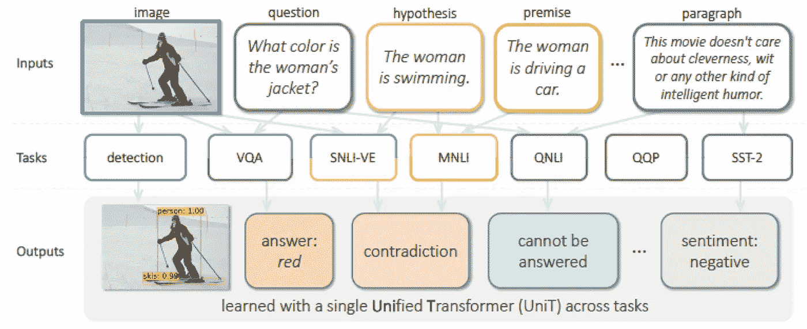
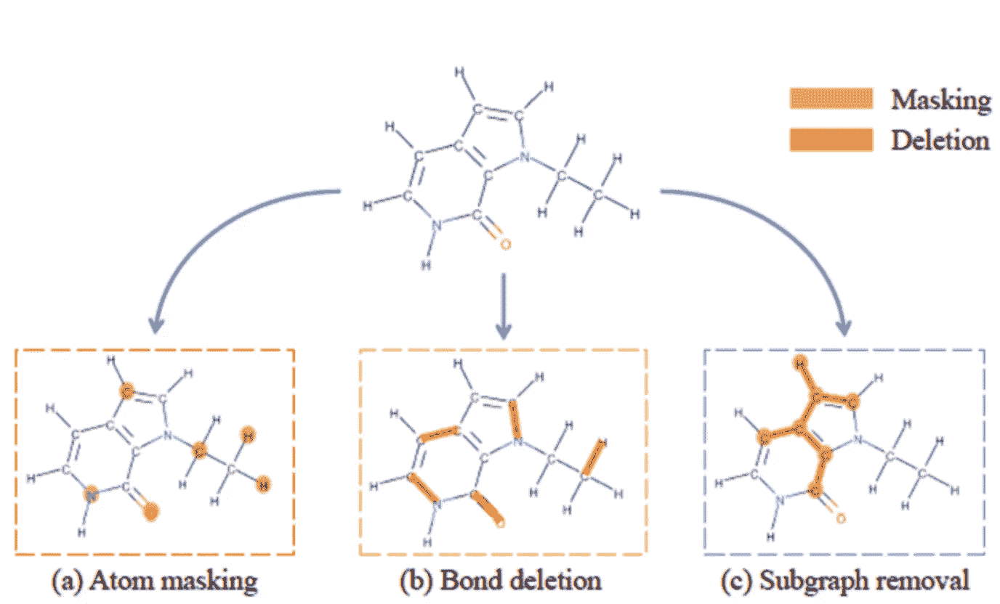

# Akira 的机器学习新闻——2021 年第 9 周

> 原文：<https://medium.com/analytics-vidhya/akiras-machine-learning-news-week-9-2021-bdc625ea96b8?source=collection_archive---------19----------------------->

## 2021 年第 9 周(2 月 22 日~)

## 本周特稿/新闻。

*   [上个月发表在 OpenAI 博客上的 DALL-E 现在可以在 arXiv](https://arxiv.org/abs/2102.10772) 中获得。这是一个非常高性能的文本到图像模型，并使用像 VQ-VAE 码本生成图像。
*   无监督预训练对于自然语言和图像已经变得很常见，但似乎[无监督预训练对于分子](https://arxiv.org/abs/2102.10056)也很有效。用大数据进行预训练的趋势很可能会加速。
*   [提出了一个模型，该模型可以用相同的参数运行 7 个图像和语言相关的任务(不需要对每个任务进行微调](https://arxiv.org/abs/2102.10772))。它用的是 Transformer，论文题目是《Transformer 是你需要的全部》。

## 现实世界中的机器学习

*   [脸书误判不当广告的故事](https://www.nytimes.com/2021/02/11/style/disabled-fashion-facebook-discrimination.html)显示了机器学习完全自动化的危险。现阶段的机器学习模型还不具备人类的认知能力，所以我认为它们在一段时间内需要适当的人类支持。
*   [物联网和 AI 可以结合起来，让很多事情自动化](https://techhq.com/2021/02/ai-and-iot-5-use-cases-where-its-gathering-pace/)。随着机器学习的快速发展和 5G 的广泛使用，我们可能会来到一个结合物联网和人工智能的全自动化和优化系统将成为常态的社会。
*   我觉得自动驾驶系统对攻击的[脆弱性](https://venturebeat.com/2021/02/22/eu-report-warns-that-ai-makes-autonomous-vehicles-highly-vulnerable-to-attack/)是一个主要问题。就汽车而言，被攻击与人的死亡直接相关，因此在自动驾驶变得普遍之前，对策将是必要的。

## 报纸

*   已经发表了很多使用变形金刚的论文，比如[使用变形金刚的图像检索](https://arxiv.org/abs/2102.05644)和[只用变形金刚的甘](https://arxiv.org/abs/2102.07074)。正如在 [ViT](https://arxiv.org/abs/2010.11929) 中指出的，感应偏置很小，因此在没有非常大的数据集的情况下，可能还需要实施各种措施。
*   有一项研究表明，在大型数据集上进行训练，即使有一点噪音，也会产生高性能。自 2019 年[大转移](https://arxiv.org/abs/1912.11370)以来，更大数据和模型的趋势在成像界变得相当明显，如果没有大数据集，可能很难参与 SotA 竞争。

— — — — — — — — — — — — — — — — — — –

在下面的章节中，我将介绍各种文章和论文，不仅仅是关于上述内容，还包括以下五个主题。

1.  本周特稿/新闻
2.  机器学习用例
3.  报纸
4.  机器学习技术相关文章
5.  其他主题

— — — — — — — — — — — — — — — — — — –

# 1.本周特稿/新闻

[**高性能文本到图像模型 DALL-E 的论文发表。**](https://arxiv.org/abs/2102.12092?utm_campaign=Akira%27s%20Machine%20Learning%20News%20%20%20&utm_medium=email&utm_source=Revue%20newsletter)**——**[**arxiv.org**](https://arxiv.org/abs/2102.12092)

图片引自 [OpenAI 博客](https://openai.com/blog/dall-e/)。

[2102.12092]零截图文本到图像生成

他们提出了 DALL-E，这是一种零拍摄从文本生成图像的技术。首先，正如在 VQVAE 中一样，他们使用编码器将图像压缩为 32x32，从码本中重新选择一个接近每个网格表示的表示，并学习离散 VAE 以从中生成图像。接下来，使用图像和文本的配对数据，他们训练了一个自回归模型，以使用文本作为输入，使用码本中的 8192 个表达式作为词汇来生成“图像令牌”。

[**用相同的参数做一个模型中的七个任务**](https://arxiv.org/abs/2102.10772?utm_campaign=Akira%27s%20Machine%20Learning%20News%20%20%20&utm_medium=email&utm_source=Revue%20newsletter)

图片引自本文

[2102.10772] Transformer 是您所需要的一切:使用统一的 Transformer 进行多模式多任务学习

他们提出了 UniT (Unified Transformer)，这是一个使用转换器的模型，可以同时学习和推断多项任务，如视觉、文本视觉和语言。每个任务都不需要微调，所有七个任务都可以使用相同的模型参数。

[**自学分子**](https://arxiv.org/abs/2102.10056?utm_campaign=Akira%27s%20Machine%20Learning%20News%20%20%20&utm_medium=email&utm_source=Revue%20newsletter)

图片引自本文

[2102.10056] MolCLR:通过图形神经网络的表征的分子对比学习

提出了分子的自我监督学习方法 MolCLR。该方法被设计用于学习分子的相同表示，即使原子被掩蔽或键被消除。通过微调，SotA 性能在各种任务中得以实现。

— — — — — — — — — — — — — — — — — — –

# 2.机器学习用例

[**脸书广告系统拒绝残疾人时尚广告**](https://www.nytimes.com/2021/02/11/style/disabled-fashion-facebook-discrimination.html?utm_campaign=Akira%27s%20Machine%20Learning%20News%20%20%20&utm_medium=email&utm_source=Revue%20newsletter)

 [## 为什么脸书拒绝这些时尚广告？

### Instagram 和脸书的自动情报系统一再拒绝小企业发布的广告…

www.nytimes.com](https://www.nytimes.com/2021/02/11/style/disabled-fashion-facebook-discrimination.html?utm_campaign=Akira%27s%20Machine%20Learning%20News%20%20%20&utm_medium=email&utm_source=Revue%20newsletter) 

脸书的广告系统正在使用机器学习来确定广告是否合适，但针对残疾人的时尚广告因不合适而被拒绝。当这样的事件发生时，拒绝的原因是不公开的，所以广告发送者自己需要猜测原因。正如你所看到的，机器学习模型并不完美，但被脸书这样的大型平台拒绝广告对小企业来说是一个很大的打击。

[**易受网络攻击的自动驾驶系统**](https://venturebeat.com/2021/02/22/eu-report-warns-that-ai-makes-autonomous-vehicles-highly-vulnerable-to-attack/?utm_campaign=Akira%27s%20Machine%20Learning%20News%20%20%20&utm_medium=email&utm_source=Revue%20newsletter)

 [## 欧盟报告警告称，人工智能使自动驾驶汽车“极易”受到攻击

### 自动驾驶汽车的梦想是它们可以避免人为错误并拯救生命，但一个新的欧盟机构…

venturebeat.com](https://venturebeat.com/2021/02/22/eu-report-warns-that-ai-makes-autonomous-vehicles-highly-vulnerable-to-attack/) 

欧盟网络安全机构(ENISA)指出，自动驾驶系统非常容易受到攻击，包括机器学习对抗性攻击。可以考虑采取一些措施，比如让行人看不见。已经发表的许多研究表明，这些是非常危险的，可以通过多种方式进行攻击。

[**物联网 x AI 的五个用例**](https://techhq.com/2021/02/ai-and-iot-5-use-cases-where-its-gathering-pace/?utm_campaign=Akira%27s%20Machine%20Learning%20News%20%20%20&utm_medium=email&utm_source=Revue%20newsletter)

 [## 人工智能和物联网-it 加速发展的 5 个用例- TechHQ

### 人工智能(AI)和物联网(IoT)的融合释放出巨大的商业潜力…

techhq.com](https://techhq.com/2021/02/ai-and-iot-5-use-cases-where-its-gathering-pace/) 

介绍了物联网和 AI 结合可以做的五个用例。举例来说，通过管理建筑能源、防止网络攻击和预测图像检测系统中的设备故障，能耗降低了 20%。

— — — — — — — — — — — — — — — — — — –

# 3.报纸

[**强力胶分数超过人类的模型**](https://arxiv.org/abs/2006.03654?utm_campaign=Akira%27s%20Machine%20Learning%20News%20%20%20&utm_medium=email&utm_source=Revue%20newsletter)

图片来自[的博客](https://www.microsoft.com/en-us/research/blog/microsoft-deberta-surpasses-human-performance-on-the-superglue-benchmark/)。

*【2006.03654】DeBERTa:解码增强的具有解纠缠注意力的 BERT* 他们提出了 DeBERTa，它是解纠缠注意力和增强的 Mask 解码器的结合，解纠缠注意力通过分离和计算相对位置矩阵来考虑文档的相对位置，增强的 Mask 解码器给解码器令牌的绝对位置信息。在强力胶中，德伯塔比人类得分更高。

[**从图像中生成最佳字幕**](https://arxiv.org/abs/2102.01645?utm_campaign=Akira%27s%20Machine%20Learning%20News%20%20%20&utm_medium=email&utm_source=Revue%20newsletter)

图片引自本文

*【2102.01645】通过 CLIP 引导的生成式潜在空间搜索，从字幕生成图像，反之亦然*
研究将遗传算法与 CLIP 相结合，从图像生成最优字幕，通过分别嵌入文本和图像并计算一致度，实现零镜头推理。他们使用预先训练的 GAN 生成器，通过遗传算法搜索最佳潜在空间，以使生成的图像与剪辑中的文本相匹配。

[**配置一个只有变压器的 GAN**](https://arxiv.org/abs/2102.07074?utm_campaign=Akira%27s%20Machine%20Learning%20News%20%20%20&utm_medium=email&utm_source=Revue%20newsletter)

图片引自本文

*【2102.07074】trans GAN:两个变压器可以组成一个强大的 GAN*
一项仅使用变压器构建 GAN 的研究发现，位置感知初始化(如 CNN 中那样逐渐打开可见部分)是有效的，并且它也可以很容易地受益于数据增强和多任务学习。

[**利用变压器进行图像检索**](https://arxiv.org/abs/2102.05644?utm_campaign=Akira%27s%20Machine%20Learning%20News%20%20%20&utm_medium=email&utm_source=Revue%20newsletter)

图片引自本文

*【2102.05644】训练用于图像检索的视觉变形金刚*
他们提出了带有变形金刚的 IRT(图像检索变形金刚)用于图像检索。除了对比损失之外，他们还使用了最近邻不会靠得太近的损失项，以防止硬阴性样本靠得太近。SotA 性能是在三个数据集上获得的。

[**在嘈杂但庞大的数据集上训练**](https://arxiv.org/abs/2102.05918?utm_campaign=Akira%27s%20Machine%20Learning%20News%20%20%20&utm_medium=email&utm_source=Revue%20newsletter)

图片引自本文

*【2102.05918】利用噪声文本监督按比例放大视觉和视觉语言表征学习*
复杂的过滤过程会产生干净的数据，但数据会变小。因此，他们采用一种策略，通过简单的预处理，在有噪声但数据量大的图像/文本对上进行对比损失的学习，以获得良好的表示。在从图像中检索字幕方面实现了强大的性能。

— — — — — — — — — — — — — — — — — — –

# 4.机器学习技术相关文章

[**通过优化摄像机参数，目标检测的地图性能提高了 48%**](https://www.edge-ai-vision.com/2021/02/optimizing-image-processing-for-computer-vision/?utm_campaign=Akira%27s%20Machine%20Learning%20News%20%20%20&utm_medium=email&utm_source=Revue%20newsletter)

 [## 为计算机视觉优化图像处理-边缘人工智能和视觉联盟

### 一家汽车 1 级供应商如何使用 Atlas 在几天内将计算机视觉精度提高了 48%。

www.edge-ai-vision.com](https://www.edge-ai-vision.com/2021/02/optimizing-image-processing-for-computer-vision/) 

目标检测技术是自动驾驶系统中的核心技术之一，但手动调整图像处理(ISP)非常耗时。在这里，他们报告说，通过使用 Atlas [相机优化套件](http://applewebdata://46DD55F3-A15D-456E-8910-BD7370194D89/Camera%20Optimization%20Suite)来优化对象检测模型的 ISP 方法，他们能够在几天内将 mAP 提高 48%。

## [用 Jax 实现元学习](http://lukemetz.com/exploring-hyperparameter-meta-loss-landscapes-with-jax/?utm_campaign=Akira%27s%20Machine%20Learning%20News%20%20%20&utm_medium=email&utm_source=Revue%20newsletter)

 [## 用 Jax 探索超参数元损失景观

### 深度学习社区的一个常见口号是区分所有事物，例如可区分的呈现器…

lukemetz.com](http://lukemetz.com/exploring-hyperparameter-meta-loss-landscapes-with-jax/) 

使用 Jax 实现元学习的说明，Jax 是 Google 开发的机器学习库。它通过实现一个使用元学习框架优化优化器的超参数的例子，解释了优化简单损失函数的问题。

— — — — — — — — — — — — — — — — — — –

# 5.其他主题

[**谷歌发布模型探索代码**](https://ai.googleblog.com/2021/02/introducing-model-search-open-source.html?utm_campaign=Akira%27s%20Machine%20Learning%20News%20%20%20&utm_medium=email&utm_source=Revue%20newsletter)

 [## 介绍模型搜索:一个寻找最佳 ML 模型的开源平台

### 神经网络(NN)的成功通常取决于它对各种任务的推广能力。然而，设计…

ai.googleblog.com](https://ai.googleblog.com/2021/02/introducing-model-search-open-source.html) 

Google 已经发布了一个网络探索库，不仅可以处理变形金刚和 LSTM 组合探索，还可以处理蒸馏等等。这里的代码是。

[**深度学习在行业中的扩散**](https://www.reddit.com/r/MachineLearning/comments/la0uux/d_how_widespread_deep_learning_really_is_in/?utm_campaign=Akira%27s%20Machine%20Learning%20News%20%20%20&utm_medium=email&utm_source=Revue%20newsletter)

一个讨论深度学习在工业界有多广泛的帖子。就这个线程来说，很多公司都在用深度学习(但注意这个线程属于机器学习板，所以有偏差)。关于预测股票价格的努力已经有了很多讨论。

## 每周新闻信！请订阅！

 [## 阿基拉的机器学习新闻- Revue

### 由 Akira 的机器学习新闻-由 Akihiro FUJII:制造工程师/机器学习工程师/硕士…

www.getrevue.co](https://www.getrevue.co/profile/akiratosei) 

— — — — — — — — — — — — — — — — — — –

# 过去的时事通讯

 [## Akira 的机器学习新闻-# 2021 年第 9 周

### Akira 的机器学习新闻-第 9 周(2 月 22 日~)，2021 年

www.getrevue.co](https://www.getrevue.co/profile/akiratosei/issues/akira-s-machine-learning-news-week-9-2021-417831)  [## Akira 的 ML 新闻-# 2021 年第 7 周

### 以下是我在 2021 年第 7 周(2 月 7 日~)读到的一些我觉得特别有趣的论文和文章…

www.getrevue.co](https://www.getrevue.co/profile/akiratosei/issues/akira-s-ml-news-week-7-2021-372359)  [## Akira 的 ML 新闻# 2021 年 1 月

### 以下是我在 2021 年 1 月读到的一些我觉得特别有趣的论文和文章。

medium.com](/analytics-vidhya/akiras-ml-news-january-2021-34a7249c6bb9)  [## Akira 的 ML 新闻# 2020 年 12 月

### 以下是我在 2020 年 12 月读到的一些我觉得特别有趣的论文和文章。

medium.com](/analytics-vidhya/akiras-ml-news-december-2020-44f9235fb250)  [## 机器学习 2020 摘要:84 篇有趣的论文/文章

### 在这篇文章中，我总共展示了 2020 年发表的 84 篇我觉得特别有趣的论文和文章…

towardsdatascience.com](https://towardsdatascience.com/machine-learning-2020-summary-84-interesting-papers-articles-45bd45c0d35b) 

— — — — — — — — — — — — — — — — — — –

# 关于我

制造工程师/机器学习工程师/数据科学家/物理学硕士/[http://github.com/AkiraTOSEI/](https://t.co/hjHHbG24Ph?amp=1)

推特，我贴一句纸评论。