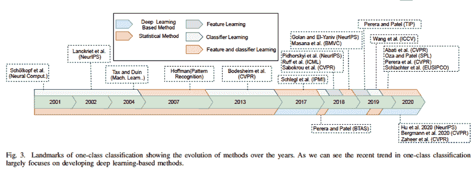
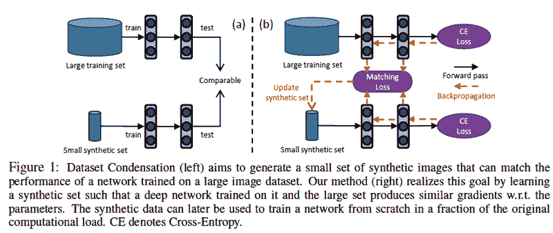
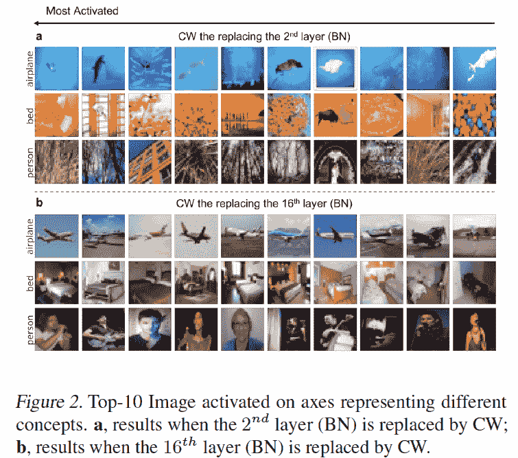
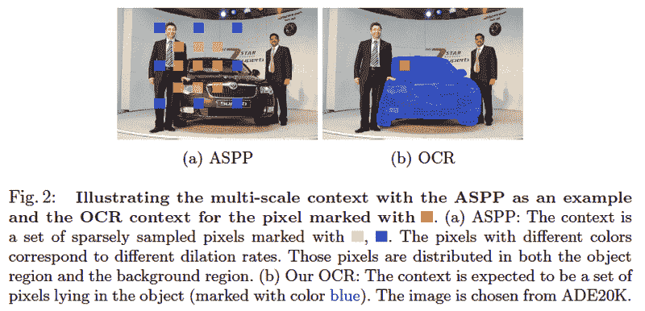
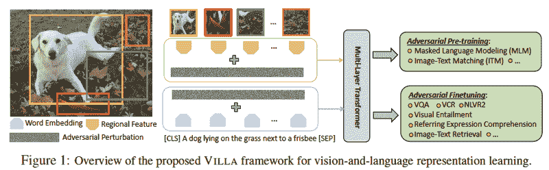
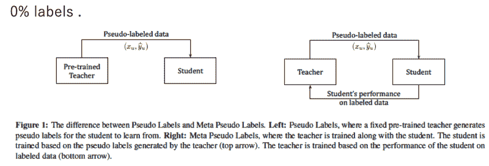
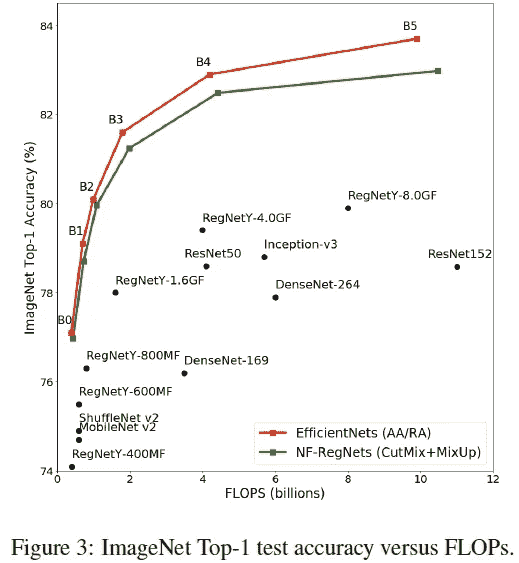
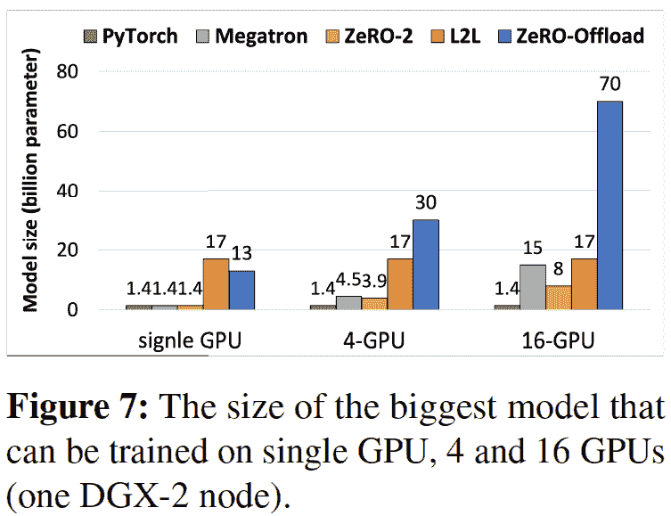
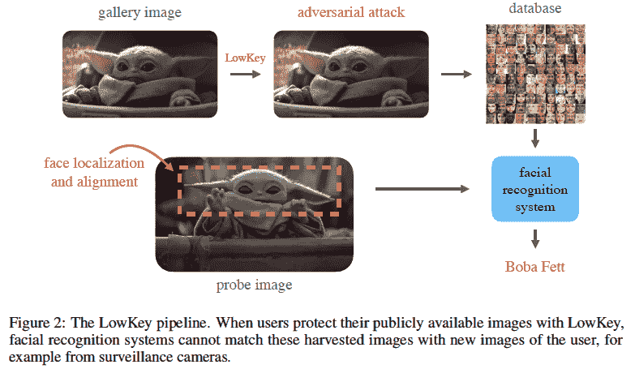

# 2021 年第 5 周

> 原文：<https://medium.com/analytics-vidhya/akiras-ml-news-week-5-2021-86248878c4c3?source=collection_archive---------16----------------------->

以下是我在 2021 年第 5 周(1 月 24 日~)读到的一些我觉得特别有意思的论文和文章。我已经尽量介绍最近的了，但是论文提交的日期可能和星期不一样。

# 主题

1.  机器学习论文
2.  技术文章
3.  机器学习用例的例子
4.  其他主题

# —每周编辑精选

*   [*强化学习看屏幕哪里？*](https://distill.pub/2020/understanding-rl-vision/)
*   [*在一个 GPU 上训练 130 亿个参数*](https://arxiv.org/abs/2101.06840)
*   [*从神经元获得的“视角”解读知识提炼与集成的关系*](https://www.microsoft.com/en-us/research/blog/three-mysteries-in-deep-learning-ensemble-knowledge-distillation-and-self-distillation/)

— — — — — — — — — — — — — — — — — — — — — — — — — —

# 1.机器学习论文

— —

# 一级分类调查

*一级分类:一项调查*
[https://arxiv.org/abs/2101.03064](https://arxiv.org/abs/2101.03064)

异常检测等中使用的基于图像的任务的一类分类综述。引入了相当多的基于 GAN 的算法。它不仅讨论了使用的算法，还讨论了异常检测的数据集和度量。

# 将数据集压缩成几个数据

*数据集凝聚与梯度匹配*
[https://openreview.net/forum?id=mSAKhLYLSsl](https://openreview.net/forum?id=mSAKhLYLSsl)

将数据集压缩为每类几幅图像，同时尽可能降低训练精度的研究。训练数据集，以便从数据中获得的梯度是一致的。将 MNIST (CIFAR)压缩到 10 个数据集后，准确率为 92% (45%)。

# 白化潜在空间中的概念相关信息，使其可解释。

*用于可解释图像识别的概念白化* [https://arxiv.org/abs/2002.01650](https://arxiv.org/abs/2002.01650)

这项研究通过学习分离特定的概念(标签等)来可视化模型所看到的内容。)同时在潜在空间中白化它们。在浅层中，模型看到网络用作分类基础的低级特征，例如颜色，而在深层中，模型看到更抽象的特征。

# 将整个遮罩区域的总和解释为单个对象的表示。

*语义切分的对象语境表征*
[https://arxiv.org/abs/1909.11065](https://arxiv.org/abs/1909.11065)

在语义分割中，每个像素都与一个标签相关联，他们认为语义标签内像素表示的聚合是一个很好的表示，他们设计了一个体现这一思想的对象上下文表示(OCR)模块。它在 ECCV2020 竞赛中获得了一等奖。

# 在预训练和微调中使用对抗性学习

*视觉和语言表征学习的大规模对抗性训练*
[https://arxiv.org/abs/2006.06195](https://arxiv.org/abs/2006.06195)

对抗训练(Adversarial training)是一种提高准确性的有效措施，其中模型用可能导致其错误分类的噪声进行训练，VILLA 通过使用对抗学习进行预训练和微调，在各种视觉语言任务中实现了最高的准确性。

# 在更新学生模型和教师模型的同时学习

*元伪标签*
[https://arxiv.org/abs/2003.10580](https://arxiv.org/abs/2003.10580)

在从教师模型学习带有伪标签的学生模型的方法中，教师模型一般是固定的，但最终学生模型的准确性取决于教师模型。因此，他们采用通过使用学生模型的更新信息更新教师模型来提高准确度的策略。在只有 10%标签的 ImageNet 上实现了超过 90%的准确率。

# 通过模仿网络的行为来学习没有 BatchNorm 的网络。

*特征化信号传播以缩小非标准化结果中的性能差距*
[https://arxiv.org/abs/2101.08692](https://arxiv.org/abs/2101.08692)

通过分析包含 BatchNorm 的 ResNet 的特征映射的行为，并应用一个可以再现无 BatchNorm 行为的系数，提出了 NF (Normalization Free)-ResNet，它可以在没有规范化层的深度网络中训练。由于不稳定，需要配合 CutMix 等使用。但是，使用自动增强，它可以达到与 EfficientNet 相同的性能。

# 在一个 GPU 上训练 130 亿个参数

*零卸载:十亿级模型培训民主化*
[https://arxiv.org/abs/2101.06840](https://arxiv.org/abs/2101.06840)

他们提出零卸载，可以在单个 GPU 上训练多达 130 亿个参数。向前和向后推进计算和参数在 GPU 上维护，而优化器计算留给 CPU。它可以扩展到多个 GPU，并且可以很容易地与 DeepSpeed 库一起使用。

— — — — — — — — — — — — — — — — — — — — — — — — — —

# 2.技术文章

— —

# 变压器是 gnn

 [## 变压器是图形神经网络

### 我的工程界朋友经常问我:关于图的深度学习听起来很棒，但是有真正的应用吗？当……

thegradient.pub](https://thegradient.pub/transformers-are-graph-neural-networks/) 

本文指出了变压器模型和图形神经网络之间的相似之处。如果你把一个文档的令牌看作一个节点，把它看作一个图形，在这个图形中它们都是相互连接的，那么你就可以把这个文档看作一个图形。如果我们将 GNNs 应用于它，我们可以使用 GNNs 建立一个转换器(图形注意力网络+范数+前馈网络)。

# 从卫星图像解决建筑物检测竞争

 [## SpaceNet 7 多时相城市发展挑战:宣布获胜者

### 前言:SpaceNet LLC 是一个非营利组织，致力于加速开源、人工智能…

medium.com](/the-downlinq/the-spacenet-7-multi-temporal-urban-development-challenge-announcing-the-winners-847a9a53004c) 

这是对 SpaceNet 挑战赛冠军的解决方案的解释，它的任务是通过语义分割检测建筑物。它描述了由于建筑物较小而提高分辨率的有效性，以及由于建筑物密集而为建筑物边界添加掩膜的有效性。

# 强化学习看屏幕哪里？

 [## 了解 RL 愿景

### 在多样化的环境中，我们可以使用归因来分析、诊断和编辑深度强化学习模型。在…

蒸馏. pub](https://distill.pub/2020/understanding-rl-vision/) 

一篇可视化游戏画面在强化学习中如何解读的文章。它观察当代理失败时观察到了什么。该文章还提到，只有某些层具有可视化的可解释表示，手动编辑模型以使某些障碍不可见并不总是会导致失败(解释为其他层承担可视化角色)，以及环境随机化对于创建可解释层是必要的。

# 机器学习生命周期

 [## 2021 年的机器学习生命周期

### 你实际上如何完成一个机器学习项目，有哪些工具可以帮助你完成每一步？

towardsdatascience.com](https://towardsdatascience.com/the-machine-learning-lifecycle-in-2021-473717c633bc) 

一篇解释生产环境中模型开发生命周期的文章:数据收集→模型开发→评估。本文描述了注释数据时要采取的预防措施，除非正确定义注释策略，否则模型的准确性不会提高，以及通过查看预测不佳的样本，可以进一步提高准确性。

# 从神经元获得的“视角”解读知识提炼与集成的关系

 [## 3 个深度学习的秘密:集合、知识和自我升华

### 根据现在的标准技术，如过度参数化、批量规范化和添加剩余链接，“现代…

www.microsoft.com](https://www.microsoft.com/en-us/research/blog/three-mysteries-in-deep-learning-ensemble-knowledge-distillation-and-self-distillation/) 

人们认为 Kaggle 中经常使用的集成可以提高性能，因为它们减少了模型的方差，但这篇文章提出，性能可能会提高，因为每个神经元都获得了更多的“视点”。从这个角度来看，知识提炼可以解释为传递“观点”信息的框架，而自我提炼是知识提炼的隐含集合体。

— — — — — — — — — — — — — — — — — — — — — — — — — —

# 3.机器学习用例的例子

— —

# 用人工智能对抗铅中毒

 [## 一种算法正在帮助社区检测铅管

### 在一份法庭声明中，施瓦茨说，他给 AECOM 的员工发了许多电子邮件，包括项目负责人艾伦·黄…

www.wired.com](https://www.wired.com/story/algorithm-helping-community-detect-lead-pipes/) 

一篇描述使用机器学习创建模型来识别密歇根州弗林特市老化水管引起的铅中毒高风险区域的努力，以及随后的法院案件的文章。它谈到了从居民那里获取信息的需要，因此对收集信息的机构(在这种情况下，是政府机构)和算法的信任是必不可少的。

# 利用机器学习寻找火星上的陨石坑

 [## 美国宇航局正在训练一个人工智能来探测火星上的新陨石坑

### 这项新技术可以极大地加速火星和其他星球上陨石坑的发现。在过去的 15 年里，美国宇航局…

www.wired.com](https://www.wired.com/story/nasa-is-training-an-ai-to-detect-fresh-craters-on-mars/) 

在火星研究中，研究新环形山的特征可以帮助估计旧环形山的年龄，NASA 已经使用深度学习来搜索火星上的环形山，将任务从 45 分钟减少到 5 分钟。

# 保护您的隐私免受商业面部识别系统的攻击

*低调:利用对抗性攻击来保护社交媒体用户免受面部识别*
[https://arxiv.org/abs/2101.07922](https://arxiv.org/abs/2101.07922)

发布了 LOWKEY，这是一个让商业面部识别系统很难精确匹配的工具。他们已经看到了 AWS 和 Azure 面部识别系统的效果。上传一张低调的照片会给你发送一张带有敌对噪音的图片。

— — — — — — — — — — — — — — — — — — — — — — — — — —

# 4.其他主题

— —

# 值得关注的人工智能初创公司

 [## 基于 Crunchbase 的 2021 年最值得关注的 25 家机器学习初创公司

### 如今，Crunchbase 中有创纪录的 9，977 家机器学习初创公司和公司，比……增长了 8.2%

www.forbes.com](https://www.forbes.com/sites/louiscolumbus/2021/01/10/top-25-machine-learning-startups-to-watch-in-2021-based-on-crunchbase/) 

Crunchbase(一个搜索私营和公共公司商业信息的平台)介绍了人工智能初创公司的趋势和 25 家值得关注的公司。这篇文章说，2020 年的中值资金是 440 万美元，人工智能初创公司的总资金是 276 亿美元。有许多美国公司，但也有许多来自以色列。

# **白宫启动国家人工智能倡议办公室**

[https://cacm . ACM . org/news/249867-白宫-发射-国家-人工智能-倡议-办公室/全文](https://www.whitehouse.gov/briefings-statements/white-house-launches-national-artificial-intelligence-initiative-office/)

白宫成立了一个办公室，以确保未来几年美国在人工智能领域的领导地位。该办公室将监督和实施美国国家人工智能战略，并作为整个政府、私营部门和学术界人工智能研究和政策制定的中心枢纽。

# 美国在人工智能研究方面领先于中国和欧洲。

 [## 美国在人工智能领域领先，中国崛起，欧盟落后:调查

### 美国在人工智能的开发和使用方面领先竞争对手，而中国正在迅速崛起…

www.euractiv.com](https://www.euractiv.com/section/china/news/us-leading-race-in-artificial-intelligence-china-rising-eu-lagging-survey/) 

使用 30 个单项指标来评估人工智能 R&D，包括人的能力，研究活动，商业发展和软硬件投资，美国以 44.6 分的总分(满分 100 分)领先，其次是中国 32 分和欧盟 23.3 分。美国研究的平均质量高于中国和欧洲。然而，中国政府已经将人工智能列为国家优先事项，特别是就其拥有的超级计算机数量而言，去年是最高的，应该受到密切监控。

— — — — — — — — — — — — — — — — — — — — — — — — — —

# —过去的文章

[2021 第 4 周](/analytics-vidhya/akiras-ml-news-week4-2021-ca5b47b4b61a) ⇦ 2021 第 4 周(本帖)⇨ 2021 第 5 周(不成文)

[2020 年 12 月汇总](/analytics-vidhya/akiras-ml-news-december-2020-44f9235fb250)
[2020 年 11 月汇总](/analytics-vidhya/akiras-ml-news-november-2020-a48a3cb75285) [2020 年 10 月汇总](/analytics-vidhya/akiras-ml-news-october-2020-c7b5b4281d36)

[2020 年总结](https://towardsdatascience.com/machine-learning-2020-summary-84-interesting-papers-articles-45bd45c0d35b)

— — — — — — — — — — — — — — — — — — — — — — — — — —

# 推特，我贴一句纸评论。