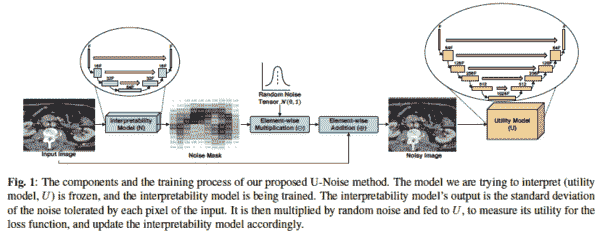
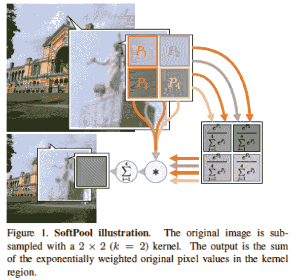
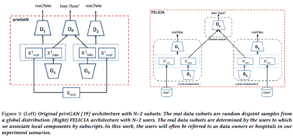
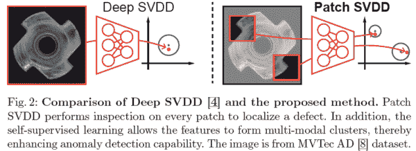
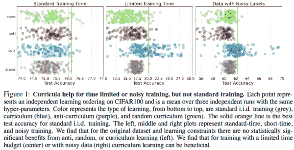
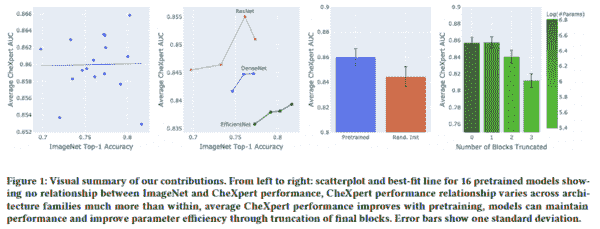
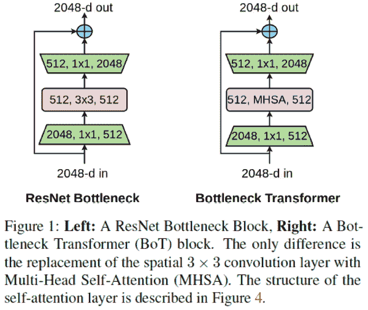
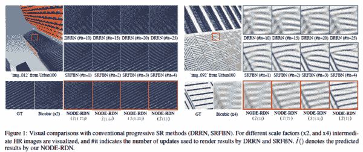
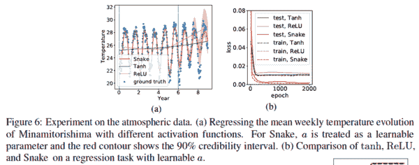

# Akira 的 ML 新闻# 2021 年第 6 周

> 原文：<https://medium.com/analytics-vidhya/akiras-ml-news-week-6-2021-8b5a822d0926?source=collection_archive---------17----------------------->

以下是我在 2021 年第 6 周(1 月 31 日~)读到的一些我觉得特别有意思的论文和文章。我已经尽量介绍最近的了，但是论文提交的日期可能和星期不一样。

我从时事通讯开始。请订阅！

 [## Akira 的 ML 新闻-# 2021 年第 6 周

### 以下是我在 2021 年第 6 周(1 月 31 日~)读到的一些我觉得特别有趣的论文和文章…

www.getrevue.co](https://www.getrevue.co/profile/akiratosei/archive/345481) 

# 主题

1.  机器学习论文
2.  技术文章
3.  机器学习用例的例子
4.  其他主题

# —每周编辑精选

*   [在什么情况下基于课程的学习是有效的？](https://openreview.net/forum?id=tW4QEInpni)
*   [ImageNet 和胸部 x 光数据的性能对比](https://arxiv.org/abs/2101.06871)
*   [用常微分方程求解超分辨率问题](https://arxiv.org/abs/2101.08987)

— — — — — — — — — — — — — — — — — — — — — — — — — —

# 1.机器学习论文

— —

# 一种提高可解释性的方法，它利用了重要部分对噪声敏感的事实。

*U-NOISE:用于可解释图像分割的可学习噪声掩模*
[https://arxiv.org/abs/2101.05791](https://arxiv.org/abs/2101.05791)

提高语义分割中学习模型可解释性的研究。基于当添加噪声时，重要区域应该对噪声的大小(即预测变化)做出敏感响应的想法，他们训练了一个小模型，该模型从学习过的模型和图像中学习如何添加噪声，并搜索学习过的模型做出敏感响应的区域，并将它们识别为重要区域。

# 使用 Softmax 函数执行池化，同时保留信息量。

*用软池*
[https://arxiv.org/abs/2101.00440](https://arxiv.org/abs/2101.00440)细化激活下采样

他们提出了 SoftPool，在一个区域内用 softmax 函数执行池化。与现有方法相比，它可以在压缩特征图的同时保留更多的信息。在图像分类和动作识别中证实了准确度的提高。

# 使用联合学习从分布式数据创建无偏差数据集。

*通过使用集中式对手对医学图像进行联合生成建模来减少偏差并提高效用*
【https://arxiv.org/abs/2101.07235 

他们建议 FELICIA 创建数据集，该数据集通过在联邦学习的框架内创建合成数据集来消除各方拥有的数据集的偏见，并且具有隐私意识。FELICIA 在每个数据保持器内都有一个 GAN 和一个鉴别器来确定数据来自哪里，并学习欺骗它们以获得合成数据。

# 通过与补片中正常图像的距离来定义异常

*补丁 SVDD:用于异常检测和分割的补丁级 SVDD*
[https://arxiv.org/abs/2006.16067](https://arxiv.org/abs/2006.16067)

他们提出了异常检测方法 Patch SVDD，该方法将一幅图像分成多个小块，并将“异常”定义为正常图像小块与潜在空间中最近的小块之间的距离。该方法的关键是在常规异常检测损失的基础上增加了自监督学习损失；在 MVTec 数据集上，准确率得到了很大的提高。

# 在什么情况下基于课程的学习是有效的？

*课程什么时候起作用？*
https://openreview.net/forum?id=tW4QEInpni

关于课程的研究，首先从简单的样本中学习。虽然它在标准基准数据集上无效，但在计算资源有限和标签噪声较大时是有效的。他们还证实，网络从简单的样本中学习，而没有明确地执行课程学习(隐性课程)。

# ImageNet 和胸部 X 线数据的性能比较

CheXtransfer:用于胸部 X 线判读的 ImageNet 模型的性能和参数效率
[https://arxiv.org/abs/2101.06871](https://arxiv.org/abs/2101.06871)

将 ImageNet 上的性能与胸部 X 射线数据上的性能进行比较的结果:ImageNet 分数与胸部 X 射线数据上的分数之间没有明确的相关性，训练前的重量很重要，即使消除了最后一个块，性能也几乎没有下降。最后一部分，即消除最后一个块不会降低性能，是有用的，因为它允许使用轻量级模型，并提供高分辨率的凸轮图像。

# 通过简单地将最后几个块改为自我关注来提高准确度。

视觉识别的瓶颈变形金刚
[https://arxiv.org/abs/2101.11605](https://arxiv.org/abs/2101.11605)

通过使用自我关注来构造 ResNet 的最后几个块，僵尸网络被提议在不进行包括高参数调整在内的任何改变的情况下提高准确性。关键是因为特征图小，所以全局注意力可以用在最后一层。他们证实了图像分类和实例分割准确性的提高。

# 用常微分方程求解超分辨率问题

通过求解 https://arxiv.org/abs/2101.08987
恢复图像

将超分辨率问题视为以低分辨率图像为初始值的常微分方程(ODE)的研究。从初始值(低分辨率图像)开始，通过将 CNN 的微分变化与 Runge-Kutta 方法相结合来获得高分辨率。可以缩放到任何分辨率。

# 明确考虑周期性的激活函数

神经网络无法学习周期函数以及如何修复
https://arxiv.org/abs/2006.08195

提出了激活函数 Snake，x+sin (x ),它考虑了周期性和单调性作为归纳偏差。在预测人体体温的任务中取得了良好的结果。

— — — — — — — — — — — — — — — — — — — — — — — — — —

# 2.技术文章

— —

# 语言模型在强力胶方面超越人类

 [## 微软和谷歌的人工智能模型在强力胶语言上已经超越了人类的表现…

### 2019 年末，脸书大学、NYU 大学、华府大学和…

venturebeat.com](https://venturebeat.com/2021/01/06/ai-models-from-microsoft-and-google-already-surpass-human-performance-on-the-superglue-language-benchmark/) 

谷歌和微软的模型在强力胶方面已经超越了人类。这篇文章解释了什么是强力胶，并对微软的模型 DeBEATa 提供了一些见解。

# 泄漏示例和对策

 [## 机器学习管道工程:数据泄漏

### 在这篇博文中，我们将回顾什么是数据泄露，它的不同风格，并向您展示一个最…

medium.com](/spikelab/machine-learning-plumbery-data-leakage-6537bf287f2f) 

一篇描述数据泄漏的示例和解决方法的文章，其中来自评估数据的信息以某种方式泄漏到训练数据中。文章描述了使用不能用于预测的特征的例子，在评估和训练数据中使用相同患者的例子，以及由于交叉验证和早期停止而导致泄漏的例子(尽管我认为这更像是由于过度拟合而不是泄漏而导致的分数降低)。解释最后这个例子的文章我没见过多少，可能有用。

# 谷歌对 2020 年研究的总结

 [## 谷歌研究:回顾 2020 年，展望 2021 年

### 当我 20 多年前加入谷歌的时候，我们只是在想如何真正开始一个高…

ai.googleblog.com](https://ai.googleblog.com/2021/01/google-research-looking-back-at-2020.html) 

这篇文章是对谷歌 2020 年研究的总结。这篇文章不仅涵盖了常规论文的研究，还涵盖了新冠肺炎、野火、医疗保健和发展环境演变等社会问题的研究。

# 以 NLP 为重点的 2020 年关键主题

 [## 2020 年的 ML 和 NLP 研究亮点

### 区域和方法的选择很大程度上受我自身兴趣的影响；选题偏向于…

ruder.io](https://ruder.io/research-highlights-2020/index.html) 

DeepMind 的一位 NLP 研究人员总结了 2020 年的重要主题，重点关注 NLP，但也提到了 Vision Transformer 以及它与自然科学和 ML 的关系

— — — — — — — — — — — — — — — — — — — — — — — — — —

# 3.机器学习用例的例子

— —

# 利用社交网络应对极端天气

 [## 使用人工智能管理极端天气事件

### 能否将深度学习(DL)-人工智能的一个子领域-与社会网络分析(SNA)结合起来，使…

www.mcgill.ca](https://www.mcgill.ca/newsroom/channels/news/using-artificial-intelligence-manage-extreme-weather-events-327770) 

极端天气事件发生后，社交网站上发布了大量信息。魁北克的麦吉尔大学正在研究利用它们来管理极端天气危机的可能性。

# Spotify 申请专利使用用户语音进行音乐推荐

 [## Spotify 新专利涉及监控用户语音以推荐音乐

### Spotify 已经获得了一项技术专利，该技术旨在利用用户语音和背景噪音的记录来…

pitchfork.com](https://pitchfork.com/news/new-spotify-patent-involves-monitoring-users-speech-to-recommend-music/) 

音乐流媒体平台 Spotify 已经申请了一项专利，可以利用用户的语音信息进行音乐推荐。这声称可以获得情绪起伏和用户是否与他人在一起等信息。目前还不清楚这项专利将如何在实践中使用或不使用。

# 人工智能可解释性的启动

 [## 担心你公司的人工智能道德？这些创业公司是来帮忙的。

### 越来越多的初创公司向组织承诺开发、监控和修复其人工智能模型的方法，奇偶校验就是其中之一…

www.technologyreview.com](https://www.technologyreview.com/2021/01/15/1016183/ai-ethics-startups/) 

机器学习模型充满了种族和其他偏见、潜在的法律风险和不透明性(无法解释预测)等问题。本文介绍了 Parity AI，这是一个研究和减轻这些偏见的初创公司。

— — — — — — — — — — — — — — — — — — — — — — — — — —

# 4.其他主题

— —

# 如何准备 FAANG 面试

讨论如何准备参加 FANNG(脸书、亚马逊、苹果网飞、谷歌)机器学习职位的面试。除了能够谈论你的机器学习知识和最新的论文，它还包括创建一份反映每个公司价值观的故事的简历。

# GPU 性能比较

 [## 面向 2021 年的深度学习工作站、服务器、笔记本电脑| Lambda

### 使用 PyTorch/TensorFlow 对计算机视觉(CV)、自然语言处理(NLP)、文本到语音转换(TTS)等进行 GPU 训练的速度。PyTorch GPU…

lambdalabs.com](https://lambdalabs.com/gpu-benchmarks) 

这是一篇比较 Pytorch 和 Tensorflow 中主要 GPU 性能的文章。可以对半精度、单精度以及每个模型(如 BERT 和 ResNet)进行比较。

— — — — — — — — — — — — — — — — — — — — — — — — — —

# —过去的文章

[2021 第 5 周](/analytics-vidhya/akiras-ml-news-week-5-2021-86248878c4c3) ⇦ 2021 第 6 周(本帖)⇨ 2021 第 7 周(不成文)

【2021 年 1 月汇总 [2020 年 12 月汇总](/analytics-vidhya/akiras-ml-news-december-2020-44f9235fb250)
[2020 年 11 月汇总](/analytics-vidhya/akiras-ml-news-november-2020-a48a3cb75285)

[2020 年总结](https://towardsdatascience.com/machine-learning-2020-summary-84-interesting-papers-articles-45bd45c0d35b)

— — — — — — — — — — — — — — — — — — — — — — — — — —

# 推特，我贴一句纸评论。