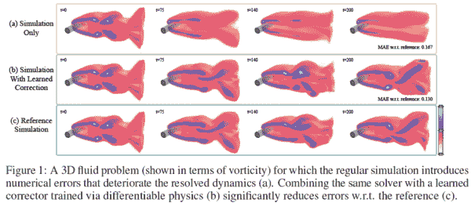

# Akira 的 ML 新闻—2021 年第 7 周

> 原文：<https://medium.com/analytics-vidhya/akiras-ml-news-week-7-2021-8d6517711a17?source=collection_archive---------19----------------------->

以下是我在 2021 年第 7 周(2 月 7 日~)读到的一些我觉得特别有意思的论文和文章。我已经尽量介绍最近的了，但是论文提交的日期可能和星期不一样。

## 主题

1.  机器学习论文
2.  技术文章
3.  机器学习用例的例子
4.  其他主题

## —每周编辑精选

*   [来自微软的经过极高性能培训的 ResNet50】](https://www.microsoft.com/en-us/research/blog/microsoft-vision-model-resnet-50-combines-web-scale-data-and-multi-task-learning-to-achieve-state-of-the-art/)
*   [图像分类可解释性的历史](https://thegradient.pub/a-visual-history-of-interpretation-for-image-recognition/)
*   [一种可以小批量训练的自我监督学习方法](https://arxiv.org/abs/2101.07525)

# 1.机器学习论文

## [一种实用的网络稀疏化方法](https://arxiv.org/abs/2102.00554?utm_campaign=Akira%27s%20ML%20news&utm_medium=email&utm_source=Revue%20newsletter)

[2102.00554]深度学习中的稀疏性:神经网络中高效推理和训练的修剪和增长
[https://arxiv.org/abs/2102.00554](https://arxiv.org/abs/2102.00554?utm_campaign=Akira%27s%20ML%20news&utm_medium=email&utm_source=Revue%20newsletter)

这是一篇 70 多页的论文，对网络稀疏化的实用方法进行了检验，并基于最近的提议讨论了什么是实用的。它说正则化和调度可以实现高性能，但需要更多的超参数，并且学习起来更困难和昂贵；丢弃作为稀疏化的预正则化是有用的；需要仔细考虑每一个的稀疏化初始化。

## [通过混合数据来加密数据集。](https://arxiv.org/abs/2010.02772?utm_campaign=Akira%27s%20ML%20news&utm_medium=email&utm_source=Revue%20newsletter)

[2010.02772] InstaHide:私有分布式学习的实例隐藏方案
[https://arxiv.org/abs/2010.02772](https://arxiv.org/abs/2010.02772?utm_campaign=Akira%27s%20ML%20news&utm_medium=email&utm_source=Revue%20newsletter)

他们提出了 InstaHide，它通过从一个数据集中选择多幅图像来保护数据集免受攻击者的攻击，该数据集中既包括 ImageNet 等网络可用图像，也包括 own dataset，并通过在反转其符号的同时混合图像来构建数据集。可以在学习后保护数据而不降低精度。

## [中断 InstaHide 受保护数据](https://arxiv.org/abs/2011.05315?utm_campaign=Akira%27s%20ML%20news&utm_medium=email&utm_source=Revue%20newsletter)

[2011.05315]对 InstaHide 的攻击:用实例编码实现私人学习可能吗？https://arxiv.org/abs/2011.05315
T3

他们攻击从 insta hide([https://arxiv.org/abs/2010.02772](https://arxiv.org/abs/2010.02772))加密的数据中恢复原始数据。InstaHide 通过将自己的数据与 CIFAR10 等网络可用数据和自己的私人数据混合在一起，对自己的数据进行合成和加密。通过创建一个函数来测量 web 可用数据中的相似性，通过对加密数据进行聚类来恢复加密数据。

## [音频字 2vec](https://arxiv.org/abs/2006.11477?utm_campaign=Akira%27s%20ML%20news&utm_medium=email&utm_source=Revue%20newsletter)

[arxiv.org](https://arxiv.org/abs/2006.11477)

[2006.11477] wav2vec 2.0:语音表示的自我监督学习框架

 [## wav2vec 2.0:语音表示的自我监督学习框架

### 我们第一次展示了从语音音频中学习强有力的表达，然后对其进行微调…

arxiv.org](https://arxiv.org/abs/2006.11477) 

学习言语表征的自我监督学习研究。使用 CNN 将语音的局部表示简化为潜在表示，并且使用使用码本的离散化表示来恢复诸如 BERT 之类的掩蔽部分。使用 CTC 进行微调，以优于现有的半监督方法。

## [可在小批量中训练的自我监督学习方法](https://arxiv.org/abs/2101.07525?utm_campaign=Akira%27s%20ML%20news&utm_medium=email&utm_source=Revue%20newsletter)

[arxiv.org](https://arxiv.org/abs/2101.07525)

[2101.07525]动量老师:动量老师带动量统计进行自导学习
[https://arxiv.org/abs/2101.07525](https://arxiv.org/abs/2101.07525?utm_campaign=Akira%27s%20ML%20news&utm_medium=email&utm_source=Revue%20newsletter)

他们不是用大批量的统计量来执行 BatchNorm，而是提出动量 BatchNorm，用历史上的批次来归一化，可以直接应用于 BYOL 框架；BYOL 使用的批量大小为 4096，而他们可以通过 32 的批量大小达到合理的准确度。

## [消除物体探测中的 NMS](https://arxiv.org/abs/2101.11782?utm_campaign=Akira%27s%20ML%20news&utm_medium=email&utm_source=Revue%20newsletter)

[arxiv.org](https://arxiv.org/abs/2101.11782)

[2101.11782]通过消除启发式 https://arxiv.org/abs/2101.11782
[NMS](https://arxiv.org/abs/2101.11782?utm_campaign=Akira%27s%20ML%20news&utm_medium=email&utm_source=Revue%20newsletter)简化了目标检测

消除目标检测中 NMS 的研究。他们附加了一个 PSS 头，计算哪个锚对每个对象是最佳的，并用排名损失训练它。它提高了一点准确性，同时消除了 NMS 而不减慢学习过程。

## [将湍流模拟加速 80 倍。](https://arxiv.org/abs/2102.01010?utm_campaign=Akira%27s%20ML%20news&utm_medium=email&utm_source=Revue%20newsletter)

[arxiv.org](https://arxiv.org/abs/2102.01010)

[2102.01010]机器学习加速计算流体动力学
[https://arxiv.org/abs/2102.01010](https://arxiv.org/abs/2102.01010?utm_campaign=Akira%27s%20ML%20news&utm_medium=email&utm_source=Revue%20newsletter)

用 ML 逼近每一时间步更新律模拟湍流的研究。10 倍的粗分辨率不会降低精度，因此，在保持精度的同时，可以加速高达 80 倍。

## [通过在学习循环中明确引入可微分流体模拟来提高准确性。](https://arxiv.org/abs/2007.00016?utm_campaign=Akira%27s%20ML%20news&utm_medium=email&utm_source=Revue%20newsletter)

[2007.00016]回路求解器:从可微物理学中学习与迭代偏微分方程求解器互动
[https://arxiv.org/abs/2007.00016](https://arxiv.org/abs/2007.00016?utm_campaign=Akira%27s%20ML%20news&utm_medium=email&utm_source=Revue%20newsletter)

在流体的机器学习近似中，这项研究将明确可微分的物理模拟结合到学习循环中。此外，模拟的梯度可以用来减少离散化误差，这是一个常见的问题。

## [单一模型下的多种视觉语言任务](https://arxiv.org/abs/2102.02779?utm_campaign=Akira%27s%20ML%20news&utm_medium=email&utm_source=Revue%20newsletter)

[arxiv.org](https://arxiv.org/abs/2102.02779)

[2102.02779]通过文本生成统一视觉和语言任务
[https://arxiv.org/abs/2102.02779](https://arxiv.org/abs/2102.02779?utm_campaign=Akira%27s%20ML%20news&utm_medium=email&utm_source=Revue%20newsletter)

他们提出了 VL-巴特和 VL-T5，通过使用具有自回归语言模型的文档生成，可以用单一模型执行各种图像语言任务。这个结果比以前那些需要特定任务的大脑的研究要好。

## [使用强化学习鼓励使用训练数据中不存在的字幕。](https://arxiv.org/abs/2101.09865?utm_campaign=Akira%27s%20ML%20news&utm_medium=email&utm_source=Revue%20newsletter)

[arxiv.org](https://arxiv.org/abs/2101.09865)

【2101.09865】https://arxiv.org/abs/2101.09865
[鼓励抄袭](https://arxiv.org/abs/2101.09865?utm_campaign=Akira%27s%20ML%20news&utm_medium=email&utm_source=Revue%20newsletter)

他们提出了 ECOL-R(利用强化学习鼓励复制对象标签)，该方法使用强化学习来鼓励在新的对象字幕任务中使用不存在于训练数据中的字幕，该任务使用不存在于训练数据中的字幕来描述零镜头形式的图像。所提出的方法基于视觉基因组检测器和任务特定对象检测器，视觉基因组检测器从图像中提取位置和对象，任务特定对象检测器提取抽象标签信息，并使用强化学习来生成训练数据中不存在的脚注。

# 2.技术文章

[**在 keras**](https://keras.io/examples/vision/image_classification_with_vision_transformer/?utm_campaign=Akira%27s%20ML%20news&utm_medium=email&utm_source=Revue%20newsletter)**——**[**中实现视觉转换器 keras.io**](https://keras.io/examples/vision/image_classification_with_vision_transformer/)

 [## Keras 文档:使用视觉转换器进行图像分类

### 作者:Khalid Salama 创建日期:2021/01/18 最近修改时间:2021/01/18 描述:实现愿景…

keras.io](https://keras.io/examples/vision/image_classification_with_vision_transformer/?utm_campaign=Akira%27s%20ML%20news&utm_medium=email&utm_source=Revue%20newsletter) 

一个在 Keras 的视觉变压器的实现，它在去年仅使用纯变压器的情况下胜过了基于 CNN 的模型。它不仅解释了模型，还解释了预处理。

[**NeurIPS2020 参与报告**](https://feldberlin.com/articles/neurips-2020?utm_campaign=Akira%27s%20ML%20news&utm_medium=email&utm_source=Revue%20newsletter)**——**[**feldberlin.com**](https://feldberlin.com/articles/neurips-2020)

 [## NeurIPS 2020 回顾

### 令人难以置信的是，23，000 人参加了 2020 年神经信息处理系统会议，这是一次高度…

feldberlin.com](https://feldberlin.com/articles/neurips-2020?utm_campaign=Akira%27s%20ML%20news&utm_medium=email&utm_source=Revue%20newsletter) 

本文描述了作者在参与 NeurIPS2020 后发现感兴趣的研究及其解释。主题包括模型压缩、可解释性、语音和屏蔽语言模型。

****——**[**The gradient . pub**](https://thegradient.pub/a-visual-history-of-interpretation-for-image-recognition/)**

** [## 图像识别解释的视觉历史

### 图像识别(即对图像中显示的对象进行分类)是计算机视觉中的核心任务，因为它使…

thegradient.pub](https://thegradient.pub/a-visual-history-of-interpretation-for-image-recognition/?utm_campaign=Akira%27s%20ML%20news&utm_medium=email&utm_source=Revue%20newsletter) 

本文描述了深度学习中可解释性研究的演变，按照从旧到新的顺序介绍了 Grad-CAM 等方法，并解释了它们与以前方法的差异，使其非常容易理解。** 

# **3.机器学习用例**

**[**提出考虑电动汽车充电时间的最短路线**](https://ai.googleblog.com/2021/01/addressing-range-anxiety-with-smart.html?utm_campaign=Akira%27s%20ML%20news&utm_medium=email&utm_source=Revue%20newsletter)**——**[**ai.googleblog.com**](https://ai.googleblog.com/2021/01/addressing-range-anxiety-with-smart.html)**

** [## 利用智能电动汽车路径解决里程焦虑

### 用于导航的地图算法通常依赖于 Dijkstra 算法，这是一个基本的教科书解决方案，用于寻找…

ai.googleblog.com](https://ai.googleblog.com/2021/01/addressing-range-anxiety-with-smart.html?utm_campaign=Akira%27s%20ML%20news&utm_medium=email&utm_source=Revue%20newsletter) 

大多数导航系统使用基于 Dijkstra 的方法推导最短路线，这些方法基于教科书级别的知识，但这些方法不能应用于电动汽车，电动汽车的充电点较少，需要更多的充电时间。本文介绍了使用谷歌的图形神经网络开发一种可应用于电动汽车的算法。** 

**[**人工智能的五种使用方法**](https://www.techiexpert.com/5-ways-artificial-intelligence-impacts-daily-life/?utm_campaign=Akira%27s%20ML%20news&utm_medium=email&utm_source=Revue%20newsletter)**——**[**www.techiexpert.com**](https://www.techiexpert.com/5-ways-artificial-intelligence-impacts-daily-life/)**

** [## 人工智能影响日常生活的 5 种方式——Techiexpert.com

### 人工智能是真实的。即使你可能不会马上注意到，人工智能实际上帮助我们每一个人…

www.techiexpert.com](https://www.techiexpert.com/5-ways-artificial-intelligence-impacts-daily-life/?utm_campaign=Akira%27s%20ML%20news&utm_medium=email&utm_source=Revue%20newsletter) 

基于五个案例研究，解释了机器学习在社会的哪些领域得到了应用:社交网络、电子邮件、流媒体服务、智能家居和银行。** 

**[**机器学习偏见的恐怖**](https://gizmodo.com/developing-algorithms-that-might-one-day-be-used-agains-1846114150?utm_campaign=Akira%27s%20ML%20news&utm_medium=email&utm_source=Revue%20newsletter)**——**[**gizmodo.com**](https://gizmodo.com/developing-algorithms-that-might-one-day-be-used-agains-1846114150)**

** [## 开发可能有一天会被用来对付你的算法

### 机器学习算法为我们阅读的新闻、看到的广告提供服务，在某些情况下甚至可以驾驶我们的汽车。但是…

gizmodo.com](https://gizmodo.com/developing-algorithms-that-might-one-day-be-used-agains-1846114150?utm_campaign=Akira%27s%20ML%20news&utm_medium=email&utm_source=Revue%20newsletter) 

对一位机器学习研究者的采访。虽然面部识别等机器学习技术在世界各地被广泛使用，但它们往往包含不适当的偏见。文章警告说，这种偏见可能会导致对少数族裔的压迫和种族歧视，并表示，处理机器学习的公司应该比以往任何时候都更加注重防止这种偏见并确保安全。** 

# **4.其他主题**

**[**非常非常高性能训练 ResNet50 来自微软**](https://www.microsoft.com/en-us/research/blog/microsoft-vision-model-resnet-50-combines-web-scale-data-and-multi-task-learning-to-achieve-state-of-the-art/?utm_campaign=Akira%27s%20ML%20news&utm_medium=email&utm_source=Revue%20newsletter)**——**[**www.microsoft.com**](https://www.microsoft.com/en-us/research/blog/microsoft-vision-model-resnet-50-combines-web-scale-data-and-multi-task-learning-to-achieve-state-of-the-art/)**

** [## 微软视觉模型:最先进的预训练视觉模型

### 预训练的视觉模型加速了深度学习研究，并降低了执行计算机视觉任务的成本…

www.microsoft.com](https://www.microsoft.com/en-us/research/blog/microsoft-vision-model-resnet-50-combines-web-scale-data-and-multi-task-learning-to-achieve-state-of-the-art/?utm_campaign=Akira%27s%20ML%20news&utm_medium=email&utm_source=Revue%20newsletter) 

微软发布了一个非常高性能的训练过的 ResNet50 模型，它可以在多个大型数据集上进行多任务处理。它可以在多个大型数据集上进行多任务处理，并显示出超越 Google 的 Big Transfer 和 OpenAI 的 Clip 的迁移学习性能。此处有训练有素的模特。** 

# **时事通讯和评论。请订阅！**

** [## 阿基拉的 ML 新闻杂志

### 关于我:制造工程师/机器学习工程师/物理学硕士/ ExaWizards Inc. _ _ _ _ _…

www.getrevue.co](https://www.getrevue.co/profile/akiratosei)** 

# **过去的时事通讯**

** [## Akira 的 ML 新闻-# 2021 年第 6 周

### 以下是我在 2021 年第 6 周(1 月 31 日~)读到的一些我觉得特别有趣的论文和文章…

www.getrevue.co](https://www.getrevue.co/profile/akiratosei/issues/akira-s-ml-news-week-6-2021-345481)  [## 2021 年第 5 周

### 以下是我在 2021 年第 5 周(1 月 24 日~)读到的一些我觉得特别有趣的论文和文章…

medium.com](/analytics-vidhya/akiras-ml-news-week-5-2021-86248878c4c3)  [## Akira 的 ML 新闻# 2021 年 1 月

### 以下是我在 2021 年 1 月读到的一些我觉得特别有趣的论文和文章。

medium.com](/analytics-vidhya/akiras-ml-news-january-2021-34a7249c6bb9)  [## 机器学习 2020 摘要:84 篇有趣的论文/文章

### 在这篇文章中，我总共展示了 2020 年发表的 84 篇我觉得特别有趣的论文和文章…

towardsdatascience.com](https://towardsdatascience.com/machine-learning-2020-summary-84-interesting-papers-articles-45bd45c0d35b) 

# 关于我

制造工程师/机器学习工程师/数据科学家/物理学硕士/[http://github.com/AkiraTOSEI/](https://t.co/hjHHbG24Ph?amp=1)

# 推特，我贴一句纸评论。**