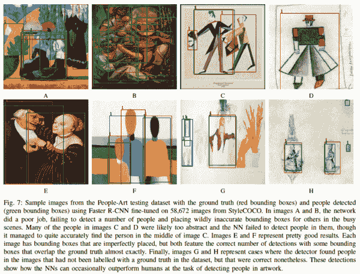

# Akira 的 ML 新闻—2021 年第 8 周

> 原文：<https://medium.com/analytics-vidhya/akiras-ml-news-week-8-2021-a59ee101cef7?source=collection_archive---------12----------------------->

以下是我在 2021 年第 8 周(2 月 14 日~)读到的一些我觉得特别有意思的论文和文章。我已经尽量介绍最近的了，但是论文提交的日期可能和星期不一样。

## 主题

1.  机器学习论文
2.  技术文章
3.  机器学习用例的例子
4.  其他主题

## —每周编辑精选

*   [具有改进的图像标记化的 ViT 模型](https://arxiv.org/abs/2101.11986?utm_campaign=Akira%27s%20ML%20news&utm_medium=email&utm_source=Revue%20newsletter)
*   [运行中的变压器识别任务](https://arxiv.org/abs/2102.05095?utm_campaign=Akira%27s%20ML%20news&utm_medium=email&utm_source=Revue%20newsletter)
*   [在没有批量标准化的情况下表现优于 EfficientNet 的网络](https://arxiv.org/abs/2102.06171?utm_campaign=Akira%27s%20ML%20news&utm_medium=email&utm_source=Revue%20newsletter)

# 1.机器学习论文

## [GANs 生成 GUI](https://arxiv.org/abs/2101.09978?utm_campaign=Akira%27s%20ML%20news&utm_medium=email&utm_source=Revue%20newsletter)

*【2101.09978】GUIGAN:学习使用生成式对抗网络生成 GUI 设计*
一种生成智能手机应用程序 GUI 的 GAN，使用顺序生成每个元素(如按钮)的策略，使用 SeqGAN 而不是直接生成每个像素。

## [用机器学习扩充模拟结果](https://arxiv.org/abs/2010.04456?utm_campaign=Akira%27s%20ML%20news&utm_medium=email&utm_source=Revue%20newsletter)

*【2010.04456】用深度网络增强物理模型，用于复杂动力学预测* 他们提出了 APHYNITY(增强不完整的物理模型，用于识别和预测复杂动力学)，它使用 ML 的力量来补充基于物理的模拟，这种模拟往往过于简化现象，无法很好地预测它们。通过将 ML 和物理模型结合起来，他们可以成功地预测单一模型无法近似的东西。

## [性能优于 EfficientNet 但没有批量标准化的网络](https://arxiv.org/abs/2102.06171?utm_campaign=Akira%27s%20ML%20news&utm_medium=email&utm_source=Revue%20newsletter)

*【2102.06171】无需归一化的高性能大规模图像识别* 他们提出了无需批量归一化就能优于 EfficientNet 的 NFNets。虽然采用了一种机制，像以前的工作一样通过批量归一化来模拟网络的缩放([https://arxiv.org/abs/2101.08692](https://arxiv.org/abs/2101.08692))，但他们使用自适应梯度裁剪(AGC)来根据权重的大小自适应地限制梯度大小。

## [运行中的变压器识别任务](https://arxiv.org/abs/2102.05095?utm_campaign=Akira%27s%20ML%20news&utm_medium=email&utm_source=Revue%20newsletter)

*【2102.06171】无需归一化的高性能大规模图像识别*
他们提出了仅使用变压器的 TimeSformer，并在动作识别任务中超越了基于 CNN 的模型。它计算时间方向上的注意力，然后像在 ViT 中一样在修补每一帧后计算空间方向上的注意力。它在 Kinetics-400，600 上实现了 Sota 性能，在 Something-Something-V2 上也实现了高精度。

## [利用小波提高分辨率的生成模型](https://arxiv.org/abs/2102.06108?utm_campaign=Akira%27s%20ML%20news&utm_medium=email&utm_source=Revue%20newsletter)

*【2102.06108】SWAGAN:一种基于风格的小波驱动生成模型* 在 StyleGAN 中，这项研究通过渐进增长小波而不是 RGB 图像生成高分辨率图像，并且可以达到与基于 RGB 方法相同的质量，而计算资源仅为基于 RGB 方法的 1/4。

## [具有改进的图像标记化的 ViT 模型](https://arxiv.org/abs/2101.11986?utm_campaign=Akira%27s%20ML%20news&utm_medium=email&utm_source=Revue%20newsletter)

*【2101.11986】Tokens-to-Token ViT:在 ImageNet 上从零开始训练视觉变形器* ViT 是第一个精度超过当时最高性能 CNN 模型的纯变形器模型，当数据集为中等规模或模型规模较小时，其性能比等效 CNN 模型差。他们认为这是因为图像标记化过于简单，因此他们提出了一个 T2T 模块，允许通过混合周围的标记进行复制和重新标记化。结果超过了具有相同参数数量的 ResNet 的结果。此外，他们通过应用 ghost net([https://arxiv.org/abs/1911.11907')](https://arxiv.org/abs/1911.11907'))中使用的压缩方法成功压缩了模型。

## 检测艺术品中的人物。

*【2102.06529】仅使用风格转换来改进艺术图像中的对象检测* 这是一项通过使用修改后的 COCO 女士(即风格转换为艺术风格)进行微调来检测艺术作品中的人物的研究。原则上，它可以用于非人类的检测，并且它可以用于收集描绘某个对象的艺术品。

## [从多幅图像中创建动画](https://arxiv.org/abs/2102.03141?utm_campaign=Akira%27s%20ML%20news&utm_medium=email&utm_source=Revue%20newsletter)

*【2102.03141】Character gan:少镜头关键点角色动画和寄托* 这是一个从几个图像创建动画的研究。通过将图像的每个部分分成三层，他们可以生成不会混淆前景和背景的图像，同时通过预测遮罩，他们可以让模型学会保持各个部分之间的联系。

# 2.技术文章

## [**使用 Tensorflow.js 运行对象检测模型**](https://blog.tensorflow.org/2021/01/custom-object-detection-in-browser.html?utm_campaign=Akira%27s%20ML%20news&utm_medium=email&utm_source=Revue%20newsletter)

 [## 使用 TensorFlow.js 在浏览器中进行自定义对象检测

### 获取和处理数据如前所述，该模型将使用袋鼠数据集进行训练…

blog.tensorflow.org](https://blog.tensorflow.org/2021/01/custom-object-detection-in-browser.html) 

本文解释了如何使用 tensorflow.js 训练对象检测模型，该模型允许您创建在浏览器中运行的模型，以及如何使用它通过网络摄像头执行实时检测。详细解释了该过程的每个步骤。

## [**检测高低频的神经元**](https://distill.pub/2020/circuits/frequency-edges/?utm_campaign=Akira%27s%20ML%20news&utm_medium=email&utm_source=Revue%20newsletter)

 [## 高低频检测器

### 一个对从高到低空间频率的定向转换做出反应的早期视觉神经元家族。一些…

蒸馏. pub](https://distill.pub/2020/circuits/frequency-edges/) 

一篇关于 DNN 神经元检测到的模式的讨论文章。用于图像识别的 DNN 模型不仅具有用于识别简单图案(例如简单曲线、直线和颜色)的机制，还具有用于识别组合了高和低频率的图案的组。文章认为它们是用来识别物体边界的。

## [**可视化一个量词**](https://distill.pub/2020/grand-tour/?utm_campaign=Akira%27s%20ML%20news&utm_medium=email&utm_source=Revue%20newsletter)

 [## 可视化神经网络与大旅游

### “大旅行”是一种经典的高维点云可视化技术，它可以投射出一个高维的…

蒸馏. pub](https://distill.pub/2020/grand-tour/) 

这篇文章使用了一种叫做 GroundTour 的方法，直观地展示了在一个简单的卷积网络的训练过程中，属于每个标签的数据是如何分类的。有趣的是，每个标签的学习时间是不同的，并且对立样本在中间层形成独立于正常数据的聚类。

# 3.机器学习用例

## [**风力发电机自动减速防止鸟撞**](https://electrek.co/2021/01/29/wind-farm-eagle-deaths-cut-by-82-percent-ai-optical-technology/?utm_campaign=Akira%27s%20ML%20news&utm_medium=email&utm_source=Revue%20newsletter)

 [## 这种人工智能光学技术将风力涡轮机鹰的死亡率降低了 82% - Electrek

### IdentiFlight 的智能摄像机可以发现老鹰等猛禽，然后停止风力涡轮机以保护鸟类…

electrek.co](https://electrek.co/2021/01/29/wind-farm-eagle-deaths-cut-by-82-percent-ai-optical-technology/) 

风力发电设施会导致野生鸟类与它们相撞，导致死亡。为了防止这种情况，已经安装了一个系统，该系统使用机器学习来识别 15 公里范围内的飞行物体，从而确定是否减慢风力涡轮机的旋转。这让我们在保护野生动物的同时，最大限度地减少发电的减法。

## [**GNN 应用举例**](/criteo-engineering/top-applications-of-graph-neural-networks-2021-c06ec82bfc18?utm_campaign=Akira%27s%20ML%20news&utm_medium=email&utm_source=Revue%20newsletter)

 [## 图形神经网络的主要应用 2021

### gnn 在学术界取得了长足的进步。但是我们在工业上有很好的应用吗？

medium.com](/criteo-engineering/top-applications-of-graph-neural-networks-2021-c06ec82bfc18) 

本文介绍了图形神经网络的一些现实应用，包括阿里巴巴用于推荐，谷歌用于硬件优化和药物发现。

# 4.其他主题

## [**闪电来自 Pytorch 闪电**](/pytorch/introducing-lightning-flash-the-fastest-way-to-get-started-with-deep-learning-202f196b3b98?utm_campaign=Akira%27s%20ML%20news&utm_medium=email&utm_source=Revue%20newsletter)

 [## 闪电简介—从深度学习基线到研究瞬间完成

### Flash 是一个任务集合，用于快速原型制作、基线和微调，以实现快速和可扩展的 DL，构建于…

medium.com](/pytorch/introducing-lightning-flash-the-fastest-way-to-get-started-with-deep-learning-202f196b3b98) 

Pytorch 闪电放出了闪电闪，比 Pyroch 闪电还要简单。它可以在几行代码中使用训练好的模型执行文本分类、表格数据分类和图像表示向量获取。

# 关于机器学习的每周时事通讯

 [## 阿基拉的 ML 新闻杂志

### 关于我:制造工程师/机器学习工程师/物理学硕士/ ExaWizards Inc. _ _ _ _ _…

www.getrevue.co](https://www.getrevue.co/profile/akiratosei) 

# 过去的时事通讯

 [## Akira 的 ML 新闻-# 2021 年第 7 周

### 以下是我在 2021 年第 7 周(2 月 7 日~)读到的一些我觉得特别有趣的论文和文章…

www.getrevue.co](https://www.getrevue.co/profile/akiratosei/issues/akira-s-ml-news-week-7-2021-372359)  [## Akira 的 ML 新闻-# 2021 年第 6 周

### 以下是我在 2021 年第 6 周(1 月 31 日~)读到的一些我觉得特别有趣的论文和文章…

www.getrevue.co](https://www.getrevue.co/profile/akiratosei/issues/akira-s-ml-news-week-6-2021-345481)  [## Akira 的 ML 新闻# 2021 年 1 月

### 以下是我在 2021 年 1 月读到的一些我觉得特别有趣的论文和文章。

medium.com](/analytics-vidhya/akiras-ml-news-january-2021-34a7249c6bb9)  [## 机器学习 2020 摘要:84 篇有趣的论文/文章

### 在这篇文章中，我总共展示了 2020 年发表的 84 篇我觉得特别有趣的论文和文章…

towardsdatascience.com](https://towardsdatascience.com/machine-learning-2020-summary-84-interesting-papers-articles-45bd45c0d35b) 

# 关于我

制造工程师/机器学习工程师/数据科学家/物理学硕士/[http://github.com/AkiraTOSEI/](https://t.co/hjHHbG24Ph?amp=1)

推特，我贴一句纸评论。