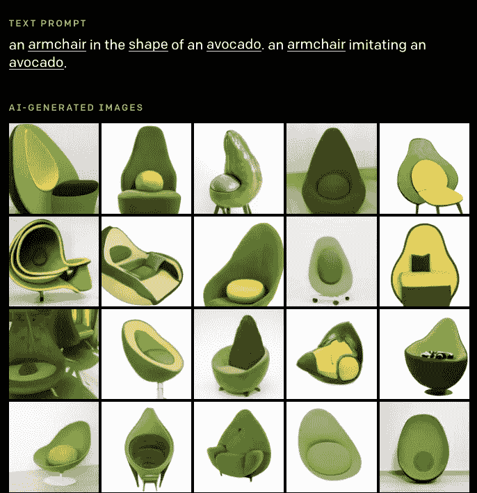

# 2021 年第 2 周阿基拉的 ML 新闻

> 原文：<https://medium.com/analytics-vidhya/akiras-ml-news-week2-2021-c9374ac86d3e?source=collection_archive---------26----------------------->

以下是我在 2021 年第 2 周(1 月 3 日~)读到的一些我觉得特别有意思的论文和文章。我已经尽量介绍最近的了，但是论文提交的日期可能和星期不一样。

# 主题

1.  机器学习论文
2.  技术文章
3.  机器学习用例的例子
4.  其他主题

# —每周编辑精选

*   [用码本和变换器生成高分辨率图像](https://arxiv.org/abs/2012.09841)
*   [通过共同学习自然语言和图像实现零镜头推理。](https://cdn.openai.com/papers/Learning_Transferable_Visual_Models_From_Natural_Language_Supervision.pdf)
*   [open ai 对文本到图像的重大改进](https://openai.com/blog/dall-e/#fn1)

— — — — — — — — — — — — — — — — — — — — — — — — — —

# 1.机器学习论文

— —

# 利用码本和变换生成高分辨率图像

*驯服变形金刚进行高分辨率图像合成*
[https://arxiv.org/abs/2012.09841](https://arxiv.org/abs/2012.09841)

他们提出 VQGAN，从 Transformer 和 codebooks 生成图像，像 VQ-VAE 一样量化潜在空间，但使用 GAN 生成图像，使用 prior by Transformer 代替 PixelCNN。从深度和关键点生成图像也是可能的。

# 通过一起学习自然语言和图像来实现零镜头推理。

*从自然语言监督中学习可转移的视觉模型*
[https://cdn . open ai . com/papers/Learning _ Transferable _ Visual _ Models _ From _ Natural _ Language _ Supervision . pdf](https://cdn.openai.com/papers/Learning_Transferable_Visual_Models_From_Natural_Language_Supervision.pdf)

OpenAI 提出了 CLIP，它使用图像和文本编码网络来执行任务，例如以类似 GPT 3 的零拍摄方式进行图像分类。由于 CLIP 使用自然语言，它可以比用 ImageNet 预先训练的模型更灵活地响应各种任务。例如，它可以为插图分配类别。除了图像分类，它还可以执行诸如动作检测、OCR 和对象细节分类的任务。然而，它不擅长计算物体或表达距离等任务(GPT 3 号也有同样的问题，无法理解奶酪融化等物理关系)。

# OpenAI 对文本到图像的主要改进

*DALL E:从文本中创建图像*
[https://openai.com/blog/dall-e/#fn1](https://openai.com/blog/dall-e/#fn1)

OpenAI 开发的基于转换器的文本到图像(从文档生成图像)模型。该论文尚未发表，它有 120 亿个参数(约为 GPT-3 的 1/10)。它不仅可以描述单个物体，也可以描述多个物体，可以成功地描述一个不存在的概念(牛油果椅)。它还可以通过生成图像来解决类似智商测试的问题。

# 考虑由注释者引起的不确定性。

*从医学图像分割的地面真相中解开人为错误*
[https://arxiv.org/abs/2007.15963](https://arxiv.org/abs/2007.15963)

在医疗数据中,“正确的”分割模板的准确性和趋势因每个人的技能水平而异。他们提出了一种可以考虑这些不确定性的学习方法。它分为一个面具预测网络和一个计算每个人的预测面具的每像素混淆矩阵的网络。

# 可以用 100 个数据训练的 gan

*针对数据高效型 GAN 训练的差异化增强*
[https://arxiv.org/abs/2006.10738](https://arxiv.org/abs/2006.10738)

通过在 G 和 D 学习中使用可区分数据增强，GANs 能够用少量数据生成图像。如果是不可微的，则只能在 D 学习中应用数据增强，G/D 学习之间失去平衡，导致性能下降。

# 利用标签平滑处理标签噪声

*标签平滑是否减轻了标签噪声？*
[https://arxiv.org/abs/2003.02819](https://arxiv.org/abs/2003.02819)

实验研究表明，标签平滑对标签噪声是有效的。在存在噪声的情况下，始终使用标签平滑而不是正常的 ce 损失可以提高精度，并成功分离噪声数据。他们发现，在有噪声的情况下，标签平滑对蒸馏效果更好。

# 视觉变压器综述

*关于视觉变形金刚的调查*
[https://arxiv.org/abs/2012.12556](https://arxiv.org/abs/2012.12556)

图像任务中使用的转换器的概述，从转换器本身的描述开始，然后描述每个转换器。描述相当详细，尤其是对维特和 DETR。

# 结合来自频率空间的信息

*FcaNet:频道关注网*
[https://arxiv.org/abs/2012.11879](https://arxiv.org/abs/2012.11879)

他们提出了 FcaNet，它概括了类似 SENet 的通道注意，并结合了频率成分的处理。当对特征图应用离散傅立叶变换时，SENet 过程对应于 k=0，但是它也可以处理 k>1 的信息。准确度大大提高。

# 也使用深度信息进行分割。

*用自我监督的深度估计改进语义分割的三种方法* [https://arxiv.org/abs/2012.10782](https://arxiv.org/abs/2012.10782)

深度信息在语义切分任务中的应用研究。他们提出了 DepthMix，它混合数据，以便它不会根据深度而变得不自然，以及一种使用多样性和不确定性方面的深度估计模型来选择要注释的样本的策略。

— — — — — — — — — — — — — — — — — — — — — — — — — —

# 2.技术文章

— —

# Python 库 2020

 [## 你应该知道的 2020 年 10 大 Python 库| Tryolabs 博客

### 欢迎来到我们顶级 Python 库列表的第六个年度版本！规则很简单。我们正在寻找…

tryolabs.com](https://tryolabs.com/blog/2020/12/21/top-10-python-libraries-of-2020/) 

本文介绍了一些将于 2020 年发布或流行的 Python 库。它引入了 PrettyErrors，这使得错误更容易看到，pytorch lightning，这是 keras 的 pytorch 版本，以及 norfair，这使得跟踪可以在几行中完成。

# 对 GNN 和 NLP 研究趋势的抱怨

 [## 为什么我对图形神经网络不冷不热

### TL；DR: GNNs 可以提供比简单的嵌入方法更好的优势，但是我们正处在一个其他研究方向…

www.singlelunch.com](https://www.singlelunch.com/2020/12/28/why-im-lukewarm-on-graph-neural-networks/) 

在这篇博客中，在指出 GNN 和 NLP 在矩阵分解方面的关系(图嵌入就是矩阵压缩，NLP 也是矩阵压缩)之后，它抱怨了 GNN/NLP 的研究趋势。它批评了 GNN 的小规模数据集和专注于改进架构的研究趋势。

— — — — — — — — — — — — — — — — — — — — — — — — — —

# 3.机器学习用例的例子

— —

# 对 2021 年人工智能医疗保健的预测

 [## 对 2021 年人工智能驱动的数字医疗保健的预测

### 除了为新冠肺炎开发疫苗的努力之外，2020 年是人工…

medcitynews.com](https://medcitynews.com/2020/12/predictions-for-ai-powered-digital-healthcare-in-2021/) 

一篇预测 2021 年人工智能将如何用于医疗保健的文章。它描述了如何使用它来加快质量控制，优先诊断患者，偏远地区的医疗保健，以及筛选患者，以确定他们是否应该接受特定的测试，如 CT。

# 实时人工智能和应用实例以及如何实现

 [## 机器学习正在走向实时化

### 在与美国、欧洲和……的主要互联网公司的机器学习和基础设施工程师交谈后

huyenchip.com](https://huyenchip.com/2020/12/27/real-time-machine-learning.html) 

文章从两个角度讨论了如何利用人工智能:实时预测的人工智能(在线预测)和实时更新模型的人工智能(在线学习)，以及实现它们的技术和问题。在前一种情况下，模型压缩被认为是实现这一点的一种技术。在后一篇文章中，他引用了抖音的推荐系统作为应用实例，但他表示，目前只有有限几家公司采用了这一系统。虽然许多公司仍在争论这些技术的实施，但一些公司正在使用这种实时机器学习，这可能是获得竞争优势的关键。

— — — — — — — — — — — — — — — — — — — — — — — — — —

# 4.其他主题

— —

# JupyterLab 3.0 发布

 [## JupyterLab 3.0 发布了！

### JupyterLab 的 3.0 版本为用户带来了许多新特性，并对扩展进行了实质性的改进…

blog.jupyter.org](https://blog.jupyter.org/jupyterlab-3-0-is-out-4f58385e25bb) 

JupyterLab 3.0 已经发布。主要特点似乎是一个可视化调试器，支持多种语言，如中文，和一个简化的界面。

# AI/ML 启动失败

一个讨论 AI/ML 创业成功或失败及其原因的帖子。管理和解决问题的难度被认为是失败的原因。有趣的是，他们失败了，因为他们试图将 ML 应用到个人不需要的地方。还有对创业公司成功定义的讨论(被收购还是 IPO？).

— — — — — — — — — — — — — — — — — — — — — — — — — —

# —过去的文章

[2020 第 52 周](/analytics-vidhya/akiras-ml-news-week52-2020-845556ee3a45) ⇦ 2021 第 2 周(本帖)⇨ [2021 第 3 周](/analytics-vidhya/akiras-ml-news-week3-2021-5c03fb326bfe)

[2020 年 12 月汇总](/analytics-vidhya/akiras-ml-news-december-2020-44f9235fb250)
[2020 年 11 月汇总](/analytics-vidhya/akiras-ml-news-november-2020-a48a3cb75285) [2020 年 10 月汇总](/analytics-vidhya/akiras-ml-news-october-2020-c7b5b4281d36)

[2020 年汇总](https://towardsdatascience.com/machine-learning-2020-summary-84-interesting-papers-articles-45bd45c0d35b)

— — — — — — — — — — — — — — — — — — — — — — — — — —

# 推特，我贴一句纸评论。

[https://twitter.com/AkiraTOSEI](https://twitter.com/AkiraTOSEI)