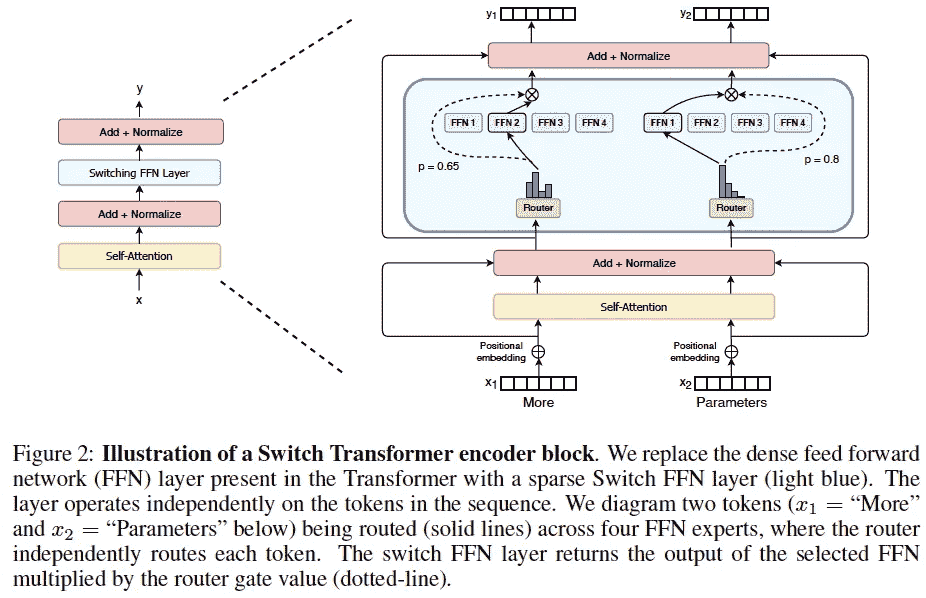
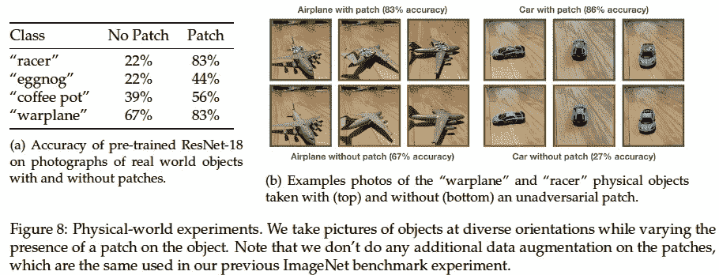
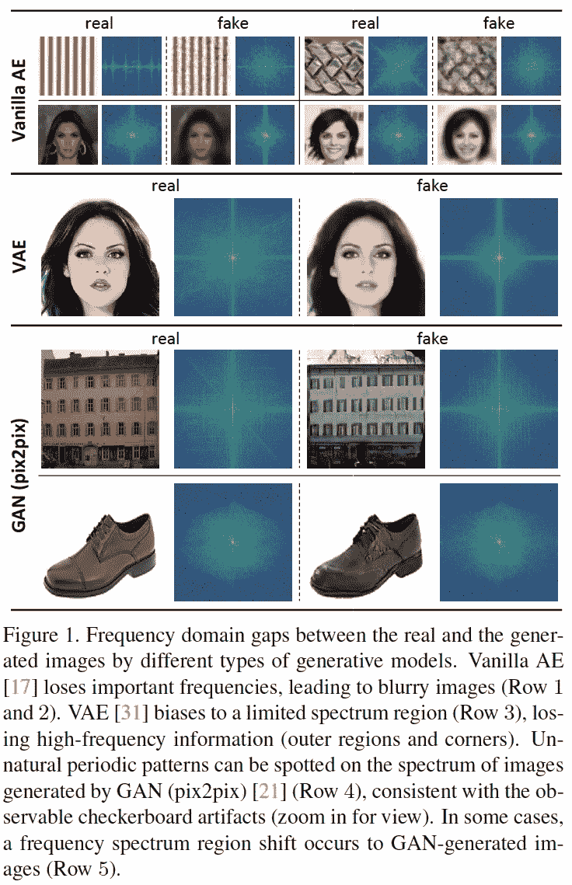
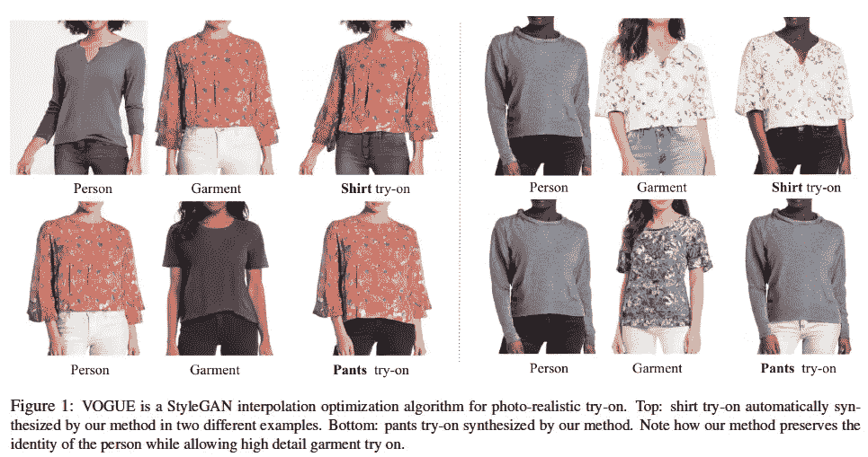
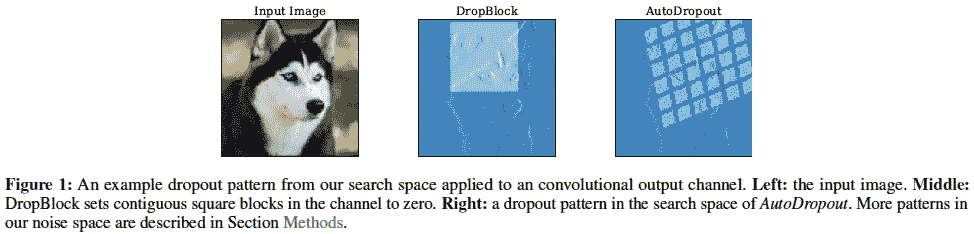
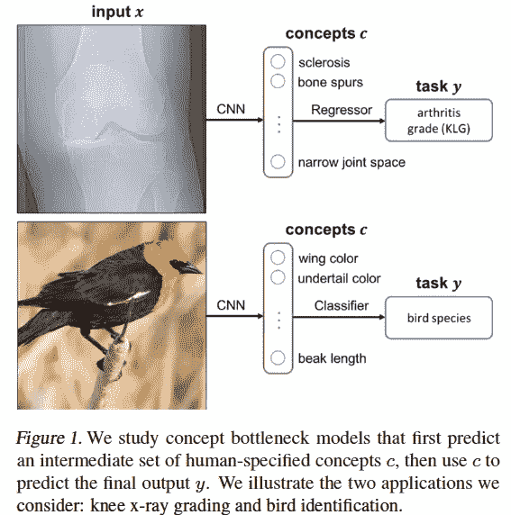
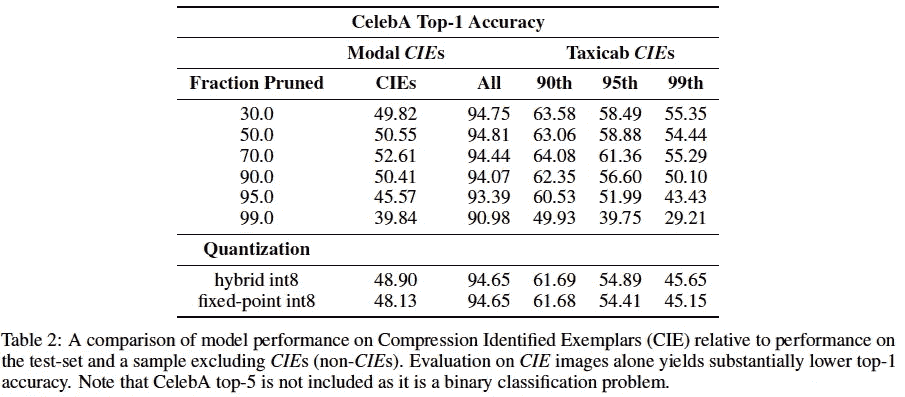
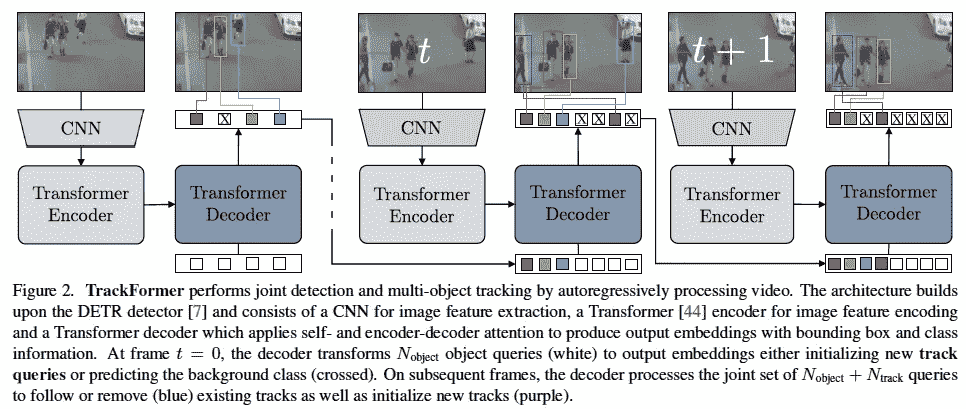

# Akira 的 ML 新闻#第 3 周，2021

> 原文：<https://medium.com/analytics-vidhya/akiras-ml-news-week3-2021-5c03fb326bfe?source=collection_archive---------17----------------------->

以下是我在 2021 年第 3 周(1 月 10 日~)读到的一些我觉得特别有意思的论文和文章。我已经尽量介绍最近的了，但是论文提交的日期可能和星期不一样。

# 主题

1.  机器学习论文
2.  技术文章
3.  机器学习用例的例子
4.  其他主题

# —每周编辑精选

*   [通过为每个令牌切换层来快速训练大规模模型](https://arxiv.org/abs/2101.03961)
*   [通过贴增加信心的贴片来增加安全性。](https://arxiv.org/abs/2012.12235)
*   [通过减少频率空间差异的高性能生成模型](https://arxiv.org/abs/2012.12821)

— — — — — — — — — — — — — — — — — — — — — — — — — —

# 1.机器学习论文

— —

# 通过为每个令牌切换层来快速训练大规模模型

*开关变压器:简单高效稀疏缩放至万亿参数模型* [https://arxiv.org/abs/2101.03961](https://arxiv.org/abs/2101.03961)

他们提出了一种开关变压器，可以在自我关注后通过“切换”到每个令牌最合适的专用层来有效地学习大量参数。使用的参数是 T5 的 65 倍，但达到相同精度的速度是 T5 的 7 倍。模型中参数的最大数量为 1.5 万亿。
模型实际上是稀疏的。虽然利用了大规模模型和大参数，但是由于切换，每个令牌使用的参数数量实际上很少。还有很多要考虑的，比如如何扩展每个设备的参数，但这可能会随着模型缩放成为一种趋势。

# 通过应用增强信心的补丁来提高安全性。

*非通用示例:为稳健视觉设计对象* [https://arxiv.org/abs/2012.12235](https://arxiv.org/abs/2012.12235)

通过创建和附加补丁来提高识别准确性的研究，通过与敌对样本相反来提高可信度。可能的应用包括通过将补丁附加到现实世界中需要识别准确性的区域来增加安全性，例如无人机着陆时需要识别的着陆垫。

# 通过减少频率空间中差异的更高性能的生成模型

*创成式模型的焦频损失*
[https://arxiv.org/abs/2012.12821](https://arxiv.org/abs/2012.12821)

尽管由生成模型生成的图像是成功的，但是在频率空间中它们与真实图像之间存在差异。使用离散傅立叶变换，提出了损失函数，即聚焦频率损失，以最小化差异。它填补了频率空间的差异，并提高了生成的 VAE 图像的质量，该图像往往是模糊的。

# 使用 StyleGAN2 进行虚拟试穿

*VOGUE:试穿由 StyleGAN 插值优化*
[https://arxiv.org/abs/2101.02285](https://arxiv.org/abs/2101.02285)

虚拟试穿研究。首先，他们用关键点条件对 StyleGAN2 进行预训练，然后对其进行后训练，调整服装参考图像和人体图像在各层中的混合比例，使服装和人体图像混合在一起。

# 强化学习下的最优辍学

*自动退出:学习退出模式以规范深层网络*
[https://arxiv.org/abs/2101.01761](https://arxiv.org/abs/2101.01761)

使用强化学习搜索最佳漏失的研究，以找到复杂漏失模式的最佳参数，包括掩模旋转。参数由控制器(如 NAS)按顺序生成，但使用转换器而不是 RNN。用 NLP 和图像证实了该效果。

# 通过相关信息进行预测，提高可解释性

*概念瓶颈车型*
[https://arxiv.org/abs/2007.04612](https://arxiv.org/abs/2007.04612)

除了正确的标签之外，通过预测相关信息(概念:鸟类的羽毛颜色和喙长)来预测标签的模型。该模型可以提高模型的可解释性，因为它输出了相关的信息。如果模型输出的概念是错误的，它可以被纠正，允许在推理过程中进行人工干预。

# 修剪会导致偏差

*表征压缩模型中的偏差*
[https://arxiv.org/abs/2010.03058](https://arxiv.org/abs/2010.03058)

一项研究表明，通过修剪来减少模型大小会导致偏差。结果表明，修剪似乎不会导致整体准确性的大幅下降，但它确实会导致具有罕见事件的数据的准确性大幅下降。

# 基于变形器的多目标跟踪

*TrackFormer:用变形金刚*
[https://arxiv.org/abs/2101.02702](https://arxiv.org/abs/2101.02702)进行多物体跟踪

基于变换的目标检测模型 DETR 在多目标跟踪中的应用研究。将前一帧中的对象添加到要跟踪的解码器的对象查询中。

# 数学上等价的变换降低了自我关注的计算复杂度。

*高效注意:具有线性复杂度的注意*
https://open access . the CVF . com/content/WACV 2021/papers/Shen _ Efficient _ Attention _ Attention _ With _ Linear _ Complexities _ WACV _ 2021 _ paper . pdf

通过将自我关注度的计算由(QK)V 改为 Q(KV)，可以将计算量从 n 减少到 d_k*d_v，数学等价。在大分辨率下，计算量可以显著减少。在对象检测中，我们通过将它作为非局部模块的替代来确认准确性的提高。

— — — — — — — — — — — — — — — — — — — — — — — — — —

# 2.技术文章

— —

# 监控机器学习服务

 [## 监控 ML 系统的简单解决方案。

### 这篇博文旨在为监控 ML 系统提供一个简单的开源解决方案。我们将讨论…

www.jeremyjordan.me](https://www.jeremyjordan.me/ml-monitoring/) 

正如使用软件的服务需要被监控一样，使用机器学习的服务也需要被监控。本文解释了使用机器学习在服务中监视什么(例如，精确监视以检查模型是否过时)、案例研究和监视工具的介绍。

# 2020 年趋势来自带代码的纸张

 [## 论文与代码 2020 审查

### 论文与代码索引各种机器学习工件-论文，代码，结果-以促进发现和…

medium.com](/paperswithcode/papers-with-code-2020-review-938146ab9658) 

这是《有代码的论文》中最受欢迎的论文、库和基准数据集的总结。

— — — — — — — — — — — — — — — — — — — — — — — — — —

# 3.机器学习用例的例子

— —

# DeepFake 的使用方向

 [## deepfakes 成为主流的那一年

### 2018 年，Motherboard 的记者山姆·科尔(Sam Cole)发现了互联网一个新的令人不安的角落。Reddit 用户……

www.technologyreview.com](https://www.technologyreview.com/2020/12/24/1015380/best-ai-deepfakes-of-2020) 

DeepFake 已经成为一个社会问题，包括虚假色情，这篇文章解释了它被使用的好的和坏的方式。好的用途包括改变举报人的脸以保护他或她，多语言政治家用他们的母语说话的宣传视频，以及作为娱乐的历史视频。

# 医学 x 机器学习的问题

 [## 医学的机器学习问题

### Rachel Thomas 随着大数据工具重塑医疗保健，有偏见的数据集和无法解释的算法威胁着进一步…

bostonreview.net](https://bostonreview.net/science-nature/rachel-thomas-medicines-machine-learning-problem) 

一篇指出医学 x 机器学习问题的文章。医学 x 机器学习在媒体上闹得沸沸扬扬，但是机器学习是依赖数据的，医学数据很容易出现缺失或偏差，或者由于缺乏了解导致数据收集不当。它还介绍了由于算法实现错误而导致援助延迟的情况。

— — — — — — — — — — — — — — — — — — — — — — — — — —

# 4.其他主题

— —

# 美国需要人工智能技术。

 [## 美国需要更多外国人工智能技术

### 因此，我对在国家安全和经济之间进行权衡持开放态度，我也非常愿意做出…

www.wired.com](https://www.wired.com/story/us-needs-more-foreign-artificial-intelligence-know-how/) 

对曾在奥巴马政府担任首席经济顾问的弗曼的采访。他说，特朗普政府有一项不鼓励工程师和学生来美国的政策，但拜登政府需要对此采取行动。

# 在 CPU 上训练深度学习模型

 [## 这家初创公司让深度学习在没有专门硬件的情况下成为可能

### 让尼尔·沙维特创办公司的发现和大多数发现一样:纯属偶然。麻省理工学院…

www.technologyreview.com](https://www.technologyreview.com/2020/06/18/1003989/ai-deep-learning-startup-neural-magic-uses-cpu-not-gpu/) 

这篇文章谈论的是 Neural Magic，一家使用 CPU 而不是 GPU 作为深度学习硬件的初创公司。Neural Magic 正在开发可以在 CPU 上训练的软件，以便它可以独立运行，并仍然可以广泛用于现有 PC 上的深度学习模型。

— — — — — — — — — — — — — — — — — — — — — — — — — —

# —过去的文章

[2021 第 2 周](/analytics-vidhya/akiras-ml-news-week2-2021-c9374ac86d3e) ⇦ 2021 第 3 周(本帖)⇨ [2021 第 4 周](/analytics-vidhya/akiras-ml-news-week4-2021-ca5b47b4b61a)

[2020 年 12 月汇总](/analytics-vidhya/akiras-ml-news-december-2020-44f9235fb250)
[2020 年 11 月汇总](/analytics-vidhya/akiras-ml-news-november-2020-a48a3cb75285) [2020 年 10 月汇总](/analytics-vidhya/akiras-ml-news-october-2020-c7b5b4281d36)

[2020 年总结](https://towardsdatascience.com/machine-learning-2020-summary-84-interesting-papers-articles-45bd45c0d35b)

— — — — — — — — — — — — — — — — — — — — — — — — — —

# 推特，我贴一句纸评论。