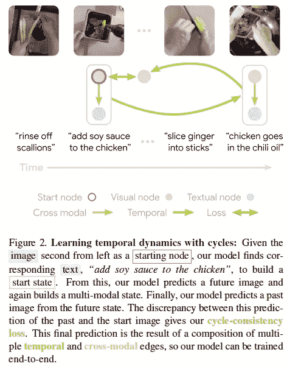
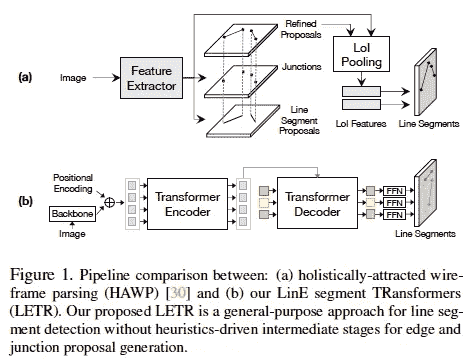
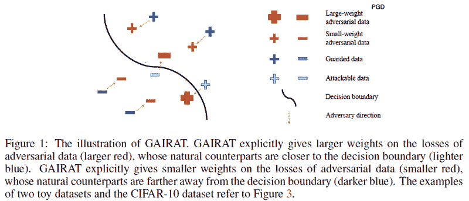
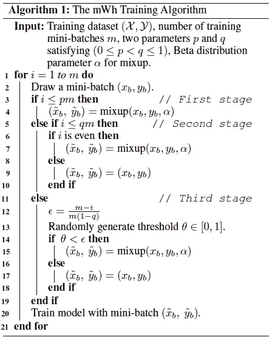
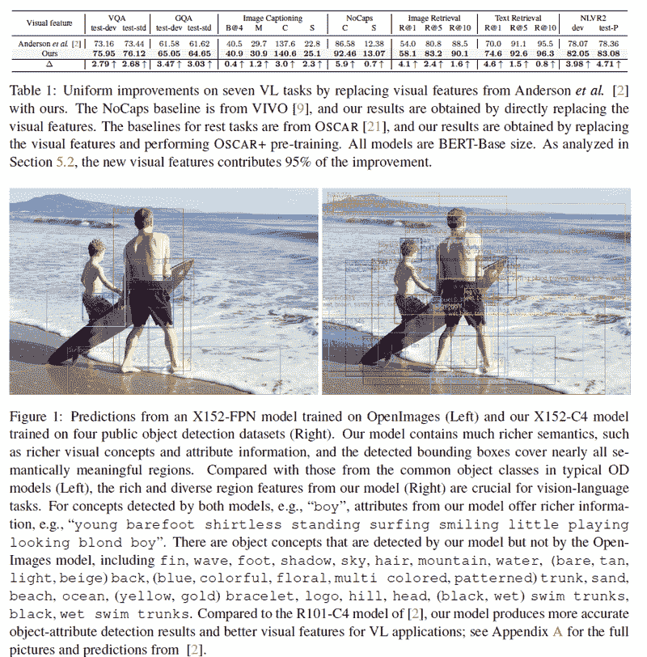
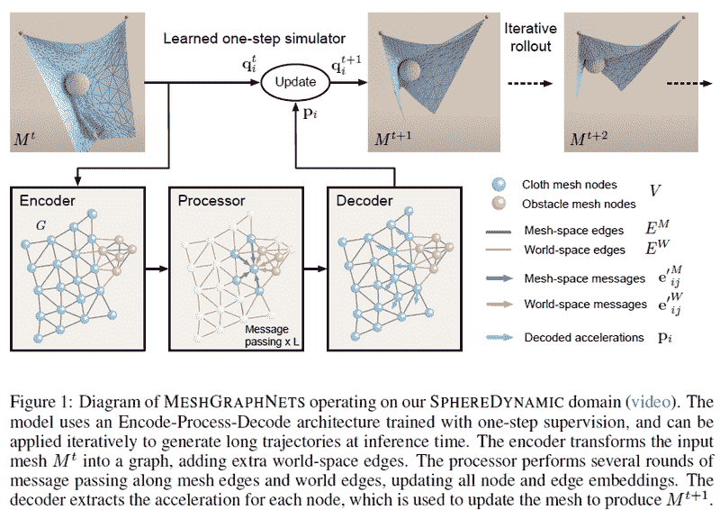
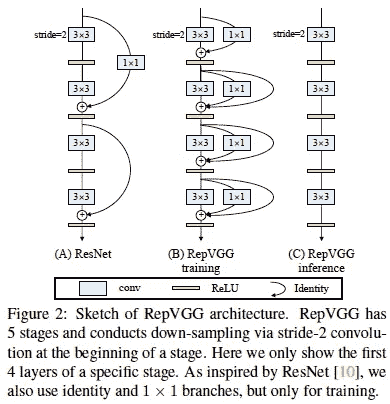
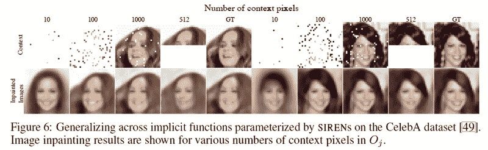

# 2021 年第 4 周

> 原文：<https://medium.com/analytics-vidhya/akiras-ml-news-week4-2021-ca5b47b4b61a?source=collection_archive---------18----------------------->

以下是我在 2021 年第 4 周(1 月 17 日~)读到的一些我觉得特别有意思的论文和文章。我已经尽量介绍最近的了，但是论文提交的日期可能和星期不一样。

# 主题

1.  机器学习论文
2.  技术文章
3.  机器学习用例的例子
4.  其他主题

# —每周编辑精选

*   [*通过仔细训练文档上的对象检测模型，获得良好的视觉语言表示。*](https://arxiv.org/abs/2101.00529)
*   [顶级会议至上导致的不良做法](https://www.reddit.com/r/MachineLearning/comments/l0oce8/d_witnessed_malpractices_in_mlcv_research_papers/)
*   [从新闻中生成中性摘要](https://navishagarwal.medium.com/creating-unbiased-news-using-data-science-dd01b52c109c)

— — — — — — — — — — — — — — — — — — — — — — — — — —

# 1.机器学习论文

— —

# 通过结合图像和文档的时间关系的自我监督学习

*从叙述视频*
[中的循环学习时间动态 https://arxiv.org/abs/2101.02337](https://arxiv.org/abs/2101.02337)

他们提出了一种通过结合图像和文档来自我监督学习时间关系的方法。在从图像中找到相应的文档之后，使系统预测未来的信息，并且从那里使系统在循环一致性中学习以预测过去。它可用于从大型图像数据集中发现时间结构和案例摘要。

# 用变压器进行线路检测

*线段检测使用无边缘变压器*
[https://arxiv.org/abs/2101.01909](https://arxiv.org/abs/2101.01909)

在线检测中，由于线段很难用锚点检测，他们建议应用 DETR 的改进模型，一种基于变压器的对象检测模型，消除了锚点。该策略是用深度特征进行粗检测，用更高分辨率的特征图进行细节检测。

# 决策边界上的对抗性学习

*几何感知实例——加权对抗训练*
【https://openreview.net/forum?id=iAX0l6Cz8ub】T21

当前的模型大小不足以进行对抗学习来对抗对抗样本。因此，他们提出了 GAIRAT，这是一种专注于学习接近决策边界且标签可能因攻击而改变的样本的策略。在提高对对抗性攻击的抵抗力的同时保持泛化性能是容易的。

# 通过逐渐减少混淆来提高性能

*毫不犹豫地混搭*
[https://arxiv.org/abs/2101.04342](https://arxiv.org/abs/2101.04342)

考虑到 Mixup 获得的表示对应于强化学习中探索/利用权衡的“探索”部分，他们提出了一种叫做 Mixup Without handly(mWh)的算法，该算法专注于学习过程后半段的“利用”(即较少的 Mixup)。学习过程分为三个阶段，混的次数逐渐减少。它对混合比α的选择是鲁棒的。

# 通过仔细训练文档上的对象检测模型来获得良好的视觉语言表示

*VinVL:让视觉语言模型中的视觉表征变得重要*
[https://arxiv.org/abs/2101.00529](https://arxiv.org/abs/2101.00529)

视觉语言(VL)处理预先训练的对象检测模型的表示，但它们没有得到太多的关注；VinVL 采取仔细训练对象检测模型的策略，以在四个数据集上具有良好的图像/语言表示。经过训练的对象检测模型能够检测大多数语义区域，使用它的 VL 模型在七项任务中实现了最高的准确性。

# 通过向交互部分添加图形边来表示交互。

*用图网络学习基于网格的模拟*
[https://arxiv.org/abs/2010.03409](https://arxiv.org/abs/2010.03409)

他们提出 MeshGraphNets，通过连接两个物体的图形(网格)并在 MLP 中表示它们的相互作用，可以计算两个物体(布和球，空气和机翼)之间的接触和碰撞。该技术的关键点是用边连接网格空间中距离较远但实际距离不同的部分。MeshGraphNets 还可以自适应地计算最佳网格大小，并且比传统模拟快一两个数量级。

# 通过消除推断过程中的跳过连接和 BatchNorm 来加速。

https://arxiv.org/abs/2101.03697

研究在没有 BN/跳跃加入的网络中实现高精度，例如 VGG。其思想是在训练过程中使用批处理范数和类似 ResNet 的 skip-join 来防止梯度消失，但在推理过程中它们不是必需的。这是通过在训练后将块转换成单个卷积层来实现的。它比基于 ResNet 的网络具有相同数量的参数更准确。

# 通过使用一个可以两次微分的激活函数，得到一个好的隐式函数表示。

*具有周期性激活功能的内隐神经表征*
[https://arxiv.org/abs/2006.09661](https://arxiv.org/abs/2006.09661)

在数据的隐式表示中，关于二阶导数的信息非常重要，但是 ReLU 无法获得这些信息。因此，他们提出了 SIREN，它可以利用 sin 函数获得二阶导数的信息。可以从点云和法线恢复 3D 结构，并从少量点恢复图像。

— — — — — — — — — — — — — — — — — — — — — — — — — —

# 2.技术文章

— —

# 使用 BERT 的主题模型

 [## 用 BERTopic 进行交互式主题建模

### 使用 BERTopic 进行主题建模的深入指南

towardsdatascience.com](https://towardsdatascience.com/interactive-topic-modeling-with-bertopic-1ea55e7d73d8) 

解释使用 BERT 的主题模型以及如何使用它们；这些模型可以在 Github 上获得，并且可以可视化。

# AlphaFold2 的影响

 [## AlphaFold2 @ CASP14:“感觉自己的孩子离家出走了。”

### 过去的一周对于蛋白质结构预测，结构生物学来说是一个重要的时刻，在适当的时候…

moalquraishi.wordpress.com](https://moalquraishi.wordpress.com/2020/12/08/alphafold2-casp14-it-feels-like-ones-child-has-left-home/) 

本文讨论了 DeepMind 的 AlphaFold2 对生物学领域的影响，注意到这种影响与深度学习在 2012 年用 ImageNet 超越常规方法时并不相同，而更像是它在 2020 年突然进入市场时的准确性。文章还提到，深度学习对药物发现的影响仍然有限，它可能可以设计蛋白质。

# kNN 的替代品

 [## KNN(K-最近邻)死了！

### 人工神经网络万岁，他们在 sklearn 的 KNN 上实现了 380 倍的惊人加速，同时提供了 99.3%的相似结果。

medium.com](/towards-artificial-intelligence/knn-k-nearest-neighbors-is-dead-fc16507eb3e) 

虽然 kNN 是一个基本的和最常用的算法，但当数据集很大时，它非常耗时。本文介绍了一种近似最近邻(ANN)算法 HNSW，并通过实验将其与 kNN 进行了比较，展示了 ANN 的优势。

— — — — — — — — — — — — — — — — — — — — — — — — — —

# 3.机器学习用例的例子

— —

# 从新闻中生成中性摘要

 [## 利用数据科学创造“无偏见的新闻”

### 在各政治派别的媒体中寻找共同点

medium.com](/swlh/creating-unbiased-news-using-data-science-dd01b52c109c) 

电视新闻和报纸都包含了各个群体的政治偏见，同样的案例用不同的方式书写。在这个项目中，他们试图通过在两篇涉及同一案件的文章中找到相似的句子，并只总结其中经常提到的事件，来生成政治中立的新闻文章。它似乎仍在部署中，但 Github 库是可用的。

# 检测枪支的算法

 [## 枪支检测人工智能正在用自制的“主动射手”视频进行训练

### 公司正在使用奇怪的方法来创建自动检测武器的算法。人工智能伦理学家担心他们…

www.vice.com](https://www.vice.com/en/article/7k94a9/gun-detection-ai-is-being-trained-with-homemade-active-shooter-videos) 

一篇文章描述了为一个可以检测枪支并快速通知安全和警察的系统开发算法的努力。如何区分扫帚柄和火器在文章中有相当详细的描述，不仅包括数据收集，还包括数据扩充。然而，由于 BLM 的演示，该算法很可能被私营部门而不是警方使用。

— — — — — — — — — — — — — — — — — — — — — — — — — —

# 4.其他主题

— —

# 免费提供 GPT 3 级模型的倡议

 [## Eleuther AI 站点| Gpt-Neo

### GPT-Neo 是一系列基于 transformer 的语言模型的代号，风格松散，围绕 GPT 架构…

eleuther.ai](https://eleuther.ai/projects/gpt-neo/) 

高性能语言模型 GPT-3 不能自由使用，因为微软与它有排他性合同。一个叫伊柳瑟雷的组织。正在牵头开发 GPT-近地天体，这是一个可免费使用的 GPT-3 等效模型。

# 查看解释 arxiv 论文的视频链接

 [## 友好/带视频的报纸

### 要安装扩展，请遵循下面给出的步骤。您也可以通过…观看视频安装演练

github.com](https://github.com/amitness/papers-with-video) 

现在有一个谷歌 chrome 扩展，允许你添加一个解释 Arxiv 论文的视频链接。

# 顶级会议至上导致的不良做法

虽然没有提到大学的具体名称，但指责是为了通过顶级会议获得高薪工作，欺诈性研究普遍存在。他指出，花费大量时间准备论文发表的研究，只是进行名义上的研究，这些研究是现有研究的组合(他说这些研究正在被传递到顶级会议，甚至口头层面)。由于他们在具体实验方面做的不多，所以他们甚至不公布他们的代码(当然这是匿名论坛，所以不一定是真的)。

— — — — — — — — — — — — — — — — — — — — — — — — — —

# —过去的文章

[2021 第 3 周](/analytics-vidhya/akiras-ml-news-week3-2021-5c03fb326bfe) ⇦ 2021 第 4 周(本帖)⇨ 2021 第 5 周(不成文)

[2020 年 12 月汇总](/analytics-vidhya/akiras-ml-news-december-2020-44f9235fb250)
2020 年 11 月汇总 [2020 年 10 月汇总](/analytics-vidhya/akiras-ml-news-october-2020-c7b5b4281d36)

[2020 年总结](https://towardsdatascience.com/machine-learning-2020-summary-84-interesting-papers-articles-45bd45c0d35b)

— — — — — — — — — — — — — — — — — — — — — — — — — —

## 推特，我贴一句纸评论。