# Aksha:基于 Arduino 的 ML 铅笔，由 TensorFlow Lite Micro 提供支持

> 原文：<https://medium.com/analytics-vidhya/aksha-an-arduino-based-ml-pencil-powered-by-tensorflow-lite-micro-e7ba854f42f3?source=collection_archive---------7----------------------->

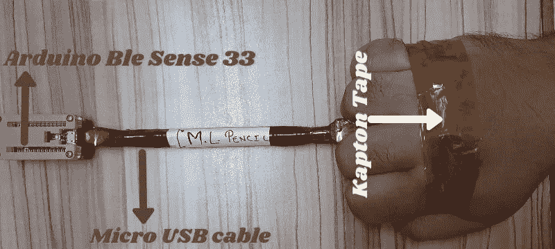

由[作者](/@naveenmanwani)通过 [Canva](https://www.canva.com/) 创作，图片列在( [CC BY 2.0](https://creativecommons.org/licenses/by/2.0/) license)下

# Zoom Call:教育殿堂的临时门户

在印度，学校和学院被认为不亚于寺庙，在 Hinglish，它们甚至被称为“Vidya kae Mandir”，即教育的寺庙。

然而，由于目前正在进行的疫情，这些寺庙对他们的信徒关闭了大门，并开始寻找在线解决方案来继续为他们的信徒提供教育。


照片由[奥古斯特·黎塞留](https://www.pexels.com/@august-de-richelieu?utm_content=attributionCopyText&utm_medium=referral&utm_source=pexels)从 [Pexels](https://www.pexels.com/photo/mother-helping-her-daughter-with-her-homework-4260485/?utm_content=attributionCopyText&utm_medium=referral&utm_source=pexels) 拍摄

像许多其他人一样，我姐姐女儿的学校也最终使用 zoom call 来开展在线课程。因此，在一个晴朗的早晨，我从 WFH 的日程中抽出时间，穿过房间，我姐姐的女儿正在上印度语课。

我注意到，在 zoom call 的另一端，老师正在用音乐背诵印地语字母，这鼓励了我姐姐的女儿和其他学生跟着做，但在同一天，当我姐姐要求她的女儿写印地语字母时，她一开始并没有准备好。

后来我意识到，老师让我姐姐的女儿们觉得学习很有趣，但当涉及到写作时，就没有办法让初学走路的孩子觉得学习有趣了。

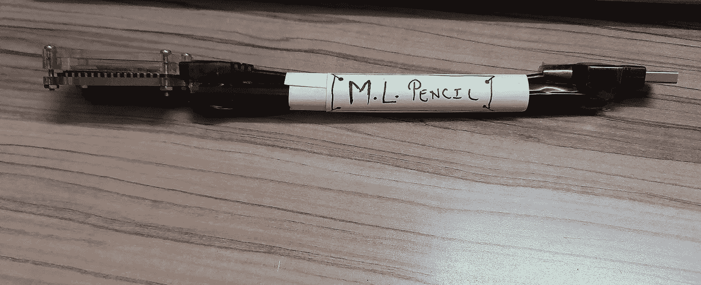

照片由[作者](/@naveenmanwani)拍摄，图片列在 [CC BY 2.0](https://creativecommons.org/licenses/by/2.0/) 许可下

此外，这种情况允许我为这个有趣的问题制定一个解决方案，我最终制作了 **Aksha 的 ML 铅笔**，供幼儿在空气中用 [TensorFlow Lite Micro](https://www.tensorflow.org/lite/microcontrollers) 驱动绘制印度字母。

# 目的

在让你了解了**为什么**我制作了 **Aksha** 一支 ML 铅笔之后，是时候向整个 TensorFlow lite 社区和嵌入式机器学习爱好者展示一下**我是如何制作的**。

# 换挡

现在从这一点开始，这篇文章将从故事模式转移到教程模式，所以所有的开发人员都准备好了，这是你最喜欢的部分。

## 硬件要求:

要跟进，您需要以下物品:

*   具有稳定互联网连接的笔记本电脑或台式机。
*   [Arduino Nano 33 BLE 感应板](https://store.arduino.cc/usa/nano-33-ble-sense)
*   [斑马字节案例](https://www.adafruit.com/product/2709)[*不一定需要*]

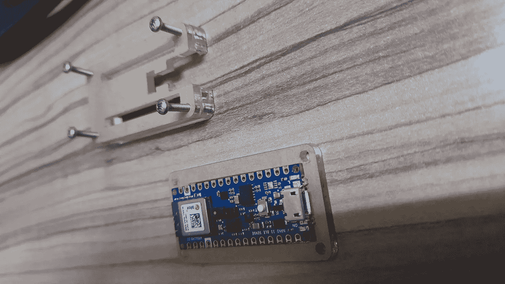

照片由[作者](/@naveenmanwani)拍摄，图片列在 [CC BY 2.0](https://creativecommons.org/licenses/by/2.0/) license 下

*   [1 根 USB A 转 Micro USB 线-120 CM](https://robu.in/product/micro-usb-a-to-micro-b-cable-120cm/) 【让数据收集变得简单】
*   [短 USB 转 Micro-USB 电源线-17 CM](https://robu.in/product/17-cm-short-usb-to-micro-usb-power-line-cable/) 【出于演示目的，我使用了它，不一定需要，上面提到的电缆也可以达到目的。]
*   USB 集线器
*   **粘住**将 Arduino BLE 板和 Micro USB 线固定在一起，你可以寻找大约 17-20 厘米长的东西。
*   Kapton 胶带

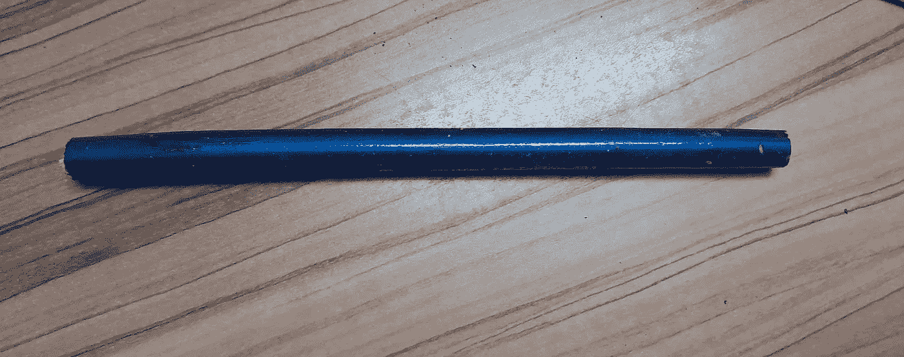

照片由[作者](/@naveenmanwani)拍摄，图片列在 [CC BY 2.0](https://creativecommons.org/licenses/by/2.0/) license 下

演示设置 A:用 Kapton 胶带将微型 USB 电缆缠绕在棍子上。

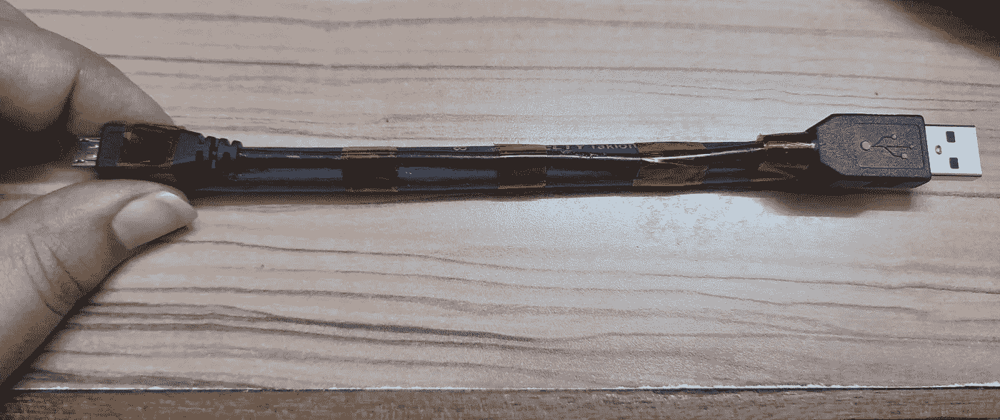

照片由[作者](/@naveenmanwani)拍摄，图片列在( [CC BY 2.0](https://creativecommons.org/licenses/by/2.0/) 许可下)

演示设置 B:带 Kapton 胶带的棒顶部的微型 USB 电缆，带有 Arduino 33 BLE 感应板。

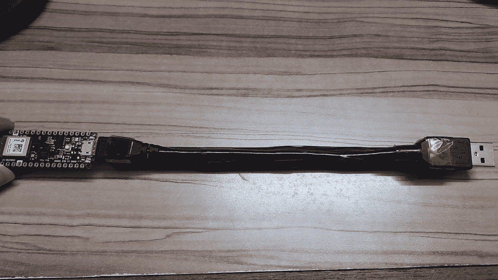

照片由[作者](/@naveenmanwani)提供，图片列在( [CC BY 2.0](https://creativecommons.org/licenses/by/2.0/) license)下

## 软件要求

*   [Arduino IDE](https://www.arduino.cc/en/software)
*   Chrome 网络浏览器的最新版本，使用网络蓝牙 API。

## 要安装的软件库

*   [ArduinoBLE](https://www.arduino.cc/en/Reference/ArduinoBLE) 【用于与网页通信】
*   [Harvard_TinyMLx](https://tinymlx.org/) 【魔杖代码库】
*   [Arduino_LSM9DS1](https://github.com/arduino-libraries/Arduino_LSM9DS1) 【读取各种传感器的值】
*   Arduino Mbed OS 纳米板(在板管理器中查找此软件包)。
*   [谷歌输入工具](https://www.google.com/inputtools/)【用于数据标注】

# 机器学习工作流

为了构建 **Aksha the** ML Pencil，我勾画了一个工作流程，它与任何其他深度学习工作流程或多或少没有什么不同。

1.  **确定一个目标**，即通过使用机器学习分析加速度计和陀螺仪数据，构建一只能够识别 **5** 印地语字母的 ML 铅笔。
2.  **收集数据:**通过 Web 蓝牙 API。
3.  **模型训练:**使用 Google [Colab](https://colab.research.google.com/notebooks/intro.ipynb) 对收集的数据进行训练。
4.  **部署**:使用[Arduino IDE](https://www.arduino.cc/en/software) 和 [TensorFlow Lite Micro](https://www.tensorflow.org/lite/microcontrollers) 在 Arduino Nano 33 BLE 板上部署 **5** 印地语字母表的训练模型

**#注意**:然而，在开始上面认可的工作流程之前，为了让 Arduino 33 BLE 感应板能够**收集数据，**我在上面部署了[魔棒代码](https://github.com/tinyMLx/arduino-library/tree/main/examples/magic_wand)，可以通过 Arduino IDE 中的 [Harvard_TinyMLx](https://tinymlx.org/) 库获得。

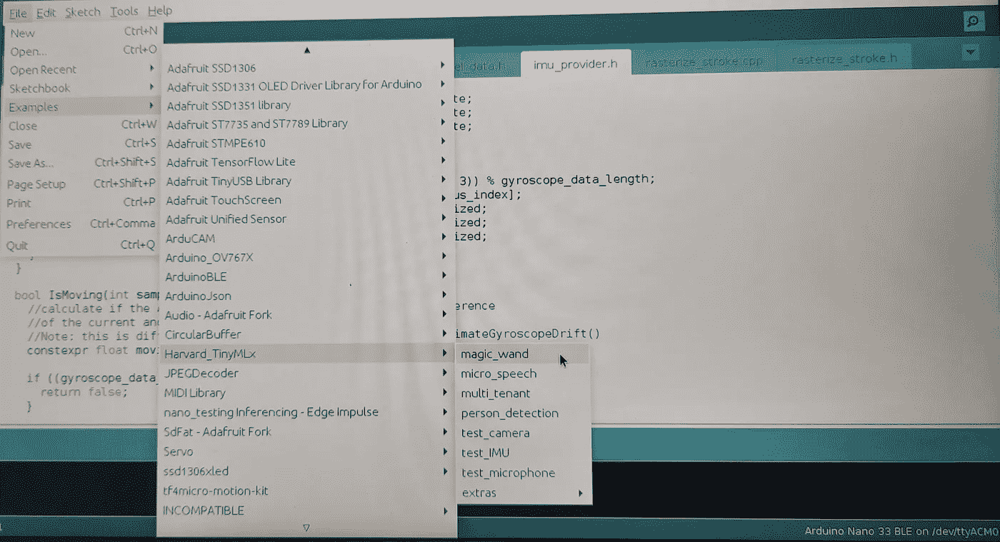

照片由[作者](/@naveenmanwani)拍摄，图片列在 [CC BY 2.0](https://creativecommons.org/licenses/by/2.0/) 许可下

# 数据收集

在 Arduino 板上部署了魔棒代码后，我导航到[https://tinymlx.org/magic_wand](https://tinymlx.org/magic_wand)进行数据收集。

*   已通过蓝牙连接 Arduino 板，方法是单击蓝牙按钮。
*   然后在配对好电路板后，我准备通过 Chrome 的 WebBLE API 收集数据。

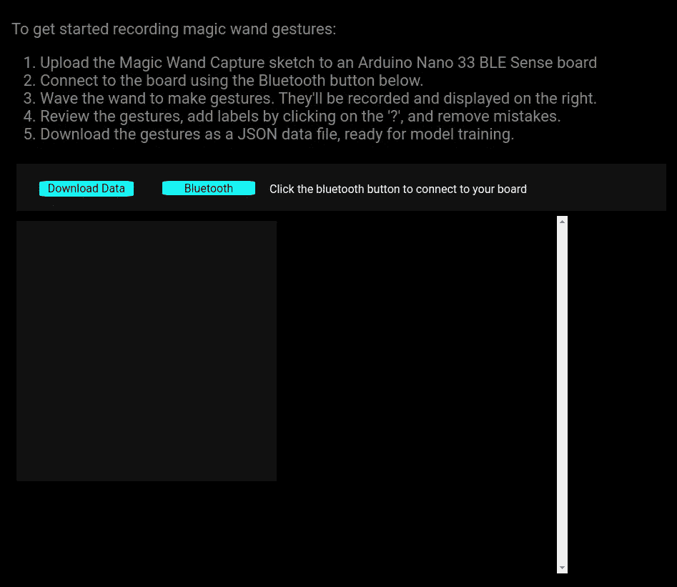

图片由[作者](/@naveenmanwani)提供，图片列在( [CC BY 2.0](https://creativecommons.org/licenses/by/2.0/) 许可下)

## 记录数据

成功设置好一切后，我开始为下面提到的印地语字母记录数据，在下面的 gif 中可以看到相同的一瞥。

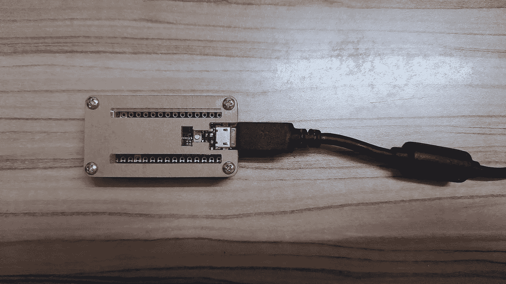

照片由[作者](/@naveenmanwani)拍摄，图片列在( [CC BY 2.0](https://creativecommons.org/licenses/by/2.0/) 许可下)

我成功收集数据的策略:

*   在浏览器中记录数据时，我没有切换选项卡或刷新页面。
*   我一次尽可能多地记录样本，通常每个字母表我记录 500-600 个样本。

```
{0: 'इ', 1: 'क', 2: 'ट', 3: 'न', 4: 'प'}
```

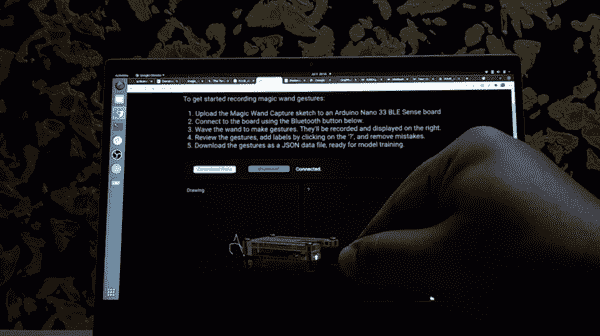

GIF 由[作者](/@naveenmanwani)制作，通过 [Hnet](https://hnet.com/video-to-gif/) 在 [CC BY 2.0](https://creativecommons.org/licenses/by/2.0/) 许可下制作

## 标签数据

记录完数据后，我清理了那些嘈杂的、没有正确记录的印地语字母。

然后我切换到数据标记，如果我标记一些英文字母，这将是很容易的，但[谷歌输入工具](https://www.google.com/inputtools/)来拯救我，让我可以很容易地标记记录的印地语字母。

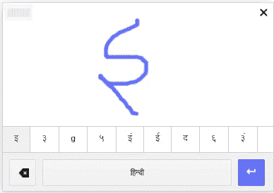

照片由[作者](/@naveenmanwani)拍摄，图片列在 [CC BY 2.0](https://creativecommons.org/licenses/by/2.0/) 许可下

看看下面的 GIF，从视觉上理解我清理和标记记录的印地语字母数据的方法。

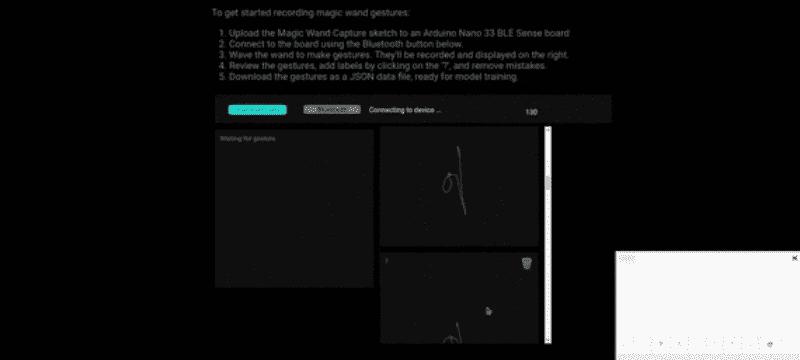

照片由[作者](/@naveenmanwani)，通过 [Canva](https://www.canva.com/) 和 [Hnet](https://hnet.com/video-to-gif/) ，图片列在( [CC BY 2.0](https://creativecommons.org/licenses/by/2.0/) license)下

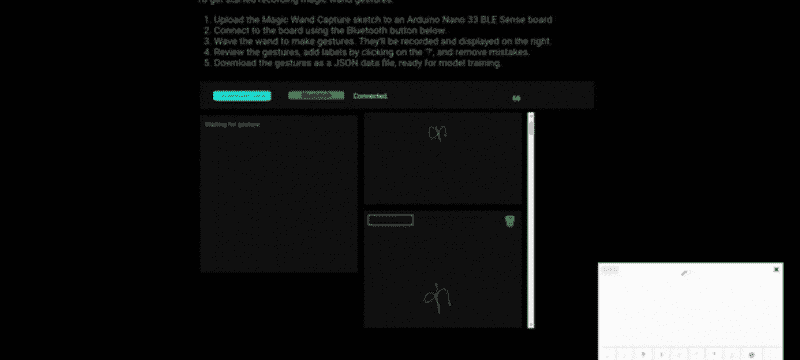

照片由[作者](/@naveenmanwani)，通过 [Canva](https://www.canva.com/) 和 [Hnet](https://hnet.com/video-to-gif/) ，图片列在( [CC BY 2.0](https://creativecommons.org/licenses/by/2.0/) license)下

## 下载数据

对于每个字母表，在完成数据记录、清理和标记步骤后，我点击下载按钮，一个 JSON 文件被下载到我的系统中。我为每个字母表生成了 2 个 JSON 文件，以便为 ML 模型训练步骤提供大量的印地语字母表数据。

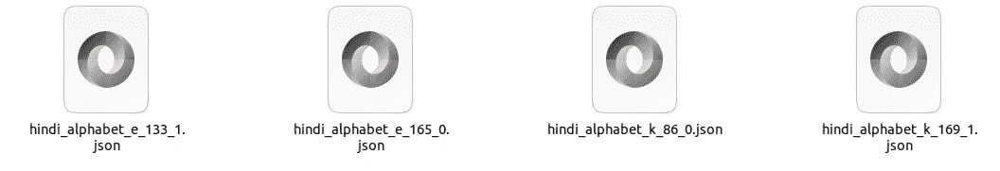

照片由[作者](/@naveenmanwani)拍摄，图片列在( [CC BY 2.0](https://creativecommons.org/licenses/by/2.0/) 许可下)

# 模特培训

为了在收集的数据上训练一个 ML 模型，我浏览了下面的链接，在目录中添加了一些收集的数据，最后得到了一个用于微控制器的 **TensorFlow Lite 模型**，用于我在上一步中收集的印地语字母表数据集。

[](https://colab.research.google.com/github/tinyMLx/colabs/blob/master/4-8-11-CustomMagicWand.ipynb) [## 谷歌联合实验室

### 编辑描述

colab.research.google.com](https://colab.research.google.com/github/tinyMLx/colabs/blob/master/4-8-11-CustomMagicWand.ipynb) 

# 模型部署

在 Arduino 33 BLE 感应板上使用 Arduino IDE 部署模型之前，除了魔棒代码模块的文件名之外，我还对代码库做了两个具体的修改。

1.  在“hindi_alphabets.ino”中，我用我的印地语字母数和标签信息替换了标签数和标签信息

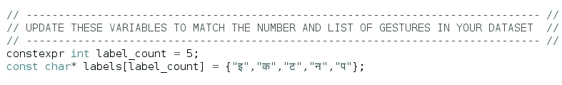

照片由[作者](/@naveenmanwani)拍摄，图片列在( [CC BY 2.0](https://creativecommons.org/licenses/by/2.0/) license)下

2.我将文件“magic_wand_model_data.cpp”的全部内容替换为用于微控制器型号的 **TensorFlow Lite 的内容，它只不过是一个**。ML 模型训练后生成的 cc** 文件，命名为“hindi_alphabets_model_data.cpp”。**

然后，鼓足勇气，我上传了代码，或者说，我开始将草图编译到 Arduino 33 BLE 感应板上。

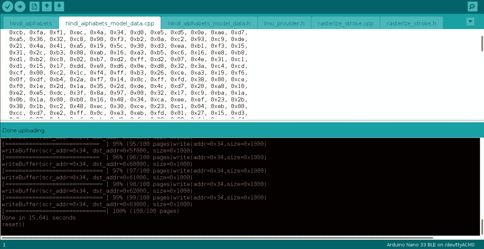

照片由[作者](/@naveenmanwani)拍摄，图片列在 [CC BY 2.0](https://creativecommons.org/licenses/by/2.0/) license 下

编译完代码后，为了测试印地语字母模型，我打开了 Arduino IDE 中的串行监视器，使用电路板在空中做了一些运动，幸运的是，串行监视器能够正确地将这些运动识别为印地语字母。

这就是 Aksha:一个基于 Arduino 的 ML 铅笔的诞生

下面包括演示，不要错过。

# ML 铅笔演示

下面的演示展示了**AK sha ML 铅笔**如何工作**。**

视频由[作者](/@naveenmanwani)，视频列在( [CC BY 2.0](https://creativecommons.org/licenses/by/2.0/) license)下

# 资源:

1.  Github repo 与 tinyML 的例子可以在[这里](http://Harvard_TinyMLx)找到。
2.  **皮特典狱长教程:** [打造魔杖](https://www.youtube.com/watch?v=vKRdQHO7tIY)。
3.  [HarvardX 的微小 ML 课程](https://www.edx.org/professional-certificate/harvardx-tiny-machine-learning)。
4.  [嵌入式机器学习入门](https://www.coursera.org/learn/introduction-to-embedded-machine-learning)

# Github 回购:

代码、模型、JSON 文件、视频，最重要的是，整个印地语字母表记录的数据都可以在这里找到。

[https://github . com/elephant hunters/Hindi _ Alphabets _ recognition . git](https://github.com/ElephantHunters/Hindi_Alphabets_Recognition.git)

使用它并扩展我构建的内容。

# 感恩角:

*   首先，我要对介绍教程的 [Pete Warden](https://medium.com/u/8cb38d2bdbf7?source=post_page-----e7ba854f42f3--------------------------------) 大呼一声:**“构建魔棒”** at T [inyML Summit 2021](https://www.tinyml.org/) 这反过来激励我开发一些简单、有趣但最重要的是 TinyML 的有用应用。
*   其次，我还要感谢布莱恩·普朗歇，他的忠告让我能够以更好的方式记录印地语字母表的数据。

## 感谢您的关注


来自[像素](https://www.pexels.com/photo/cardboard-gift-box-with-postcard-on-table-5957128/?utm_content=attributionCopyText&utm_medium=referral&utm_source=pexels)的[龟背竹](https://www.pexels.com/@gabby-k?utm_content=attributionCopyText&utm_medium=referral&utm_source=pexels)的照片

你利用你的时间阅读我的《T21》作品对我来说意味着整个世界。我完全是这个意思。

希望你喜欢这篇文章！

如果你喜欢，你可以给我买一杯 [**咖啡**](https://www.buymeacoffee.com/naveenManwani) **！**

[](https://www.buymeacoffee.com/naveenManwani)

另外，如果你愿意，可以在 Medium 和 LinkedIn 上关注我！我很乐意。

[](/@naveenmanwani) [## 纳文·曼瓦尼培养基

### 我知道这一定是你看完标题的第一反应。但是当你阅读这篇文章时，我的同事艾…

medium.com](/@naveenmanwani) [](https://www.linkedin.com/in/naveen-manwani-65491678/) [## Naveen Manwani -机器学习工程师- AIMonk Labs Private Ltd | LinkedIn

### 查看纳文·曼瓦尼在全球最大的职业社区 LinkedIn 上的个人资料。Naveen 有一份工作列在他们的…

www.linkedin.com](https://www.linkedin.com/in/naveen-manwani-65491678/)