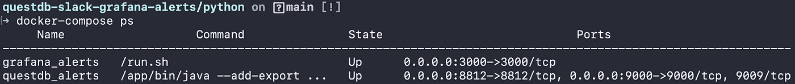
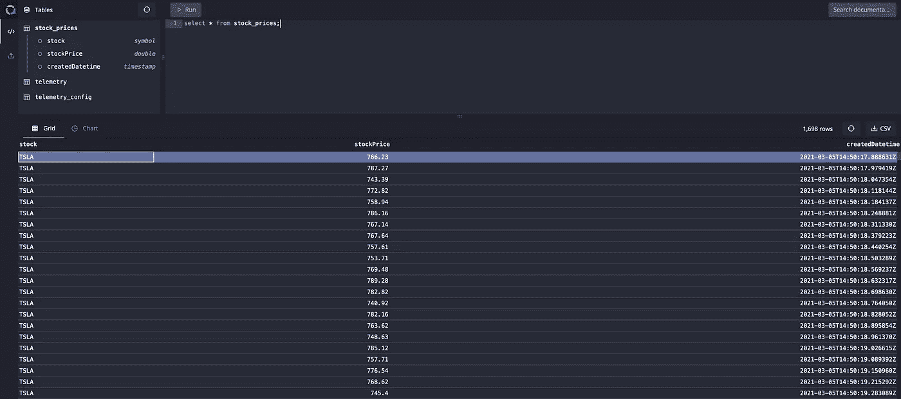
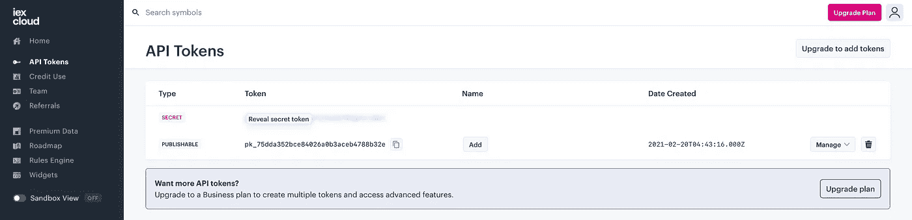
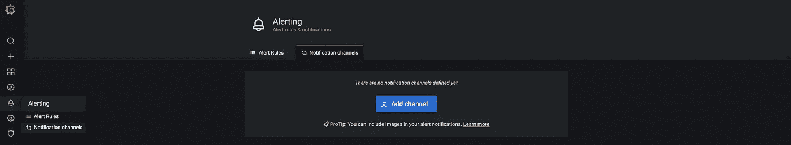
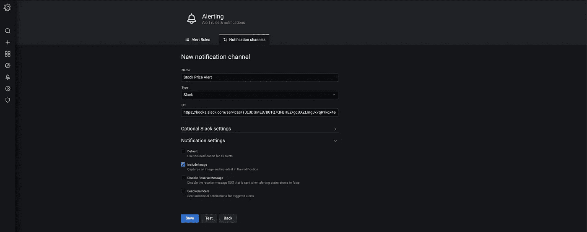
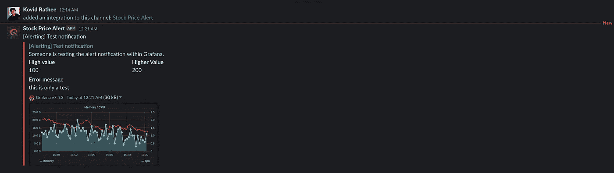
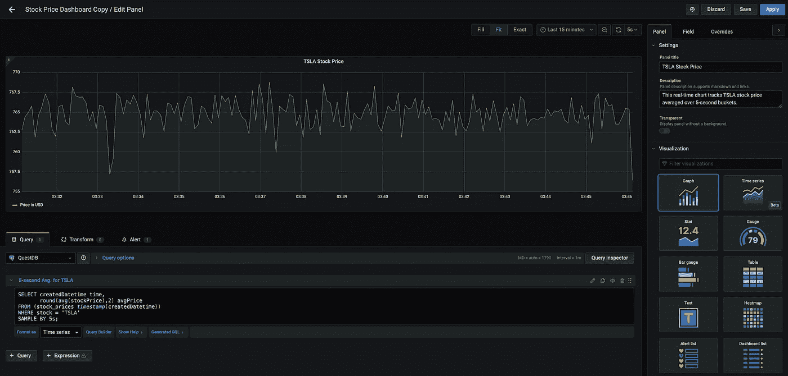
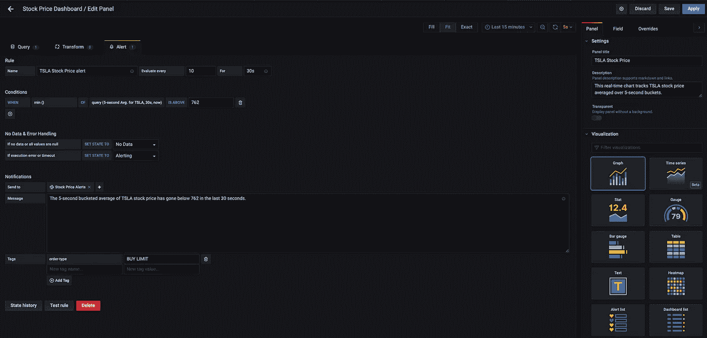
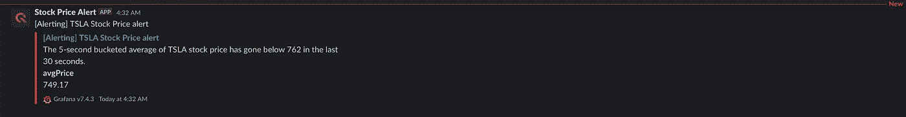
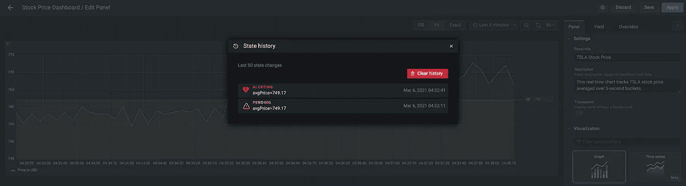

# 使用 QuestDB 和 Grafana 为 Tesla 的股票价格提供警报仪表板

> 原文：<https://medium.com/analytics-vidhya/alerting-dashboard-for-teslas-stock-price-with-questdb-and-grafana-eacf2e6e112c?source=collection_archive---------25----------------------->


[科技日报](https://unsplash.com/@techdailyca?utm_source=unsplash&utm_medium=referral&utm_content=creditCopyText)在 [Unsplash](https://unsplash.com/s/photos/chart?utm_source=unsplash&utm_medium=referral&utm_content=creditCopyText) 拍摄的照片

## 时间序列，数据工程

## 关于如何使用 QuestDB 和 Grafana 设置时序数据警报的教程

# 介绍

对时间序列数据做出反应非常有用的原因有很多，通常情况下，对数据变化做出反应越快越好。这项工作的最佳工具是时间序列数据库，这是一种设计用来读写大量随时间变化的测量数据的数据库。

在本教程中，您将学习如何从 REST API 读取数据，并将其传输到 QuestDB，这是一个开源的时间序列数据库。我们将使用 Grafana 来可视化数据，并提醒 Slack 我们感兴趣的变化。我们使用 Python 从 API 获取数据，并将其传输到 QuestDB，您可以轻松定制脚本来检查不同的股票甚至 API。

# 配置

## 先决条件

在开始学习本教程之前，您需要以下东西:

*   [**Docker 桌面**](https://www.docker.com/products/docker-desktop) —我们已经创建了一个 [GitHub 库](https://github.com/bsmth/questdb-slack-grafana-alerts)，它将使您能够在 Docker 容器中运行 Grafana 和 QuestDB。项目`**README**`还记录了 Grafana、QuestDB 和 Python 的设置步骤。
*   [**IEX 账户**](https://pypi.org/project/iexfinance/) —我们将使用 IexFinance API 来查询股票价格，请注意，IexFinance 上的免费账户每月最多可调用 50，000 次 API
*   [**Slack workspace**](https://slack.com/intl/en-au/help/articles/206845317-Create-a-Slack-workspace)—要从 Grafana 发送股票价格警报，您需要一个能够创建新网页挂钩的 Slack workspace。

## 使用 Docker 部署 QuestDB & Grafana 容器

首先从 GitHub 中克隆[库:](https://github.com/bsmth/questdb-slack-grafana-alerts)

```
**git clone** [**git@github.com**](mailto:git@github.com)**:bsmth/questdb-slack-grafana-alerts.git**
```

运行`**docker-compose up**` 将调出两个联网在一起的容器；Grafana 在`**localhost:3000**`上运行，QuestDB 在`**localhost:9000**`上有一个 web 控制台，在 8812 上有一个开放的端口，可以接受 Postgres 协议。

要检查您的 QuestDB 和 Grafana 容器是否工作正常，请访问上述 URL。或者，您可以在命令行上使用`**docker-compose ps**` 来检查状态，这将显示以下输出:



运行`**docker-compose**`还将为 Grafana 提供默认的连接凭证来使用 Postgres 认证。这意味着您可以立即使用 QuestDB 作为 Grafana 中的默认数据源，而无需手动配置步骤。

## 安装 Python 库

本教程所需的所有 Python 库都列在`**requirements.txt**` 文件中。使用 pip 安装需求:

```
**pip install -r requirements.txt**
```

## 将模拟数据导入 QuestDB

我们需要 QuestDB 中的一些数据来创建一些可视化和警报。我们可以使用 IexFinance API 来获取股票价格，并使用一个额外的脚本来生成虚拟数据。IexFinance API 在免费账户中每月有 50，000 个请求的上限，所以我们的模拟脚本可以生成随机价格，这样我们就不会在测试期间耗尽我们的试用。要开始将模拟数据接收到 QuestDB 中，请运行脚本:

```
**cd python
python mock_stock_data_example.py**
```

该脚本将自动创建一个表`**stock_prices**` **，**，并开始将模拟数据接收到这个包含三列的表中:

*   `**stock**`—股票的上市名称，如 TSLA 代表特斯拉。QuestDB 有一个优化的数据类型`**symbol**`，用于包含重复值的文本列。在 [QuestDB 的官方文档](https://questdb.io/docs/concept/symbol/)中阅读更多相关内容。
*   `**stockPrice**`**—`**double**`中股票的美元价格。**
*   **`**createdDateTime**`—`**timestamp**``**stockPrice**`摄入 QuestDB 的时间。**

**在下面的截图中，您可以看到 QuestDB 中摄取的数据:**

****

## **配置 [IexFinance API](https://iexcloud.io/console/usage)**

**一旦您测试了摄取，您就可以开始使用具有真实数据的 API。使用这个 API，您可以实时查询股票价格。如前所述，每个月有 50000 个免费 API 调用的上限，所以确保你在免费计划中不要超过这个限制。要配置 IexFinance API，请按照下列步骤操作:**

1.  **在 IexFinance 上创建一个免费帐户。**
2.  **创建一个 API 令牌。**
3.  **按下`**Reveal Secret Token**`，复制`**SECRET**` 令牌。**
4.  **在`**./python**`文件夹中创建一个新文件`**.env**`。**
5.  **将令牌粘贴到格式为→ `**IEX_TOKEN=Skwf93hD**`的`**.env**`文件中。**

****

## **配置松弛的传入 Webhook**

**接下来，我们需要创建一个 Slack webhook，用于从 Grafana 发送警告消息:**

1.  **转到`[**https://api.slack.com/apps?new_app=1**](https://api.slack.com/apps?new_app=1)`**
2.  **将你的 Slack 应用命名为`**QuestDB Stock Price Alerts**`**
3.  **在`**Features and functionality**`中选择*入网挂钩***
4.  **激活传入的 webhooks 并点击`**Add New Webhook to Workspace**`**
5.  **选择允许应用程序发布的频道，然后单击`**Allow**`**
6.  **复制以下格式的 web hook URL→`[**https://hooks.slack.com/services/T123/B0123/2Fb**](https://hooks.slack.com/services/T123/B0123/2Fb)**...**`**

## **在 Grafana 中创建通知渠道**

**在浏览器中转至`**localhost:3000**`。要启用 Grafana 和 Slack 之间的连接以进行报警，请单击`**Alerting > Notification channels**` 部分中的`**Add Channel**`，如下所示:**

****

**创建新的通知渠道时，将时差`**Incoming Webhook URL**` 粘贴到`**Url**` 字段，如下图所示:**

****

**您可以通过按下上面屏幕上的`**Test**` 按钮快速测试 webhook 是否工作正常。这将触发 Grafana 在 Slack 上发布通知。您可以在下面看到一个通知示例:**

****

## **创建一个 Grafana 面板并设置警报**

**[使用以下步骤设置一个 Grafana 面板](https://grafana.com/docs/grafana/latest/panels/add-a-panel/)来托管`**TSLA**` 股票价格的实时图形:**

1.  **导航至`**+**` `**Create and select Dashboard**`**
2.  **点击`**+**` `**Add new panel**`**
3.  **在面板中，单击铅笔图标或单击`**Edit SQL**`并粘贴以下示例查询:**

****

**使用上图所示的查询创建 Grafana 面板后。保存仪表板。要创建关于 **TSLA** 股票价格的警报，请执行以下步骤:**

1.  **编辑仪表板中的面板。**
2.  **转到`**Alert**`选项卡，将警报命名为`**Tesla Stock Price alert**`。**
3.  **将`**Evaluate every**` 设置为 10 秒`**for**` 30 秒(`**Evaluate every**`表示调度程序评估预警规则的频率，而`**for**` 指定在触发预警通知之前查询需要违反阈值多长时间)。**
4.  **将条件设置为`**WHEN min() OF query(5-second Avg. of TSLA, 30s, now() IS BELOW**` 762。换句话说，如果名为`**5-second Avg. of TSLA**`的查询的最小值在过去 30 秒内低于 762，则满足警报条件。**
5.  **在`**No Data & Error Handling**`部分，使用默认值。**
6.  **在`**Notifications → Send to**`中，选择我们之前设置的通知渠道，名为股票价格警报。**
7.  **添加消息`**The 5-second bucketed average of TSLA stock price has gone below 762 in the last 30 seconds**`。**
8.  **保存面板。**

**您可以在下面看到实际操作步骤:**

****

**一旦满足条件，Grafana 就会触发警报，并向 Slack 发送通知。通知类似于下面的截图:**

****

**要更深入地了解警报状态的变化，可以访问`**State history**`。它将向您展示从一种状态到另一种状态的转换时间表。您可以在下面看到一个州历史示例:**

****

**要了解更多关于使用 Grafana 为时间序列数据构建仪表板的信息，QuestDB 网站上有另一个教程，其中有一个到示例数据的链接，可以详细尝试更多功能。**

**[](https://questdb.io/tutorial/2020/10/19/grafana/) [## 使用 QuestDB 和 Grafana |时间序列数据更快地构建监控仪表板

### 在本教程中，我们将介绍如何从加载演示数据。CSV 文件导入 QuestDB，并以此作为数据源…

questdb.io](https://questdb.io/tutorial/2020/10/19/grafana/) 

# 结论

在本教程中，您了解了 Grafana 如何使用 PostgreSQL 端点与 QuestDB 融合。使用从 API 获取到 QuestDB 的数据，您了解了如何在 Grafana 仪表板中可视化该数据，并基于一些预定义的条件设置警报。您还学习了如何向 Slack 等外部工具发布警报消息。有关本教程中任何主题的更多信息，请访问 [QuestDB 的官方文档](https://questdb.io/docs/introduction/)。**