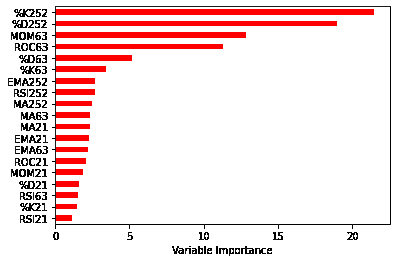
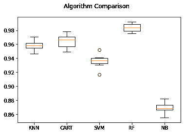
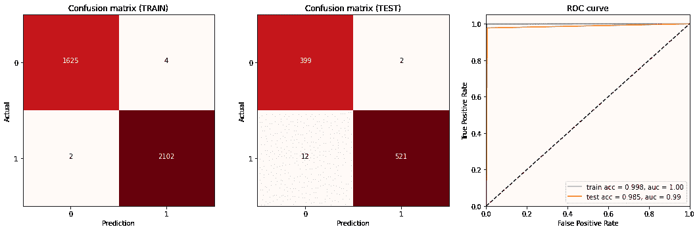
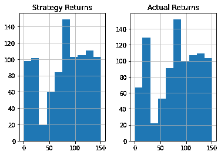
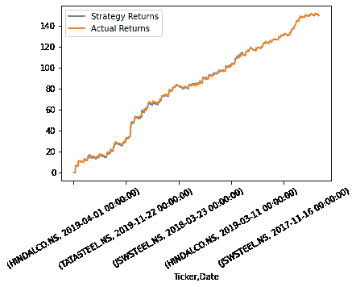

# 算法动量交易策略

> 原文：<https://medium.com/analytics-vidhya/algorithmic-momentum-trading-strategy-747e726d04b4?source=collection_archive---------0----------------------->

*注入大数据+机器学习&稳健算法动量交易策略的技术指标*

## 介绍

大数据正在彻底改变全球股票市场的运作方式和投资者的投资决策方式。机器学习——使用计算机算法在海量数据中寻找模式的实践——正在使计算机能够在输入数据时做出准确的预测和类似人类的决策，以快速和频繁的速度执行交易。

业务原型实时监控股票趋势，并纳入可能的最佳价格，允许分析师做出明智的决策，并减少因行为影响和偏见而出现的人工错误。结合大数据，算法交易因此为交易员带来了高度优化的洞察力，以最大化他们的投资组合回报。

> ***更好的股票价格方向预测是普通投资者和金融专家更好的交易策略和决策的关键参考****——*吉姆·西蒙斯。

## **目标**

更好的股票价格方向预测是普通投资者和金融专家更好的交易策略和决策的关键参考。由于数据量越来越大，对于人类来说，手动分析一些任务(如预测股票市场运动)的数据已经变得不切实际，如果不是不可能的话，因此需要自动化。通过提供大量数据，机器学习算法探索这些数据，并搜索将实现这一目标的模型。

*主要目标是使用机器学习实现算法动量交易策略。*

## 方法学

我们将股票交易决策问题公式化为一个分类问题，分为两类:买入和卖出。我们的目标是基于一些度量来识别最有效的分类器。我们使用了一些时间周期为 7、14 和 28 天的动量和波动性技术指标作为预测指标。因为其中一些指标可能与我们的数据无关。我们使用随机森林变量重要性技术来找出不重要的预测因子。结果我们得到了这些相关指标:相对强弱指数，商品通道指数，动量(针对时间段=7)，威廉姆的%R，终极振荡指标，变化率。这些指标然后被标准化，作为不同模型的输入。

通常，机器学习可以分为两个阶段。第一阶段是训练模型，第二阶段是系统根据第一阶段训练的技术指标对数据进行分类。分析的结果是市场指数的预测趋势，它可用于制定一些交易规则:

*如果第二天的走势是* ***上升趋势*** *，那么决定是* ***买入***

*如果* ***购买决定*** *已经* ***存在*** *，那么* ***持有***

*如果第二天* ***走势*** *是* ***下跌*** *，那么决定是* ***卖出***

*如果* ***卖出决定*** *已经* ***存在*** *，那么* ***持有***

根据这些规则得到的结果，计算了策略的收益。

## **数据集**

我们从雅虎财经获取了每日历史数据。我们选择了 4 只股票(JINDALSTEL。NS，JSWSTEEL。欣达尔科。NS 和塔塔钢铁。国家证券交易所 Nifty India 的 Nifty 金属指数(^CNXMETAL)。时间段为 2015 年 1 月 1 日至 2020 年 1 月 1 日。数据集由 6 个变量组成:日期、当天的开盘价、当天的最高价、当天的最低价、当天的收盘价、成交量。我们使用这些数据的 80%作为我们的训练集，20%作为测试集。

## **特征构造**

我们首先构建一个数据集，其中包含用于进行预测的预测因子和输出变量。我们的数据集是使用由四种不同股票的 5 年价格序列组成的原始数据构建的。个股和指数数据由日期、开盘价、最高价、最低价、收盘价和成交量组成。使用这些数据，我们计算了基于各种技术指标的指标，即指数移动平均线、随机振荡器%K 和%D、相对强弱指数(rs i)、变化率(ROC)、动量(MOM)。

链接到使用的数据集:

 [## 卡尔提卡耶拉德哈/BDT

### 在 GitHub 上创建一个帐户，为 kartikayladha/BDT 的发展做出贡献。

github.com](https://github.com/kartikayladdha/BDT/blob/main/BDT%20Project/Dataset_Algortihmic%20Momentum%20Trading%20Strategy.csv) 

## **技术指标**

各种技术指标已被纳入这一战略，以获得更好的结果和强大的功能创建。

1.  *移动平均线*

移动平均线广泛用于技术分析，这是投资的一个分支，旨在了解证券和指数的价格运动模式并从中获利。一般来说，技术分析师会使用移动平均线来检测一种证券的趋势是否发生了变化，例如一种证券的价格是否突然下跌。其他时候，他们会使用移动平均线来证实他们的怀疑，变化可能正在进行中。例如，如果一家公司的股价升至 200 天移动平均线以上，这可能被视为看涨信号。

*2。相对强度指数*

相对强弱指数(RSI)是技术分析中使用的一种动量指标，用于衡量最近价格变化的幅度，以评估股票或其他资产价格的超买或超卖情况。RSI 显示为一个振荡器(在两个极端之间移动的线形图),读数可以从 0 到 100。RSI 的传统解释和用法是，70 或以上的值表明证券正在超买或高估，可能预示着价格的趋势反转或回调。RSI 读数为 30 或以下表明超卖或低估。

*3。随机振荡器*

随机振荡指标是一种动量指标，它将一种证券的特定收盘价与其在一段时间内的价格范围进行比较。振荡指标对市场波动的敏感度可以通过调整时间周期或移动平均来降低。它被用来产生超买和超卖的交易信号，使用 0-100 范围的值。

随机振荡器是有范围限制的，意味着它总是在 0 到 100 之间。这使得它成为超买和超卖状况的有用指标。传统上，读数超过 80 被认为处于超买范围，读数低于 20 被认为超卖。

随机指标图表通常由两条线组成:一条反映了每个时段指标的实际值，另一条反映了三天的简单移动平均线。因为价格被认为跟随动量，这两条线的交叉点被认为是反转可能正在进行的信号，因为它表明今天的动量有很大的变化。

*4。势头价格力度*

动量是股票、证券或可交易工具价格变化的速度。动量显示一段时间内价格运动的变化率，帮助投资者确定趋势的强度。倾向于随动量强弱而动的股票叫动量股。投资者利用动量在上涨趋势中交易股票，在下跌趋势中做多(或买入股票)和做空(或卖出股票)。换句话说，股票可以表现出看涨的势头，意味着价格在上涨，或者表现出看跌的势头，价格在稳步下跌。

## 特征选择

特征选择是选择与模型构建最相关的特征子集的过程，这有助于创建准确的预测模型。有各种各样的特征选择算法，这些算法主要属于三个类别之一:过滤方法-通过使用一些统计测量给特征分配分数来选择特征。包装方法–评估不同的功能子集，并确定最佳子集。嵌入式方法-该方法在训练模型时计算出哪个特征的精确度最高。

在我们的模型中，我们将使用利用 random.forest.importance 函数的过滤方法。random.forest.importance 函数对结果分类中的每个特征(即类变量)的重要性进行评级。该函数返回一个数据框，其中包含每个属性的名称以及基于精度平均下降值的重要性值。

## 机器学习算法

我们使用了以下模型和这些模型的集合。

1.  *K 个最近邻居*

k 近邻算法是基于监督学习技术的最简单的机器学习算法之一。K-NN 算法假设新案例/数据与可用案例之间的相似性，并将新案例放入与可用类别最相似的类别中。

*2。决策树*

决策树—它是一个树形结构的分类器，其中内部节点代表数据集的特征，分支代表决策规则，每个叶节点代表结果。在决策树中，有两个节点，即决策节点和叶节点。决策节点用于做出任何决策并具有多个分支，而叶节点是这些决策的输出，不包含任何进一步的分支。

*3。高斯朴素贝叶斯*

高斯朴素贝叶斯假设与每个要素相关联的连续值按照高斯分布进行分布。

*4。支持向量机*

SVM 算法的目标是创建可以将 n 维空间分成类的最佳线或决策边界，以便我们将来可以轻松地将新数据点放入正确的类别中。这个最佳决策边界称为超平面。

*5。随机森林*

随机森林是一种监督学习算法。它构建的“森林”是决策树的集合，通常用“打包”方法训练。bagging 方法的一般思想是学习模型的组合增加了整体结果。简单来说:随机森林构建多个决策树，并将它们合并，以获得更准确和稳定的预测。随机森林算法的另一个优点是它非常容易测量每个特征对预测的相对重要性。

## 模型精度

*   k 最近邻— 95%
*   决策树— 96%
*   随机森林— 98%
*   支持向量机——93%
*   高斯朴素贝叶斯— 86%

## 预言；预测；预告

## 结果

我们看到回报确实是正的，与实际市场回报一致。此外，在某些时期，策略回报略高，这是一个额外的好处。

> **结论**

基于我们策略的回报，我们不会偏离实际市场回报太多。事实上，成功的动量交易策略使我们能够很好地预测股票价格的方向，以投资/撤资来获取利润。然而，由于我们的准确率不是 100%(但超过 98%)，因此，与实际回报相比，我们的损失相对较少。

您可以在下面的链接中找到关于相同策略的更多信息:

 [## 卡尔提卡耶拉德哈/BDT

### 在 GitHub 上创建一个帐户，为 kartikayladha/BDT 的发展做出贡献。

github.com](https://github.com/kartikayladdha/BDT/blob/main/BDT%20Project/%20BDT_Project_ICA_SEM6.ipynb)