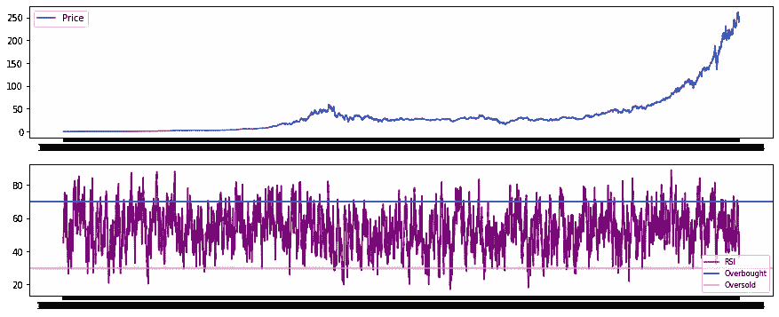

# Python 中的算法交易:RSI

> 原文：<https://medium.com/analytics-vidhya/algorithmic-trading-in-python-rsi-f633524ea7eb?source=collection_archive---------5----------------------->

这里还有一个！在我的 Python 中进行股票分析。希望你会喜欢这个！要获得更完整的股票分析，请访问我的文章:

[](/analytics-vidhya/python-for-stock-analysis-fcff252ca559) [## 用于股票分析的 Python

### 在这个项目中，我们将分析股票市场的数据。

medium.com](/analytics-vidhya/python-for-stock-analysis-fcff252ca559) 

# 相对强度指数(RSI)简介

相对强弱指数(RSI)是一个流行的技术指标和动量振荡器，由 J. Welles Wilder 于 1978 年开发。RSI 比较证券最近损益的大小和比率(通常在 14 天内),并向交易员发出证券是否被视为“超买”或“超卖”的信号。

RSI 值是在 0-100 范围内测量的，值为 70 及以上表示证券被超买，值为 30 及以下表示 T2 超卖。高于 70 的数值可能是卖出和退出头寸的好时机。低于 30 的数值是买入和建仓的好时机。

# 如何测量 RSI？

要计算相对强弱指标，交易者必须先计算某段时间内的平均盈亏。通常，这个期限是 14 天，但最终由交易者决定。

专注于短期的交易者可以使用较小的值(例如 8)，而长期交易者可以使用较高的值，例如 n = 24。在这个例子中，我们将使用 J. Welles Wilder 建议的 14 天期限。

使用平滑移动平均或滚动平均来计算平均损益。在本例中，我们将使用**指数移动平均线** (EMA)来计算 14 天窗口内的滚动平均值。

完成后，可使用以下公式将值限制在 0–100 范围内:


# 我们将用 PYTHON 来实现这一点，并且在本教程中我们将使用 MSFT 的历史数据。

让我们读取数据，我有从[雅虎财经](https://in.finance.yahoo.com/)下载的 CSV 文件。这些 CSV 文件有超过 20 年的数据，对于本教程来说应该足够了。

现在让我们开始吧！

1.  导入和数据读取

让我们导入基本库。

```
import numpy as npimport pandas as pdimport matplotlib.pyplot as plt
```

然后我将阅读我从雅虎财经下载的 CSV 文件。也可以使用雅虎财经提供的 python 库即 yfinance 来获取数据。

```
stock = pd.read_csv("MSFT.csv")print(stock)
```


MSFT 史料

现在我们将使用 TA-LIB 库来计算 RSI。

```
stock[‘RSI’] = ta.RSI(stock[‘Close’],14)stock[‘RSI’].plot(figsize=(15,15))plt.show()
```


MSFT 的 RSI 图

让我们画出超买= RSI 70 和超卖= RSI 30 的约束条件



当 RSI 指标告诉我们买入/卖出时，与其猜测和观察，不如在数据框架中创建买入和卖出触发器。


看起来不错吧！你可以做同样的事情，并且在几秒钟内开始使用 python 进行算法交易！！开始吧，如果你有任何疑问，请告诉我。

# 我们如何试图预测未来的股票行为？

在这里，我给你提供了一个可以用来预测股票价格的不同模型的列表。

# [使用脸书先知模型预测股票价格](/analytics-vidhya/predicting-stock-prices-using-facebooks-prophet-model-b1716c733ea6)

# [时间序列预测:用 ARIMA 模型预测微软(MSFT)的股票价格](/analytics-vidhya/time-series-forecasting-predicting-microsoft-msft-stock-prices-using-arima-model-be1c45961739)

# [时间序列预测:使用 LSTM 模型预测苹果股票价格](/analytics-vidhya/time-series-forecasting-predicting-apple-stock-price-using-an-lstm-model-f1bb73bd8a80)

我推荐你通读这些文章，所描述的模型能够非常精确地预测价格。

**免责声明**已经有人尝试使用时间序列分析算法来预测股票价格，尽管它们仍然不能用于在真实市场中下注。这只是一篇教程文章，并不打算以任何方式“指导”人们购买股票。

现在轮到你鼓掌了，跟我来。感谢您的阅读！

给我一个[关注](https://rohan09.medium.com/)如果你喜欢这个，更多的技术博客！

> “如果一开始你不成功，那么跳伞不适合你。”—梅尔·赫利策

再见了。