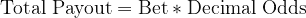
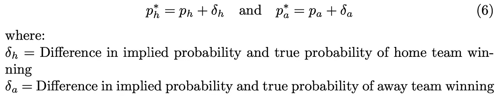

# 所有关于投注赔率:他们是什么，他们如何不公平？

> 原文：<https://medium.com/analytics-vidhya/all-about-betting-odds-what-are-they-and-how-are-they-unfair-4f4d776582c3?source=collection_archive---------8----------------------->

[来源:晨间咨询](https://morningconsult.com/2018/06/07/legal-sports-gamblings-future-younger-less-wealthy-bettors/)

**–**[**简介**](#13e5) **–**[**赔率换算表**](#1020) **–**[**各种赔率格式**](#d61c) **–**[**最常见的投注类型**](#0252)
–[**为什么体育投注定价不公平**](#1d7b)

# 介绍

光是体育运动就是人类历史上最普遍的娱乐形式之一。伴随着各种形式的体育博彩增加了一个新的组成部分，它已经愉快的性质。然而，理解这些可能性有时会令人困惑，所以写这篇文章是希望澄清这种困惑。除此之外，我们将讨论为什么这些赔率定价不公平，以及博彩公司如何总是预期盈利。

# **赔率换算表**

*   为了计算获胜赌注的**利润**，**用利润乘数**乘以赌注大小。
*   为了得到**总支出**，**将** **总利润加到原始下注额**。
*   例如，如果您以-500 的美国赔率下注 200 美元并获胜，您将获得 200 美元*0.2= **的**利润**、40 美元**和 40 美元+200 美元=**的**总支出**。**

****

**赔率转换表**

# **各种赔率格式**

## ****美国赔率****

*   ****示例:** -200，+400，-1000，+2000**
*   ****正美国赔率:**如果美国赔率为**正**，这个赌注代表**失败者**，并表示**如果你下注 100 美元**，你将获利多少。如果你以+400 的美国赔率下了 100 美元的注，并最终获胜，你将获利 400 美元，总支出为 500 美元。**

****

**赔率为正的赌注的利润**

****

**以正赔率下注的总支出**

*   ****负的美国赔率:**如果美国赔率是**负的**，这个赌注代表**最喜欢的**，并表示**你需要下多少钱才能赢得 100 美元**。如果你以-300 的美国赔率下了 300 美元的注，最后赢了，你将获利 100 美元，总支出为 400 美元。**

****

**赔率为负的赌注的利润。|负赔率|是负赔率的绝对值(不带负号的负赔率)。**

****

**赔率为负的赌注的总回报。|负赔率|是负赔率的绝对值(不带负号的负赔率)。**

## ****小数赔率****

*   ****示例:** 1.5，1.2，2.5，4.2**
*   **小数赔率代表 1 美元赌注的**总支出。****总支出**由**利润加上您的原始赌注组成。**如果您在 1.5 的小数赔率上下了 100 美元的注并赢了，您将总共获得 150 美元，但只能获利 50 美元。**
*   **如果一个赌注只有两种可能的结果，十进制赔率高的一方代表不被看好的一方，十进制赔率低的一方代表被看好的一方。**

****

**用小数赔率打赌的利润**

****

**用小数赔率下注的总支付额**

## ****分数赔率****

*   ****示例:** 16/5、13/10、1/2、2/1**
*   **分数赔率代表 1 美元赌注的**利润。如果您在 13/10 小数赔率上下注 100 美元并赢了，您将获利 130 美元，并获得 230 美元的总支出。****

****

**用分数赔率打赌的利润**

****

**用分数赔率下注的总支出**

# **最常见的下注类型**

## **货币线**

**这简直就是在赌**哪个队会赢这场比赛。****

## **点差**

**一个**正数**表示这一方是**的劣势方**，需要以相应的点差或更少的点差**赢或输。一个**负的**数字表示该方是**最有希望的**，需要以相应的分数**或更多的分数**获胜。****

## **总计或偏高/偏低**

**Totals 是一种基于两个队得分的**总和是否将超过** **的**或低于**某个阈值的** **的下注类型。如果总点数等于总阈值，这通常被称为压注，原始赌注被返还给下注者，没有收益也没有损失。有时，过量/不足总和以 0.5 结尾，因此不会发生推送。****

## **小道具**

**Prop bets，命题下注的简称，是**可以但不一定要基于博弈**的结果 **的下注。几乎所有不是货币线、总数或点差的赌注都被归类为适当的赌注。这些赌注的范围可以从哪一队最先得分一直到玩家 X 将得到多少分。****

# **为什么体育博彩定价不公平**

**首先，让我们看一个例子，回顾一下这些几率是如何工作的:**

****

**主场列显示对主场队下注的赔率，而客场列显示对特定赌注对客场队下注的赔率。在这个例子中，如果你在主队身上下注 100 美元，他们赢了，你将赢得 110 美元(除了拿回你原来的 100 美元)，如果他们输了，你将失去 100 美元。如果你在客队身上下注 130 美元，他们赢了，你将赢 100 美元(除了拿回你原来的 100 美元)，如果他们输了，你将失去 130 美元。由于主队的回报更高，他们不太可能获胜，因此处于劣势。因此，他们在总数上处于劣势，最多需要赢或输 1 分，而客队至少需要赢 2 分才能获得赌注。如果两个队的总得分都在 8 分以上，则赌赢，而如果总得分低于 8 分，则赌输。**

****

**情商。(1):收益和隐含概率之间的关系**

**现在，让我们更深入地探讨一下这些可能性。我们究竟如何将这些赔率转换成回报(或利润),以及我们如何使用这些支出来确定每个团队获胜的概率？如果我们看看货币线的主场赔率，100 美元的赌注将产生 110 美元的回报。这是 110 美元/$100 = 1.1 = 110%的回报。如果我们看看货币线的赔率，130 美元的赌注将产生 100 美元的回报。这是 100 美元/$130 = 0.77 = 77%的回报率。由于客队的回报**较小，他们更有可能赢得**。但是，考虑到他们的回报，我们如何准确地量化他们获胜的机会呢？嗯，这个机会被称为**隐含概率**，基于预测团队成功的获胜回报。**

****

**情商。(2):隐含概率与收益的关系**

**Eq 中的关系。(2)显示了将赌注的潜在回报映射为赢得该赌注的隐含概率的函数。**隐含概率是为了公平地证明赢得所述赌注的回报，赢得赌注所需的概率。**举例来说，如果赢得一个赌注会产生 40%的回报，那么赢得那个赌注的隐含概率大概是 71%。这使得关系具有直观意义；如果一个团队赢得的概率**更高，那么押注于该团队的**将产生更低的回报**，因为他们已经被预期会赢，反之亦然。现在，让我们使用这些信息来更清楚地理解前面的例子。****

****

**但是，坚持住。为什么这些隐含概率加起来不是 100%？嗯，这实际上是庄家赚钱的方式。一个团队的隐含概率越高，在他们身上下注的支出就越低，因为他们获胜的机会更大。因此，如果我是博彩公司，并显示一个团队有 65%的机会获胜，而实际上他们只有 60%的机会获胜，我就不必付给赢家那么多，因为我给了他们额外的 5%的机会获胜。因此，隐含概率的总和**将总是超过 100%** 。**这就是为什么体育赔率** **没有被公平定价**以及为什么**博彩公司总是被期望赚钱**的原因。这个总和超过 100%的程度被称为超额、保证金或 vig，并因游戏而异，但总是存在的。这一现象也解释了为什么一个策略总是赌最喜欢的，或就此而言的失败者，不会有 0 美元的预期回报；预期回报将是负的。**

# **更严谨的解释**

**让我们更象征性地解释一下这个概念。假设我们是博彩公司，并想知道给定我们为每个获胜团队设定的回报，我们的预期利润或损失会是多少。该期望值如等式所示。(3). **p_h 和 p_a 分别是主队和客队获胜的*真实*概率**。换句话说，如果我们有一个模型预测主队以 60%的概率获胜，客场队以 40%的概率获胜，这将分别是 p_h 和 p_a。如果主队赢了(概率为 p_h ),我们(博彩公司)将赢得所有在客队下注的钱，但失去我们必须支付给主队的原始下注者的钱。如果客队赢了，奖金也会反过来发放。**

> **旁注，因为 p_h 和 p_a 是真实概率，它们必须加起来是 100%,即 1。这将是以后重要的一步。**

****

**情商。(3):从博彩公司的角度看，以美元计算的预期利润/损失**

**接下来，让我们利用**我们将夸大每支球队获胜的真实概率**的事实，**将这些作为我们的隐含概率**。请记住，这样做的想法是因为我们给一个团队赢的概率越高，我们支付给赢家的回报就越少(如等式 1 所示)。(2)).**改变真实概率只会改变我们支付给赢家的回报，而不会改变双方获胜的实际概率。**如果我们这样做，然后替换等式中的值。(2)和情商。(3)我们将获得:**

****

**情商。(4):以隐含概率的形式表达博彩公司必须支付的回报**

****

**情商。(5):将这些回报代入等式。(3)**

**现在，让我们确定我们想要夸大多少真实概率。我们想要膨胀这些概率的总量是由不同的增量决定的。当我们把这个表达式代入等式。(5):**

**现在，让我们确定我们想要夸大多少真实概率。我们希望这些概率膨胀的**量由不同的**增量**决定。当我们把这个表达式代入等式。(5):****

****

**情商。(6):将隐含概率表示为真实概率 p*和一些盈余δ的总和**

****

**情商。(7–13):替换等式。(6)转化为情商。(5)化繁为简。请注意，在等式中。(11)，真实概率之和消失，因为它等于 1。**

****博彩公司的预期盈利/亏损是对主队和客场队下注的加权和，其中权重等于我们夸大真实概率的程度。**注意，由于两个 deltas 都必须是正的，庄家期望看到利润。这个利润乘以成千上万的赌注，就是博彩公司赚钱的方式，也是赔率没有公平定价的原因。**

**感谢阅读这篇文章！我希望你学到了一些东西，并确保关注未来的文章——谢谢！**