# 关于决策树的一切

> 原文：<https://medium.com/analytics-vidhya/all-about-decision-trees-2e167d421002?source=collection_archive---------29----------------------->

21 世纪的到来给数学家和统计学家带来了巨大的祝福，因为计算能力的提高使他们能够将曾经只存在于纸上的东西可视化并付诸实施。决策树就是这样一种算法。

决策树的概念并不是现成的，事实上它就是我们每天用来做决策的过程。你有没有在周一早上醒来，检查闹钟，然后在显示凌晨 5 点后继续睡觉？如果是(谁不会同意？)，那么你也使用了强大的决策树所使用的决策概念。

首先从决策树的优势开始，我们有:

*   不需要重新缩放/归一化连续特征。
*   很容易理解为什么决策树会给出一个特定的预测。
*   它可用于分类和回归任务。
*   需要最少的数据预处理，因为丢失的值对决策树没有太大影响。
*   DTs 对数据的空间分布不做任何假设。

不同的现代和传统决策树算法是:

*   ID3(仅用于二元分类)
*   C4.5 — ID3 的继任者(适用于离散和连续数据)
*   CART(具有更高灵活性的动态学习回归和分类 DTs 系列，由 scikit-learn 使用；在一个节点产生 0 或 2 个分裂)
*   CHAID(分类/回归 DT，但是特征必须是分类的；可以在一个节点上产生 2 个以上的分裂)
*   MARS(对数值数据有更好支持的改进版本)

**由于 CART 提供的灵活性，本文通篇都在讨论它**

> 这篇文章相当长，但就像各种 ML 算法中的权衡一样，我必须在保持文章尽可能短和同时添加尽可能多的信息之间做出权衡。所以，这里是我尝试击中甜蜜点。

# **分类决策树**

决策树的创建过程包括一个递归步骤，在每个步骤中，数据根据“是-否”条件进行拆分。当节点是纯的时，即该节点处的所有样本属于同一类时，该递归过程终止，并且直观上它被称为*叶节点*。关于决策树的一个值得注意的事实是，这个递归过程一直持续到所有叶节点都是纯的，这就是为什么**在被允许完全形成时，它总是会过度拟合训练数据。**

> 决策树天生就适应过度。

在每一步中，都要进行分割，以便产生尽可能多的同类子节点。这个直观的任务主要使用两个概念来完成:基尼系数和熵。虽然，在引擎盖下，他们做非常相似的事情，基尼不纯在可用性方面领先，因为计算要求比熵低，因为熵使用对数运算，而基尼不纯不使用。

> **基尼杂质:通俗地说，就是衡量一个样本的同质性。在一个批次中找到属于一个类别的样本的概率越大，与之相关的基尼系数就越小。目标是将基尼系数最小化。**

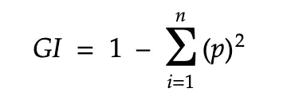

计算基尼系数的公式

> 用一个简单的例子来说明，假设我们有一个装有 10 个水果的篮子，其中 4 个是苹果，5 个是芒果，一个是草莓。该样本的基尼系数为:
> 
> GI(苹果)= 1 — [(4/10) + (6/10) ]
> 
> GI(苹果)= 1 — (0.52) = 0.48

> 基尼系数的范围是 0-0.5(包括 0 和 0)。scikit-learn API 默认使用 Gini 杂质标准。

> 熵:顾名思义，熵是对样本随机性的度量。像基尼不纯一样，找到属于一个类别的样本的概率越大，与分布相关的熵就越小。同样，目标是最小化熵。熵有时与术语信息增益一起使用。熵越低，信息增益越高，这是有意义的。

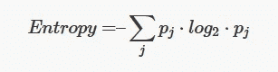

计算熵的公式

> 使用与之前相同的示例，熵得出为:
> 
> 熵(苹果)=-((4/10)* log2(4/10)+(6/10)* log2(6/10))
> 
> 熵(苹果)= 0.97

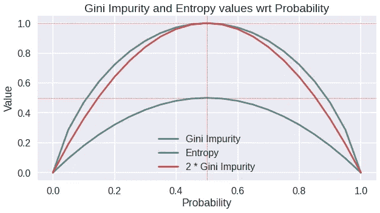

熵与两倍的基尼系数不完全一致

当使用两者中的任何一个时，精度没有显著差异。

我们来看看在使用基尼杂质和熵(使用经典的 Iris 数据集)的情况下，同一数据集上的模型训练时间出现了什么程度的差异。

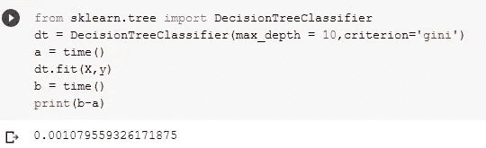

训练基于基尼系数杂质的决策树所花费的时间

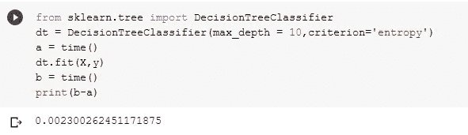

训练基于熵的决策树所花费的时间

随着数据集规模的增加，基于熵和基尼系数的决策树之间的训练时间差异急剧增加。

决策树迭代地遍历特征矩阵中的每个值，并基于关于特定特征的特定值的分割来计算基尼系数杂质/熵。然后，它首先根据最低基尼系数杂质/熵对它们进行排序。

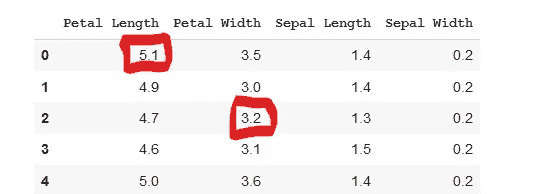

每个条目(如红框中的条目)是一个块，决策树分割每个块的数据并计算其基尼系数杂质/熵

**分裂具有最小基尼系数杂质/熵的块被分配给根节点。**

第二个和第三个最小值被分配给根节点的左右子节点，依此类推。

> **由于基于平等-不平等的决策，决策树的决策边界明显是箱形的**

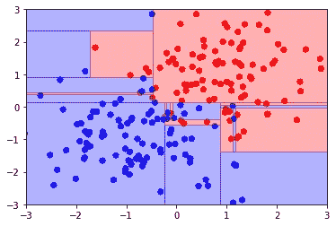

DT 分类器的独特的箱形决策边界(图片提供:堆栈溢出)

**好处:**在 scikit-learn 中，可以使用决策树 instace 的 feature_importances_ attribute 轻松检查每个特征在进行预测时的重要性，以便更好地理解数据本身。它可以很容易地可视化，以便快速解释。

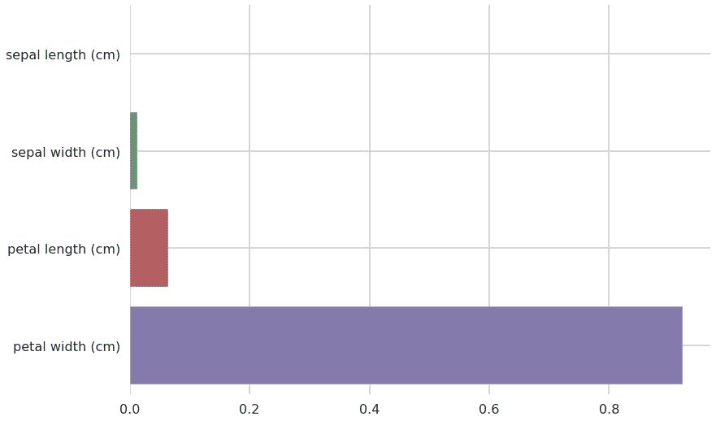

虹膜数据集的特征重要性

# 回归决策树

回归型决策树的工作方式与分类型决策树非常相似。大多数概念是相似的:

1.  基于条件的二进制拆分
2.  天生适应过度
3.  箱形决策边界
4.  它计算关于每个特征的每个值的分割的损失函数。

然而，有一个很小但非常重要的区别:

> 回归型决策树没有基尼杂质或熵的概念来进行节点分裂。他们用均方差来代替。

回归型决策树试图在节点处分割数据，使得在每个节点处，分配给该节点的值具有与该节点处包含的数据点最小的 MSE。

在调整的 Iris 数据集上测试决策树回归器—萼片宽度(连续)被指定为目标列，我们得到:

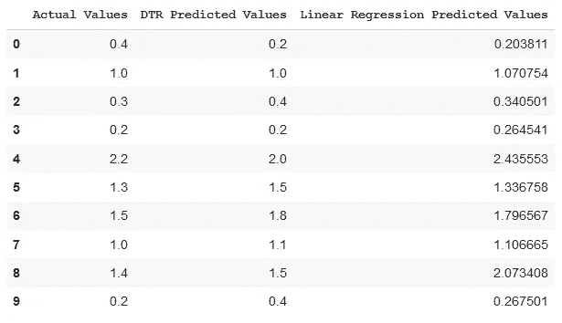

决策树回归器和线性回归之间的一个显著区别是，DTR 中的预测值实际上是从训练数据本身中选取的。而线性回归在基于截距和系数计算最终值后给出预测。

> 回归型决策树给出的预测是从训练数据中选取的值。决策树回归器的一个很大的缺点是它不能外推，也就是说，它总是在被训练的数据范围内给出预测。

# **修剪:减少过度拟合的简单方法**

修剪的概念包括限制决策树的深度，使得所有的叶节点不一定是纯的。这有助于我们避免过度拟合，因为模型不再试图记住整个数据集，而是捕捉数据的总体趋势，这才是更重要的。

修剪决策树有两种方法:

1.  预修剪(在训练期间限制树的最大深度)
2.  后期修剪(移除训练决策树的过度拟合叶节点)

> 预修剪:这是一种早期停止技术，当我们怀疑过度拟合开始时，我们停止训练过程。在训练过程之前，我们简单地设定 DT 的最大深度。在 scikit-learn 中，我们使用参数“max_depth”来实现此目的。例如:

> 从 sklearn.tree 导入决策树分类器
> 
> dt =决策树分类器(max_depth = 5)

> 后期修剪:修剪已训练好的决策树模型的过程称为后期修剪。它的实现比预修剪稍微复杂一点。
> 
> 在 scikit-learn 中，后期修剪是使用成本复杂性参数(在 sklearn 中称为 CCP _ 阿尔法)来完成的。
> 
> CCPα的值越高，修剪的节点数越多。scikit-learn 有一个名为 cost_complexity_pruning_path 的参数，它返回 alpha 值和与之关联的相应叶基尼杂质/熵。很明显，随着α的增加，杂质也会增加。
> 
> 你可以在 scikit-learn [这里](https://github.com/dipspilani/Post_Pruning_DecisionTre/blob/master/plot_cost_complexity_pruning.ipynb)找到一个详细的笔记本，里面有执行后期修剪的过程。

# **系综决策树**

使用单个决策树有很多缺点，这就是集合决策树来拯救它的地方。

*   以有效的方式控制单个 DT 的过拟合特性并不容易。
*   单个 DT 对单个数据点非常敏感。移除一个样本可能会导致非常不同的 DT。
*   单个 DT 无法处理异常值。

> 集合决策树使用了一个非常强大的思想:一群普通人的智慧胜过一个聪明人。它使用大量弱的、不适合的分类器，并基于多数投票给出预测。

1.  **随机森林:**是一种使用 n 棵决策树进行预测的装袋技术。对于分类，它使用软投票，而对于回归，它给出每个 DT 预测的平均值作为结果。随机森林的每个决策树在一个数据集上训练，该数据集的大小等于原始数据集的大小，但是特征的数量会更少。

> Bagging 技术包括基于多个单独的分类器/回归器的结果进行预测，这些分类器/回归器使用整个数据集的引导样本(替换样本)进行训练。

随机森林中的“随机”代表这样一个事实，即使用原始数据集的 d 个特征的随机子集来训练每个单独的 DT。此外，作为自举抽样的结果，一个样本可能出现不止一次，而有些样本甚至可能一次也没有被选中。

其中，d < number of features in the original dataset. In scikit-learn, d is called as n_features and it defaults to square root of number of features in original dataset. n_features parameter determines the number of randomly selected features to be used in each Decision Tree of the Random Forest.

If n_features = number of features in the original dataset, no randomness is induced in the individual DTs. Higher the value of n_features, more similar are the Individual DTs.

> Non-zero importance is given to all features and it helps us to capture a much broader picture of the dataset.

A major drawback of Random Forest is that it performs poorly on sparse datasets.

High Variance problem is easily tackled by Random Forest.

**2。AdaBoost(自适应提升):**这是一种提升技术，每个决策树都试图从前任决策树的错误中学习。因此，它是一系列正向训练的决策树。

AdaBoost 中的每棵决策树深度为 1，因此被称为决策树桩。每个树桩选择一个要素，并根据该要素的特定值分割数据集。

每个 AdaBoost 决策树都试图纠正前一个树所犯的错误。每个决策树的输出被用来训练下一个决策树的参数。这是通过给不正确预测的样本较高的权重和给那些处理得好的样本较低的权重来实现的。

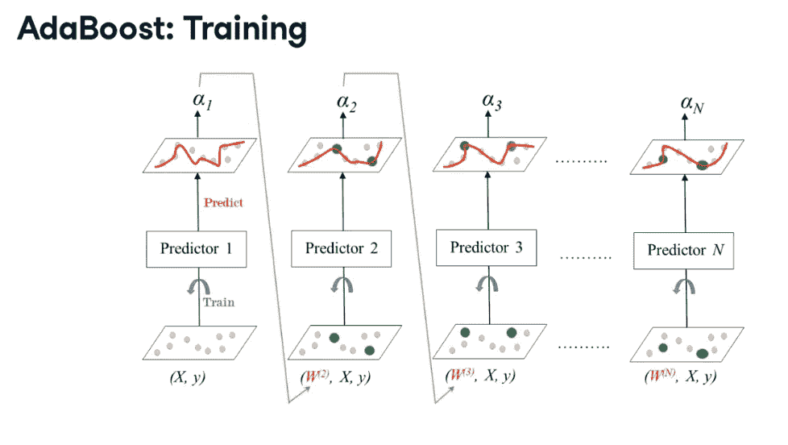

图片来源:数据营

注意不正确预测的(绿点)如何在下一个决策树桩训练过程中获得更高的权重。

每个预测器被分配一个系数α，该系数是预测器对训练数据执行得有多好的度量。α值越高，该预测值对 AdaBoost 最终预测的贡献就越大。

AdaBoost 的另一个重要参数是*学习率* η。它的值介于 0 和 1 之间(包括 1)，用于缩小系数α。

**因此，α := η * α**

η的小值必须用大量的估算器来补偿。

**3。梯度推进:**与 AdaBoost 类似，梯度推进是另一种推进技术，其中每个估计器试图纠正其前任的错误。

然而，与 AdaBoost 不同，训练实例的权重没有调整。**取而代之的是，每个预测器都使用其前任的残差作为标签来训练。CART 用作基础学习者。**

它是最热门和最常用的分类算法之一，并已被证明是各种场景中最好的算法之一。

在梯度推进机器中，每当一个新的弱估计量加入序列时，随着新层的引入，先前估计量的参数不变。这与 AdaBoost 策略相反，AdaBoost 策略在每次添加新的估计器时更新权重。

梯度推进机器试图最小化损失函数，因此它们非常类似于梯度下降。

> 一些特征通过梯度推进机器获得零重要性。

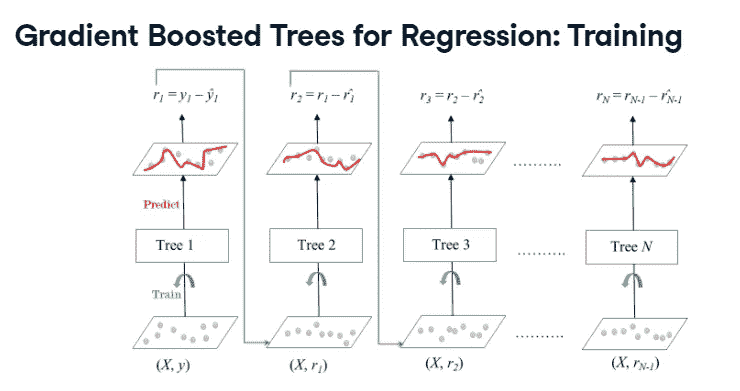

图片来源:数据营

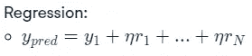

回归输出是单个估计量预测的加权平均值

每个预测器都使用其前一个预测器的残差作为样本来训练。

梯度推进机中的一个重要参数是收缩率(η)，其值为 0

Hence, for each predictor, **r := η * r**

快乐学习！如果你发现它能提供信息，请鼓掌！