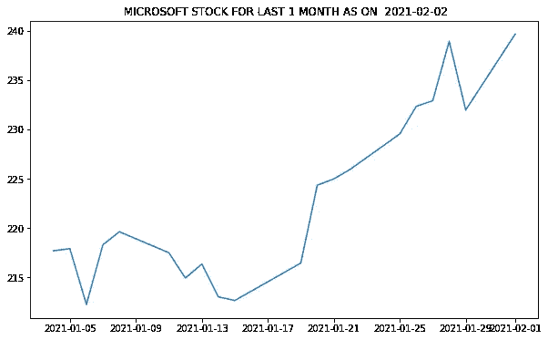

# 全部内容:时间序列分析—指数平滑示例

> 原文：<https://medium.com/analytics-vidhya/all-about-it-time-aeries-analysis-exponential-smoothing-example-e62057768bc1?source=collection_archive---------7----------------------->


大家好 **大家好！**在本文中，我将使用 python 中的指数平滑法来解释时间序列预测。如果你正在阅读这篇文章，我敢肯定你知道指数平滑法的基础知识。如果没有，你可以在这里阅读[。](https://sreeramkashyap.medium.com/all-about-it-time-series-analysis-box-jenkins-holt-winter-methods-fe19724ab884)

在这个例子中，我们将使用 yfinance API 下载股票市场数据，并了解简单的指数平滑是如何工作的。我用微软的数据作为例子。可以换成自己喜欢的股票。

现在让我们开始吧。

简而言之，指数平滑:它对历史数据使用平滑因子，并为数据分配权重。然后用它来预测未来。

*数据:*我们将使用雅虎财经 API 使用 1 个月的股市数据。

*语言:* Python

*库:* statmodels，pandas，matplotlib，datetime。

*API:* yfinance

首先安装库。

```
!pip install pandas, matplotlib
!pip install statmodels
```

现在我们准备开始了。我们需要导入以下库

```
import pandas as pd
import yfinance as yf
import datetime
import matplotlib.pyplot as plt
from statsmodels.tsa.api import SimpleExpSmoothing
```

现在我们需要从 yfinance 下载数据。yfinance API 每天更新股票市场数据。它需要三个主要参数，即 tickers、period 和 interval。Period 是我们要下载的数据的总周期，interval 是两次记录之间的间隔或每个时间步长的大小。Tickers 将我们想要的股票的符号列在股票市场上。你可以从纽约证券交易所或标准普尔 500 指数列表中查看你喜欢的股票的代码。

以下命令下载数据。

```
data = yf.download(tickers=’MSFT’, period=’1mo’, interval=’1d’)
```

您可以使用 head()命令查看下载的数据

```
data.head(3)
```


让我们首先绘制下载的数据，看看它是什么样子

```
today = datetime.date.today()
plt.figure()
plt.title(‘ MICROSOFT STOCK FOR LAST 1 MONTH AS ON ‘+ str(today))
plt.plot(data[‘Close’])
```



在绘制的图中，您可以观察到一段时间内的增长趋势以及每个时间步长的一些变化。这就是典型的股价图的样子。

现在让我们来预测一下。我们将使用 statsmodels 库的内置 [SimpleExpSmoothing](https://www.statsmodels.org/stable/generated/statsmodels.tsa.holtwinters.SimpleExpSmoothing.html) 函数进行预测。为此，我们需要指定平滑系数(α)。

```
SimpleExpSmoothing(data”).fit(smoothing_level=0.1)
```

在此详细了解[功能和参数](https://www.statsmodels.org/stable/generated/statsmodels.tsa.holtwinters.SimpleExpSmoothing.html)

这个函数还需要其他参数，但这足以让我们理解。

让我们首先定义输入。该函数需要由值和索引组成的一系列输入。在我们的例子中，值是股票在每个时间步的收盘价，指数是日期。

这里要做的另一个决定是预测的时间步长。这定义了我们要预测未来多少时间步长的值。在本例中，我们将选择 2 天的时间步长。请记住，时间步长应与下载数据时定义的间隔单位相同。在我们的例子中，两者都是以天为单位的。

```
data = data[‘Close’].tolist()
index= pd.date_range(start=’2021–01–05', end=’2021–02–01', freq=’B’)
stock_data = pd.Series(data, index)
forecast_timestep = 2#CHANGE DATA to period of 30 DAYS FROM THE DATE WHEN YOU ARE RUNNING THIS CODE
```

现在我们将首先使用 SimpleExpSmoothing 函数来拟合曲线，然后对每个时间步长进行预测。

这里我们需要指定 alpha 值。我们在上一篇文章中讨论过，alpha 值是在反复试验的基础上设置的。所以我们先用三个不同的α值做实验。然后，我们将使用内置函数来选择 alpha 的最佳值。

```
fit_1 = SimpleExpSmoothing(stock_data, initialization_method=”heuristic”).fit(smoothing_level=0.1,optimized=False)
forecast1 = fit_1.forecast(forecast_timestep).rename(r’$\alpha=0.1$’)
plt.plot(stock_data, color=’black’)
plt.plot(fit_1.fittedvalues, color=’cyan’)
line1, = plt.plot(forecast1, color=’cyan’)
```


你可以很容易地看到预测值与实际值相差甚远。所以我们知道我们必须改变这个值。

现在来试试 0.4。

```
fit_2 = SimpleExpSmoothing(stock_data, initialization_method=”heuristic”).fit(smoothing_level=0.4,optimized=False)
forecast2 = fit_2.forecast(forecast_timestep).rename(r’$\alpha=0.4$’)
plt.plot(fit_2.fittedvalues, color=’red’)
line2, = plt.plot(forecast2, color=’red’)
```


您可以观察到预测值越来越接近实际值。所以现在我们知道我们需要进一步增加 alpha 值。

让我们看看所有的值，以及选择阿尔法值的内置函数。

```
plt.figure(figsize=(16,10))
plt.plot(stock_data,  color='black')
plt.plot(fit_1.fittedvalues,  color='cyan')
line1, = plt.plot(forecast1,  color='cyan')
plt.plot(fit_2.fittedvalues,  color='red')
line2, = plt.plot(forecast2, color='red')
plt.plot(fit_3.fittedvalues,  color='green')
line3, = plt.plot(forecast3, color='green')
plt.plot(fit_4.fittedvalues,  color='blue')
line4, = plt.plot(forecast4, color='blue')
plt.legend([line1, line2, line3,line4], [forecast1.name, forecast2.name, forecast3.name,forecast4.name])
plt.show()
```


你现在可以清楚地看到预报了。内置函数为 alpha 选择了 0.810 的值，正如您所观察到的，与其他值相比，它给出了很好的预测。但是如前所述，简单的指数平滑法并不是一个非常精确的方法。你可以看到αa =的最佳选择值也有一些偏差。

完整代码

```
import numpy as np
import pandas as pd
import yfinance as yf
import datetime 
import matplotlib.pyplot as plt
from statsmodels.tsa.api import SimpleExpSmoothingdata = yf.download(tickers=’MSFT’, period=’1mo’, interval=’1d’)data.head(3)today = datetime.date.today()
plt.figure(figsize=(10,6))
plt.title(‘ MICROSOFT STOCK FOR LAST 1 MONTH AS ON ‘+ str(today))
plt.plot(data[‘Close’])
plt.show()data = data[‘Close’].tolist()
index= pd.date_range(start=’2021–01–05', end=’2021–02–01', freq=’B’)#CHANGE DATA FOR 30 DAYS FROM THE DATE WHEN YOU ARE RUNNING THIS CODE
stock_data = pd.Series(data, index)
forecast_timestep = 2fit_1 = SimpleExpSmoothing(stock_data, initialization_method=”heuristic”).fit(smoothing_level=0.1,optimized=False)
forecast1 = fit_1.forecast(forecast_timestep).rename(r’$\alpha=0.1$’)fit_2 = SimpleExpSmoothing(stock_data, initialization_method=”heuristic”).fit(smoothing_level=0.4,optimized=False)
forecast2 = fit_2.forecast(forecast_timestep).rename(r’$\alpha=0.4$’)fit_3 = SimpleExpSmoothing(stock_data, initialization_method=”heuristic”).fit(smoothing_level=0.6,optimized=False)
forecast3 = fit_3.forecast(forecast_timestep).rename(r’$\alpha=0.8$’)fit_4 = SimpleExpSmoothing(stock_data, initialization_method=”estimated”).fit()
forecast4 = fit_4.forecast(forecast_timestep).rename(r’$\alpha=%s$’%fit_4.model.params[‘smoothing_level’]) plt.figure(figsize=(16,10))
plt.plot(stock_data, color=’black’)
plt.plot(fit_1.fittedvalues, color=’cyan’)
line1, = plt.plot(forecast1, color=’cyan’)
plt.plot(fit_2.fittedvalues, color=’red’)
line2, = plt.plot(forecast2, color=’red’)
plt.plot(fit_3.fittedvalues, color=’green’)
line3, = plt.plot(forecast3, color=’green’)
plt.plot(fit_4.fittedvalues, color=’blue’)
line4, = plt.plot(forecast4, color=’blue’)
plt.legend([line1, line2, line3,line4], [forecast1.name, forecast2.name, forecast3.name,forecast4.name])
plt.show()
```

我们将在以后的文章中讨论其他方法。

## ………… ***敬请期待……..***