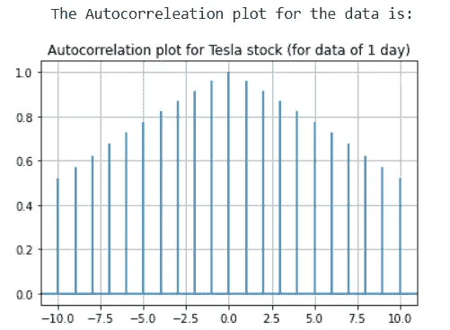

# 全部内容:时间序列分析——Box-Jenkins，Holt-Winter 方法

> 原文：<https://medium.com/analytics-vidhya/all-about-it-time-series-analysis-box-jenkins-holt-winter-methods-fe19724ab884?source=collection_archive---------10----------------------->

> 大家好。这是我的时间序列分析讲解系列的延续。在本文中，我们将讨论一些用于时间序列分析的老方法。我第一次在我的制造课上看到这种方法被用于需求预测，后来在我的销售预测数据分析课程中，我快速推断了这些算法在深度学习框架出现之前有多重要。这些方法的主要优点除了相当准确、计算速度快和容易做到之外，还在于它们更容易解释，也就是说，你对所有获得的结果都有一个解释。这就是它们在行业中被使用了非常非常长时间的原因。

话虽如此，我们还是开始吧。

在本文中，我们将详细讨论时间序列分析中的两种主要方法

1.  温特霍尔特方法(指数平滑)
2.  博克斯詹金斯方法(ARIMA 模型)

**指数平滑:**
指数平滑法是用于预测的简单移动平均法的扩展。我简单描述一下，这将使你容易理解指数平滑法。

**移动平均法:** 根据前 n 个时间步记录的数值，对当前时间步进行预测。

让 p1，p2，p3…..pn 是以 n 个时间步长记录的数值。

时间 t 的值由下式给出

移动平均线

例如
假设 p1 = 5，p2 = 4，p3 = 6
那么 pt = (5+4+6)/3 = 5

**指数平滑:**

直觉会告诉你这种方法可能是错误的，因为值会随着时间而变化。

例如，如果你对 10 个月的需求进行预测，并使用简单的移动平均来预测第 11 个月，你很快就会认为每个月对预测的贡献是不一样的。会更依赖最后一个月而不是第一个月(最天真的想法)。因此，您需要为这些值分配不同的权重值。这个想法导致了指数平滑。

*公式:*

假设我们有一系列值 P1、P2、P3……Pn，我们想估计时间 t 的值 Pt。通过指数平滑公式，Pt 由下式给出

指数平滑法

其中，α =平滑因子 0

t ≥ 3

Example:

Let y1 = 71, y2 = 70, y3 = 69, y4 = 68, y5 = 64
设α = 0.1
在任何预测中，由于没有历史数据，我们无法预测第一个值。在指数平滑法中，预测从第三个时间步开始。
先将 P2 设为 y1。
P3 = 0.1 * Y2+(1–0.1)* P2 = 70.9

p4 和 p5 的结果如下图所示。

移动平均预测

这里你可以看到我们已经将α设置为 0.1。通常，它需要在 0.1 到 0.9 的范围内进行测试。α值的预测值与已知值之间的误差有助于我们确定使用哪个值。

**注:**这里讨论的方法是单指数平滑法。对此进行了改进，提出了双指数平滑和三指数平滑，可以提供更好的预测。它们将在另一篇文章中详细讨论。

**Box Jenkins 方法:**

现在让我们讨论一下比指数平滑法更精细的 box Jenkins 方法。

box Jenkins 方法需要讨论一些关键点。

*平稳性:*如果一个数据的均值、方差和自相关性在给定的时间内不随时间变化，那么这个数据就是平稳的。

box Jenkins 方法假设使用的数据是稳定的。因此，在我们使用任何 box Jenkins 方法之前，我们需要将数据转换为静态数据。

*检测平稳性:*这可以通过使用自相关图或运行序列图来完成。通常使用自相关图，因为它们易于理解和使用。

*自相关图:*自相关图显示时间序列数据的组成部分之间是正相关还是负相关(提示:auto = self)。自相关函数(ACF)值的范围可以在-1 和 1 之间。

解释自相关图:滞后 n 的图给出了所考虑的值和 n 个时间步之前记录的值之间的相关性。因此，滞后为 0 的自相关始终为 1。

如果自相关图显示显著的峰值，则使用差分使数据稳定。随着差异的增加，相关性增加。

既然数据是稳定的，我们可以继续预测。

在 box Jenkins 方法中有两种主要方法。

**自回归移动平均法**:

该模型的预测是通过组合自回归模型和移动平均模型给出的。

ARMA 模型

其中，
θ=移动平均参数
ϕ =自回归模型参数
ε =误差项
c =常数
*符号:* ARMA(p，q)对于 p 个自回归项和 q 个移动平均项

**自回归综合移动平均法:**

在这种方法中，在 p 个自回归分量和 q 个移动平均分量之上，我们定义了差分度 d，它给出了我们执行差分以实现所用数据的平稳性的顺序。

ARIMA 模型中的预测由下式给出

ARIMA 模型

在哪里，

L =滞后运算符

符号:ARIMA(p，d，q)

注:部分自相关图和自相关图分别用于选择 p 和 q 值。类似地，也可以使用扩展自相关图。

使用 python 实现 ARIMA 模型将在下一篇文章中解释。

******************************************************************

…………………………………..敬请关注

*******************************************************************