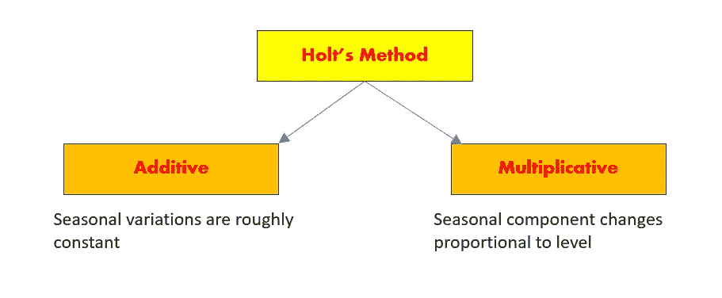
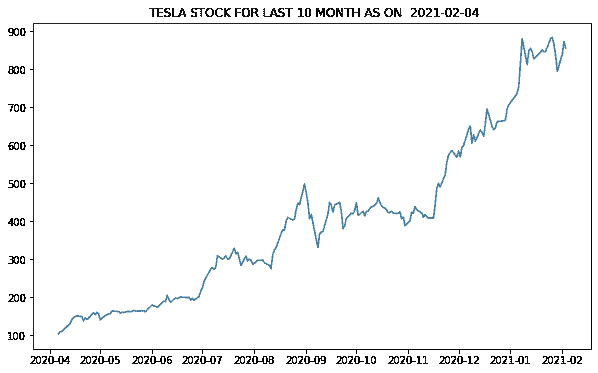
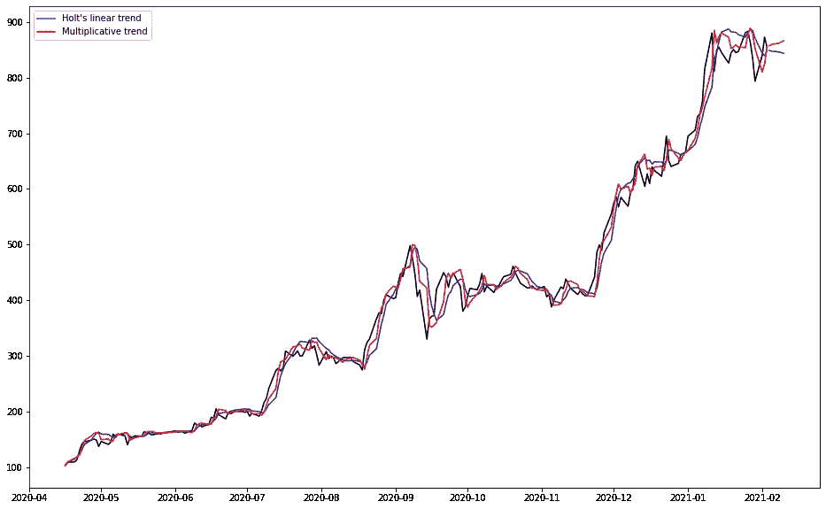
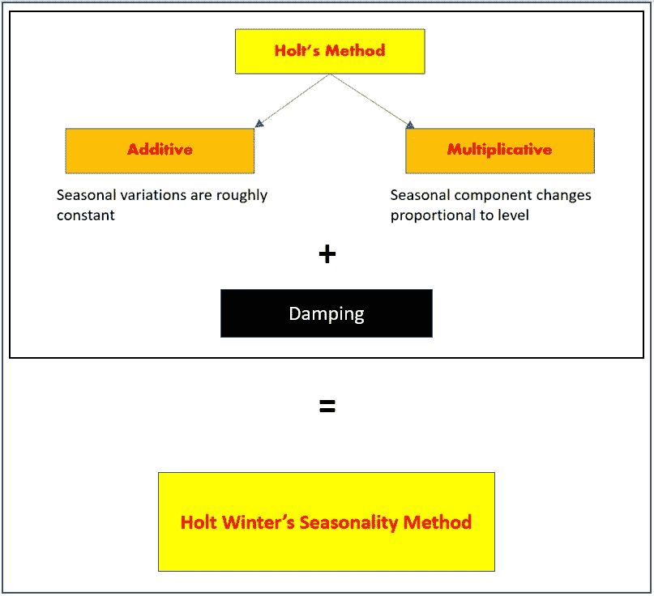
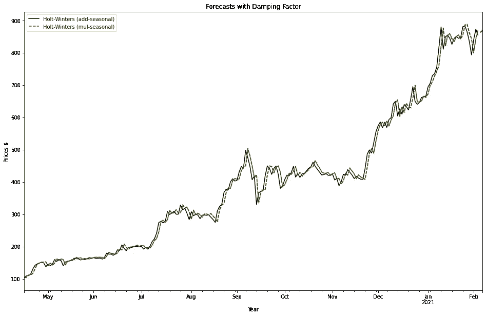

# 全部内容:时间序列分析—霍尔特—温特斯季节性方法

> 原文：<https://medium.com/analytics-vidhya/all-about-it-time-series-analysis-holt-winters-seasonal-method-83935bf6d6e1?source=collection_archive---------12----------------------->


斯蒂芬·道森在 [Unsplash](https://unsplash.com/s/photos/time-series-analysis?utm_source=unsplash&utm_medium=referral&utm_content=creditCopyText) 上拍摄的照片

> 本文是时间序列分析系列文章的一部分。在前一篇文章中，解释了简单的指数平滑。你可以在这里看到。在本文中，我们将讨论指数平滑的霍尔特和霍尔特-温特方法。

让我们开始吧。

简单的[指数平滑](https://sreeramkashyap.medium.com/all-about-it-time-aeries-analysis-exponential-smoothing-example-e62057768bc1)基于应用于历史数据的平滑因子进行预测。它不考虑[季节性](https://sreeramkashyap.medium.com/all-you-need-time-series-analysis-introduction-d30e3b4138d1)和[趋势](https://sreeramkashyap.medium.com/all-you-need-time-series-analysis-introduction-d30e3b4138d1)调整。为了解决这个问题，霍尔特提出了两种成分的调整系数。这使得指数平滑法的组成部分有三个，即水平、趋势和季节性。让我们首先讨论霍尔特的方法，然后把它推广到霍尔特-温特的方法。



霍尔特根据季节性提出了两种方法

Holt 的方法提出了两种平滑方法，即加法和乘法。分类是基于数据的季节性。当数据中季节性成分的变化大致不变时，使用加法模型。在加法模型中，所有季节变化的总和为零。当变化倾向于随着数据水平与数据水平成比例地变化时，则使用乘法方法。

霍尔特-温特斯公式中的三个组成部分是水平、趋势和季节性。相关的平滑因子分别称为 alphs 和γ。

让我们看一个股票市场数据的例子。

*数据:*我们将使用雅虎财经 API 使用 10 个月的股市数据。

*语言:* Python

*库:*stat model，pandas，matplotlib

*API:* yfinance

首先安装库。

```
!pip install pandas, matplotlib
!pip install statmodels
```

现在我们准备开始了。我们需要导入以下库

```
import pandas as pd
import yfinance as yf
import datetime
import matplotlib.pyplot as plt
from statsmodels.tsa.api import Holt, ExponentialSmoothing
```

现在我们需要从 yfinance 下载数据。yfinance API 每天更新股票市场数据。它需要三个主要参数，即 tickers、period 和 interval。Period 是我们要下载的数据的总周期，interval 是两次记录之间的间隔或每个时间步长的大小。Tickers 将我们想要的股票的符号列在股票市场上。你可以从纽约证券交易所或标准普尔 500 指数列表中查看你喜欢的股票的代码。

以下命令下载数据。

```
data = yf.download(tickers='TSLA', period='10mo', interval='1d')
```

让我们首先绘制下载的数据，看看它是什么样子

```
today = datetime.date.today()
plt.figure(figsize=(10,6))
plt.title(' TESLA STOCK FOR LAST 1 MONTH AS ON  '+ str(today))
plt.plot(data['Close'])
plt.show()
```



让我们先看看加法和乘法霍尔特方法的结果。

```
fit_add = Holt(stock_data, initialization_method=”estimated”).fit(smoothing_level=0.3, smoothing_trend=0.2, optimized=False)
forecast1 = fit_add.forecast(5).rename(“Holt’s linear trend”)
fit_mul = Holt(stock_data, exponential=True, initialization_method=”estimated”).fit(smoothing_level=0.6, smoothing_trend=0.2, optimized=False)
forecast2 = fit_mul.forecast(5).rename(“Multiplicative trend”)
```

在这里，我分别用α= 0.3 表示加法，用α= 0.6 表示乘法。上面的两个拟合会给你以下的输出。



在这里，您可以看到加法和乘法方法在每一步的预测中显示出微小的差异。

在这一点上，你会猜测我们还没有讨论趋势组件。

如果你看到上面的图片，你可以观察到股票价格随着时间的推移而整体上涨的明显趋势。由于过去几个阶段的历史行为，在任何时候，预测都有可能导致价格非理性上涨。所以我们需要抑制这种趋势。这就是我们得到温特-霍尔特方法的地方。



让我们对我们的数据使用 winter-Holt 的方法，看看结果。除了加法或乘法季节性平滑，我们还将使用趋势抑制。此外，我们将使用优化器来选择最佳值，而不是试验α、β和γ的值。

```
fit1 = ExponentialSmoothing(stock_data, seasonal_periods=4, trend=’add’, seasonal=’add’, initialization_method=”estimated”).fit()
fit2 = ExponentialSmoothing(stock_data, seasonal_periods=4, trend=’add’, seasonal=’mul’,initialization_method=”estimated”).fit()
fit3 = ExponentialSmoothing(stock_data, seasonal_periods=4, trend=’add’, seasonal=’add’, damped_trend=True,initialization_method=”estimated”).fit()
fit4 = ExponentialSmoothing(stock_data, seasonal_periods=4, trend=’add’, seasonal=’mul’, damped_trend=True, initialization_method=”estimated”).fit()
```

上述公式给出了两组结果，有和没有阻尼因子的加法和乘法结果。它们可以被形象化如下。



传统上，许多经验实验已经产生了一个共同的概念，即带有阻尼的乘性季节分量给出了指数平滑预测的最佳结果。尽管对解释的研究仍在继续，但当你用多个数据集进行实验时，这一概念是站得住脚的。

霍尔特·温特指数平滑法的完整代码如下。

```
import numpy as np
import pandas as pd
import yfinance as yf
import datetime 
import matplotlib.pyplot as plt
from statsmodels.tsa.api import SimpleExpSmoothing,Holt, ExponentialSmoothing# DOWNLOADING DATA FROM API
data = yf.download(tickers='TSLA', period='10mo', interval='1d')
#TEST RUN FOR DATA
# data.head(3)
# #PLOT DOWNLOADED DATA
today = datetime.date.today()
plt.figure(figsize=(10,6))
plt.title(' MICROSOFT STOCK FOR LAST 10 MONTH AS ON  '+ str(today))
plt.plot(data['Close'])
plt.show()#DEFINING INPUTS
data = data['Close'].tolist()
#CHANGE DATA FOR 30 DAYS FROM THE DATE WHEN YOU ARE RUNNING THIS CODE
start_date = '2020-04-16'
end_date = '2021-02-03'
index= pd.date_range(start=start_date, end=end_date, freq='B')
stock_data = pd.Series(data, index)
forecast_timestep = 2get_ipython().magic('matplotlib inline')
fit1 = ExponentialSmoothing(stock_data, seasonal_periods=4, trend='add', seasonal='add', use_boxcox=True, initialization_method="estimated").fit()
fit2 = ExponentialSmoothing(stock_data, seasonal_periods=4, trend='add', seasonal='mul', use_boxcox=True, initialization_method="estimated").fit()
fit3 = ExponentialSmoothing(stock_data, seasonal_periods=4, trend='add', seasonal='add', damped_trend=True, use_boxcox=True, initialization_method="estimated").fit()
fit4 = ExponentialSmoothing(stock_data, seasonal_periods=4, trend='add', seasonal='mul', damped_trend=True, use_boxcox=True, initialization_method="estimated").fit()ax = stock_data.plot(figsize=(16,10), color='black', title="Forecasts Without Damping factor" )
ax.set_ylabel("Prices $")
ax.set_xlabel("Date")
fit1.fittedvalues.plot(ax=ax, style='--', color='red')
fit2.fittedvalues.plot(ax=ax, style='--', color='green')
fit1.forecast(2).rename('Holt-Winters (add-seasonal)').plot(ax=ax, style='--', color='red', legend=True)
fit2.forecast(2).rename('Holt-Winters (mul-seasonal)').plot(ax=ax, style='--', color='green', legend=True)ax = stock_data.plot(figsize=(16,10), color='black', title="Forecasts with Damping Factor" )
ax.set_ylabel("Prices $ ")
ax.set_xlabel("Year")
fit3.fittedvalues.plot(ax=ax, style='--', color='red')
fit4.fittedvalues.plot(ax=ax, style='--', color='green')
fit3.forecast(2).rename('Holt-Winters (add-seasonal)').plot(ax=ax, style='--', color='red', legend=True)
fit4.forecast(2).rename('Holt-Winters (mul-seasonal)').plot(ax=ax, style='--', color='green', legend=True)
plt.show()
```

**参考文献:**

麦肯齐，埃迪&加德纳，埃弗雷特。(2010).阻尼趋势指数平滑:一个建模观点。国际预测杂志。26.661–665.10.1016/jjforecast