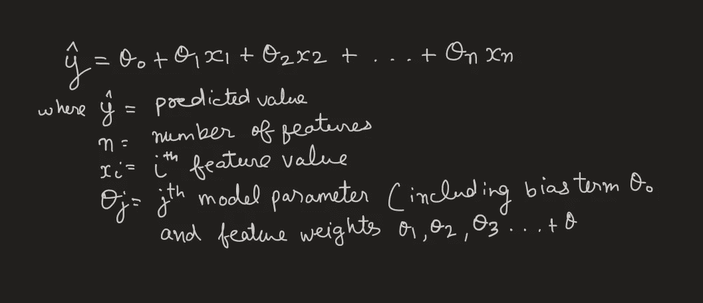
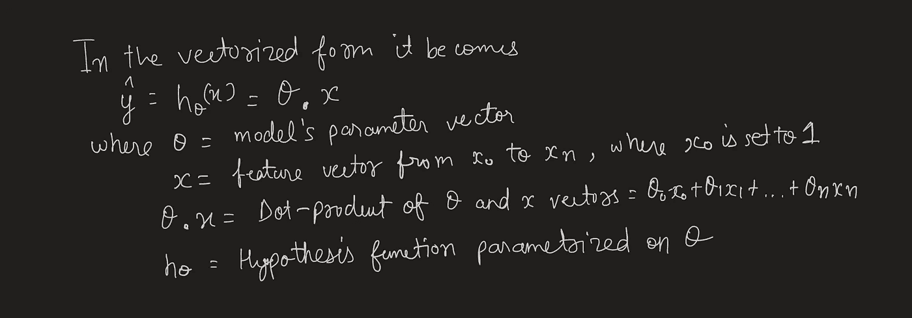
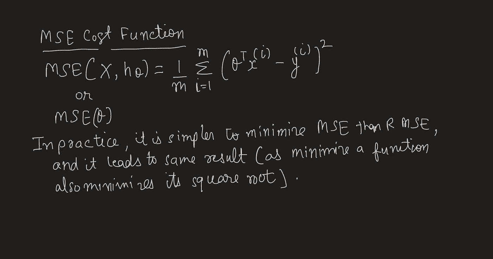
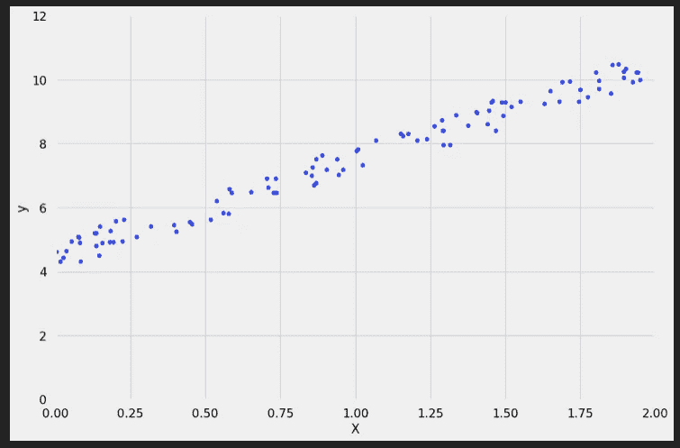
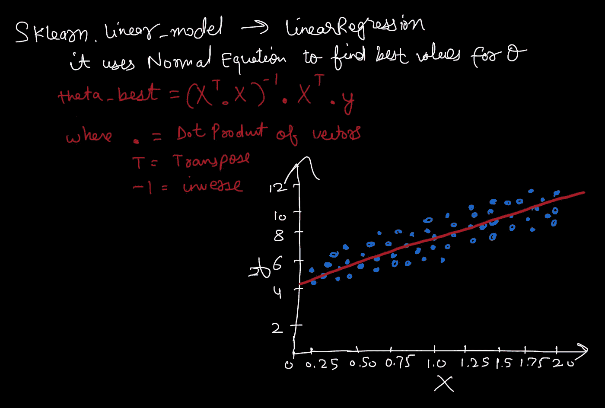
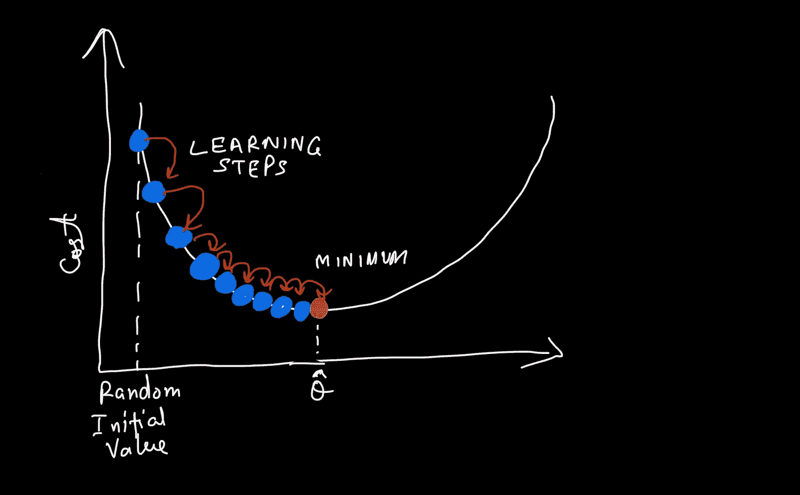
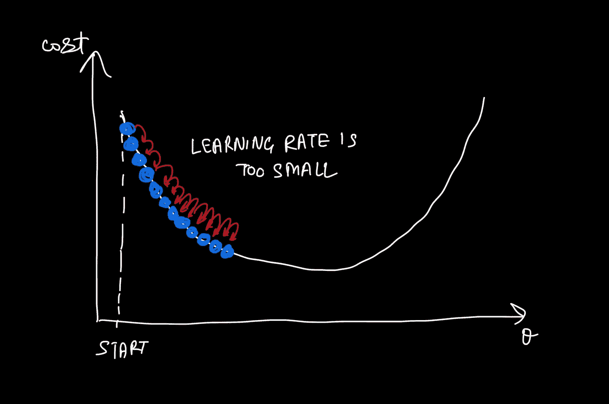
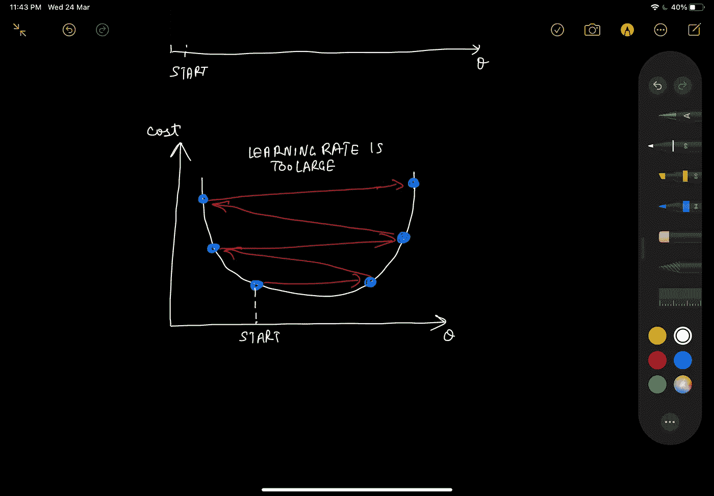
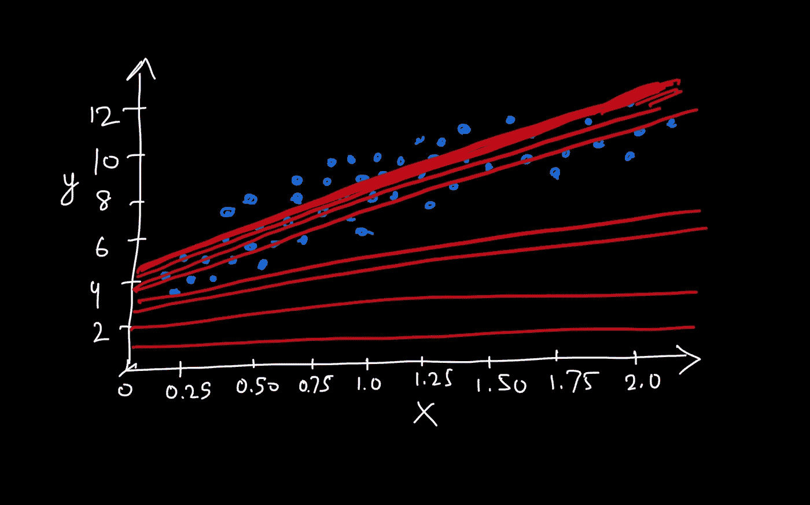

# 机器学习中的线性回归分析

> 原文：<https://medium.com/analytics-vidhya/all-about-linear-regression-analysis-in-machine-learning-b64677d9d7fc?source=collection_archive---------9----------------------->

## 使用 Scikit-learn 及其背后的数学知识构建您自己的线性回归模型

只是另一个数学 GIF

我们先从最基本也最容易理解的回归说起:线性回归。更简单地说，线性回归试图通过将线性方程拟合到观察到的数据来模拟两个变量之间的关系。

更一般地，线性回归模型通过简单地计算输入要素+常数的加权和来进行预测，该加权和称为偏差项(也称为截距项)。

数学上:



线性回归模型预测方程



向量形式的线性回归模型预测方程

这是我们的线性回归模型。但是为了训练它，我们需要设置参数，使我们的模型最适合训练集。我们有一个称为 ***RMSE 或均方根误差的性能指标。***

因此，我们需要以这样的方式训练我们的模型，使得**θ**的值最小化 RMSE。



线性回归模型的 MSE 成本函数

我们试着用一个例子来理解这一点。

首先，进口所有需要的东西:

```
import numpy as np
import pandas as pd
import sklearn
import matplotlib as mpl
import matplotlib.pyplot as plt
%matplotlib inline
```

设置一些随机 X 特征值:

```
# this will return an array of 100 values between 0 to 2 
X = 2 * np.random.rand(100, 1)
```

设置一些相应的随机 y 标签值:

```
y = 4 + (3 * X + np.random.rand(100, 1))
```

使用 matplotlib 绘图和可视化:

```
from matplotlib import style
style.use("fivethirtyeight")
plt.plot(X, y, "b.")
plt.xlabel("X")
plt.ylabel("y")
plt.axis([0, 2, 0, 12])
plt.show()
```



用 matplotlib 绘制一些随机值

数据似乎是线性的，它应该是我们采用的线性方程，但在分析真实数据时，我们一开始不知道这一点。

```
from sklearn.linear_model import LinearRegressionlin_reg = LinearRegression()
lin_reg.fit(X, y)print(lin_reg.intercept_)
print(lin_reg.coef_)
```



使用正态方程或 Sklearn 线性回归模型的最佳拟合线

这适用于较小的训练数据。但是随着训练数据越来越大，计算 X 转置与 X 的点积的 ***倒数的时间复杂度变得非常高。因此，通常，我们使用 **SGDRegressor** ，它使用**梯度下降**的概念来寻找最佳拟合线。***

> *梯度下降*是一种通用优化算法，能够找到各种问题的最优解。梯度下降的一般思想是迭代地调整参数，以便最小化成本函数。

**目测:**



梯度下降的描述，模型参数被随机初始化并反复调整以最小化成本函数

*学习步长*与成本函数的斜率成比例，因此随着参数接近最小值，步长逐渐变小。

梯度下降中的一个重要参数是由学习率超参数确定的步长。

如果学习率 ***太小*** ，那么算法将不得不经历大量迭代，这将花费很长时间来最小化代价函数。



学习率太小了

另一方面，如果学习率*太高，你可能会跳过山谷，到达另一边，甚至可能比以前更高。*

**

*学习率太大*

*要使用 SGD 执行线性回归或使用 Scikit-Learn 执行随机梯度下降，我们只需遵循以下简单步骤:*

```
*from sklearn.linear_model import SGDRegressor
sgd_reg = SGDRegressor()
sgd_reg.fit(X, y.ravel())print(sgd_reg.intercept_)
print(sgd_reg.coef_)*
```

**

*SGD 的最初几步*

*我们用 SGD 得到的解非常接近正规方程。*

*今天到此为止。我将在下一篇文章中分享多项式分析。*

***如果你有任何困难，欢迎在下面评论。干杯！***