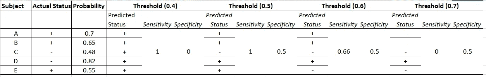
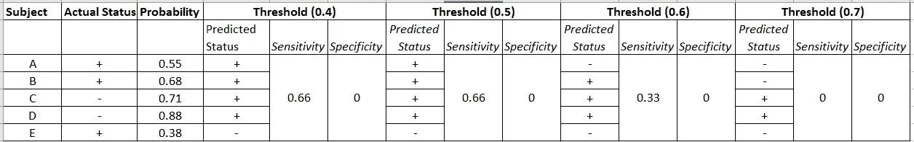
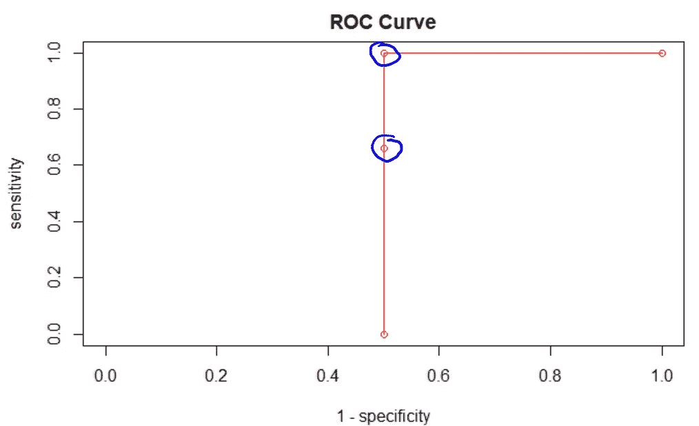
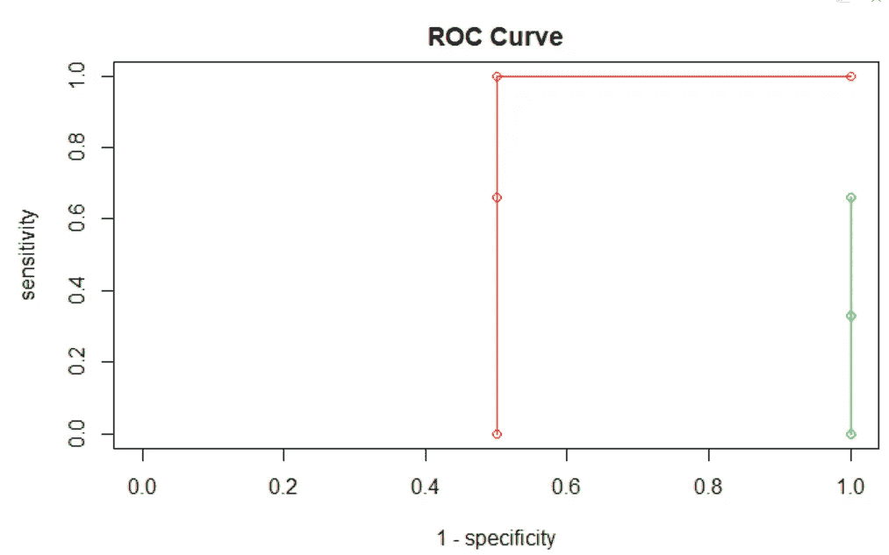
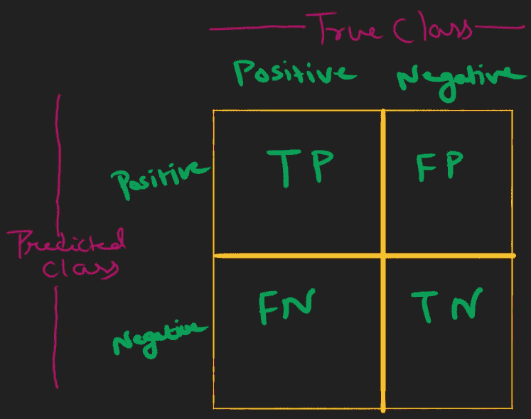

# 关于 ROC 和 AUC 的所有信息

> 原文：<https://medium.com/analytics-vidhya/all-about-roc-and-auc-480cc3885760?source=collection_archive---------12----------------------->

## 分类器的性能

我认识两个瑜伽士(神秘的人)。这两位瑜伽士在我所在的州非常受欢迎，他们的名气在疫情时期成倍增长。这两位瑜伽士彼此相距约 250 英里。这些瑜伽士受欢迎的原因是，他们可以通过看一个人的脸来判断他是阳性还是阴性。这引起了我的兴趣，我决定测试这些说法的真实性。

我带了 100 个朋友一起去。一天前，我所在地区的医疗机构对我的 50 位同行朋友进行了电晕测试，结果呈阳性。

首先，我去找了一个叫罗瑞格的瑜伽士。Loreg 看着我 100 个朋友的脸，宣布其中 50 个是电晕阳性。

> 不要惊讶！瑜伽士并不绝对正确。怎么会？

让我们假设陪伴我的 100 个朋友分为两组:A 组和 B 组。A 组完全是电晕阳性的朋友，B 组由电晕阴性的朋友组成。这位瑜伽士所做的是，他正确地将 A 组的 25 位朋友认定为阳性，并且错误地将 B 组的 25 位朋友也认定为阳性。

在这种情况下，我们可以说:

1.  Loreg 真实地预测 25 个朋友为阳性(他们实际上是阳性的)，这被称为真实阳性(TP)。
2.  此外，Loreg 错误地预测 25 个朋友为阳性(他们实际上是阴性)，这被称为假阳性(FP)。
3.  我们还可以推断出，Loreg 确实预测了 25 个朋友是负面的(他们实际上是负面的)，这被称为真负面(TN)。
4.  此外，Loreg 错误地预测 25 个朋友为阴性(而实际上他们是阳性)，这被称为假阴性(FN)。

我刚才介绍的这四个术语(TP，FP，TN，FN)，对于寻找两位修行者的真理将起到宏伟的作用。

让我们通过计算 Loreg 的 ***敏感度*** 来找出他的敏感度。

> 敏感性意味着“在所有积极的朋友中，被正确识别为积极的朋友的比例”。

灵敏度= TP/(TP+FN)

灵敏度也称为真阳性率(TPR)。高灵敏度意味着会有更少的假阴性结果，从而更少的病例被遗漏。

让我们找出真正的负利率(TNR)。TNR 又叫*。*

*特异性=TN/(TN+FP)*

> *特异性意味着“在所有负面因素中，被正确识别为负面因素的朋友比例。”*

*高特异性值意味着将会有更少的假阳性结果，因此将会有更少的健康朋友的病例被诊断为患病。*

> *我们将永远追求高灵敏度和高特异性。*

*因此，第一位瑜伽士(Loreg)的敏感度和特异度分别为 0.5 和 0.5。*

*特异性值 50%在这里可能不是一个问题，因为在这种情况下，如果认真对待瑜伽，一半的健康人将被诊断为电晕阳性，并将被隔离。但是，50%的灵敏度值将意味着一半实际上电晕阳性的人将被瑜伽师识别为健康的，并且他们将自由地漫游而不会被隔离。一场灾难！*

*当瑜伽士“罗瑞格”被告知他的灾难行为时，他要求第二次尝试预言，我们很高兴地给了他。*

*这一次，瑜伽士聪明地提出了他的诊断。他提供了朋友是积极的可能性，而不是像朋友是积极的或消极的那样明目张胆的回答。比如他会说一个人 X 为正的概率是 0.7。然后他让我自己找一个合适的**阈值，**，超过这个阈值，我就宣布我的朋友是阳性。例如，假设我设置了一个 0.6 的阈值，因为人 X 是阳性的概率是 0.7，大于 0.6，所以我会声明他是阳性的。如果我真的把阈值设为 0.8，那么同一个人就会被宣布为阴性。*

> *这个阈值对敏感性和特异性有什么影响？*

*不同的阈值会有不同的特异性和灵敏度值。为了简单起见，让我们通过五个主题来理解这一点。实际状态(阳性或阴性)、Yogi 的预测、阈值以及相应的灵敏度和特异性值如表 1 所示。*

**

*表 1:瑜伽 1 的阈值敏感性和特异性*

*查看表 1，我们可以推断阈值 0.5 提供了最大的灵敏度和同等的特异性，这是四个竞争者阈值中最好的。*

*当我对第二位瑜伽士——俗称“林迪斯”——重复同样的程序时，他也给了我他的概率预测。然后我创建了一个类似的表，但这次是为第二个瑜伽士，表 2。*

**

*表 2:瑜伽 2 的阈值敏感性和特异性*

*显然，从表 2 中，我们可以看到，就特异性而言，没有一个阈值是可接受的；然而，0.4 和 0.5 在灵敏度方面同样更好。*

> *我们如何找到最佳阈值？*

*请注意，我们在上面的讨论中采用的阈值只有四个。理论上，这些阈值可以是无限的。因此，如果我们真的想知道最佳阈值，我们应该比较多个阈值(不仅仅是四个)的灵敏度和特异性值。我们必须为多个阈值创建并查看这样的表(表 1 和表 2)。详尽！*

**

*图 1: ROC 曲线*

*解决方法是受试者工作特征(ROC)曲线。ROC 曲线通过在 Y 轴上取灵敏度值和在 X 轴上取(1-特异性)值来绘制。1-特异性也称为假阳性率(FPR)。*

*图 1 是利用表 1 中指定的所有四个阈值的灵敏度和特异性值绘制的。曲线上的两个圈起来的点表明，对于 0.5 的 FPR，TPR(或灵敏度)值是 0.66 和 1。因为，我们总是争取更大的灵敏度值，因此，将选择对应于上圆圈点的阈值(阈值=0.5)。*

*因此，ROC 曲线提供了一种有效找到最佳临界值(或阈值)的方法。*

> *有没有什么办法，让我们可以直观的对比两位瑜伽士的表现？*

*是啊！ROC 曲线再次拯救了我们。请注意，ROC 的曲线下面积(AUC)意味着该瑜伽士解释的信息比例。在图 1 的例子中，瑜伽士可以解释一半的信息，这并不比偶然好多少。因此，第一位修行者没有任何功德(根据我们的四个门槛)。*

*让我们画出瑜伽 2 号的 ROC，并分析它的 AUC。*

**

*图 2:瑜伽士 1 和瑜伽士 2 的 ROC 区域*

*yogi 2 的 AUC 在图 2 中以绿色显示，可以推断为零。*

*因此，我们可以得出结论，第一位瑜伽士(“洛雷格”)比第二位瑜伽士(“林迪斯”)好得多。总的来说，即使是第一个瑜伽师，通过看朋友的脸来预测疾病也是无效的。两个修行者被证明是假的。*

*在现实世界的机器学习应用中，瑜伽士被称为分类器。 *Loreg 可以是基于“逻辑回归”的分类器，Lindis 可以是基于“线性判别分析”的分类器*。*

*通过看他或她的脸来识别电晕阳性的人的问题可以是典型的分类问题。*

*表 1 和表 2 通常不太详细，通常以“混淆矩阵”的形式呈现(图 3)。*

**

*图 3:混淆矩阵。TP 代表真阳性病例的数量，FP 代表假阳性病例的数量，等等。*

***呼吁**:如果你喜欢我的文章，请分享到其他领域，这样搜索者会受益匪浅。还有就是，**拍手跟**。快乐(机器)学习！！！*