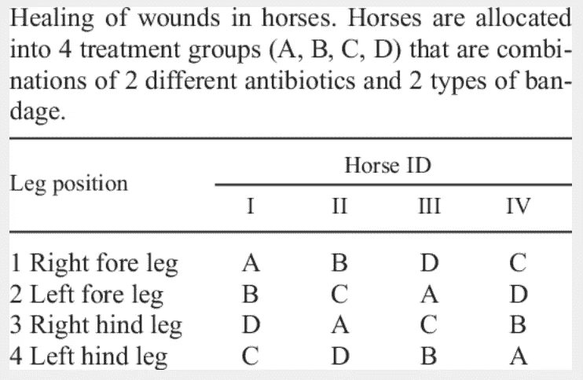
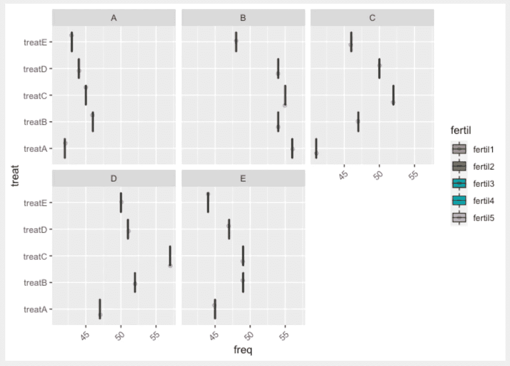

# R 中的所有统计检验

> 原文：<https://medium.com/analytics-vidhya/all-statistical-tests-in-r-7a55ca5e46a2?source=collection_archive---------1----------------------->


统计测试提供了一种对流程进行定量决策的机制。目标是确定是否有足够的证据来“拒绝”关于过程的假设或假说。要使用统计测试，过程必须满足一些条件(假设)。

有两种类型的测试，即参数测试和非参数测试。让我们首先从参数测试开始。

# **测试总体均值**

# R 中的参数检验

## 单样本 T 检验

它测试总体均值是否等于(大于或小于)特定值。

## 假设:

*   观察的独立性
*   样本的正态性
*   随机性

让我们用“钻石”数据集来展示如何使用统计测试。

```
library(ggplot2)
library(kableExtra)
library(knitr)
library(rsample)

data(diamonds)
kbl(head(diamonds), caption="Dataset", booktabs = T) %>% kable_styling(latex_options = c("striped", "hold_position","scale_down"),font_size=12, stripe_index = c(1,3,5,7))
```


图一。钻石数据集

测试钻石的价格是否大于 3500。

首先，我们用夏皮罗-威尔克正态性检验和 qq 图来检验正态性。

**Q-Q 图:** Q-Q 图(或分位数-分位数图)绘制给定样本与正态分布之间的相关性。还绘制了 45 度参考线。

```
library(ggpubr)
ggqqplot(diamonds$price)
```


图二。带“ggpubr”包的 QQPlot

```
library("car")
qqPlot(diamonds$price)
```


图 3。带“汽车”包的 QQPlot

当我们查看*【价格】*变量的 qqplot 时，上尾部和下尾部存在巨大的偏差。此外，还有离群值。然后，用适当的检验来检验正态性。

```
*shapiro.test(diamonds$price)*

***Error in shapiro.test(diamonds$price) : sample size must be between 3 and 5000***
```

*   正如所见，当样本量大于 5000 时，夏皮罗检验不起作用。在这种情况下，使用 Kolmogorov-Smirnov 检验或 Jarque-Bera 正态性检验。

> Ho:样本正态分布
> 
> H1:样本不服从正态分布

```
ks.test(x=diamonds$price,y='pnorm',alternative='two.sided')
## 
##  One-sample Kolmogorov-Smirnov test
## 
## data:  diamonds$price
## D = 1, p-value < 2.2e-16
## alternative hypothesis: two-sided
```

Jarque-Bera 检验是一种拟合优度检验，用于确定样本数据的偏斜度和峰度是否符合正态分布。

```
library(tseries)
jarque.bera.test(diamonds$price)
## 
##  Jarque Bera Test
## 
## data:  diamonds$price
## X-squared = 34201, df = 2, p-value < 2.2e-16
```

正如 Jarque-Bera 检验和 Kolmogorov-Smirnov 检验所示，p 值小于 0.05 的显著性水平，因此拒绝零假设(Ho)。这意味着钻石的价格不是正态分布的。通常，在这种情况下，我们不能使用 t-检验，但作为如何在 R 中进行 t-检验的例子，假设满足正态性。

**假设:**

> 何:μ=3500 vs H1: μ>3500

```
t.test(diamonds$price,mu=3500,alternative = "greater")
## 
##  One Sample t-test
## 
## data:  diamonds$price
## t = 25.196, df = 53939, p-value < 2.2e-16
## alternative hypothesis: true mean is greater than 3500
## 95 percent confidence interval:
##  3904.545      Inf
## sample estimates:
## mean of x 
##    3932.8
```

**替代=** 指定替代假设的字符串，必须是`"two.sided"`(默认)、`"greater"`或`"less"`中的一个。

当我们查看 t 检验结果时，p 值小于 0.05 的显著性水平，因此我们拒绝零假设。这意味着真实人口平均数大于 3500。实际人口平均值为 3932.8。

## 双样本 T 检验

它检验两个样本的总体均值是否等于(大于或小于)特定值。

**假设:**

*   样本应该是相互独立的
*   样本的正态性
*   “样本方差”应该相等(同质)

**测试理想切工和高级切工的钻石价格是否相等。**

**首先我们用 shapiro-wilk 正态性检验和 qq 图来检验正态性。**

首先，让我们使用“过滤”命令从数据中过滤理想切割和高级切割钻石。

```
*#select ideal and premium cuts from data*
library(dplyr)
diamonds_cut<- diamonds %>% filter(cut=="Ideal" | cut=="Premium")ggqqplot(diamonds$price[diamonds$cut=="Ideal"])
ggqqplot(diamonds$price[diamonds$cut=="Premium"])
```


图 4。两个样本的 QQPlot

从理想切点和溢价切点的价格 QQ 图可以看出，两个样本的上下尾部都有很大的偏差，所以两个样本都不是正态分布。为了确保万无一失，让我们使用一个适当的正态性检验。

> Ho:样本呈正态分布。
> 
> H1:样本不是正态分布的。

```
jarque.bera.test(diamonds$price[diamonds$cut=="Ideal"])
## 
##  Jarque Bera Test
## 
## data:  diamonds$price[diamonds$cut=="Ideal"]
## X-squared = 22169, df = 2, p-value < 2.2e-16 jarque.bera.test(diamonds$price[diamonds$cut=="Premium"])
## 
##  Jarque Bera Test
## 
## data:  diamonds$price[diamonds$cut=="Premium"]
## X-squared = 21398, df = 2, p-value < 2.2e-16
```

*   正如所见，两个样本不是正态分布的。

## 方差的同质性

文献中使用了两种检验来检验方差的同质性。这些是**巴特利特测试**和**勒文测试**。这两种测试之间差异将在后面说明。

让我们在这个例子中使用 Bartlett 测试。

> Ho:样本方差相等
> 
> H1:样本方差不相等

```
bartlett.test(price ~ cut, data = diamonds_cut)
## 
##  Bartlett test of homogeneity of variances
## 
## data:  price by cut
## Bartlett's K-squared = 301.5, df = 1, p-value < 2.2e-16
```

*   可以看出，两个样本的方差不相等(p 值=0)。t 检验不满足正态性和方差齐性假设，但让我们看看如何在 R 中进行 t 检验。

**假设:**

> Ho: μ(理想切割)=μ(溢价切割)
> 
> H1: μ(理想切工) **≠** μ(优质切工)

```
t.test(diamonds_cut$price ~ diamonds_cut$cut, alternative = "two.sided",conf.level = 0.95, var.equal = F)
## 
##  Welch Two Sample t-test
## 
## data:  diamonds_cut$price by diamonds_cut$cut
## t = 24.918, df = 26552, p-value < 2.2e-16
## alternative hypothesis: true difference in means is not equal to 0
## 95 percent confidence interval:
##  1038.088 1215.344
## sample estimates:
## mean in group Premium   mean in group Ideal 
##              4584.258              3457.542
```

如果两个样本的方差相等，写出***“var . equal = T”。***

*   两个总体平均值不相等(p 值=0)。超值组均价 4584258，理想组均价 3457542。

## 相关样本的 T 检验(成对样本 T 检验)

配对样本 t 检验用于比较两组相关样本的平均值。

*   作为数据的例子，20 名患者在 6 个月期间接受了糖尿病治疗。我们想知道糖尿病的治疗是否对患者的胰岛素水平有影响。

为了回答这个问题，在治疗前后测量了 20 名患者的胰岛素水平。通过测量相同个体两倍的胰岛素水平，我们得到了治疗前的 20 组值和治疗后的 20 组值。

在这种情况下，配对 t 检验可用于比较治疗前后的平均胰岛素水平。

成对 t 检验分析如下进行:

1.  计算每对数值之间的差值(d)
2.  计算 d 的平均值(m)和标准偏差(s)
3.  将平均差值与 0 进行比较。如果两对样本之间存在任何显著差异，则 d (m)的均值预计将远离 0。

```
*# Insulin level of the patients before treatment*
before <-c(200.1, 190.9, 192.7, 213, 241.4, 196.9, 172.2, 185.5, 205.2, 193.7)*# Insulin level of the patients before treatment*
after <-c(392.9, 393.2, 345.1, 393, 434, 427.9, 422, 383.9, 392.3, 352.2)*# Create a data frame*
my_data <- data.frame(group = rep(c("before", "after"), each = 10),
                insulin = c(before,  after))head(my_data)
##    group weight
## 1 before  200.1
## 2 before  190.9
## 3 before  192.7
## 4 before  213.0
## 5 before  241.4
## 6 before  196.9*# Plot weight by group and color by group*
library("ggpubr")
ggboxplot(my_data, x = "group", y = "insulin", 
          color = "group", palette = c("#00AFBB", "#E7B800"),
          order = c("before", "after"),
          ylab = "insulin", xlab = "Groups")
```


图 5。治疗前后的箱线图

**配对样本 t 检验的假设**

*   样本应该是相关的
*   样本量应该很大
*   样本应呈正态分布。

在我们的案例中:

1.  样本是相关的，因为数据是通过测量同一个人的两倍胰岛素水平收集的。
2.  样本量小，因为 n< 30\. Since the sample size is not large enough (less than 30), we need to check whether the differences of the pairs follow a normal distribution.

That means we should look for normality distance(d) when sample is smaller than 30\. (distance means difference between before and after)

Let print distance.

```
*# compute the difference*
d <-  my_data$insulin[my_data$group == "before"] - my_data$insulin[my_data$group == "after"]print(d)## [1] -192.8 -202.3 -152.4 -180.0 -192.6 -231.0 -249.8 -198.4 -187.1 -158.5
```

> Ho: Distance is normally distributed
> 
> H1: Distance is not normally distributed

```
shapiro.test(d)## 
##  Shapiro-Wilk normality test
## 
## data:  d
## W = 0.94536, p-value = 0.6141
```

*   Since p-value is bigger than the significance level of 0.05, so distance is normally distributed.

> Ho: μ(after treatment)=μ(before treatment)
> 
> H1: μ(after treatment)**≦**μ(处理前)

```
*# Compute t-test
# we write paired=T*t.test(insulin ~ group, data = my_data, paired = TRUE)## 
##  Paired t-test
## 
## data:  weight by group
## t = 20.883, df = 9, p-value = 6.2e-09
## alternative hypothesis: true difference in means is not equal to 0
## 95 percent confidence interval:
##  173.4219 215.5581
## sample estimates:
## mean of the differences 
##                  194.49
```

正如所见，p 值小于 0.05 的显著性水平，因此我们拒绝零假设。这意味着患者治疗前和治疗后的胰岛素水平不相等。因此，治疗是有用的。

## 单向方差分析

单向方差分析(ANOVA)是独立双样本 t 检验的扩展，用于在有两个以上组的情况下比较平均值。在单因素方差分析中，根据一个分组变量(也称为因素变量)将数据组织成几组。

假设:

*   这些观察值是从因子水平定义的总体中独立随机地获得的
*   **各因子水平的数据呈**正态分布。****
*   **这些正态总体有一个共同的方差。(可以用 Levene 氏试验或 bartlett 试验对此进行检查。)**

****测试所有切割组价格的平均值之间是否存在显著差异。记住有 5 个切割组，所以我们比较 2 个以上的平均值。这就是为什么我们使用单向方差分析。****

> **Ho: μ1=μ2=μ3=μ4=μ5**
> 
> **H1:至少有一个是不同的**

```
library(ggplot2)
ggplot(diamonds, aes(x=price, y=cut, fill=cut)) + geom_boxplot(outlier.colour="red", outlier.shape=18,
             outlier.size=3, notch=F)+labs(title = "Boxplot of price by cut") + scale_fill_brewer(palette = "BuPu")
```

****

**图 6。按切割价格的箱线图**

**R 函数 aov()用于应用 ANOVA。summary.aov()函数用于汇总方差分析模型。**

```
anova<-aov(price ~ cut, data = diamonds)
summary(anova)
##                Df    Sum Sq   Mean Sq F value Pr(>F)    
## cut             4 1.104e+10 2.760e+09   175.7 <2e-16 ***
## Residuals   53935 8.474e+11 1.571e+07                   
## ---
## Signif. codes:  0 '***' 0.001 '**' 0.01 '*' 0.05 '.' 0.1 ' ' 1
```

**由于 p 值小于显著性水平 0.05，我们可以得出结论，在模型总结中用“*”突出显示的各组之间存在显著差异。**

****多组两两比较——各组平均值之间的比较****

**在单因素方差分析检验中，显著的 p 值表明某些组均值不同，但我们不知道哪些组对不同。**

**可以进行多次成对比较，以确定特定组对之间的平均差异是否具有统计显著性。**

****Tukey 多重成对比较****

**由于 ANOVA 检验非常重要，我们可以计算 Tukey HSD (Tukey 诚实显著差异，R 函数:Tukey HSD())来执行组均值之间的多重成对比较。(如果方差分析检验不显著，则无需进行成对比较)**

```
TukeyHSD(anova)
##   Tukey multiple comparisons of means
##     95% family-wise confidence level
## 
## Fit: aov(formula = price ~ cut, data = diamonds)
## 
## $cut
##                          diff         lwr        upr     p adj
## Good-Fair          -429.89331  -740.44880  -119.3378 0.0014980
## Very Good-Fair     -376.99787  -663.86215   -90.1336 0.0031094
## Premium-Fair        225.49994   -59.26664   510.2665 0.1950425
## Ideal-Fair         -901.21579 -1180.57139  -621.8602 0.0000000
## Very Good-Good       52.89544  -130.15186   235.9427 0.9341158
## Premium-Good        655.39325   475.65120   835.1353 0.0000000
## Ideal-Good         -471.32248  -642.36268  -300.2823 0.0000000
## Premium-Very Good   602.49781   467.76249   737.2331 0.0000000
## Ideal-Very Good    -524.21792  -647.10467  -401.3312 0.0000000
## Ideal-Premium     -1126.71573 -1244.62267 -1008.8088 0.0000000
```

*   ***diff:两组平均值之间的差异***
*   ***lwr，UPR:95%置信区间的下限和上限(默认)***
*   ***p adj:多次比较调整后的 p 值*。**

**我们可以说，p 值低于 0.05 的组的均值显著不同。**

```
*#we can use also this function to performn pairwise comparison*
pairwise.t.test(diamonds$price, diamonds$cut,
                 p.adjust.method = "BH")## 
##  Pairwise comparisons using t tests with pooled SD 
## 
## data:  diamonds$price and diamonds$cut 
## 
##           Fair    Good    Very Good Premium
## Good      0.00023 -       -         -      
## Very Good 0.00042 0.43055 -         -      
## Premium   0.03419 < 2e-16 < 2e-16   -      
## Ideal     < 2e-16 9.5e-14 < 2e-16   < 2e-16
## 
## P value adjustment method: BH
```

****检查检验有效性的 ANOVA 假设****

**ANOVA 检验假设数据是正态分布的，组间方差是齐次的。我们可以用一些诊断图来验证。**

## **方差的同质性**

```
*# 1\. Homogeneity of variances*
plot(anova, 1)
```

****

**图 7。残差与拟合值**

*   **对于等方差，图中的点应该在零线周围，但在我们的情况下，等方差假设似乎被打破了。让我们用测试来检查这个结果。我们使用 Bartlett 检验来检验 t 检验中方差的同质性，这次让我们使用 Levene 检验。**

****Levene 的检验对正态分布的偏差不太敏感。换句话说，在没有提供正态性的情况下，使用 Levenes 检验比 Bartlett 检验更准确。****

> **Ho:各组之间的方差是相等的。**
> 
> **H1:各组之间的差异在统计学上有显著差异。**

```
library(car)
leveneTest(price ~ cut, data = diamonds)## Levene's Test for Homogeneity of Variance (center = median)
##          Df F value    Pr(>F)    
## group     4   123.6 < 2.2e-16 ***
##       53935                      
## ---
## Signif. codes:  0 '***' 0.001 '**' 0.01 '*' 0.05 '.' 0.1 ' ' 1bartlett.test(price ~ cut, data = diamonds)
## 
##  Bartlett test of homogeneity of variances
## 
## data:  price by cut
## Bartlett's K-squared = 406.7, df = 4, p-value < 2.2e-16
```

**从上面的输出中，我们可以看到 p 值小于 0.05 的显著性水平。这意味着有证据表明不同组之间的差异显著不同。我们在巴特利特测试中得出了同样的结果。**

****无等方差假设的 ANOVA 检验****

**一种替代过程(Welch 单向测试)，它不要求在函数 oneway.test()中实现假设。**

```
oneway.test(price ~ cut, data = diamonds)
## 
##  One-way analysis of means (not assuming equal variances)
## 
## data:  price and cut
## F = 166.04, num df = 4.0, denom df = 9398.6, p-value < 2.2e-16pairwise.t.test(diamonds$price, diamonds$cut,
                 p.adjust.method = "BH", pool.sd = FALSE)
## 
##  Pairwise comparisons using t tests with non-pooled SD 
## 
## data:  diamonds$price and diamonds$cut 
## 
##           Fair    Good    Very Good Premium
## Good      4.5e-05 -       -         -      
## Very Good 0.00011 0.40560 -         -      
## Premium   0.02122 < 2e-16 < 2e-16   -      
## Ideal     < 2e-16 1.7e-15 < 2e-16   < 2e-16
## 
## P value adjustment method: BH
```

## **常态**

*   **残差的正态图。在下图中，残差的分位数是相对于正态分布的分位数绘制的。还绘制了 45 度参考线。**
*   **残差的正态概率图用于检查残差呈正态分布的假设。它应该大致沿着一条直线。**

```
plot(anova,2)
```

****

**图 8。残差的正态 Q-Q 图**

```
aov_residuals <- residuals(object = anova )
jarque.bera.test(x = aov_residuals )
## 
##  Jarque Bera Test
## 
## data:  aov_residuals
## X-squared = 34438, df = 2, p-value < 2.2e-16
```

*   **也不满足正态假设。在这种情况下，我们应该使用单向 anova 的非参数版本，即*“Kruskal-Wallis 秩和检验”*。(在非参数测试部分提到)**

## **双向方差分析**

**双向 ANOVA 检验用于同时评估两个分组变量(A 和 B)对一个响应变量的影响。分组变量也称为因子。因子的不同类别(组)称为级别。因子之间的级别数可以不同。**

*   **当细胞内的样本量相等时，我们有所谓的平衡设计。在这种情况下，可以应用标准的双向 ANOVA 检验。**
*   **当自变量各水平内的样本量不同时(不平衡设计的情况)，方差分析检验应区别对待。**

****

**图 9。双向方差分析的表示**

****双向方差分析检验的假设****

**像所有方差分析检验一样，双向方差分析假设每个单元格内的观察值是正态分布的，并且具有相等的方差。**

****双向方差分析检验假设****

**Ho:因子 A 的均值没有差异，因子 B 的均值没有差异，因子 A 和因子 B 之间没有交互作用**

**例如，我们根据钻石的颜色和切工对其价格进行分组，我们测试了以下两种情况:**

*   **如果切割组的方法不同**
*   **如果颜色组的平均值存在差异**

```
ggplot(diamonds, aes(x=price, y=cut, fill=color)) + geom_boxplot(outlier.colour="red", outlier.shape=18,
             outlier.size=0.3, notch=F)+labs(title = "Boxplot of price by cut and color") + scale_fill_brewer(palette = "BuPu")
```

****

**图 10。按切割和颜色定价**

**我们想知道价格是否取决于切割和颜色。**

```
res.aov2 <- aov(price ~ cut +color , data =diamonds)
summary(res.aov2)
##                Df    Sum Sq   Mean Sq F value Pr(>F)    
## cut             4 1.104e+10 2.760e+09   181.1 <2e-16 ***
## color           6 2.551e+10 4.251e+09   278.9 <2e-16 ***
## Residuals   53929 8.219e+11 1.524e+07                   
## ---
## Signif. codes:  0 '***' 0.001 '**' 0.01 '*' 0.05 '.' 0.1 ' ' 1
```

**从方差分析表中，我们可以得出结论，切工和颜色都具有统计学意义。让我们在模型中包括切割和颜色之间的相互作用。**

```
*# Two-way ANOVA with interaction effect*
res.aov3 <- aov(price ~ cut*color , data =diamonds)
summary(res.aov3)
##                Df    Sum Sq   Mean Sq F value Pr(>F)    
## cut             4 1.104e+10 2.760e+09 181.405 <2e-16 ***
## color           6 2.551e+10 4.251e+09 279.371 <2e-16 ***
## cut:color      24 1.653e+09 6.889e+07   4.527  1e-12 ***
## Residuals   53905 8.203e+11 1.522e+07                   
## ---
## Signif. codes:  0 '***' 0.001 '**' 0.01 '*' 0.05 '.' 0.1 ' ' 1
```

**根据方差分析结果，基于 p 值和 0.05 的显著性水平，您可以得出以下结论:**

*   **cut 的 p 值为~0(显著)，表明 cut 的水平与显著不同的价格相关。**
*   **颜色的 p 值是< 2e-16 (significant), which indicates that colors are associated with significant different price.**
*   **the p-value for the interaction between cut*color is ~0 (significant), which indicates that the relationships between color and price depends on the cut.**

```
*#multiple comparison like in the ANOVA* TukeyHSD(res.aov2)
##   Tukey multiple comparisons of means
##     95% family-wise confidence level
## 
## Fit: aov(formula = price ~ cut + color, data = diamonds)
## 
## $cut
##                          diff         lwr         upr     p adj
## Good-Fair          -429.89331  -735.75636  -124.03026 0.0011913
## Very Good-Fair     -376.99787  -659.52768   -94.46806 0.0025302
## Premium-Fair        225.49994   -54.96387   505.96375 0.1821643
## Ideal-Fair         -901.21579 -1176.35038  -626.08121 0.0000000
## Very Good-Good       52.89544  -127.38604   233.17692 0.9305749
## Premium-Good        655.39325   478.36707   832.41943 0.0000000
## Ideal-Good         -471.32248  -639.77829  -302.86667 0.0000000
## Premium-Very Good   602.49781   469.79831   735.19731 0.0000000
## Ideal-Very Good    -524.21792  -645.24787  -403.18797 0.0000000
## Ideal-Premium     -1126.71573 -1242.84112 -1010.59035 0.0000000
## 
## $color
##          diff        lwr        upr     p adj
## E-D -104.4894 -286.36133   77.38248 0.6201928
## F-D  537.8278  354.96509  720.69052 0.0000000
## G-D  820.6730  643.79152  997.55443 0.0000000
## H-D 1260.0195 1071.58200 1448.45698 0.0000000
## I-D 1885.6973 1675.96202 2095.43256 0.0000000
## J-D 2064.7478 1806.41658 2323.07904 0.0000000
## F-E  642.3172  476.76688  807.86758 0.0000000
## G-E  925.1624  766.24356 1084.08123 0.0000000
## H-E 1364.5089 1192.82072 1536.19711 0.0000000
## I-E 1990.1867 1795.36107 2185.01235 0.0000000
## J-E 2169.2372 1922.85710 2415.61737 0.0000000
## G-F  282.8452  122.79337  442.89696 0.0000039
## H-F  722.1917  549.45426  894.92911 0.0000000
## I-F 1347.8695 1152.11859 1543.62038 0.0000000
## J-F 1526.9200 1279.80758 1774.03243 0.0000000
## H-G  439.3465  272.95393  605.73911 0.0000000
## I-G 1065.0243  874.84890 1255.19973 0.0000000
## J-G 1244.0748 1001.35519 1486.79449 0.0000000
## I-H  625.6778  424.70932  826.64627 0.0000000
## J-H  804.7283  553.46259 1055.99405 0.0000000
## J-I  179.0505  -88.55864  446.65968 0.4322041
```

****检验 ANOVA 假设:检验有效性****

**方差分析假设数据是正态分布的，组间方差是齐次的。我们可以用一些诊断图来验证。**

****检查方差假设的同质性****

```
*# 1\. Homogeneity of variances*
plot(res.aov3, 1)
```

****

**图 11。残差与拟合值**

```
library(car)
leveneTest(price ~ cut*color , data =diamonds)
## Levene's Test for Homogeneity of Variance (center = median)
##          Df F value    Pr(>F)    
## group    34  50.915 < 2.2e-16 ***
##       53905                      
## ---
## Signif. codes:  0 '***' 0.001 '**' 0.01 '*' 0.05 '.' 0.1 ' ' 1
```

*   **因为 levene 检验的 p 值小于 0.05 的显著性水平，所以拒绝零假设。因此，方差是不相等的。**

****常态****

```
*# 2\. Normality*
plot(res.aov3, 2)
```

****

**图 12。正常 Q-Q 图**

```
*# Extract the residuals*
aov_residuals <- residuals(object = res.aov3)
*# Run Shapiro-Wilk test*
jarque.bera.test(x = aov_residuals )## 
##  Jarque Bera Test
## 
## data:  aov_residuals
## X-squared = 33271, df = 2, p-value < 2.2e-16
```

*   **上述结论得到了对 ANOVA 残差(X 平方= 33271，p= 2.2e-16)的 jarque.bera 检验的支持，该检验发现了违反正态性的迹象。**

****在 R 中计算不平衡设计的双向 ANOVA 检验****

**不平衡设计包括每组受试者数量不等。当我们将双向方差分析中使用的 2 个因素(切割和颜色)分组时，让我们看看每个单元格中有多少个观察值。**

```
table(diamonds$cut,diamonds$color)##            
##                D    E    F    G    H    I    J
##   Fair       163  224  312  314  303  175  119
##   Good       662  933  909  871  702  522  307
##   Very Good 1513 2400 2164 2299 1824 1204  678
##   Premium   1603 2337 2331 2924 2360 1428  808
##   Ideal     2834 3903 3826 4884 3115 2093  896
```

*   **正如在每个单元格中看到的，观察值的数量不相等。因此，我们有不平衡的设计。**
*   **要在双向 ANOVA 中设置不平衡设计，我们需要写 **Anova(type = "III")** 。**

```
library(car)
my_anova <- aov(price ~ cut*color , data =diamonds)
Anova(my_anova, type = "III")## Anova Table (Type III tests)
## 
## Response: price
##                 Sum Sq    Df    F value    Pr(>F)    
## (Intercept) 3.7606e+11     1 24713.0009 < 2.2e-16 ***
## cut         8.7891e+09     4   144.3969 < 2.2e-16 ***
## color       9.4602e+09     6   103.6142 < 2.2e-16 ***
## cut:color   1.6535e+09    24     4.5274 1.001e-12 ***
## Residuals   8.2027e+11 53905                         
## ---
## Signif. codes:  0 '***' 0.001 '**' 0.01 '*' 0.05 '.' 0.1 ' ' 1
```

## **马诺娃**

**在有多个响应变量的情况下，您可以使用多变量方差分析(MANOVA)同时测试它们。(我们有两个连续因变量和一个独立类别变量)**

****马诺娃的假设****

**MANOVA 可在特定条件下使用:**

*   **因变量应在组内正常分布。R 函数 mshapiro . test()[在 mvnormtest 包中]可用于执行多元正态性的夏皮罗-维尔克检验。这在假设多元正态性的 MANOVA 的情况下是有用的。**
*   **预测值范围内方差的同质性。**
*   **每个单元格中所有因变量对、所有协变量对以及所有因变量-协变量对之间的线性**

****假设:****

> **Ho:治疗变量对两个连续变量没有显著影响**

****我们想知道按切割分组时，价格和克拉是否有显著差异。****

```
*# MANOVA test*
res.man <- manova(cbind(price, carat) ~ cut, data = diamonds)
summary(res.man)##              Df   Pillai approx F num Df den Df    Pr(>F)    
## cut           4 0.081688   574.18      8 107870 < 2.2e-16 ***
## Residuals 53935                                              
## ---
## Signif. codes:  0 '***' 0.001 '**' 0.01 '*' 0.05 '.' 0.1 ' ' 1
```

*   **我们看到 p 值小于 0.05 的显著性水平。这意味着，切工(处理)对钻石的价格和克拉有重大影响。**

```
*# Look to see which differ*
summary.aov(res.man)##  Response price :
##                Df     Sum Sq    Mean Sq F value    Pr(>F)    
## cut             4 1.1042e+10 2760436340  175.69 < 2.2e-16 ***
## Residuals   53935 8.4743e+11   15712087                      
## ---
## Signif. codes:  0 '***' 0.001 '**' 0.01 '*' 0.05 '.' 0.1 ' ' 1
## 
##  Response carat :
##                Df  Sum Sq Mean Sq F value    Pr(>F)    
## cut             4   429.7 107.435  495.69 < 2.2e-16 ***
## Residuals   53935 11689.6   0.217                      
## ---
## Signif. codes:  0 '***' 0.001 '**' 0.01 '*' 0.05 '.' 0.1 ' ' 1## [1] 1996
```

****检查多元正态性:****

```
library(MVN)
result <- mvn(data = diamonds2[,c(1,7)], mvnTest = "royston")
result$multivariateNormality##      Test        H      p value MVN
## 1 Royston 251.0394 6.571757e-56  NO*# create univariate Q-Q plots*
result <- mvn(data = diamonds2[,c(1,7)], mvnTest = "royston", univariatePlot = "qqplot")
```

****

**图 13。多元正态 Q-Q 图**

*   **我们看到 MVN=否，所以不满足多元正态性。**

## **拉丁方设计**

**拉丁方设计用于研究人员希望控制与田间行和列相关的实验中的变化的情况。**

****假设:****

*   **在行和列内随机分配处理，每行一次，每列一次。**
*   **行数、列数和处理数相等。**
*   **这在实验者希望控制两个不同方向的变化时是有用的**

**用于这种三向方差分析的公式是:**

****

**例如:**

****

*   **我们有 3 个分类变量(行效应、列效应和处理效应)和 1 个连续变量(目标)。**

```
*#create new dataset*fertil <- c(rep("fertil1",1), rep("fertil2",1), rep("fertil3",1), rep("fertil4",1), rep("fertil5",1))
treat <- c(rep("treatA",5), rep("treatB",5), rep("treatC",5), rep("treatD",5), rep("treatE",5))
seed <- c("A","E","C","B","D", "C","B","A","D","E", "B","C","D","E","A", "D","A","E","C","B", "E","D","B","A","C")
freq <- c(42,45,41,56,47, 47,54,46,52,49, 55,52,57,49,45, 51,44,47,50,54, 44,50,48,43,46)

mydata <- data.frame(treat, fertil, seed, freq)kbl(head(mydata), caption="Dataset", booktabs = T) %>% kable_styling(latex_options = c("striped", "hold_position","scale_down"),font_size=12, stripe_index = c(1,3,5,7))
```

****

```
*#visualize data*
mydata %>% 
  ggplot(aes(x= freq, y=treat, fill=fertil)) +
  geom_boxplot() +
  geom_jitter(width=0.1,alpha=0.2) +
  xlab("freq")+ 
  facet_wrap(~seed) +
  theme(axis.text.x = element_text(angle = 45, hjust = 1))
```

****

**图 14。肥料数据箱线图**

## ****假设:****

> **Ho: Row 对响应没有影响**
> 
> **Ho:列对响应没有影响**
> 
> **Ho:治疗对反应无影响**

```
myfit <- lm(freq ~ fertil+treat+seed, mydata)
anova(myfit)## Analysis of Variance Table
## 
## Response: freq
##           Df Sum Sq Mean Sq F value   Pr(>F)    
## fertil     4  17.76   4.440  0.7967 0.549839    
## treat      4 109.36  27.340  4.9055 0.014105 *  
## seed       4 286.16  71.540 12.8361 0.000271 ***
## Residuals 12  66.88   5.573                     
## ---
## Signif. codes:  0 '***' 0.001 '**' 0.01 '*' 0.05 '.' 0.1 ' ' 1
```

*   **考虑肥料的组间差异不显著(p 值> 0.1)。**
*   **考虑耕作的组间差异相当显著(p 值< 0.05).**
*   **The difference between group considering the seed is very significant (p-value < 0.001).**

# ****R 中的非参数检验****

**当假设参数 t 检验时，使用非参数版本的检验。**非参数检验中常见的假设是随机性和独立性。**卡方检验是一种非参数检验，用于检验三种统计检验:拟合优度、独立性和同质性。在非参数分析中，Mann-Whitney U 检验用于比较一个变量的两组病例。Kruskal-Wallis 检验被视为参数单向方差分析(ANOVA)的替代检验，用于比较一个变量的两个以上的组。Wilcoxon 符号秩检验是参数“成对样本 T 检验”的替代检验，用于检验两个相关/相依随机样本之间均值的统计差异。**

## **符号检验**

**符号检验用于检验样本的中值是否等于特定值。请记住，对于钻石数据集，不满足正态性假设，因此让我们使用非参数版本应用相同的测试。**

**让我们用符号测试来测试钻石价格的中位数是否等于 3900。**

> **Ho:中位数=3900**
> 
> **H1:中位数≠3900**

```
library(BSDA)
SIGN.test(diamonds$price, md = 3500)## 
##  One-sample Sign-Test
## 
## data:  diamonds$price
## s = 21440, p-value < 2.2e-16
## alternative hypothesis: true median is not equal to 3500
## 95 percent confidence interval:
##  2376 2441
## sample estimates:
## median of x 
##        2401 
## 
## Achieved and Interpolated Confidence Intervals: 
## 
##                   Conf.Level L.E.pt U.E.pt
## Lower Achieved CI     0.9499   2376   2441
## Interpolated CI       0.9500   2376   2441
## Upper Achieved CI     0.9509   2376   2441
```

*   **正如所见，钻石价格的中位数不是 3500，而是 2400。**

## **Wilcoxon 秩和检验**

**“Wilcoxon 秩和检验”(也称为“Mann-Whitney 检验”)是 t 检验(不假设正态性)的一种无分布替代方法，用于检验两组中的分布具有相同中位数的假设。**

> **Ho: Median1=Median2**
> 
> **H1:媒体 1≠媒体 2**

```
*# independent 2-group Mann-Whitney U Test*
wilcox.test(diamonds_cut$price~diamonds_cut$cut)## 
##  Wilcoxon rank sum test with continuity correction
## 
## data:  diamonds_cut$price by diamonds_cut$cut
## W = 174286667, p-value < 2.2e-16
## alternative hypothesis: true location shift is not equal to 0*# where y is numeric and A is A binary factor*
```

*   **可以看出，实际位置偏移不等于 0 (p 值=0)。这意味着，中间值之间的差异不为 0，因此中间值不相等。我们拒绝零假设，因为 P 值接近于 0。如你所见，钻石价格的中位数是 2400，而不是 3500。我们也看到了钻石价格的上下置信区间。中位数的置信区间是(2376，2441)。**

## **Wilcoxon 符号秩检验**

**匹配对(相关样本)的 t 检验的非参数等价物是“Wilcoxon 符号秩检验”。**

> **Ho:中值(之前)=中值(之后)**
> 
> **H1:中位数(之前)≠中位数(之后)**

```
*# dependent 2-group Wilcoxon Signed Rank Test* 
wilcox.test(insulin ~ group, data = my_data, paired=TRUE)## 
##  Wilcoxon signed rank exact test
## 
## data:  weight by group
## V = 55, p-value = 0.001953
## alternative hypothesis: true location shift is not equal to 0
```

*   **如前所见，前后的中位数是不相等的(如在平均数中)。**

**注意:我们知道数据集中的异常值会破坏正态性，并且总体的“平均值”会受到异常值的严重影响。然而，中位数不受离群值的影响。这就是为什么在非参数测试中，中位数被比较和测试。**

## **克鲁斯卡尔-沃利斯秩和检验**

**Kruskal-Wallis H 检验(有时称为“秩的单向方差分析”)是一种基于秩的非参数检验，可用于确定两组或多组独立变量之间是否存在统计显著性差异。它被认为是单向方差分析的非参数替代方法，是 Mann-Whitney U 检验的扩展，允许对两个以上的独立组进行比较。**

****假设****

*   **1:你的因变量应该以序数或连续水平来衡量。**
*   **2:你的论点必须由两个或两个以上明确的、独立的群体组成。**
*   **3:你必须独立于观察结果，也就是说，每个组中的观察结果之间或者组本身之间不应该有任何关系**

**因为 Kruskal-Wallis H 检验不假设数据的正态性，并且对异常值的敏感度低得多，所以当这些假设被违反并且单因素方差分析的使用不合适时，可以使用该检验。。此外，如果您的数据是有序的，单向方差分析是不合适的，但克鲁斯卡尔-沃利斯 H 检验是。然而，克鲁斯卡尔-沃利斯 H 检验带有一个额外的假设。这个假设；**

*   **4:要了解如何解释 Kruskal-Wallis H 检验的结果，您必须确定每组中的分布是否具有相同的形状(即具有相同的可变性)。**

**简要地；**

****假设****

*   **样本内和样本间的观察是独立的。**
*   **所研究的变量是连续的**
*   **人口相对于中位数是相同的。**

**检验统计量近似分布为具有(k-1)个自由度的卡方分布。**

> **Ho:所有组别的中位数相等(Ho: M1=M2=M3=M4=M5)**
> 
> **H1:至少有一个中间值是不同的**

```
kruskal.test(price ~ cut, data=diamonds)## 
##  Kruskal-Wallis rank sum test
## 
## data:  price by cut
## Kruskal-Wallis chi-squared = 978.62, df = 4, p-value < 2.2e-16
```

*   **由于 p 值小于显著性水平 0.05，我们可以得出结论，治疗组之间存在显著差异。**

****多组两两比较****

*   **从 Kruskal-Wallis 检验的输出中，我们知道组之间存在显著差异，但我们不知道哪些组对是不同的。**
*   **可以使用函数 pairwise.wilcox.test()计算分组水平之间的成对比较，并对多重测试进行校正。**

```
pairwise.wilcox.test(diamonds$price, diamonds$cut,
                 p.adjust.method = "BH")## 
##  Pairwise comparisons using Wilcoxon rank sum test with continuity correction 
## 
## data:  diamonds$price and diamonds$cut 
## 
##           Fair    Good    Very Good Premium
## Good      7.9e-14 -       -         -      
## Very Good < 2e-16 0.023   -         -      
## Premium   1.5e-05 1.6e-12 < 2e-16   -      
## Ideal     < 2e-16 < 2e-16 < 2e-16   < 2e-16
## 
## P value adjustment method: BH
```

## ****弗里德曼试验****

**Friedman 检验是单向重复测量 ANOVA 检验的非参数替代方法。它在有两个以上的组要比较的情况下扩展了符号检验。**

**Friedman 检验用于评估三个或更多配对组的分布之间是否存在任何统计显著性差异。当不满足单向重复测量 ANOVA 检验的正态性假设时，或者当在有序尺度上测量因变量时，建议使用此方法。**

****假设:****

*   **在无重复完全区组设计中排列的双向数据**
*   **因变量是序数、区间或比率**
*   **治疗或组自变量是具有两个或更多水平的因素。即两组或更多组**
*   **阻塞变量是具有两个或更多级别的因素**
*   **块是相互独立的，与处理没有交互作用**
*   **为了检验中位数，每对组之间分数差异的分布都是对称的，或者每组值的分布具有相似的形状和分布。否则，该测试就是分布测试。**

****假设:**如果每对组之间的分数差的分布都是对称的，或者每组的值的分布具有相似的形状和分布:**

> **零假设:每组数值的中位数相等。**
> 
> **替代假设(双侧):每组值的中位数不相等。**

****事后检验:**弗里德曼检验的结果会告诉你各组之间是否存在差异，但不会告诉你哪些组与其他组不同。为了确定哪些组与其他组不同，可以进行事后测试。**

```
*friedman.test(price~ cut|color, diamonds)* Friedman rank sum testFriedman chi-squared = 23.139, df = 4, p-value = 0.0001188
```

# **测试总体方差**

## **方差的单样本检验**

**我们估计方差。使用卡方检验，其中方差等于用户指定的值，我们测试零假设并构建方差的置信区间。**

**让我们测试一下钻石价格的方差是否等于 90。**

> **Ho: σ2 = 90**
> 
> **H1: σ2 ≠ 90**

```
library(EnvStats)varTest(diamonds$price ,alternative = "two.sided", conf.level = 0.95,
    sigma.squared = 90)## 
##  Chi-Squared Test on Variance
## 
## data:  diamonds$price
## Chi-Squared = 9538590395, df = 53939, p-value < 2.2e-16
## alternative hypothesis: true variance is not equal to 90
## 95 percent confidence interval:
##  15727376 16107299
## sample estimates:
## variance 
## 15915629
```

*   **可以看出，方差的样本估计值是 15915629，而不是 90。(p 值=0)**

## **样本方差的双样本检验**

**什么时候应该使用 f 检验？**

**比较两个差异在许多情况下都很有用，包括:**

*   **当我们想要运行双样本 t 检验来检查两个样本的方差相等时。**
*   **当我们想要比较新测量方法和旧测量方法的可变性时。测试新方法是否减少了测量的可变性。**

****

*   **注意，这个比率偏离 1 越多，不相等总体方差的证据就越强。**
*   ****注意 f 检验需要两个样本的正态分布。**(我们已经检查了这些变量的正态性)**

**让我们测试一下理想降价和溢价降价的方差是否相等。**

> **Ho: σ2(理想切割)=σ2(溢价切割)**
> 
> **H1: σ2(理想切割)≠ σ2(优质切割)**

```
var.test(price~cut, diamonds_cut, alternative = "two.sided",alpha=0.05)## 
##  F test to compare two variances
## 
## data:  price by cut
## F = 1.3042, num df = 13790, denom df = 21550, p-value < 2.2e-16
## alternative hypothesis: true ratio of variances is not equal to 1
## 95 percent confidence interval:
##  1.265403 1.344263
## sample estimates:
## ratio of variances 
##            1.30417
```

*   **可以看出，方差比大于 1，这意味着方差不相等。(也在 p 值=0 时指定)**

> *****重要提示*****

**有不同类型的检验可以用来评估方差的相等性。**

1.  ****F 检验:**用于比较两组方差。数据应该是正态分布的。**
2.  ****Bartlett 检验:**用于两组或多组的方差比较。数据应该是正态分布的。**
3.  ****Levene 检验:**对于非正态分布数据，它是 Bartlett 检验的替代方法。**
4.  ****Figner-Killeen 检验:**对异常数据进行非参数检验。**

**我们得出结论，f 检验的非参数版本是 **levene 检验**。我们已经展示了如何进行 Levene 测试。**

```
library(car)
leveneTest(price ~ cut, data = diamonds_cut)## Levene's Test for Homogeneity of Variance (center = median)
##          Df F value    Pr(>F)    
## group     1  424.97 < 2.2e-16 ***
##       35340                      
## ---
## Signif. codes:  0 '***' 0.001 '**' 0.01 '*' 0.05 '.' 0.1 ' ' 1
```

**从上面的输出中，我们可以看到 p 值小于 0.05 的显著性水平。这意味着有证据表明各组之间的方差显著不同。**

# **测试人口比例**

**“prop.test”可用于检验几个组中的赔率(成功概率)等于或等于某些给定值的假设。我们的主要目标是找出抽样率 p̂和声称的人口比率值＄p _ 0＄之间是否存在差异。要执行此测试，采样率的采样分布必须近似为正态分布，其平均 p̂和标准偏差为:**

****

****假设:****

**必须满足以下 3 个条件:**

*   **样本应通过简单的随机取样过程获得。(随机性)**
*   **n* p * (1 — p) ≥ 10**
*   **n ≤ 0.05*N 其中 N 为样本量，N 为总体量。**

## **单样本比例检验**

****测试理想切割钻石的比例是否等于 0.1。首先，我们来看看所有切割的数量和理想切割。****

> **Ho: p=0.1**
> 
> **H1: p≠0.1**

```
table(diamonds$cut)## 
##      Fair      Good Very Good   Premium     Ideal 
##      1610      4906     12082     13791     21551
```

**比例测试的语法；is **prop.test(x，n，p，alternative)** 。x 是测试类别的数量，n 是所有样本的数量，p 是在零假设下测试的比率。**

**在我们的情况下；**

*   **x:理想切割数(21551)**
*   **n:所有数字之和(1610+4906+12082+13791+21551 = 53940)**
*   **p: 0.1**

```
prop.test(x = 21551, n = 53940, p = 0.1, correct = FALSE,alternative = "two.sided")## 
##  1-sample proportions test without continuity correction
## 
## data:  21551 out of 53940, null probability 0.1
## X-squared = 53773, df = 1, p-value < 2.2e-16
## alternative hypothesis: true p is not equal to 0.1
## 95 percent confidence interval:
##  0.3954104 0.4036770
## sample estimates:
##         p 
## 0.3995365
```

*   **我们看到理想的切割比是 0.4，而不是 0.1。**

## **两个样本的比例比较**

**出于统计目的，当变量是分类变量(吸烟者/不吸烟者，民主党/共和党，支持/反对某个观点，等等)时，我们可以比较两个人口或群体。)或具有某一特定特质的个体比例(如吸烟者比例)。**

**为了进行这种比较，必须从每个群体中选择一个**独立(单独)随机样本**。**

****注意，只有当样本量(n)足够大时，Z 统计公式才有效。****

****大样本情况****

****

****让我们测试一下理想切割钻石率和溢价切割钻石率之间是否存在显著差异。在第一部分，我们看到这些类别的数字。****

> **Ho: p1=p2**
> 
> **H1: p1≠p2**

```
prop.test(x = c( 13791, 21551 ), n =c(53940, 53940),
              alternative = "two.sided")## 
##  2-sample test for equality of proportions with continuity correction
## 
## data:  c(13791, 21551) out of c(53940, 53940)
## X-squared = 2533.4, df = 1, p-value < 2.2e-16
## alternative hypothesis: two.sided
## 95 percent confidence interval:
##  -0.1494173 -0.1383098
## sample estimates:
##    prop 1    prop 2 
## 0.2556730 0.3995365
```

*   **我们看到保费削减率是 0.26，理想的削减率是 0.40。所以这两个样本的比例是不一样的。(p=0)**

# **摘要**

****