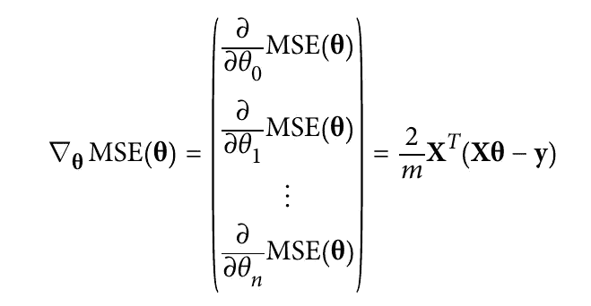

# 关于梯度下降，你需要知道的是

> 原文：<https://medium.com/analytics-vidhya/all-you-need-to-know-about-gradient-descent-f0178c19131d?source=collection_archive---------3----------------------->

[](https://www.buymeacoffee.com/mustisid13) [## Mustafa Sidhpuri 正在使用 Flutter 撰写博客和开发应用程序。

### 嘿，我叫穆斯塔法，是一名 Flutter 开发者，也是一名兼职博主。

www.buymeacoffee.com](https://www.buymeacoffee.com/mustisid13) 

# 介绍

你好，在这篇博客中，我将谈论梯度下降。是学习机器学习的人必须知道的基本课题之一。我会试着用一种非常简单的方式，和不同类型的梯度下降，用数学方程来解释。我们开始吧！

# 什么是梯度下降？

梯度下降是一种通用优化算法，能够找到各种问题的最优解。梯度下降的一般思想是迭代地更新权重参数以最小化成本函数。

假设你在浓雾中迷失在群山之中；你只能感觉到脚下地面的坡度。快速到达谷底的一个好策略是朝着坡度最陡的方向下山。这正是梯度下降所做的:它测量误差函数关于参数向量θ的局部梯度，并且它沿着梯度下降的方向前进。一旦梯度为零，你就达到了最小值！

通常，首先，我们随机初始化θ值，然后逐步最小化成本函数(例如 MSE 或 RMSE ),直到达到全局最小值。

学习率是梯度下降中最重要的参数。它决定了台阶的大小。如果学习率太小，那么算法就要经过多次迭代才能收敛，耗时较长。


学习率太低。

另一方面，如果学习率太高，你可能会跳过山谷，到达另一边，甚至可能比以前更高。这可能会使算法发散，值越来越大，无法找到好的解决方案。


学习率太高。


左边是学习率太低:算法最终会达到解，但需要很长时间。在中间，学习率看起来相当不错:在短短的几次迭代中，它已经收敛到解。右边，学习率太高:算法发散，跳得到处都是，实际上每一步都离解越来越远。

最后，并不是所有的成本函数看起来都像一个漂亮的普通碗。可能有洞、山脊、高原和各种不规则的地形，这使得很难找到一个全局最小值。


梯度下降的挑战。

上图显示了梯度下降的两个主要挑战:如果随机初始化在左侧启动算法，那么它将收敛到一个局部最小值，这不如全局最小值。如果它从右边开始，那么它将需要很长的时间来穿越平台，如果你停止得太早，你将永远不会达到全局最小值。

为了实现梯度下降，我们需要计算如果我们稍微改变θj，成本函数会改变多少。这叫做偏导数。以下等式仅适用于一行中的一个特征。我们必须对每个特征的每一行进行计算。


偏导数

# 梯度下降的类型

## 批量梯度下降

在简单梯度下降法中，我们单独计算每个实例的偏导数，并取平均值，如上式所示。批量梯度下降一次性计算这些偏导数，即我们仅计算梯度下降的一个值来更新θ，如下所示。



请注意，每个特征都有自己的θ值，并通过梯度下降进行更新。该公式包括在每个梯度下降步骤对整个训练
集合 X 的计算！这就是为什么该算法被称为批量梯度下降:它在每一步都使用整批训练数据。因此，它在非常大的训练集上非常慢。

计算梯度下降后，是时候使用下面的等式更新θ值了。


梯度下降步骤

现在，让我们使用 python 实现批量梯度下降:

```
import numpy as np
# generating random data
X = 2 * np.random.rand(100, 1)
y = 4 + 3 * X + np.random.randn(100, 1)eta = 0.1 # learning rate
n_iterations = 1000
m = 100 # size of dataset
theta = np.random.randn(2,1) # random initializationfor iteration in range(n_iterations):
    gradients = 2/m * X_b.T.dot(X_b.dot(theta) - y) # batch GD
    theta = theta - eta * gradients # step
print(theta)# array([[4.21509616],
#       [2.77011339]])
```

## 随机梯度下降

随机梯度下降(SGD)在每一步的训练集中选取一个随机实例，并仅基于该单个实例计算梯度。SGD 克服了批量 GD 问题，即它使用整个训练集来计算每一步的梯度，这使得当训练集很大时它非常慢。

与批量 GD 相比，SGD 算法的规则性要差得多，成本函数将上下跳动，仅平均下降，而不是缓慢下降到最小值。所以使用 SGD 我们每次都能得到好的值，而不是最优值。

为了获得最佳值并减少 SGD 中的上下跳动，我们可以逐渐降低学习速率。步长从大开始，然后变得越来越小，允许算法停留在全局最小值。决定每次迭代学习速率的函数被称为*学习时间表*。

请注意，如果我们过快地降低学习率，它可能会陷入局部最小值，甚至最终冻结在最小值的中途。如果学习率降低得太慢，它可能会在最小值附近跳很长时间，如果我们过早停止训练，最终会得到一个次优的解决方案。

让我们深入研究一下 SGD 的实现:

```
n_epochs = 50t0, t1 = 5, 50 # learning schedule hyperparametersdef learning_schedule(t):
    return t0 / (t + t1)theta = np.random.randn(2,1) # random initializationfor epoch in range(n_epochs):
    for i in range(m):# getting a random instance       
        random_index = np.random.randint(m)
        xi = X_b[random_index:random_index+1]
        yi = y[random_index:random_index+1]# calulating gradient on single instance        
        gradients = 2 * xi.T.dot(xi.dot(theta) - yi)# getting learning rate         
        eta = learning_schedule(epoch * m + i)# updating theta        
        theta = theta - eta * gradients
print(theta)
# array([[4.21076011],
#       [2.74856079]])
```

[](https://www.buymeacoffee.com/mustisid13) [## Mustafa Sidhpuri 正在使用 Flutter 撰写博客和开发应用程序。

### 嘿，我叫穆斯塔法，是一名 Flutter 开发者，也是一名兼职博主。

www.buymeacoffee.com](https://www.buymeacoffee.com/mustisid13) 

## 小批量梯度下降

我们要看的最后一个梯度下降算法叫做小批量梯度下降。小批量 GD 在称为小批量的小随机实例集上计算梯度。与随机 GD 相比，小批量 GD 的主要优势在于，您可以从矩阵运算的硬件优化中获得性能提升，尤其是在使用 GPU 时。小批量 GD 可能面临逃离局部极小值的困难。

下图显示了三种 GD 算法在训练期间在参数空间中采用的路径。都是在最小值附近结束的，但是批量 GD 的路径实际上是停在最小值，而随机 GD 和迷你批量 GD 都是继续走来走去。但是，不要忘记，批量 GD 需要花费大量时间来完成每一步，如果你使用良好的学习计划，随机 GD 和小批量 GD 也会达到最小值。


这就是梯度下降。如果我错过了任何重要的观点，请在下面分享你的观点和评论。谢谢:)

[](https://www.buymeacoffee.com/mustisid13) [## Mustafa Sidhpuri 正在使用 Flutter 撰写博客和开发应用程序。

### 嘿，我叫穆斯塔法，是一名 Flutter 开发者，也是一名兼职博主。

www.buymeacoffee.com](https://www.buymeacoffee.com/mustisid13)