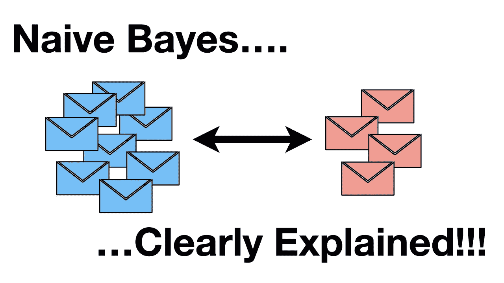
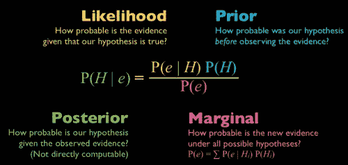
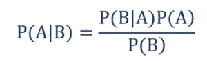
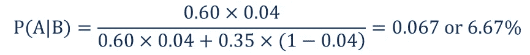
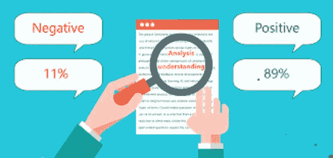
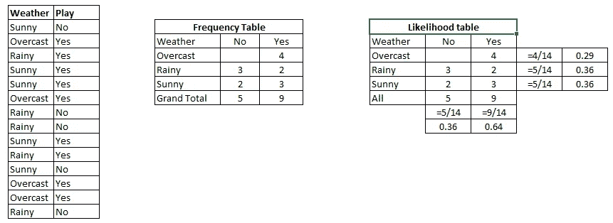
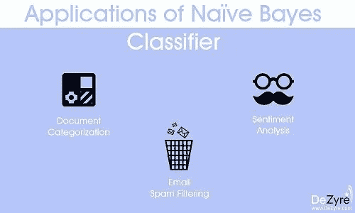

# 关于朴素贝叶斯，你只需要知道

> 原文：<https://medium.com/analytics-vidhya/all-you-need-to-know-about-naive-bayes-1b1681bf6cc9?source=collection_archive---------7----------------------->

在这篇博客中，我将写一些简单、有效且常用的机器学习分类器，也就是朴素贝叶斯。

在这里，我将解释什么是朴素贝叶斯，贝叶斯定理及其用途，朴素贝叶斯的数学工作，逐步实现，朴素贝叶斯的应用。此外，我会提供链接到我的 jupter 笔记本作为参考。

因此，没有任何进一步的到期让我们开始。



# **什么是朴素贝叶斯？**

它是一种基于贝叶斯定理的分类技术，假设预测因子之间是独立的。简而言之，朴素贝叶斯分类器假设一个类中特定特征的存在与任何其他特征的存在无关。

例如，如果一个水果是红色的，圆形的，直径约为 3 英寸，它就可以被认为是苹果。即使这些特征相互依赖或依赖于其他特征的存在，所有这些特性都独立地有助于这个水果是苹果的概率，这就是为什么它被称为“幼稚”。

朴素贝叶斯模型易于构建，对于非常大的数据集尤其有用。除了简单之外，朴素贝叶斯被认为比高度复杂的分类方法更好。



# 贝叶斯定理—

在统计学和概率论中，贝叶斯定理(也称为贝叶斯规则)是一个数学公式，用于确定事件的条件概率。本质上，贝叶斯定理描述了基于可能与事件相关的条件的先验知识的事件概率。

## 贝叶斯定理的公式

贝叶斯定理用下面的公式表示:



其中:

*   P(A|B) —事件 A 发生的概率，假设事件 B 已经发生
*   P(B|A) —事件 B 发生的概率，假设事件 A 已经发生
*   P(A) —事件 A 的概率
*   P(B) —事件 B 的概率

## 贝叶斯定理的例子

假设你是一家投资银行的财务分析师。根据你对[上市公司](https://corporatefinanceinstitute.com/resources/knowledge/finance/private-vs-public-company/)的研究，在过去三年中股价涨幅超过 5%的公司中，有 60%在此期间更换了他们的[首席执行官](https://corporatefinanceinstitute.com/resources/careers/jobs/what-is-a-ceo-chief-executive-officer/)。

与此同时，同期股价涨幅不超过 5%的公司中，只有 35%更换了 CEO。已知股票价格增长超过 5%的概率是 4%，求解雇首席执行官的公司股票增长超过 5%的概率。

在寻找概率之前，你必须首先定义概率的符号。

*   P(A) —股票价格上涨 5%的概率
*   P(B) —首席执行官被替换的概率
*   P(A|B) —假设首席执行官已经更换，股票价格上涨 5%的概率
*   P(B|A) —给定股票价格，更换 CEO 的概率增加了 5%。

使用贝叶斯定理，我们可以找到所需的概率:



因此，更换 CEO 的公司股票增长超过 5%的概率为 6.67%。

> 现在我们知道了朴素贝叶斯算法背后的数学，让我们看看算法是如何工作的。

# 朴素贝叶斯算法是如何工作的？



我们用一个例子来理解一下。下面我有一个天气的训练数据集和相应的目标变量“玩”(建议玩的可能性)。现在，我们需要根据天气情况对球员是否上场进行分类。让我们按照以下步骤来执行它。

步骤 1:将数据集转换成频率表

第二步:通过寻找概率来创建可能性表，比如阴概率= 0.29 和玩的概率是 0.64。



第三步:现在，使用朴素贝叶斯方程计算每一类的后验概率。具有最高后验概率的类是预测的结果。

**问题:**如果天气晴朗，玩家会玩。这种说法正确吗？

我们可以使用上面讨论的后验概率方法来解决它。

P(是|晴)= P(晴|是)* P(是)/ P(晴)

这里我们有 P (Sunny |Yes) = 3/9 = 0.33，P(Sunny) = 5/14 = 0.36，P( Yes)= 9/14 = 0.64

现在 P(是|晴)= 0.33 * 0.64 / 0.36 = 0.60，概率较大。

朴素贝叶斯使用类似的方法来预测基于各种属性的不同类别的概率。该算法主要用于文本分类和多类问题。

# 朴素贝叶斯的逐步实现

现在，让我们继续我们的朴素贝叶斯博客，并逐一了解所有步骤。我把整个过程分成了以下几个步骤:

*   **处理数据**
*   **汇总数据**
*   **做出预测**
*   **评估准确度**

## 步骤 1:处理数据

我们需要做的第一件事是加载我们的数据文件。数据是 CSV 格式，没有标题行或任何引号。我们可以使用 open 函数打开文件，并使用 CSV 模块中的 reader 函数读取数据行。

```
import csv
import math
import randomdef loadCsv(filename):
  lines = csv.reader(open(r'pima-indians-diabetes.data.csv'))
  dataset = list(lines)
  for i in range(len(dataset)):
    dataset[i] = [float(x) for x in dataset[i]]
  return dataset
```

现在我们需要将数据分成训练和测试数据集。

```
def splitDataset(dataset, splitRatio):
  trainSize = int(len(dataset) * splitRatio)
  trainSet = []
  copy = list(dataset)
  while len(trainSet) < trainSize:
    index = random.randrange(len(copy))
    trainSet.append(copy.pop(index))
  return [trainSet, copy]
```

## 第二步:总结数据

收集的训练数据摘要包括每个属性的平均值和标准偏差(按类值)。在进行预测以计算属于每个类值的特定属性值的概率时，这些是必需的。

我们可以将汇总数据的准备工作分解为以下子任务:

```
**# Separate Data By Class**def separateByClass(dataset):
  separated = {}
  for i in range(len(dataset)):
    vector = dataset[i]
    if (vector[-1] not in separated):
      separated[vector[-1]] = []
      separated[vector[-1]].append(vector) return separated**# Calculate Mean**def mean(numbers):
  return sum(numbers)/float(len(numbers))**# Calculate Standard Deviation**def stdev(numbers):
  avg = mean(numbers)
  variance = sum([pow(x-avg,2) for x in numbers])/float(len(numbers)-1) return math.sqrt(variance)**# Summarize Dataset**def summarize(dataset):
  summaries = [(mean(attribute), stdev(attribute)) for attribute in zip(*dataset)]
  del summaries[-1]
  return summaries**# Summarize Attributes By Class**def summarizeByClass(dataset):
  separated = separateByClass(dataset)
  summaries = {} 
  for classValue, instances in separated.items():
      summaries[classValue] = summarize(instances) return summaries
```

## 第三步:做预测

我们现在准备使用从我们的训练数据准备的摘要来进行预测。进行预测包括计算给定数据实例属于每个类的概率，然后选择概率最大的类作为预测。我们需要执行以下任务:

```
**# Calculate Gaussian Probability Density Function**def calculateProbability(x, mean, stdev):
  exponent = math.exp(-(math.pow(x-mean,2)/(2*math.pow(stdev,2))))
  return (1/(math.sqrt(2*math.pi)*stdev))*exponent**# Calculate Class Probabilities**def calculateClassProbabilities(summaries, inputVector):
  probabilities = {}
  for classValue, classSummaries in summaries.items():
     probabilities[classValue] = 1
     for i in range(len(classSummaries)):
         mean, stdev = classSummaries[i]
         x = inputVector[i]
         probabilities[classValue] *= calculateProbability(x, mean, stdev)
     return probabilities**# Make a Prediction**def predict(summaries, inputVector): 
  probabilities = calculateClassProbabilities(summaries, inputVector) 
  bestLabel, bestProb = None, -1
  for classValue, probability in probabilities.items():
     if bestLabel is None or probability > bestProb:
        bestProb = probability
        bestLabel = classValue
  return bestLabel**# Make Predictions**def getPredictions(summaries, testSet):
  predictions = []
  for i in range(len(testSet)):
     result = predict(summaries, testSet[i])
     predictions.append(result)
  return predictions**# Get Accuracy**def getAccuracy(testSet, predictions):
  correct = 0
  for x in range(len(testSet)):
     if testSet[x][-1] == predictions[x]:
        correct += 1
  return (correct/float(len(testSet)))*100.0
```

最后，我们定义我们的主函数，在这里我们调用我们定义的所有这些方法，一个接一个地得到我们创建的模型的精度。

```
def main():
  filename = 'pima-indians-diabetes.data.csv'
  splitRatio = 0.67
  dataset = loadCsv(filename) 
  trainingSet, testSet = splitDataset(dataset, splitRatio)
  print('Split {0} rows into train = {1} and test = {2} rows'.format(len(dataset),len(trainingSet),len(testSet))) #prepare model
  summaries = summarizeByClass(trainingSet) #test model
  predictions = getPredictions(summaries, testSet) accuracy = getAccuracy(testSet, predictions)
  print('Accuracy: {0}%'.format(accuracy))main()
```

**输出可能看起来像这样**

> 将 768 行拆分成 514 行 train = 514 行，254 行 test = 254 行，准确率:68.166727248241

输出在 68%左右，这在不使用 scikit 学习库的情况下是相当不错的

> 这是我的 Jupyter 笔记本的链接，在那里我实现了相同的代码。你也可以参考一下。你也可以在同一个目录中找到数据集。

[](https://github.com/Shag10/Machine-Learning/tree/master/Internity_Internship/Day-13) [## shag 10/机器学习

### 此时您不能执行该操作。您已使用另一个标签页或窗口登录。您已在另一个选项卡中注销，或者…

github.com](https://github.com/Shag10/Machine-Learning/tree/master/Internity_Internship/Day-13) 

# 朴素贝叶斯算法的应用



*   **实时预测:**朴素贝叶斯是一个渴望学习的分类器，它肯定很快。因此，它可以用于实时预测。
*   **多类预测:**该算法也以多类预测特性而闻名。这里我们可以预测多类目标变量的概率。
*   **文本分类/垃圾邮件过滤/情感分析:**与其他算法相比，最常用于文本分类的朴素贝叶斯分类器(由于在多类问题中的更好结果和独立性规则)具有更高的成功率。因此，它被广泛用于垃圾邮件过滤(识别垃圾邮件)和情感分析(在社交媒体分析中，识别积极和消极的客户情感)
*   **推荐系统:**朴素贝叶斯分类器和[协同过滤](https://en.wikipedia.org/wiki/Collaborative_filtering)一起构建了一个推荐系统，该系统使用机器学习和数据挖掘技术来过滤看不见的信息，并预测用户是否喜欢给定的资源。

# 朴素贝叶斯的利弊？

***优点:***

*   预测测试数据集的类别是容易和快速的。它在多类预测中也表现良好
*   当独立性假设成立时，与其他模型(如逻辑回归)相比，朴素贝叶斯分类器的性能更好，并且需要的训练数据更少。
*   与数字变量相比，它在分类输入变量情况下表现良好。对于数值变量，假设正态分布(钟形曲线，这是一个强假设)。

***缺点:***

*   如果分类变量具有在训练数据集中未观察到的类别(在测试数据集中)，则模型将分配 0(零)概率，并且将无法进行预测。这就是通常所说的“零频率”。为了解决这个问题，我们可以使用平滑技术。最简单的平滑技术之一叫做拉普拉斯估计。
*   另一方面，朴素贝叶斯也被认为是一个糟糕的估计量，所以 predict _ probab 的概率输出不要太认真。
*   朴素贝叶斯的另一个限制是独立预测者的假设。在现实生活中，我们几乎不可能得到一组完全独立的预测值。

**所以这都是从我这边来的，我试图提供关于朴素贝叶斯算法及其实现的所有重要信息。** **希望你能在这里找到有用的东西。谢谢你一直读到最后。**

# 参考文献—

[](https://www.analyticsvidhya.com/blog/2017/09/naive-bayes-explained/) [## 用 Python 和 R 语言学习朴素贝叶斯算法的 6 个简单步骤

### 注意:本文最初发布于 2015 年 9 月 13 日，更新于 2017 年 9 月 11 日概述了解其中一个…

www.analyticsvidhya.com](https://www.analyticsvidhya.com/blog/2017/09/naive-bayes-explained/) [](https://corporatefinanceinstitute.com/resources/knowledge/other/bayes-theorem/) [## 贝叶斯定理-定义、公式和例子

### 在统计和概率论中，贝叶斯定理(也称为贝叶斯规则)是一个数学公式，用于…

corporatefinanceinstitute.com](https://corporatefinanceinstitute.com/resources/knowledge/other/bayes-theorem/) [](https://www.edureka.co/blog/naive-bayes-tutorial/) [## 朴素贝叶斯教程| Python 中的朴素贝叶斯分类器| Edureka

### 在一个充满机器学习和人工智能的世界，围绕着我们周围的几乎一切…

www.edureka.co](https://www.edureka.co/blog/naive-bayes-tutorial/)