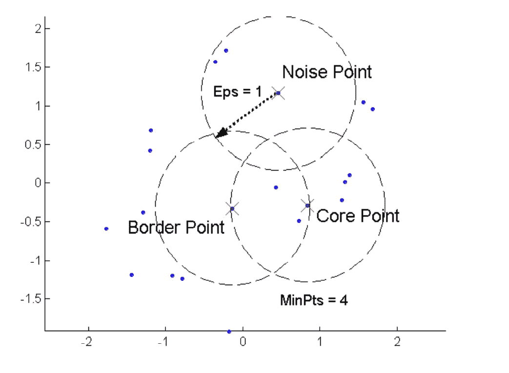
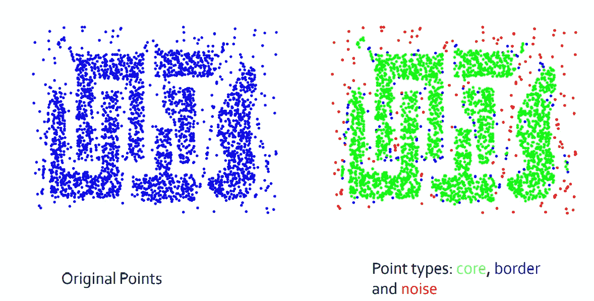

# 关于 DBSCAN 算法你需要知道的

> 原文：<https://medium.com/analytics-vidhya/all-you-need-to-know-about-the-dbscan-algorithm-f1a35ed8e712?source=collection_archive---------4----------------------->

# **简介**

DBSCAN 是一种无监督学习。正如我们已经知道的 K-Means 聚类，层次聚类和他们工作在不同的原则，如 K-Means 是一个质心为基础的算法，然后层次是基于凝聚，像 DBSCAN 是一个**密度为基础的聚类**算法，这是一个非常流行和强大的算法。从大量数据中，DBSCAN 可以发现包含异常值和噪声的不同形状和大小的集群。这种特殊的算法可以很容易地在很大程度上检测出数据中的噪声。DBSCAN 的全称是**带噪声应用的基于密度的空间聚类**。

基于密度的聚类的核心思想是，给定一个点的数据集，D = {xi}你需要将这些点划分成“**密集区域**”，你称之为聚类和“**稀疏区域**”，它们可能包含噪声。通常情况下，密集区域会变成集群，并被稀疏区域分隔开，所以你可能会想，密集和稀疏分别意味着什么，如何用数学方法量化密集和稀疏。稀疏直观上就是点很少，密集就是点很多。现在第一个问题是如何测量密度？

实际上，在 DBSCAN 算法中存在两个参数，利用它们我们可以完成这项任务，即 MinPoints ( **MinPts** )和 Epsilon ( **Eps** )，通常这两个参数称为超参数。

现在在这里试着理解这些概念:

1.现在首先让我们了解如何测量 P 处的密度:它被定义为 P 周围半径为 Eps 的超球面内的点数。

2.稠密区:半径为 Eps 的超球/圆，至少包含 MinPts 个点。

稀疏区域:如果一个超球体中的点的数量小于一个 Minpts 点，那么它被称为稀疏区域。

因此，给定 Minpts 和 Eps，我们数据集中的每个点我都可以将我数据集中的每个点归类为**核心点**或**边界点**或**噪声点**。那么，现在让我们来谈谈这些术语

1.核心点(P):如果 P 在其周围的 Eps 半径内大于 MinPts，则称 P 为核心点。这些点总是属于密集区域，并且位于星团的内部。

2.边界点(P):点 P 被称为边界点，如果

“P”不是核心点，这意味着“P”在其周围的 Eps 半径中具有小于 Minpts 的点。

P 属于邻域“Q”其中“Q”是核心点，邻域意味着 P 和 Q 之间的距离小于 Eps。

3.噪声点:既不是核心点也不是边界点的点称为噪声点。

为了清楚地理解这个概念，我们需要理解下面给出的图像:

现在，在这个图像中，我的最小分点数是 4，每股收益是 1，所以当我们在它周围画一个圆时，我们在大于最小分点数的圆内有 5 个点，所以这个点是核心点。现在，在左侧，当我们围绕它画一个圆时，我们只有 3 个点，这 3 个点少于最小点的数量，所以这个点不是核心点，这两个点之间的距离小于 Eps。因此，该点成为边界点。现在，如果你观察噪声点，那么圆圈内的点小于最小点，并且离核心点的距离也大于最小点，这就是为什么它变成了噪声点。

现在，如果观察这个例子，您会发现所有核心点都在密集区域内，边界点实际上与核心点接壤，而噪声点在密集区域之外。这是核心点、边界点和噪声点的基本概念。

在开始研究 DBSCAN 算法之前，我们还需要了解两个术语和概念。第一个是密度边，第二个是密度连接点。

1.密度边(Density Edge):边只不过是连接。这个术语来自图论，每当我们把事物表示为一个图时，我们把它们中的每一个称为顶点，如果你是两个顶点，你就用一条边把它们连接起来。因此，如果 p 和 q 是两个核心点，并且 p 和 q 之间的距离小于 Eps，那么我们将 p 和 q 作为一个顶点，并用一条边将它们连接起来，这条边称为密度边。

2.**密度连通点**:两点 p 和 q 称为密度连通点(p 和 q 是核心点)，如果有一条从 p 到 q 的边的路径，并且中间所有的点也是核心点。

因此，到目前为止，我们试图理解总共 7 个概念/术语。现在，通过结合所有这些想法，我们将理解 DBSCAN 算法实际上是如何工作的。

## **DBS can 算法涉及的步骤:**

1.对于数据集中的每个点，将每个点标记为核心点或边界点或噪声点。

2.现在，从数据中移除所有噪声点，因为噪声点属于稀疏区域，这意味着它们不属于任何聚类。

3.对于没有被分配给集群的每个核心点“p”。

用“p”创建一个新的集群。

将密度连接到“p”的所有点添加到这个新簇中。

4.获取每个边界点，并将其分配给最近的核心点的聚类。

## **确定 MinPts 和 Eps**

现在，让我们讨论如何确定我们的超参数 MinPts 和 Eps 的正确值。

1.MinPts:它帮助我们去除异常值，所以经验法则是 MinPts 总是大于数据集的维数。

通常 MinPts = 2 *数据维数。

如果数据集有点嘈杂，则需要选择较大的 MinPts 值。

2.Eps:假设 MinPts 的值是 4，那么，对于每个点“xi ”,计算从“xi”到 xi 的第四近邻的距离。

现在我将画出每个点到它的第四个最近邻的排序距离，按升序排列。

找出曲线拐点处的距离“d”。

## **时间和空间复杂度**

1.DBSCAN 算法的时间复杂度为 O (nlogn)。

2.DBSCAN 算法的空间复杂度为 O (n)。

# **DBS can 算法的优势和局限**

## **DBS can 算法的强度**

1.当数据集中有大量噪声时，DBSCAN 工作得非常好。

2.它可以处理不同形状和大小的集群。

3.我们不需要像任何其他聚类算法一样指定聚类的数量。

4.我们只需要两个参数 MinPts 和 Eps，它们可以由领域专家来设置。

## **DBS can 算法的局限性**

1.如果我们有一个不同密度的数据集，该算法不能给出准确的结果。

2.它对超参数非常敏感。

3.如果你有高维数据，并且使用欧几里德距离这样的度量标准，你很容易陷入维数灾难的问题。

4.如果领域专家不能很好地理解数据，那么就很难找到 MinPts 和 Eps 的最佳值。

# 描述道德考量:

1.  如果原始数据集中的密度有很大的变化，就不能得到准确的聚类。
2.  该算法对超参数非常敏感，通过 Eps 的小变化，我们可以观察到聚类形成中的大差异。

我们可以通过选取密度变化较少的数据集来避免这些问题。

# 参考资料:

1.  [https://www.aaai.org/Papers/KDD/1996/KDD96-037.pdf](https://www.aaai.org/Papers/KDD/1996/KDD96-037.pdf)
2.  [https://www.psychosocial.com/article/PR200632/10583/](https://www.psychosocial.com/article/PR200632/10583/)
3.  [https://link . springer . com/article/10.1007% 2fs 11227-020-03524-3](https://link.springer.com/article/10.1007%2Fs11227-020-03524-3)
4.  [https://blog . domino datalab . com/topology-and-density-based-clustering/](https://blog.dominodatalab.com/topology-and-density-based-clustering/)

**PS:** 如果你认为他们可以改进这个博客，请随时提供意见/批评，我一定会努力做出必要的修改。

感谢阅读:)