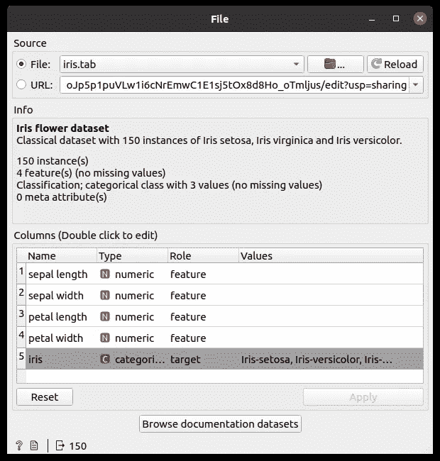
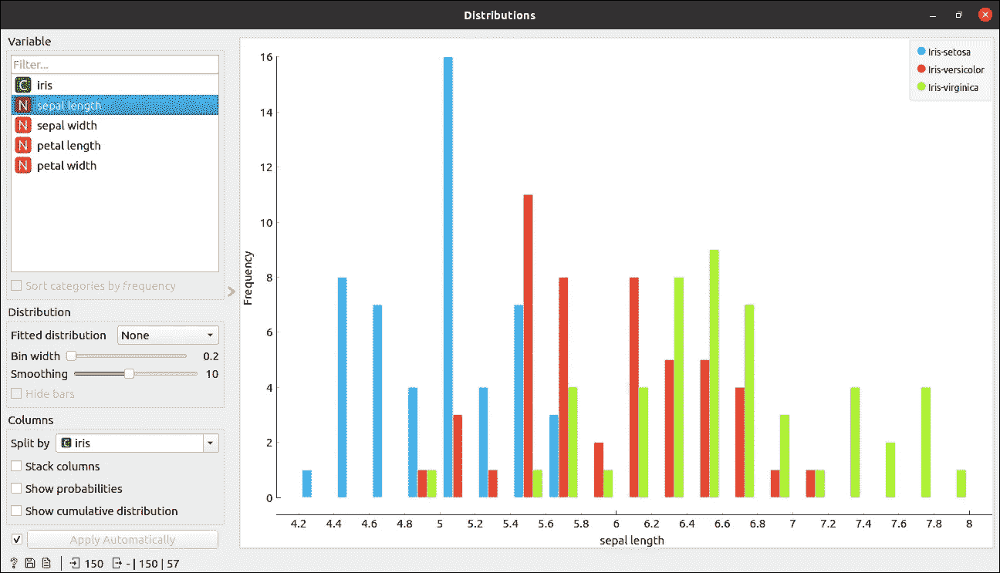

# 开始使用橙色工具时，您需要了解的全部信息

> 原文：<https://medium.com/analytics-vidhya/all-you-need-to-know-for-getting-started-with-orange-tool-32312faa6e52?source=collection_archive---------0----------------------->


[来源](https://orangedatamining.com/)

Orange 是一款用 Python 语言编写的开源、基于组件的软件，最适合机器学习和数据挖掘——即可视化。这些组件被称为小部件，其范围从可视化到预处理、评估和预测建模。

您不需要知道编程开始与橙色和做机器学习与橙色工具所有您需要的是了解一些基本的机器学习，你可以做的艺术状态机器学习与橙色工具。

在本文的最后，您将了解到 orange 工具有多有用，以及使用 orange 进行机器学习的速度有多快。

现在不要浪费时间了，让我们开始吧。

# 装置

Orange 是一款开源软件，适用于所有平台，如 Windows、linux 和 MacOs。

您可以通过 [**官网**](https://orangedatamining.com/download/) 根据自己的设备下载。

您可以通过 conda 或 pip 下载。

对于 conda 安装

```
conda config --add channels conda-forge
conda install orange3
conda install -c defaults pyqt=5 qt
```

对于 pip 安装

```
pip install orange3
```

现在，您可以通过两种方式启动橙色工具 GUI

1.  只需在控制台中写入命令

```
orange-canvas
```

2.使用 Python 命令

```
python3 -m Orange.canvas
```

现在，我们准备从橙色开始。

# 概观

当您第一次开始橙色时，会看到一个空白画布。


橙色空白画布

白色区域是我们执行所有任务的操场。

# 橙色小部件

我们用橙色做的每件事都是通过它的小部件。

从加载数据到最终保存和预测数据，一切都有一个小部件。我们也将在本文中看到其中一些。

如何在画布中添加小部件？

有两种方法可以在画布中添加小部件。

1.  从最左边的小部件选项


小工具

您只需双击任何小部件，小部件就会出现在画布上。

2.您只需右键单击画布，就会显示小部件。

每个小部件都有一个漂亮的文档，你可以在这里看到[](https://orangedatamining.com/widget-catalog/)**。**

# **加载数据集**

**您可以加载逗号分隔的文件()。csv)文件或 excell 电子表格或谷歌表格。使用文件小部件加载文件。**

****

**文件小部件**

**您可以浏览文件位置并以橙色加载文件。要加载 csv 文件，请使用 CSV 文件导入。**

**现在，让我们导入预构建的虹膜数据集。**

****

**正在加载虹膜数据集**

# **工作流程**

**一旦现在加载了数据，您就可以将这个小部件连接到数据表小部件，以表格形式查看数据。**

**有两种连接小部件的方法。**

1.  **您可以首先添加小部件，然后链接它们。**
2.  **您可以扩展小部件的链接，然后搜索选项将可用，您可以将所有适用的小部件应用于当前小部件。**

**我更喜欢第二种选择。**

****

**小部件之间的连接**

**现在双击数据表部件，您将能够看到表格形式的数据。**

****

**数据表**

**现在我们可以使用分布小部件来查看数据分布。只需将分发小工具与文件小工具连接起来，您就会看到它的神奇之处。**

****

**添加分发小部件**

**添加分发插件后，双击分发插件，你会看到所有功能的分发。**

****

**分配**

**这里所有的特征分布都显示在图像中，萼片长度的分布显示在左上方，您可以选择该特征来查看其分布。**

**您也可以使用散点图绘制数据，以查看图中的分布。**

**只需连接散点图和文件小部件。**

****

**添加散点图**

**现在打开散点图部件，查看分布。**

****

**散点图**

**如果您想要查看该区域中的某些样本，只需使用鼠标选择该区域，并将数据表小部件连接到散点图小部件，您将会看到所有选定的样本。**

****

**选择一些点**

**连接数据表小部件。**

****

**用散点图连接数据表**

**现在打开数据表。**

****

**选定的点**

**现在，在该数据表中，散点图小部件发送选定的数据点，该数据点显示在数据表小部件中。**

**因此，在 orange 中，每一个小部件都与其连接的小部件实时通信，并相互发送数据。**

**你可以看到其他的图也是橙色的，比如箱线图，条形图等等。**

# **建筑模型**

**现在让我们用 orange 做一些机器学习，即制作分类器。**

**现在，我将树小部件连接到文件小部件，以使树分类器，并进一步连接树查看器小部件，以查看分类树。**

****

**添加树分类器**

**现在让我们来看看分类树。双击分类查看器，就会看到分类树。**

****

**分类树**

# **模型评估**

**现在，我们已经看到了 iris 数据集的分类树，我们希望评估我们的模型，为此，我们需要将文件小部件连接到测试和评分小部件，并将树小部件连接到测试和评分小部件，以查看各种矩阵。**

****

**添加树部件进行测试和评分**

**现在让我们看看比分。**

****

**得分**

**请注意，这里我选择了 10 倍的交叉验证，您可以用其他倍数进行试验，也可以在单独的测试集上进行验证。在这里，您可以看到各种矩阵，如 AUC 分数、分类准确度、F1 分数、精确度分数、召回分数等。**

**现在，我们还可以通过简单地添加其他分类器来比较其他模型。让我通过添加简单的逻辑回归来展示给你看。**

****

**现在让我们来比较一下这两种模型。**

****

**从结果来看，逻辑回归比树分类器表现得更好。**

# **做预测**

**作为一名数据科学家，我们必须知道如何预测数据。那么，让我们看看如何预测数据。**

**让我们为此做一些测试数据。**

**让我们制作一个包含 5 个实例的简单测试集。**

****

**测试装置**

**现在让我们通过文件小部件加载这个文件。**

**现在让我们将预测小部件连接到逻辑回归，并进一步将该小部件连接到文件小部件。**

****

**预言；预测；预告**

**现在打开预测小部件。**

****

**逻辑回归预测**

**你也可以看到预测的概率，在这种情况下，这确实更高。**

**所以预测是正确的。**

**您还可以将多个模型连接到它。**

# **保存预测**

**您也可以使用**保存数据**小部件下载预测文件，只需将**预测**小部件添加到**保存数据**小部件，并选择您想要保存数据的任何格式的文件，例如。csv 文件、excel 等。**

****

**预言**

**预测文件还显示了每个预测的概率。**

**这是任何关于 orange 的机器学习项目的整个周期。**

**这只是一个简单的介绍，我们可以用橙色做很多事情。**

**可以查看他们的官方 [**youtube 教程**](https://www.youtube.com/playlist?list=PLmNPvQr9Tf-ZSDLwOzxpvY-HrE0yv-8Fy) 进行探索，了解更多关于 orange 的信息。**

**我希望这篇文章能帮助你开始使用 orange tool for data science，它为你的数据科学工具包增加了一项技能。**

**感谢阅读这篇文章，继续学习。😃**