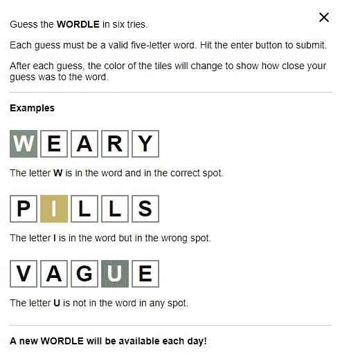

# ⚡️阿尔法世界

> 原文：<https://medium.com/analytics-vidhya/alphawordle-4b8eedad3073?source=collection_archive---------2----------------------->

## 剥夺了沃尔多的乐趣😈

## 利用信息论赢得世界——每天！😎

在这篇博客中，我将讨论如何使用决策树来构建一个为你赢得 WORDLE 的机器人。想试试吗？这里有一个[互动演示](https://colab.research.google.com/drive/1KVvmJxVEhEfVCZU26Cl1nShKk-8yDSGm?usp=sharing)


资料来源:Unsplash | Sergei A

# 等等。什么？😳

当本月早些时候[纽约时报以超过 100 万美元收购 WORDLE 的消息传出后](https://en.as.com/en/2022/02/07/latest_news/1644194032_400672.html#:~:text=Last%20month%20is%20was%20confirmed,of%20millions%20of%20daily%20players.)，这个星球上的每个游戏开发者都质疑他们的人生选择。然而，其他人似乎都在试图找出玩这个游戏的最佳起始词。😏

我发现我的大多数朋友分成两类，一类是早上醒来第一件事就解决一天的工作，另一类是午夜过后三分钟才解决一天的工作。如果你还没听说过这个游戏，我强烈推荐你从你一直生活的岩石下爬出来！😬

说明非常简单，网页也很好地解释了这个游戏。我不打算在这里链接它(只是谷歌一下😜)



图 1:单词指令

# 方法——世界制胜战略📋

这是 TL。灾难恢复版本:

```
Create a **candidate_list** of all possible five-letter english words
Create an empty **rule_list** of rules that stores the feedback you get**Repeat until you guess** the WORDLE:
 **Pick a word** from the candidate_list with max information gain (TBD)
 **Obtain the feedback** from the game and **update the rule_list** 
 **Update the candidate_list** to remove words that defy the rule_list
```

## 候选人 _ 列表

斯坦福大学的人们整理了这个由五个字母组成的单词列表。我们将其作为候选人名单的起点。这个列表有 5757 个有效的五个字母的单词，我还没有遇到一个不在这个列表中的单词。如果在别处有更好的数据库，请务必告诉我！

## 规则 _ 列表

我们将把`rule_list`一分为二:`tautology` 和`contradictions`。第一个列表将存储 WORDLE 必须满足的所有规则(想想绿色的方框)，第二个列表用于存储 WORDLE 绝对不满足的规则(想想黑色的方框，我称它们为红色，因为稍后您将看到 WORDLE 中的黑色方框并不完全是`contradictions`)。

> 规则是一个二元组形式(alphabet，position ),其中 alphabet 是 A-Z 中的一个字符，position 是一个从 0 到 4(包括 0 和 4)的数字，表示字符在单词中的位置。

**举例:**假设 ***规则是 A2*** 。如果它出现在`tautology`列表中，那么任何不在*的第三个(记住:我们从零开始计数)位置有“A”的单词都被踢出`candidate_list`。然而，如果同样的规则出现在`contradictions`列表中，那么任何一个*在其第三个位置有一个“A”的单词都会被踢出`candidate_list`。**

**我们观察到，在缩小候选搜索空间方面，`tautology`规则比`contradiction`规则更有效。显然，找到一个`tautology`规则更难。**

## **猜一猜**

**规则(如上所述)不是无限的。对于长度为 5 的英语单词，只有 130 种不同的可能规则(5 乘以 26)。每条规则将 candidate_list 分为两组:满足该规则的候选列表和不满足该规则的候选列表。**

**所以我们的猜测策略很简单(贪心):**

```
****unverified_rules** is a list of rules who have neither been proven true nor falseMake a **local_copy** of the **unverified_rules**Repeat 5 times:
 From **local_copy**, **pick the rule with max** [**Information Gain**](https://en.wikipedia.org/wiki/Information_gain_in_decision_trees)From **local_copy,** remove rules that can't be tested with picked rule
 # We can't test A2 and B2 in the same guess!
 # Because the third position can be filled with A XOR BBuild a word from the five picked rules and that's our guess! (TBD)**
```

**这保证了我们总是能够从五个挑选的规则中构建一个单词，因为我们依次挑选了每个规则的最大 IG。**

**由于这个原因，一个被所有候选人违反(或被所有候选人满足)的规则将永远不会被挑选出来，我们可以确定在候选列表中至少有一个单词满足我们挑选来建立猜测的五个规则的任意组合。**

## **反馈**

**用户应该以 RGY 字符串的形式给出反馈。**

> *****R*** *:* 用于表示对应的字符在 WORDLE 中没有出现。
> ***G:*** 用于表示对应的字符出现在 WORDLE 中的正确位置。
> ***Y:*** 用于表示对应的字符存在于 WORDLE 中，但不在正确的位置。**

**让我们看一个处理反馈以更新`rules_list`的例子**

**如果猜测是“PLACE ”,输入的反馈是“RGYRG ”,我们将:**

*   **将 P0、P1、P2、P3 和 P4 添加到`contradictions`列表中，表明“P”在单词中没有出现。**
*   **将 L1 添加到`tautology`列表中，表明所有候选人的第二个位置必须是“A”。**
*   **在`contradictions` 列表中添加 A2，表示“A”不得出现在任何候选项的第三个位置。**
*   **将 C0、C1、C2、C3 和 C4 添加到列表中，表明“C”在世界上没有出现过。**
*   **将 E4 添加到`tautology`列表中，表明所有候选人的第二个位置必须有“E”。**

***…这一直持续下去，直到我们得到一个 GGGGG，表明这个单词已经被猜到了！*🌑 🌒 🌓 🌔 🌝**

# **密码🚀**

**TL；博士:转到这个[演示笔记本](https://colab.research.google.com/drive/1KVvmJxVEhEfVCZU26Cl1nShKk-8yDSGm?usp=sharing)。**

**🚨**在 alpha-wordle 中提供 RGY 反馈的方式略有不同**🚨**

> **只有当你想表达相应的字母表不会出现在单词中的任何地方时，才给出 R 反馈。如果一个字母在单词中只出现一次，不要在第二次出现时使用 R。用 Y 表示错误的位置。**

****例如:**如果单词是“STEAL”并且引擎猜测是“AAAAA”(是的，这是一个正确的英语单词。这意味着我很生气，因为你打断了我的例子💁)你应该提供的反馈是:YYYGY 而不是 RRRGR**

## **使用👶🏻**

**没有依赖性，您应该能够在 Python 3.6 以上的任何平台上安装它。**

**要安装 PyPI 包，请使用。**

```
**> pip3 install alpha-wordle**
```

**如果您想为 Python3 的较低版本(不支持)安装它，请使用:**

```
**> git clone [https://github.com/ivbhatt/alpha-wordle](https://github.com/ivbhatt/alpha-wordle)
# Go into setup.py and change the Python version requirements.
> python3 setup.py sdist bdist_wheel # build the package
> pip3 install -e .  #install the trial package to curr_dir**
```

**要启动发动机:**

```
**import alphawordle as a
a.start()
---
You should be prompted for an RGY feedback. Here is the prompt after a sample run.
---
Guess is: BALES
Enter RGY feedback: RGRRR 
Guess is: CANDY 
Enter RGY feedback: YGRRR 
Guess is: MAFIA 
Enter RGY feedback: RGRGY 
Guess is: TACIT 
Enter RGY feedback: GGGGG 
Done!**
```

## **贡献的💙**

*   **开源代码库👷https://github.com/ivbhatt/alpha-wordle**
*   **麻省理工学院许可证:以你喜欢的任何方式使用代码💃**
*   **📢代码重构、文档、错误修复、特性添加——一切都受欢迎:)**
*   **你知道该怎么做:叉，提交&提出公关(或者只是⭐️ ️and 继续前进！)**

# **再见！**

**下次见。**

****

**来源:Unsplash | Thomas Lipke**