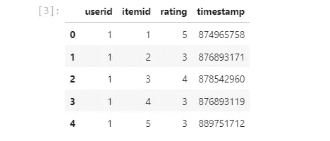
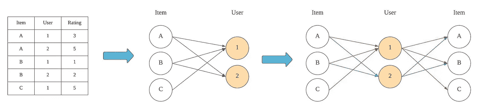
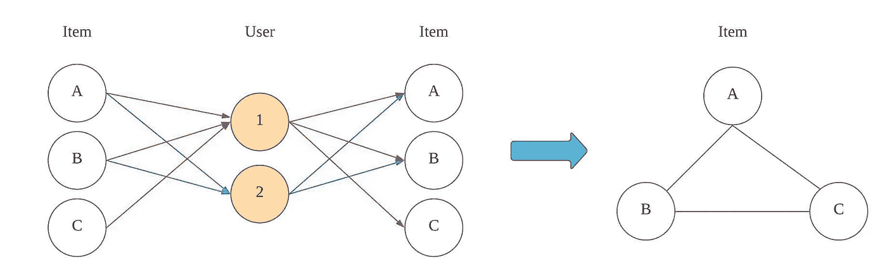
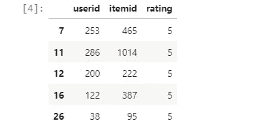

# 基于图论的同视推荐系统

> 原文：<https://medium.com/analytics-vidhya/also-view-recommendation-system-with-graph-theory-e2f098455519?source=collection_archive---------12----------------------->

用图论建立推荐系统的一种有趣方法


Benjamin Lizardo 在 [Unsplash](https://unsplash.com?utm_source=medium&utm_medium=referral) 上的照片

在实践中，大多数时候很难收集用户对特定项目的兴趣分数，有时我们可能没有额外的信息来构建推荐系统，如产品规格或用户的人口统计信息。例如，当我们需要为网页建立推荐模型时，我们只有用户的 cookie id 和他们访问的页面。我们可以使用聚类方法来建立一个基本的项目-项目推荐系统。

为了构建一个也是视图的推荐系统，**项目到项目推荐系统**，我们可以使用聚类来实现该系统。有各种方法来构建基于聚类的推荐系统。在本例中，我们将使用网络分析基于 movielen 数据集对项目-项目图进行分区。

## 资料组

在本例中，我们将使用 movielens 数据集(ml-100k)。

链接:[https://grouplens.org/datasets/movielens/](https://grouplens.org/datasets/movielens/)

## **GitHub**

Github 链接:[https://github . com/Chiang 9/re commendation _ system _ py spark/blob/main/network _ analysis/network _ analysis . ipynb](https://github.com/chiang9/Recommendation_system_pyspark/blob/main/network_analysis/network_analysis.ipynb)

# 构建图表

在开始网络分析之前，我们首先需要从 movielen 数据集定义网络。



图一。movielen 样本数据

为了建立物料到物料的网络，我们使用以下方法。

1.  如果用户对项目评分，则在项目-用户之间建立优势
2.  复制项目节点并连接到相应的用户
3.  如果用户对两个项目都进行评分，则在两个项目之间建立边缘
4.  (可选)使用等级值计算边的权重
5.  丢弃用户节点



图二。构建图表

从上面的例子中，用户 1 评价项目{A，B，C}，我们在{(AB)，(BC)，(AC)}之间建立边。用户 2 评价项目{A，B}，我们在{(AB)}之间建立边。



图 3。构建图表

在我们的示例中，我们将边的权重指定为对同一对项目进行评级的用户数量。

```
Weight = {
(A,B): 2,
(A,C): 1,
(B,C): 1
}
```

# 入门指南



为了构建项目-项目网络图，我们首先通过 **userid** 对数据进行分组，并为相应的用户生成项目列表。接下来，我们通过生成 itemid 列表的组合来构建边。在本练习中，我们将边权重设置为对同一对进行评级的用户数量。

```
174005
[(1, 6, 2), (1, 9, 20), (1, 12, 24), (1, 13, 5), (1, 14, 11)]
```

接下来，我们使用 **networkx 构建图表。**

```
Total number of graph nodes: 1172
Total number of graph edges: 174005
Average node degree: 296.94
Number of communities: 4
```

现在，我们可以在集群中看到所有电影的类别。

```
[['Animation', "Children's", 'Comedy'],
 ['Drama'],
 ['Drama', 'Thriller'],
 ['Action', 'Adventure', 'Romance', 'Sci-Fi', 'War'],
 ['Crime', 'Drama', 'Romance', 'Thriller'],
 ['Drama'],
 ['Action', 'Adventure', 'Sci-Fi'],
 ['Drama'],
 ['Action', 'Sci-Fi', 'Thriller'],
 ['Comedy', 'Sci-Fi'],
 ['Comedy', 'Romance'],
 ['Documentary'],
 ['Action', 'Adventure', 'Drama', 'Romance', 'Sci-Fi', 'War'],
 ['Action', 'Adventure', 'Comedy', 'Romance'],
 ['Action', 'Adventure'],
 ['Action', 'Sci-Fi', 'Thriller', 'War'],
 ['Action', 'Adventure', 'Romance', 'Sci-Fi', 'War'],
 ['Action', 'Sci-Fi', 'Thriller'],
 ['Drama'],
 ['Comedy', 'Romance'],
 ['Comedy', 'Sci-Fi'],
 ['Comedy', 'Romance'],
....
]
```

第一个集群主要包含**动作片、剧情片**和**冒险片**。

# 结论

使用图论的基于聚类的推荐可能不是构建推荐系统的完美解决方案，但它能够在降低数据集的复杂性方面提供一个良好的开端，并且可以作为一种特征工程技术嵌入到其他推荐系统应用中。

感谢您的阅读，祝您有美好的一天。