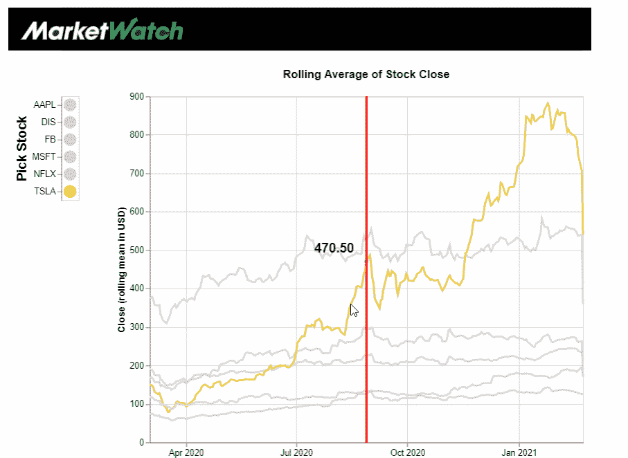

# 牛郎星交互式多线图

> 原文：<https://medium.com/analytics-vidhya/altair-interactive-multi-line-chart-59a29c9287d?source=collection_archive---------1----------------------->

## 将图例绑定到股票收盘价的多行显示。为选定的纸张添加工具提示行和文本。



我最近看到 BI elite 的 Parker Stevens 用一个非常巧妙的技巧在 Power BI 中创建了一个股票图表。这里 可以看 [**。我发现非常有趣的是，无论是在 Power Query 还是 Power View 中，Python 库中用于清理和可视化数据的许多概念都可以转移到 Power BI 上，反之亦然。**](https://www.youtube.com/watch?v=_GOIflxSlYI)

以上面在 Altair (Python 可视化库)中创建的图表为例。在 Altair 中，您可以分解图表的各种元素，在独立单元中基于底层数据构建它们，然后将它们分层并连接起来。你可以把它们放在一起或放在一起，就像放拼图玩具一样，直到它们合为一体。

在 Altair 中创建可视化效果最重要的一点是，你可以将图形的样式，无论是线形、散点形还是条形(称为标记),从数据的无可争议的编码中分离出来，这些编码可以是分类的(名义的或有序的),也可以是定量的或时间的等等。

在 Power BI 中，您将看到 Parker 将一个可视化图形叠加在另一个图形上，根据可定制的选择一次突出显示一个股票折线图。其余的股票退入背景，因为他们是灰色的。由沿 x 轴滚动的工具提示行提供“**按需细节”**。我们将使用 Pandas 和 Altair 从本文中的原始数据生成这个非常生动的图形。

在本文中，我们将对图表和文本、工具提示行和图像进行分层，并对它们进行定位，使它们紧密地结合在一起，形成如上图所示的图表。

**安装**

> 使用以下命令在 **Jupyter 笔记本**单元格中检索用于创建图表的 Python 包及其版本:
> 
> % reload _ ext watermark
> % watermark-v-m-p 熊猫，牛郎星，numpy，织女星 _ 数据集

```
CPython 3.7.7
IPython 7.19.0pandas 1.1.0
altair 4.1.0
numpy 1.19.1
vega_datasets 0.8.0
```

## **数据**

数据由[**market watch**](https://www.marketwatch.com/investing/stock/msft?mod=mw_quote_switch)**慷慨提供。**

```
* Change ticker for every stock you want historical data for
* In the menu, select Historic Quotes
* Change calendar to retrieve data for up to one year
* Update results
* Download the CSV
```

**清理和准备数据的代码:**

将下载的文件合并到一个名为 data(相对路径)的文件夹后，Pandas 用于读取 excel 文件。清理数据以设置正确的类型，并删除分析不需要的列。使用这里看到的代码添加了额外的必需列，如股票名称(使用正则表达式从文件名派生而来)和滚动平均值。

```
#Pick out the stock name from the filename
pattern = “.*_(.*)\.csv”
cpat = re.compile(pattern)
stock = re.findall(cpat,filename)
df = pd.read_csv(f”data\{filename}”)

#Add the stock name to the dataframe
df[‘stock’] = stock[0]
```

**注意**:您可以在这里 找到关于滚动窗口功能 [**使用的详细信息，**](https://towardsdatascience.com/dont-miss-out-on-rolling-window-functions-in-pandas-850b817131db)

我们正在创建一个新的列“rolling_mean ”,它采用一个窗口内收盘价的移动平均值。为此，我们申请。滚动(2)。mean()到 Close 列，在这里我们指定窗口“2”并计算数据帧中每个窗口的平均值。每一行得到的“滚动平均值”等于其“关闭*”值加上前一行的“关闭*”除以 2(窗口)。本质上就是移动 Avg = ([t] + [t-1]) / 2。

我们还将 min_periods=1 添加到该方法中，这将窗口中有效观察的最小所需数量从 2 减少到 1。这有助于我们避免第一行中的 NaN，否则窗口大小为 2 会导致 NaN。

**最终数据帧**


## 牛郎星优化用 [**JSON 缓存**](https://altair-viz.github.io/user_guide/data_transformers.html)

> alt . data _ transformers . enable(' JSON ')

在我们开始创建可视化之前，让我们先讨论一下包含这段代码所获得的性能。通过这段代码，我们使用的 Pandas 数据帧被净化、序列化并以 json 格式存储，如下所示。 [Altair](https://altair-viz.github.io/) 毕竟是一个 Python API，用于构建基于 Vega-lites 可视化语法的统计可视化。由于缓存，数据帧的转换加快了渲染过程。


## **生成图表**

代码中点缀着注释，解释对数据进行编码的各种元素，并创建标记来绘制数据。值得注意的元素是折线图和代表股票选择的圆形图之间的结合。selection_multi 函数的“fields”参数将这些联系在一起。

alt.condition Altair 函数是“If”条件，我们需要在选择股票时选择性地显示颜色和价格的工具提示文本。Altair 的 transform_filters 功能将数据框缩小到所选的股票和 x 轴上的“最近”日期。

输出是在文章顶部看到的图表，其中只有选中的股票用彩色绘制，工具提示显示其价格，而其余的用灰色发送到背景。

分层运算符“+”或 alt.layer，用“|”(管道运算符)或 alt 并排串联。HConcatChart 和垂直串联“&”或 alt。VConcatChart 都被用在一行代码中，将所有的元素放在一起！进一步学习的文档和例子在这里是 [**。**](https://altair-viz.github.io/user_guide/compound_charts.html)

## 用牛郎星还是熊猫进行数据操作？

## 选择权在你！

在上面的代码中，我们通过使用“，”领略了 Altair 对数据集的操作。transform_filter(radio_select)”。数据框缩小到包含由选择指示的股票的行。但是 Altair 还有其他几个强大的转换功能。

在下面的代码中，上面使用的选择元素被丢弃，取而代之的是悬停选择，它允许我们创建一个工具提示，显示工具提示所在的日期以及该日期所有股票的价格。这里我们看到了另一个 Altair 转换函数的强大之处——transform _ pivot，对于每只股票，它将收盘滚动平均值聚合到一个日期(工具提示沿 x 轴显示)。

这些转换函数的优势在于，您不必为要在图表中显示的每个聚合创建额外的数据框架。

```
def createTooltip():
    """
        This function creates a tooltip containing the date and all stock prices displayed upon hover

    """
    hover = alt.selection_single(
        fields=["Date"],
        nearest=True,
        on="mouseover",
        empty="none",
        clear="mouseout",
    ) tooltips = alt.Chart(stock_df).transform_pivot(
        "stock", "rolling_mean", groupby=["Date"]
    ).mark_rule(strokeWidth=2,  color="red").encode(
        x='Date:T',
        opacity=alt.condition(hover, alt.value(1), alt.value(0)),
        tooltip=["Date:T", "AAPL:Q", "MSFT:Q", "DIS:Q",
                 "FB:Q",  "MSFT:Q", "NFLX:Q", "TSLA:Q"]
    ).add_selection(hover) return tooltipstooltips =  createTooltip()
img_layer & (make_selector | alt.layer(highlight_stocks, tooltips ))
```


**最后..**

这篇文章通过 Altair 可视化数据的图形语法概述了我的发现之旅。元素通过分层、绑定和数据转换的相互作用用一个可视化来演示，这个可视化有简单的数据但有很多潜力。如果你有更多要补充的，请评论！