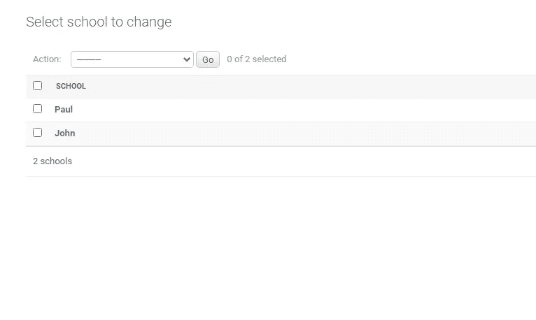

# 填充 Django 数据库的替代方法

> 原文：<https://medium.com/analytics-vidhya/alternative-methods-to-populating-your-django-database-f995732238ba?source=collection_archive---------8----------------------->

## 填充 Django 数据库的实用指南

由[托拜厄斯·费希尔](https://unsplash.com/@tofi?utm_source=medium&utm_medium=referral)在 [Unsplash](https://unsplash.com?utm_source=medium&utm_medium=referral) 上拍摄的照片

传统上，当使用 django 来填充我们的数据库时，我们通常必须登录到管理面板。但是你有没有想过用其他更方便更省时的方法来实现同样的功能，如果有，那么这篇博文就适合你。

这将是一个由三部分组成的系列，在这个系列中，我将教您如何使用，

1.  固定装置
2.  迁移
3.  第三方软件包

**做出假设**

如果你正在阅读这篇博客，我假设你已经知道 Django 的基础知识，比如；

1.  如何设置 Django 项目

基于以上假设，让我们开始我们系列教程的第一部分

**夹具**

fixture 是 Django 知道如何导入数据库的数据集合。如果已经有了一些数据，那么创建 fixture 最直接的方法就是使用

`**python manage.py dumpdata**`

Fixtures 可以写成 JSON、XML 或 YAML(安装了 [PyYAML](https://pyyaml.org/) )文档，但是对于本教程，我们将使用 JSON，因为它更常见，也更容易使用。

从您的设备加载数据

为了从您运行的装置中加载数据，

> **python manage . py loaddata<fixture name>**

# Django 在哪里找到夹具文件

默认情况下，Django 会在每个应用程序的`**fixtures**`目录中查找 fixtures。您可以将 **FIXTURES_DIRS** 设置为 Django 应该查看的附加目录列表。

当运行***manage . py loaddata***时，你也可以指定一个夹具文件的路径，这将覆盖通常目录的搜索。

**实际执行**

为此，我创建了一个基本的应用程序，在我们的应用程序目录中，我们可以看到一个 fixtures 目录，其中包含一个名为 schools.json 的文件，如下所示，该文件将用于填充我们的模型。

我们的 models.py 文件包含以下内容，将使用上面的 fixtures 填充这些内容。

我们跑完之后

> **python manage . py loaddata schools . JSON**

我们观察到我们的数据库已经被 schools.json 文件中包含的信息填充

Django 管理门户

**结论**

这就把我们带到了本系列教程的第一部分的结尾，我希望读者现在可以继续前进，并尝试在您的项目中实现这一点。

本系列的第二部分将关注我们如何使用迁移来执行相同的功能。

**资源**

[姜戈文件](https://docs.djangoproject.com/en/3.1/)

[github 回购项目](https://github.com/cforcross/databases_medium)