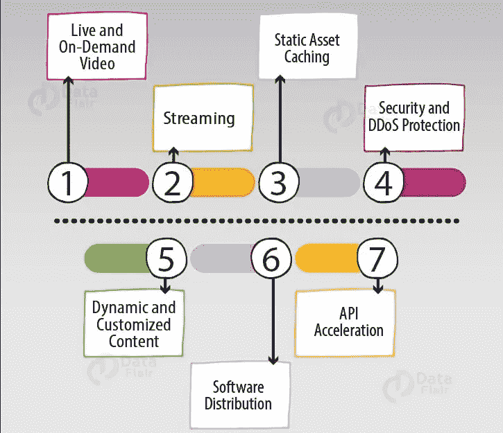

# 亚马逊云锋

> 原文：<https://medium.com/analytics-vidhya/amazon-cloudfront-ec0ce30f4eee?source=collection_archive---------6----------------------->

亚马逊云锋

亚马逊 CloudFront 是一个**内容交付 web 服务(CDN)** 。它与其他 AWS 云服务集成，为开发人员和企业提供了一种简单的方式，以低延迟、高数据传输速度和无最低使用量承诺的方式向世界各地的用户分发内容。

# 亚马逊 CloudFront 基础知识:

开始使用 CloudFront 需要理解三个核心概念:发行版、起源和缓存控制。

**1。发行版:**要使用 Amazon CloudFront，首先要创建一个发行版，它由一个 DNS 域名标识。要从 Amazon CloudFront 提供文件，您只需使用分发域名来代替您网站的域名；其余的文件路径保持不变。

**2。** **Origins:** 当您创建一个发行版时，您必须指定您希望 Amazon CloudFront 从中获取您的对象(web 文件)的最终版本的源的 DNS 域名——Amazon S3 桶或 HTTP 服务器。

**3。Cache-Control:** 一旦从边缘位置请求和提供服务，对象就一直留在缓存中，直到它们过期或被驱逐，以便为更频繁请求的内容腾出空间。

# AWS CloudFront 高级功能:

**动态内容、多个来源和缓存行为:**如前所述，服务静态资产是使用 CDN 的常见方式。

*   然而，Amazon CloudFront 发行版可以很容易地设置为除了静态内容之外还提供动态内容，并且可以使用多个源服务器。
*   您可以控制哪些请求由哪个源提供服务，以及如何使用一个称为缓存行为的特性来缓存请求。
*   缓存行为允许您为网站上文件的给定 URL 路径模式配置各种 Amazon CloudFront 功能。
*   例如，见下图一个缓存行为应用于 web 服务器中的所有 PHP 文件(动态内容)，使用路径模式*。php，而另一种行为适用于另一个源服务器(静态内容)中的所有 JPEG 图像，使用路径模式*.jpg。

交付静态和动态内容

# AWS CloudFront 如何交付内容？

1.  *客户端*访问网站并请求下载对象。
2.  *DNS* 将用户请求路由到 AWS CloudFront。
3.  AWS *CloudFront* 连接到其最近的*边缘位置*以便服务于用户请求。
4.  在边缘位置，AWS CloudFront 寻找所请求的缓存文件，如果不存在，它将需求与规范进行比较，并与相应的*服务器*共享。
5.  服务器通过将文件发送回 CloudFront edge 位置来做出响应。
6.  然后 CloudFront 与客户机共享文件或请求。

# **AWS CloudFront 的优势:**

CloudFront 的使用

1.  性价比高
2.  节省时间
3.  内容隐私
4.  高度可编程
5.  地理定位
6.  加速静态网站内容交付。
7.  提供实时流媒体视频点播服务。

# 使用 CloudFront 的公司

使用 CloudFront 的公司

*   Jio Saavn:它使用亚马逊 CloudFront 向全球用户提供 15pb 的音频和视频。
*   天空新闻:它使用这项服务是为了统一内容，以便更快地分发给订户。
*   发现通信:它使用服务来交付 API、静态资产和动态内容。
*   Tv1EU:该服务有助于改善延迟和性能，从而实现最快的内容交付。

# 结论:

AWS CloudFront 是由 AWS 提供的全球分布式网络，它以高传输速度和低延迟向最终用户安全地交付内容。我们看到了 AWS CloudFront 如何交付内容。它具有各种优势和用途，如提供点播直播视频、在整个系统处理过程中加密特定字段，以及加速静态网站内容交付。许多流行的媒体和流媒体平台都使用 AWS CloudFront。