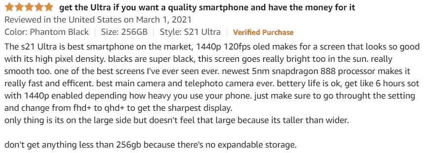
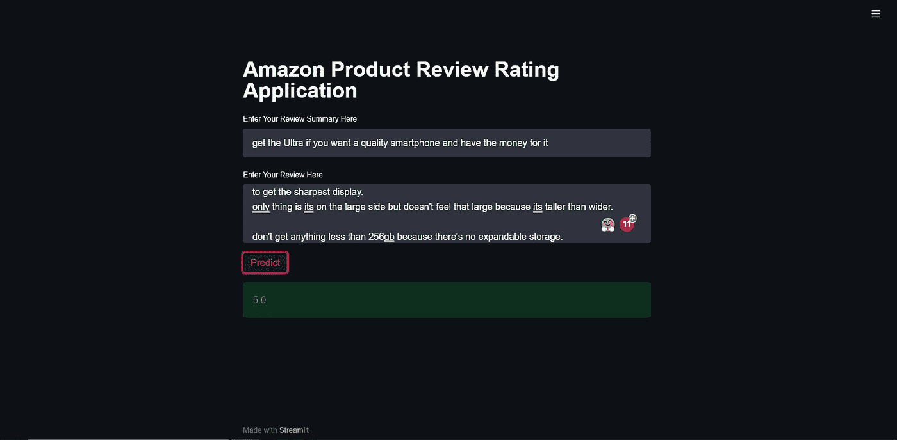
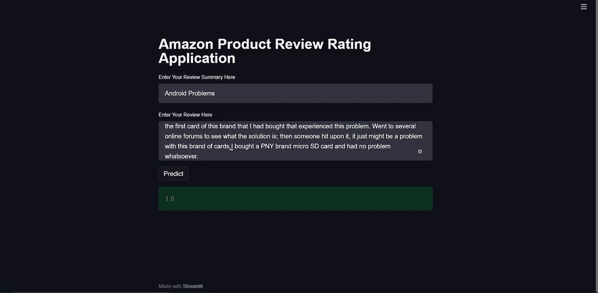

# 亚马逊电子评论分类器

> 原文：<https://medium.com/analytics-vidhya/amazon-electronics-reviews-classifier-aa69dcc3f829?source=collection_archive---------23----------------------->

如果你是一个像我一样在亚马逊购买产品时会想“我应该给多少颗星”的人，这篇中等文章就适合你。


约纳斯·勒普在 [Unsplash](https://unsplash.com?utm_source=medium&utm_medium=referral) 上拍摄的照片

在这个项目中，我在包含亚马逊评论的数据集中选择了[电子数据集](https://nijianmo.github.io/amazon/index.html)。我通过在我训练的模型中选择最好的模型做了一个应用，发布在 Heroku 上。

## 现在让我们来看看这个项目的目的

如今，产品和批评已经超越了私人页面，也发生在社交媒体空间。

当我在亚马逊上查看电子产品的评论时，大多数产品评论者的评分都在 3 到 5 分之间，所以如果一个新客户在前面提到的任何一个评论网站上浏览在线评论，他们就会通过亚马逊进行购买。

观点不断在社交媒体平台上分享，并被其追随者阅读。通过阅读这些在线帖子，关于这些追随者对产品的看法的信息可以帮助我们更好地了解公众对产品的看法。

如果我们在亚马逊工作，如果一个评论被归类在 3 分以下，我们可以看看那个产品评论，找出他们为什么对产品有负面意见，并作为回报解决问题。

你可以在这里访问我的 Heroku 应用[。](https://review-rating-predictor-byogi.herokuapp.com/)

## 别跟我解释，出示代码

你可以在这里访问 GitHub repo。

# 现在，让我们看看项目中的步骤

## 1.预处理

在这一步中，我们将从数据集中提取我们认为必要的部分，应用必要的预处理操作，并保存数据集。

首先，我在数据集中为项目选择了必要的变量。

```
df_= pd.read_csv("Data/df_sub.csv")
df_.dropna(inplace=True)
df["all_text"] = df_["summary"]+df_["reviewText"]
df["overall"] =df_["overall"]
```

执行完第一步后，让我们从名为 all_text 的文本中执行我们认为不必要的每一步。分别将所有字符转换为小写，删除特殊格式，如电子邮件地址，删除重音字符和删除特殊字符。

```
df["all_text"] = df["all_text"].apply(lambda x: get_clean(x))
#df.head()

df.to_csv('Amazon yorum/preprocessed.csv',index=False)
```

## 2.TF-IDF


照片由[沙哈达特·拉赫曼](https://unsplash.com/@hishahadat?utm_source=medium&utm_medium=referral)在 [Unsplash](https://unsplash.com?utm_source=medium&utm_medium=referral) 上拍摄

因为我们将对文本进行预测，所以让我们用 TF-IDF 使它们在矩阵格式中可行。

```
tfidf = TfidfVectorizer(max_features=20000, ngram_range=(1,3),analyzer='char')
X = tfidf.fit_transform(df["all_text"])
pickle.dump(tfidf, open("Amazon yorum/tfidf.pickle", "wb"))
pickle.dump(X, open("Amazon yorum/X.pickle", "wb"))
y = df["overall"]
```

## 3.构建模型并选择最佳模型

其实我们的数据并不是平衡数据。特别是低星评论相当低，所以如果没有非常明确的负面评论，很难获得低分。但是，通过创建最佳模型，我们将选择能为低分提供平衡结果的模型。

```
def score_funct(model, X_train, X_test, y_train, y_test):
    acc_train = model.score(X_train, y_train)
    acc_test = model.score(X_test, y_test)
    d = {'Train Accuracy': [acc_train],
         'Validation Accuracy': [acc_test],
         'Accuracy Difference': [acc_train -acc_test]}
    scores_table = pd.DataFrame(data=d)
    return scores_tableskf = StratifiedKFold(n_splits=5,random_state=42,shuffle=True)
```

我应用了某些分类模型，并试图调整它们。当然，可以产生更好的模型，甚至更多，使用神经网络可以产生成功的模型，但这里的目的是；访问最好的机器学习模型将会很容易。

```
### Decision Tree Classifier ###
dec_tree = DecisionTreeClassifier()
params = {'min_samples_leaf':[3,5,10,15,30,50,100],
          'max_depth':[2,3,4,5,6,7,8,9]}
opt_model = GridSearchCV(dec_tree,
                                 params,
                                 cv=skf,
                                 scoring='accuracy',
                                 return_train_score=True,
                                 n_jobs=-1)
opt_model.fit(X_train, y_train)
opt_model.best_params_
dec_tree_model = opt_model.best_estimator_
dec_table = score_funct(dec_tree_model,X_train,X_test, y_train, y_test) #   Train Accuracy  Validation Accuracy  Accuracy Difference
#0        0.817048             0.801628             0.015421### Random Forest  ###
rf = RandomForestClassifier()

params = {'min_samples_leaf':[2,3,5,10,15,30,50,100],
          'max_depth':[17,19,21,23,25,27,30]}
opt_model = GridSearchCV(rf,
                                 params,
                                 cv=skf,
                                 scoring='accuracy',
                                 return_train_score=True,
                                 n_jobs=-1)

opt_model.fit(X_train, y_train)
opt_model.best_params_
rf_model = opt_model.best_estimator_
rf_table = score_funct(rf_model,X_train,X_test, y_train, y_test)

#   Train Accuracy  Validation Accuracy  Accuracy Difference
#0        0.842494             0.791455             0.051039### KNN ###
knn = KNeighborsClassifier()
params = {'n_neighbors':[5,10,15,20,25,30,40]}
opt_model = GridSearchCV(knn,
                         params,
                         cv=skf,
                         scoring='accuracy',
                         return_train_score=True,
                         n_jobs=-1)
opt_model.fit(X_train, y_train)
opt_model.best_params_
knn_model = opt_model.best_estimator_
knn_table = score_funct(knn_model,X_train,X_test, y_train, y_test)
#    Train Accuracy  Validation Accuracy  Accuracy Difference
# 0         0.81145             0.802645             0.008805

### Adaboost ###
ada_boost = AdaBoostClassifier()
params = {'learning_rate':[0.3,0.5, 0.7]}
opt_model = GridSearchCV(ada_boost,
                         params,
                         cv=skf,
                         scoring='accuracy',
                         return_train_score=True,
                         n_jobs=-1)
opt_model.fit(X_train, y_train)
opt_model.best_params_
ada_model = opt_model.best_estimator_
ada_table = score_funct(ada_model,X_train,X_test, y_train, y_test)
#    Train Accuracy  Validation Accuracy  Accuracy Difference
# 0        0.814758             0.803662             0.011096
```

我选择 KNN 是因为它在我安装的型号中出错率最低。我保存了这个模型，以便以后可以用它来预测。

```
pickle.dump(knn_model, open(f'Models/best_model.pkl', 'wb'))
```

## 4.通过模型创建预测

我们正在导入我之前保存的模型，以及我为 tf-idf 创建的矩阵。

```
model = pickle.load(open('Models/best_model.pkl','rb'))
tfidf = pickle.load(open('tfidf.pickle', 'rb'))
X = pickle.load(open('X.pickle','rb'))
```

之后，我们将评论文本和摘要结合起来，我们将通过 Streamlit 接口获得它们，并将其转换成一个变量。

```
sl.title("Amazon Product Review Rating Application")

review_summary_text = sl.text_input('Enter Your Review Summary Here')
review_text = sl.text_area('Enter Your Review Here')

if sl.button('Predict'):
    result_review_sum = review_summary_text.title()

    result_review = review_text.title()

    all_review_text = result_review_sum + result_review
```

在下一步中，在应用了我们之前用来训练模型的预处理步骤并进行 tf-idf 变换之后。

```
 X = get_clean(all_review_text)
    vec = tfidf.transform([X])
    prediction = model.predict(vec)

    sl.success(prediction[0])
```

把这些 python 文件全部上传到 GitHub 后，我用 Heroku 把它们转换成应用。因此，在回顾回购协议后，你可以看到它是如何运作的。

## 5.预言


迈克尔·泽兹奇在 [Unsplash](https://unsplash.com?utm_source=medium&utm_medium=referral) 上的照片

我在我的 Heroku 应用程序上写了一条我在 Amazon.com 上找到的评论，以及它的摘要，并查看了分数。



然后我通过找到一篇关于 Amazon.com 的负面评论来尝试预测。



然而，由于我的数据集很小，我不能说我训练的模型非常成功，特别是产生像 1 和 2 这样的低分数一直很有挑战性。如果我使用更大的数据集，我认为我可以获得更成功的结果。

*感谢阅读！*

# 参考

[1]安德烈·贝利教授—[https://www.expert.ai/](https://www.expert.ai/)

[https://www.veribilimiokulu.com](https://www.veribilimiokulu.com/bootcamp-programlari/veri-bilimci-yetistirme-programi/)

[https://nijianmo.github.io/amazon/index.html](https://nijianmo.github.io/amazon/index.html)