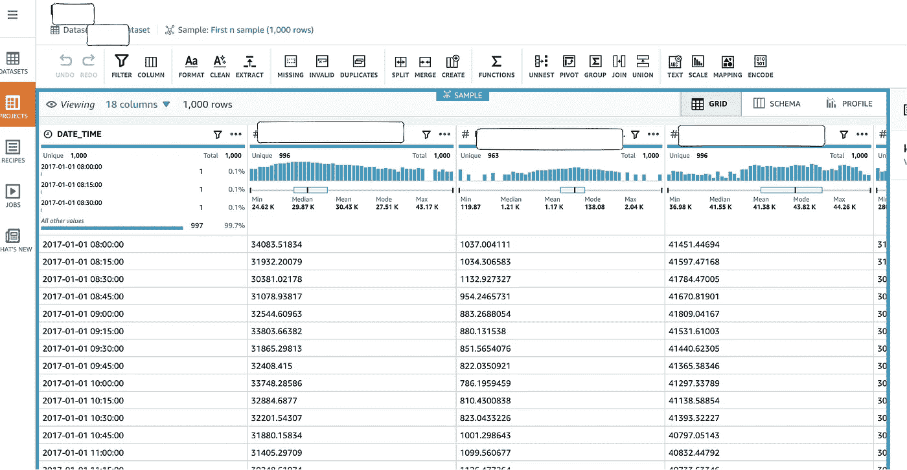

# 亚马逊正在重塑 MLOps。没人能赶上。

> 原文：<https://medium.com/analytics-vidhya/amazon-is-reinventing-mlops-57f36c0b2d0a?source=collection_archive---------6----------------------->

## 关键 AWS 服务塑造 2021 年的机器学习格局

克里斯蒂安·威迪格在 [Unsplash](https://unsplash.com?utm_source=medium&utm_medium=referral) 上拍摄的照片

在三大云提供商中，AWS 拥有[最广泛的机器学习能力已经不是什么新闻了。随着 2020 年初](https://www.geeksforgeeks.org/top-cloud-computing-platforms-for-machine-learning/#:~:text=There%20are%20many%20cloud%20computing,Google%20Cloud%2C%20and%20IBM%20Cloud.) [Sagemaker Studio 的公开发布](https://aws.amazon.com/blogs/aws/amazon-sagemaker-studio-the-first-fully-integrated-development-environment-for-machine-learning/)，他们创建了一个完全集成的 ML 开发环境——这是第一个这样的环境。

将 IDE 作为所有 ML 产品的核心是一个明智之举——前提是您的周边服务能够正确填补关键的运营缺口。如果做得好，亚马逊有机会一劳永逸地重塑行业内机器学习的方式。

甚至在 Sagemaker Studio 之前，AWS 就有一些面向 MLOps 的服务。然而, [Re:invent 2020](https://reinvent.awsevents.com) 已经把门槛抬得更高了。他们发布了一系列产品/服务，填补了大多数已知的空白。

他们做得好吗？他们为正确的受众构建了正确的工具吗？几年内我们不会知道。但 AWS 肯定在这场竞争中占据了前排位置。现在，让我们来看看一些关键的新服务，它们将有助于理解 AWS 在这场游戏中的优势。

# AWS 现有的 MLOps 套件

亚马逊现有产品的核心是基于 Sagemaker Studio。它为 ML 开发提供了第一个同类的集成开发环境。在它的基础上还有其他一些功能，已经使它变得非常有吸引力:

*   [Sagemaker studio 笔记本](https://docs.aws.amazon.com/sagemaker/latest/dg/notebooks.html)将提供无服务器 Jupyter 笔记本，取代您的本地笔记本。它还支持本地模式。但是我强烈建议您围绕集中式笔记本电脑建立您的建模开发环境。
*   [Sagemaker Autopilot](https://aws.amazon.com/sagemaker/autopilot/) 将 [AutoML](https://en.wikipedia.org/wiki/Automated_machine_learning) 带入 AWS，将 ML 过程中的所有繁重工作都去掉。
*   [Sagemaker 实验](https://aws.amazon.com/blogs/aws/amazon-sagemaker-experiments-organize-track-and-compare-your-machine-learning-trainings/)允许您保存和跟踪您的训练实验。它还允许相互比较，允许从实验结果表中手动选择最佳模型。
*   [Sagemaker 模型调整](https://docs.aws.amazon.com/sagemaker/latest/dg/automatic-model-tuning.html)允许您利用云来自动化超参数优化。
*   [多模型端点](https://docs.aws.amazon.com/sagemaker/latest/dg/multi-model-endpoints.html)将显著降低你的推理成本。
*   [Model monitor](https://docs.aws.amazon.com/sagemaker/latest/dg/model-monitor.html) 允许您跟踪生产中的指标，从而轻松跟踪模型漂移。

# 2021 年有什么新鲜事？

尽管是 ML 服务的领先 ops 提供商，AWS 仍然不能声称拥有一个用于所有机器学习目的的良好连接的开发环境。多边行动计划的几个领域存在重大差距。

> 没有连贯的 CI/CD 渠道可以将它们联系在一起。没有它，感觉就像一系列不同的服务。ML 过程的各个阶段(数据准备、培训、验证、推理、监控)的个别产品也不完整。

但这种情况正在改变。随着新服务在 re:invent 2020(12 月和之前的几个版本)中发布，AWS 开始了新的一年，填补了大多数空白，并将大多数其他提供商远远甩在后面。

这里有一些。

## 数据牧马人:零代码数据准备

AWS Sagemaker[Data Wrangler](https://aws.amazon.com/sagemaker/data-wrangler/)(不是[这个](https://github.com/awslabs/aws-data-wrangler)那个)为机器学习数据准备提供了一个干净的 Jupyter 风格的 IDE。它直接建立在 Sagemaker Studio 上，因此使用了 Studio 的所有强大功能。比如它的数据可视化。

尽管从技术上来说，Data Wrangler 是一个无代码工具，但它可以通过代码进行定制。有 300 多种内置的自动转换可以应用于您的训练数据。您可以通过单击将工作流导出到 Sagemaker 笔记本中，并构建适当的模型。它还直接支持几种数据存储——包括 Snowflake、MongoDB 和 Databricks。

Data Wrangler 填补了亚马逊在 ML 数据准备方面的一个巨大空白。他们声称，通过这种方式简化数据准备，[花费在数据准备上的时间](https://www.datanami.com/2020/07/06/data-prep-still-dominates-data-scientists-time-survey-finds/)显著减少。

## Sagemaker Data Brew:同样的事情，但是[做得不同](https://julsimon.medium.com/data-preparation-aws-glue-data-brew-or-amazon-sagemaker-data-wrangler-d8e76d1510cb)

Sagemaker 数据酿造

[Data Brew](https://aws.amazon.com/blogs/big-data/preparing-data-for-ml-models-using-aws-glue-databrew-in-a-jupyter-notebook/) 也是无代码数据准备工具。但是这两个工具面向两种不同的受众。虽然 data wrangler 专为 ML 设计，但 data brew 专注于通用探索性数据分析(EDA)。此外，Data Brew 是一个以 UI 为中心的工具。

EDA 往往是 ML 的先决条件，所以它们没有理由不能齐头并进。Data brew 使这项工作变得更加简单，只需点击一下就可以进行分析，并为不编码的人提供一个周到的界面。

特征工程可以在两种工具中完成。然而，只有 data wrangler 支持将特征空间导出到 AWS 特征存储，这使得这个工具更加可爱。

又一个缺口。修好了。

## AWS 功能商店:功能工程@ scale

这是一个重大的发布，解决了一个关键的[特性工程脱节](https://towardsdatascience.com/real-time-feature-engineering-with-a-feature-store-2d51ce925734)。许多 ML 实践在离线(批量)和在线(实时)特征工程之间存在差异。复杂的特征工程转换和在批处理期间构建的新特征不容易很好地转化为推理/预测管道。

[特征库](https://aws.amazon.com/sagemaker/feature-store/)通过在这两点之间放置一个专有的特征空间特定存储库来解决这个问题。您在训练期间在 Sagemaker studio 中对原始数据所做的一切都可以导出到特征存储中，并且可以保证它在推断期间得到正确的复制。

除了修复这个在线-离线问题，它还支持特性可发现性、共享和特性重用。该设计还考虑了延迟，这是大规模时必须做的事情。

## Sagemaker Pipelines:为您的 ML 流程提供 CI/CD

对我来说，这项服务是今年最大的 ops 发布。

虽然这是可扩展 ML 的一个重要先决条件，但是目前还没有可靠的 CI/CD 流程/框架能够很好地工作。每个人要么都有一个次优的 MLOps 流程，要么都建立了自己版本的 CI/CD(包括我自己)。

ML 的定制 CI/CD 框架的问题是它们不可通用，因此不容易开源。许多领域知识不可避免地被编码到其中——这既是为了缩短开发时间，也是为了更好地与现有服务集成。AWS 打算用 ML 的通用 CI/CD 框架来解决这个问题。

Sagemaker Pipelines 允许您创建、可视化和管理 ML 工作流。它使您能够创建单独的开发和生产环境，并跟踪它们。环境允许你提升神器。它还带有一个模型注册中心，允许您跟踪和选择合适的部署模型。

管道的一个不太明显的效果是，它还将所有其他面向 ML 的 Sagemaker 服务编织在一起。这是 AWS 的真正胜利，因为它实现了真正的端到端 ML。

# 来自 re: invent 的其他相关内容

## Sagemaker 澄清:

e2e Sagemaker 工作流程中的偏差检测。B2C 公司的一个大头。

## Sage maker 调试器改进

培训期间对资源利用的监控和深入剖析。尤其是在深度神经网络上。

## ML 在边缘

基于 AWS [Neo](https://aws.amazon.com/sagemaker/neo/) 、 [Sagemaker edge manager](https://aws.amazon.com/sagemaker/edge-manager/) 引入了边缘设备的模型管理。如果你从事物联网行业，这一点尤其有用。

## **数据库 ML 功能**

不完全是 mlOps，但 Amazon 的新数据库 ML 服务确实与它有一个共同的主题——建立一个平滑的生产级 ML 过程，完全消除对 Ops 的需要。

*   亚马逊红移 ML–将 Sagemaker 自动驾驶仪集成到亚马逊红移中
*   亚马逊 Neptune ML–集成图形 ML
*   Amazon Aurora ML——使用 SQL 查询将 ML 集成到 Postgres 中。
*   Amazon Athena ML——在 Athena 上提供预先训练的模型。

# 别人过得怎么样？

[Azure Machine Learning](https://azure.microsoft.com/en-ca/services/machine-learning/) 和 [Google Cloud AI platform](https://cloud.google.com/ai-platform) 是排名前两位的 MlOps 提供商，在顶级云提供商中定位最佳。两者都具有强大的流水线和 CI/CD 功能。然而，谷歌人工智能管道仍处于测试阶段，而其 AWS 模拟已经全面上市。 [Azure 机器学习工作室](https://studio.azureml.net/)感觉和 Sagemaker 很像，但不太像很多服务都是在保护伞下建立的。

其他提供商遵循的模型并不包括集成的 IDE 作为其核心。 [Azure ML Studio](https://studio.azureml.net/) 似乎是这方面的尝试。但是，它在特性集上有很大的局限性。

# 感谢阅读

与其他领先提供商相比，亚马逊似乎在提供更好的数据科学运营解决方案方面投入了更多。这是否巩固了他们作为最集成的 MLOps 套件的地位？我也这么认为 3-5 年的领先优势(或更长？我在这里找不到参考)亚马逊在开发云解决方案显示。然而，现在决定谁会赢得 MLOps 比赛还为时过早。

## 参考

 [## AWS 宣布了六项新的 Amazon SageMaker 功能，包括第一个完全集成的…

### 亚马逊 SageMaker Studio 是第一个完全集成的机器学习开发环境(IDE ),它提供了…

press.aboutamazon.com](https://press.aboutamazon.com/news-releases/news-release-details/aws-announces-six-new-amazon-sagemaker-capabilities-including)  [## 亚马逊 SageMaker 机器学习功能商店(ML) -亚马逊网络服务

### 机器学习功能的完全托管存储库亚马逊 SageMaker 功能商店是一个完全托管的…

aws.amazon.com](https://aws.amazon.com/sagemaker/feature-store/)  [## 为什么公司欢迎 MLOps 进入软件开发领域

### 机器学习的 MLOps 或 DevOps 正在将软件开发的最佳实践引入数据科学。你知道…

techcrunch.com](https://techcrunch.com/sponsor/microsoftazure/why-firms-are-welcoming-mlops-into-the-fold-of-software-development/)