# 亚马逊产品推荐系统

> 原文：<https://medium.com/analytics-vidhya/amazon-product-recommendation-system-855c9d3df481?source=collection_archive---------3----------------------->

> 基于自然语言处理的推荐系统

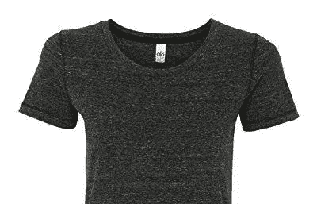

# 介绍

每个电子商务网站都有一个推荐系统，为客户提供他们可能愿意购买的最佳推荐。本文介绍了如何使用自然语言处理向客户推荐产品。模特们接受时尚产品的测试。该项目也是为了完成德里科技大学的 CO102 课程而提出的。

## 自然语言处理(NLP)

它是人工智能的一个分支，帮助计算机理解、解释和操纵人类语言。NLP 借鉴了许多学科，包括计算机科学和计算语言学，以填补人类交流和计算机理解之间的空白。

# 了解数据集

该数据集包含超过 18 万件女性时尚产品，由 AppliedAI 使用亚马逊产品 API 提取。因此，这些数据可以在网站上公开获取。因此，数据被进一步处理并用于应用 NLP 模型。数据最初有 19 个特征。在这 19 项功能中，我们将在本次研讨会中仅使用 6 项功能。1.asin(亚马逊标准识别号)2。品牌(产品所属的品牌)3。颜色(服装的颜色信息，它可以包含许多颜色作为一个值，例如:红色和黑色条纹)4。产品类型名称(服装的类型，例如:衬衫/t 恤)5。medium_image_url(图像的 URL)6。标题(产品的标题。) 7.formatted_price(产品价格)

此外，标题大小小于 4 的数据条目被移除，以便在标题中有足够的词用于自然语言处理。

# 重复数据删除

180k 数据条目的标题具有相似的标题。因为顾客不喜欢在看某个产品时看到相同的产品被当作推荐产品。这样，重复数据消除过程就完成了。在这个过程中，如果两个字符串中不同的单词数大于 2，我们就认为这两个字符串是不同的。如果两个字符串不同的单词数小于 2，我们认为这两个服装是相同的，因此我们忽略它们。

为了获得更好的结果，还可以实现类似的算法，但是保持裕量为 3，但是不执行该算法，因为该算法具有 O(n)时间复杂度，并且需要大量资源来进行去重复。

在标题中保留 2 的页边空白的去重复之后，留下 151k 的数据条目。接下来获取数据以进行进一步的预处理。

# 数据预处理

对于数据预处理，通过去除停止字来清除数据。

通过首先从 NLTK 或自然语言工具包下载一个列表来删除停用词。您可以分析的许多数据是非结构化数据，并且包含人类可读的文本。在以编程方式分析数据之前，首先需要对其进行预处理。

清理后的数据被保存为 pickle 文件，以便在这个项目的后续部分中为模型重用。

# 基于文本的产品相似性

首先，定义了一些函数，用于以热图和图表的形式显示推荐的产品。

给定的代码块讲述了在相同的。

现在，为基于文本的推荐系统定义了三种不同的模型。

1.  一堆话。
2.  术语频率—逆文档频率
3.  逆文档频率

## 一袋单词

**单词袋模型**是自然语言处理和信息检索(IR)中使用的简化表示。在这个模型中，一个文本(比如一个句子或一个文档)被表示为它的单词的包(多集合)，不考虑语法甚至词序，但是保持多样性。

欧几里德距离是在转换为计数矢量器之前计算的数据条目之间的距离。

最初，随机选择一个产品，如下图所示。对于这篇文章，包含了 3 个建议，因此很容易在这里解释。

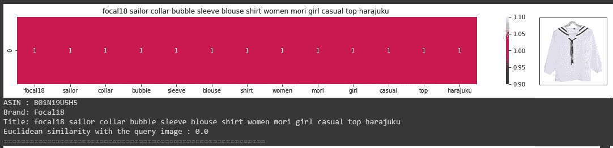

根据产品的名称，欧几里德距离被考虑在内，下面推荐 3 款产品。如果我们仔细观察图像，可以看出产品是相似的。

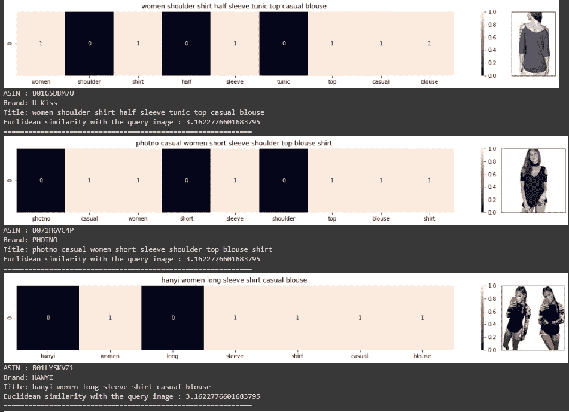

为了获得更好的结果，使用了 TF-IDF 模型。

## 术语频率—逆文档频率

TF-IDF 代表**“词频—逆文档频率”**。这是一种量化文档中单词的技术，我们通常计算每个单词的权重，这表示该单词在文档和语料库中的重要性。该方法是信息检索和文本挖掘中广泛使用的技术。

为了显示推荐的产品，在 BoW 中使用的相同产品被用作主要产品。

该产品的建议如下图所示。可以看出，与以前的建议相比，这些建议更加合适。

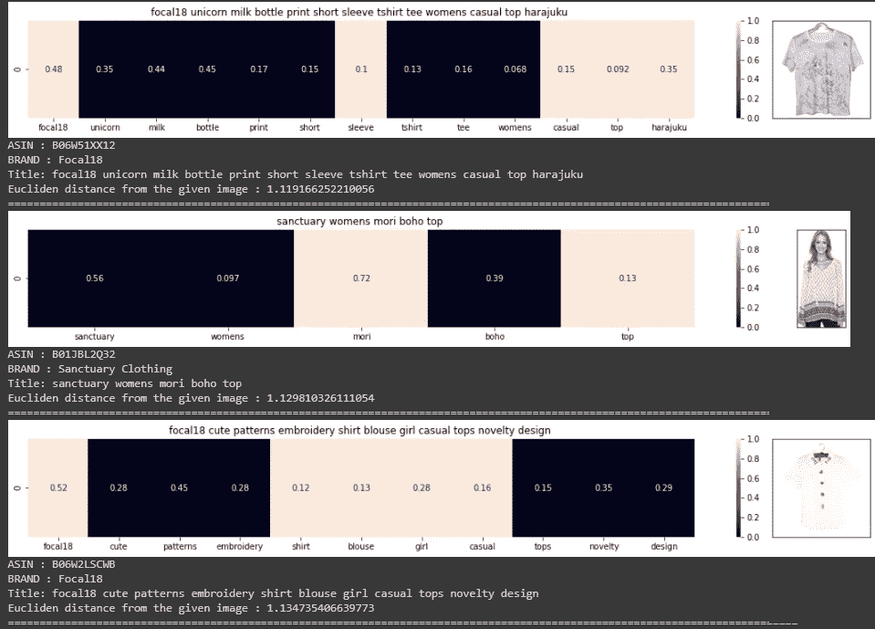

## 逆文档频率

简单来说，这是衡量一个词的稀有程度。从概念上讲，我们从测量文档频率开始。由于 IDF 的矢量化非常耗时，我删除了缺少颜色、品牌和价格信息的数据条目。之后，还会执行余量为 3 的重复数据删除，以获得更好的结果。这个经过更多处理的数据有 28k 个条目，可以用于基于文本语义的推荐，这将在下一部分讨论。

随着数据的进一步处理，一个不同的产品被设置为基础产品，如下图所示。

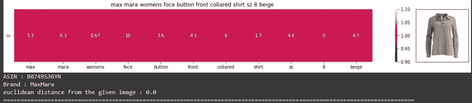

基于此模型的建议如下所示。虽然这些建议似乎并不更合适，但是在这个模型中形成的向量将进一步用于文本语义。

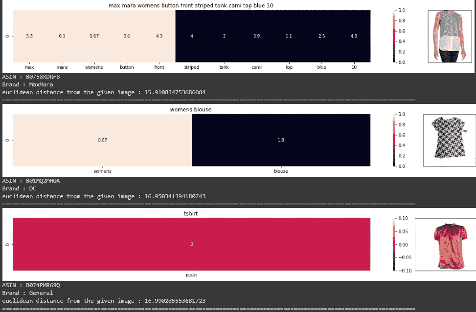

# 基于文本语义的产品相似度

下面给出了基于文本语义的产品相似性的效用函数。

本部分应用了两个模型—基于品牌和颜色的平均 Word2Vec 和 Word2Vec。

## 平均 Word2Vec

单词嵌入是最流行的文档词汇表示之一。它能够捕捉文档中单词的上下文、语义和句法相似性、与其他单词的关系等。

这个项目中使用的 word2vec 模型是 data 文件夹中已经给出的模型，至于创建我们自己的模型，需要大量的数据。

在 IDF 模型中用作基础产品的产品在这里也用于创建建议。

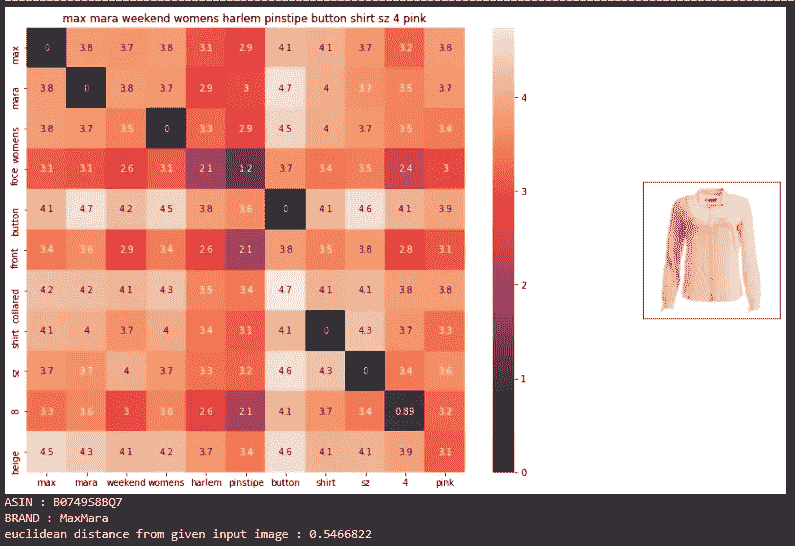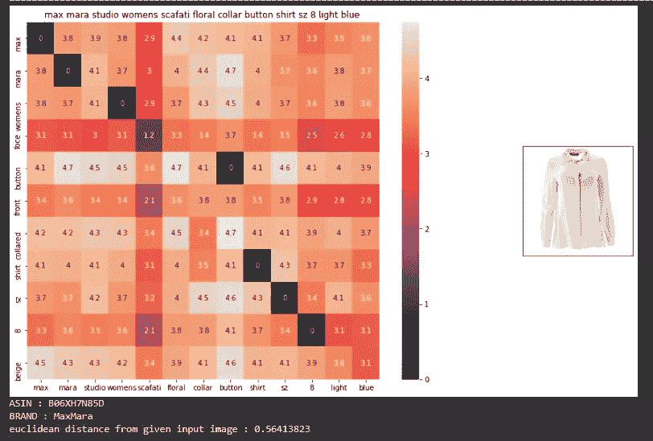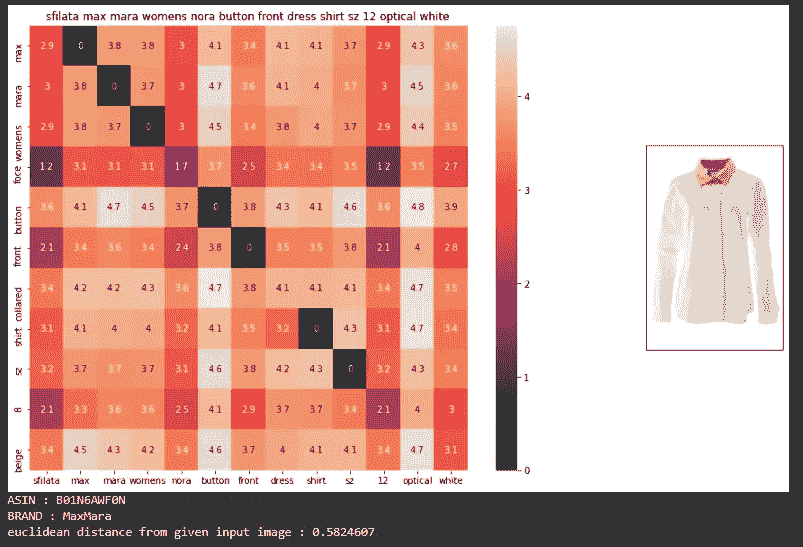

可以看出，与所有其他模型相比，这些建议更合适。

## 基于品牌和颜色的 Word2Vec

正如我们所知，在商业模式中，相同品牌的产品不会作为推荐给出，而会显示其他产品。该模型将标题和品牌/颜色的权重设置为 10 和 5，以获得结果。

基础产品的选择与 IDF 和 average Word2Vec 型号相同。

这些建议更合适，因此适合于适当的商业模式。

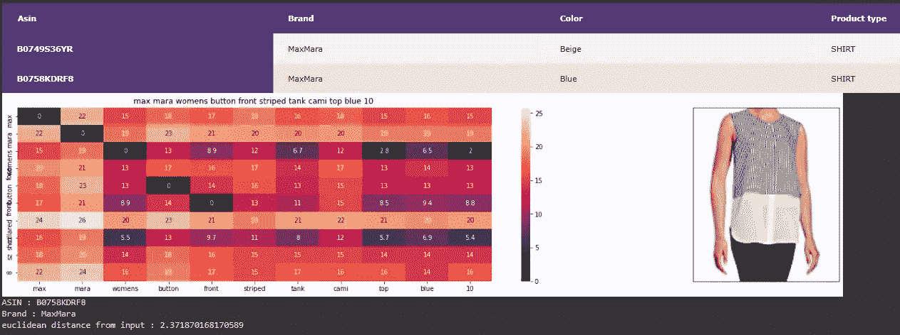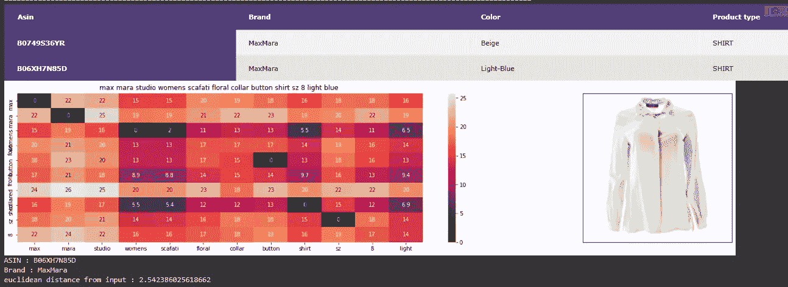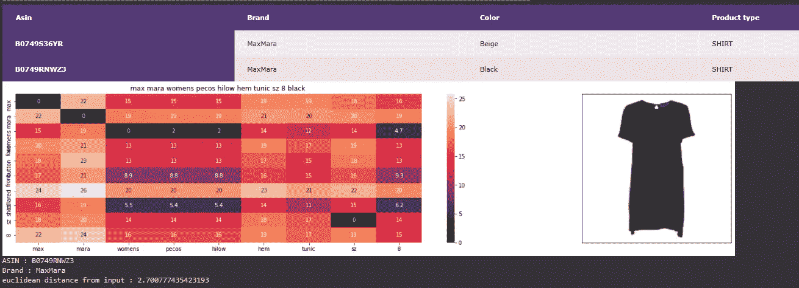

# 结论和未来工作

因此，从商业角度来看，基于品牌和颜色的 Word2vec 模型更有助于在电子商务网站上提供推荐。

将来，更多的数据可以用于混合类型的产品，同时可以使用图像和神经网络来基于图像给出建议。

# 文献学

1.  data—[https://drive . Google . com/drive/folders/1K _ bsjfqjzdhhy 9 qtqdgi 032 egy 8 spjd 5？usp =共享](https://drive.google.com/drive/folders/1K_BSjfQjZdHhy9qtQdGi032egY8sPJD5?usp=sharing)
2.  Colab 笔记本—[https://colab . research . Google . com/drive/15 fgpnn-ke 2 IP 5 udqbjsqvlbcxwe 7 FH 9 l？usp =共享](https://colab.research.google.com/drive/15fGpnn-Ke2Ip5udQBjSQvlbCxWe7fh9l?usp=sharing)
3.  github—[https://github . com/sakshamchecker/Amazon product recommendation](https://github.com/sakshamchecker/AmazonProductRecommendation)
4.  [https://www . SAS . com/en _ us/insights/analytics/what-is-natural-language-processing-NLP . html](https://www.sas.com/en_us/insights/analytics/what-is-natural-language-processing-nlp.html)
5.  [https://realpython.com/nltk-nlp-python/](https://realpython.com/nltk-nlp-python/)
6.  [https://en.wikipedia.org/wiki/Bag-of-words_model](https://en.wikipedia.org/wiki/Bag-of-words_model)
7.  [https://towardsdatascience . com/TF-IDF-for-document-ranking-from-scratch-in-python-on-real-world-dataset-796 d339 a 4089](https://towardsdatascience.com/tf-idf-for-document-ranking-from-scratch-in-python-on-real-world-dataset-796d339a4089#:~:text=TF%2DIDF%20stands%20for%20%E2%80%9CTerm,Information%20Retrieval%20and%20Text%20Mining)
8.  [https://towards data science . com/introduction-to-word-embedding-and-word 2 vec-652 d0c 2060 fa](https://towardsdatascience.com/introduction-to-word-embedding-and-word2vec-652d0c2060fa)