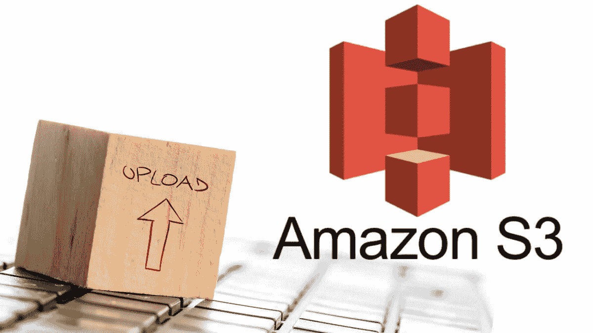
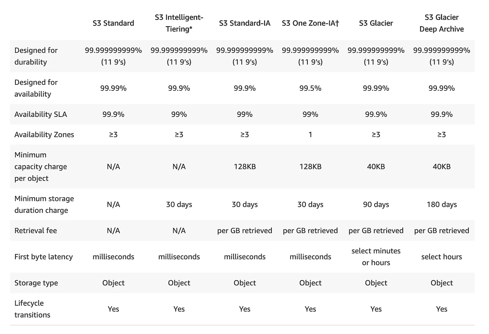
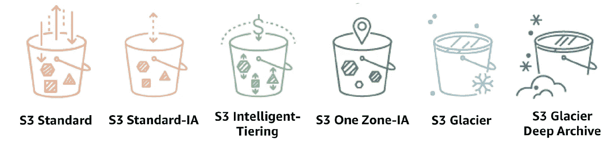
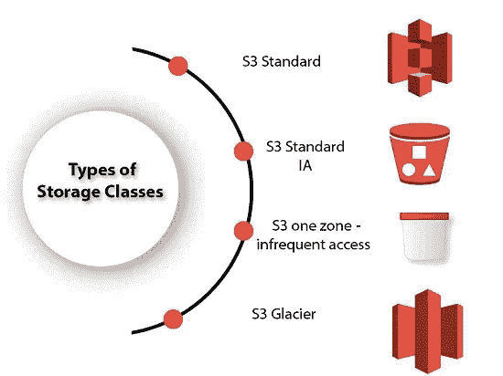

# 亚马逊 Web 服务 S3 存储类

> 原文：<https://medium.com/analytics-vidhya/amazon-s3-storage-classes-d77de43df23d?source=collection_archive---------2----------------------->

## S3 存储类的类型。

亚马逊 S3 提供了一系列针对不同用例设计的存储类别。这些为我们提供了很少使用的数据存储，不需要即时访问、长期存档、数字保存等等。所有亚马逊 S3 存储类都具有高水平的**可靠性，并支持传输过程中的 SSL 数据加密**，但在成本上有所不同。S3 还定期**验证完整性**你的数据使用校验和，并提供自动修复能力。S3 存储类别允许生命周期管理/策略实现对象的**自动迁移**，以节约成本。

[**点击图片链接**](https://jayendrapatil.com/wp-content/uploads/2016/03/S3-Storage-Classes-Performance-1536x1050.png)

提供的不同存储类别有:

*   S3 标准报
*   S3 标准-IA
*   S3 智能分层
*   S3 一区-IA
*   S3 冰川
*   S3 冰川深层档案
*   S3 前哨

# S3 标准(通用)

*   S3 标准是**默认存储类别，如果上传期间未指定，则为**。
*   S3 标准为频繁访问的数据提供了**高耐用性、可用性和高性能的对象存储**。
*   S3 标准提供**低延迟和高吞吐量。**
*   S3 标准拥有广泛的使用案例，包括云应用、动态网站、web 服务、网站托管、大数据分析、移动游戏和内容分发。
*   S3 标准是所有同类产品中**最昂贵的存储产品。**
*   针对多个可用性区域中 99.99999999%的对象的耐用性而设计。
*   数据存储在多个位置。S3 标准对影响整个可用性区域的事件具有弹性，旨在承受两个设施中的数据丢失。
*   针对给定年份内 99.99%的可用性而设计
*   支持传输中数据的 SSL 和静态数据的加密。

# S3 智能分层(未知或不断变化的访问权限)

*   S3 智能分层存储类旨在通过自动将数据移动到最经济高效的存储访问层来优化存储成本，而不会影响性能或产生运营开销。
*   通过在两个访问层之间在粒度对象级别上移动数据，实现自动成本节约

—→针对频繁访问而优化的一层，以及

—→另一个成本较低的层，针对不常访问的数据进行了优化。

*   频繁访问层和低成本的非频繁访问层。
*   当访问模式未知或不可预测时，非常适合自动优化长期数据的存储成本。
*   S3 将连续 30 天未被访问的对象移动到非频繁访问层，每个对象每月只需支付少量的监控和自动化费用。如果对象被访问，则它会自动移回频繁访问层。
*   使用 S3 智能分层存储类别不收取检索费或额外的分层费。
*   适用于大于 128 KB 的较大对象(较小对象仅收取 128 KB 的费用)至少保留 30 天(至少收取 30 天的费用)
*   低延迟和高吞吐量性能。
*   AZs 中对象在给定年份内 99.99999999%的耐久性和 99.99%的可用性。
*   自动在两个访问层之间移动数据。(不经常访问和经常访问)。
*   以[亚马逊 S3 服务水平协议](https://aws.amazon.com/s3/sla/)支持可用性。
*   没有最短存储时间。
*   每月小额监控和自动分层费用。

[点击**链接**点击](https://d1.awsstatic.com/product-marketing/S3/AWS_StorageAsset%202%402x.0840a770e3a358b6075f7d2f703d0d8cef9836f4.png)

# S3 标准-IA(不经常访问)

*   S3 标准-不频繁访问存储类针对长期数据和**不太频繁访问的**数据进行了优化。例如，*用于访问受限的备份和旧数据，但使用情形仍要求高性能。*
*   非常适合用于无法重新创建的数据的主拷贝或唯一拷贝。
*   S3 标准的高耐用性、低延迟和高吞吐量性能，但每 GB 存储价格和每 GB 检索费用较低。。
*   针对多个可用性区域中 99.99999999%的对象的耐用性而设计。
*   S3 Standard-IA 是备份、长期存储和灾难恢复数据存储的理想选择。
*   数据以冗余方式存储在多个地理上分离的 az 中，并且对可用性区域的**损失具有弹性。**
*   提供比 ONEZONE_IA 类更高的可用性和弹性。
*   对象可用于实时访问。
*   适用于大于 128 KB 的较大对象(较小对象仅收取 128 KB 的费用)至少保留 30 天(至少收取 30 天的费用)
*   设计用于 AZs 中物体的 99.999999999%即 11 个 9 的耐久性
*   针对给定年份的 99.9%可用性而设计。
*   比 S3 标准存储便宜。

# S3 一区-不经常访问(S3 一区-IA)

*   S3 One Zone-不频繁访问存储类专为长期和不频繁访问的数据而设计，但可用于毫秒级访问(类似于标准和 STANDARD_IA 存储类)。
*   当 AZ 出现故障时可以重新创建数据，以及在设置跨区域复制(CRR)时用于对象副本时，这是理想的选择。
*   对象可用于实时访问。
*   适用于大于 128 KB 的较大对象(较小对象仅收取 128 KB 的费用)至少保留 30 天(至少收取 30 天的费用)
*   由于另一个 S3 存储类别将数据存储在最少 3 个可用分区(AZ)中，因此 S3 One Zone 将对象数据存储在**的唯一一个 AZ** 中，这使得它的成本更低，成本比标准的非频繁访问低 20%
*   数据对于地震和洪水等灾难造成的物理损失没有弹性。
*   一种区域不频繁访问的存储类别与标准不频繁访问的存储类别一样耐用，但可用性和弹性较差。
*   专为单个 AZ 中物体的 99.999999999%即 11 个 9 的耐久性而设计
*   针对给定年份的 **99.5%可用性**而设计
*   S3 对这些对象收取检索费，因此它们最适合不经常访问的数据。

[**点击链接**](https://static.javatpoint.com/tutorial/aws/images/aws-storage-classes.jpg)

# S3 冰川(档案)

*   GLACIER 存储类适用于**低成本数据归档**，其中数据访问不频繁，检索时间为几分钟到几小时是可以接受的。
*   存储类别的**最短存储持续时间为 90 天**
*   提供**可配置的检索时间**，从分钟到小时
*   为了接近冰川物体，

→必须恢复物体，这可能需要几分钟到几小时

→对象仅在恢复请求期间指定的时间段(天数)内可用

→对象的存储类别仍然是冰川

→临时恢复的档案(冰川费)和副本都要收费

*   保管库锁定功能通过可锁定的策略实施合规性
*   提供与标准存储级别相同的耐用性和弹性
*   设计用于 AZs 内 99.999999999%即 11 个 9 的耐久性
*   针对给定年份的 99.9%可用性而设计

# S3 冰川深层档案

*   Glacier Deep Archive 存储类提供**最低成本的数据归档**，在这种情况下，数据访问不频繁，检索时间为几小时也是可以接受的。
*   具有 180 天的**最短存储持续期**，并且可以在 12 小时的默认检索时间内访问。
*   支持对一年中可能被访问一次或两次的数据进行长期保留和数字保存
*   为 AZs 上的物体的 99.999999999%设计，即 11 个 9 的耐久性
*   为给定年份的 99.9%可用性而设计
*   使用批量检索可以降低 DEEP_ARCHIVE 检索成本，批量检索可以在 48 小时内返回数据。
*   磁带库的理想替代品。
*   它非常适合那些将数据存储 5-10 年或更长时间的行业，如医疗保健、金融等。它还可以用于备份和灾难恢复。
*   使用批量检索可以降低检索成本。

# 前哨 S3

*   S3 on outpost 为我们的内部 AWS outposts 环境提供对象存储。
*   前哨站上的 S3 使数据的存储、检索、保护、访问控制、标记和报告变得更加容易。
*   它非常适合具有本地数据驻留要求的工作负载，并通过将数据保存在本地来满足苛刻的性能需求。
*   S3 对象兼容性和存储桶管理是通过 S3 SDK 实现的
*   用于在前哨站上持久和冗余地存储数据。
*   前哨站上的 S3 将为用户提供 48TB 或 96TB 的 S3 存储容量，每个前哨站上有多达 100 个存储桶。
*   旨在持久和冗余地存储您的前哨数据。
*   使用 SSE-S3 和 SSE-C 加密
*   使用 IAM 和 S3 接入点进行身份验证和授权。
*   使用 AWS 数据同步将数据传输到 AWS 区域。
*   S3 生命周期到期活动。

## 结论:

我希望这个博客能帮你节省时间和金钱，这样你就可以和你爱的人一起度过了。保持微笑，展现爱心！。

**参考文献:**

 [## 对象存储类-亚马逊 S3

### 亚马逊 S3 提供了一系列针对不同用例设计的存储类别。这些包括 S3 标准…

aws.amazon.com](https://aws.amazon.com/s3/storage-classes/)  [## 什么是云文件存储？— AWS

### 云文件存储是一种在云中存储数据的方法，可让服务器和应用程序访问数据…

aws.amazon.com](https://aws.amazon.com/what-is-cloud-file-storage/) 

**作者领英:**

 [## Ankit Gupta —印度马哈拉施特拉邦浦那|职业简介| LinkedIn

### 我是深度学习爱好者/学习者，正在寻找一个可以贡献和提高技能的机会…

www.linkedin.com](https://www.linkedin.com/in/ankit-gupta2/) 

**其他博客:**

 [## 在亚马逊 S3 存储桶之间迁移数据

### 在同一个账户里。

aws .平原英语. io](https://aws.plainenglish.io/migrate-data-between-amazon-s3-buckets-db9c37d81708)  [## AWS S3 |简介|命名规则|子资源|对象

### AWS 简单存储服务。

aws .平原英语. io](https://aws.plainenglish.io/aws-s3-introduction-naming-rules-sub-resource-objects-d02543907d79) 

感谢您的阅读，如果您喜欢，请点击“鼓掌”按钮。

**关注我们了解更多内容。**

**查看**[**AWS in Plain English**](https://aws.plainenglish.io/)**了解更多 AWS 相关内容。**

*更多内容请看*[*plain English . io*](http://plainenglish.io/)*。*