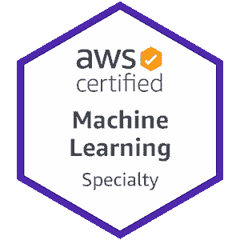

# 亚马逊 SageMaker 内置算法:快速笔记

> 原文：<https://medium.com/analytics-vidhya/amazon-sagemaker-built-in-algos-be21c07cf3fd?source=collection_archive---------9----------------------->

当我准备 AWS 机器学习专业认证考试时，我正在寻找一个可以快速查看摘要的地方。作为这方面的新手，我发现这种资源节省了我查找 Sagemaker 提供的内置算法信息的时间。然而，我找不到任何这样的东西。所以，我写了这些笔记。希望对和我有相同意向的人有用！我将在另一篇文章中分享我以表格形式创建的另一个摘要。

# BlazingText:

以两种模式运行:

*   无人监督(word2Vec)
*   监督(文本分类)

**频道**:列车

**训练输入方式**:文件或管道

**实例类型** : GPU(单实例)和 CPU

**可并行化**:否

**不同类型实例支持的模式:**

*   单 CPU — Word2Vec ( `cbow`、`skipgram`、`batch_skipgram`)，文本分类(`supervised`)
*   多 CPU — Word2Vec ( `batch_skipgram`)
*   GPU— Word2Vec ( `cbow`，`skipgram`)，文本分类(`supervised`)，一个 GPU

**培训数据格式**:

*   Word2Vec —文本文件(文件每行应包含一个训练句子，用空格分隔标记)
*   文本分类—文件或扩充清单文本(文件每行应包含一个培训句子以及标签。标签是以字符串 *__label__* 为前缀的单词

**推断数据格式**:

*   Word2Vec —包含字符串列表并返回向量列表的 JSON 文件。如果在词汇表中找不到该单词，推理将返回一个零向量。如果在训练期间**子词**被设置为`True`，则该模型能够为不在词汇表中(OOV)的词生成向量。
*   文本分类—包含句子列表的 JSON 文件，并返回相应预测标签和概率得分的列表。每个句子都应该是一个字符串，包含空格分隔的标记、单词或两者。JSONLines 文件。

**所需超参数:**

*   **模式** — Word2Vec ( `cbow`、`skipgram`、`batch_skipgram`)，文本分类(`supervised`)

**客观指标:**

*   word 2 vec-training:mean _ rho(最大化)
*   文本分类—验证:准确性(最大化)

**EC2 推荐**:

*   对于`cbow`和`skipgram`模式，BlazingText 支持单 CPU 和单 GPU 实例。这两种模式都支持学习`subwords`嵌入。推荐 EC2 实例 **ml.p3.2xlarge** 。
*   对于`batch_skipgram`模式，BlazingText 支持单个或多个 CPU 实例。在多个实例上训练时，将传递给  `[CreateTrainingJob](https://docs.aws.amazon.com/sagemaker/latest/APIReference/API_CreateTrainingJob.html)`到`FullyReplicated`的  `[S3DataSource](https://docs.aws.amazon.com/sagemaker/latest/APIReference/API_S3DataSource.html)`对象的`S3DataDistributionType`字段的值设置为。
*   对于监督文本分类模式，如果训练数据集小于 2 GB，则推荐 C5 实例。对于较大的数据集，使用具有单个 GPU 的实例(ml.p2.xlarge 或 ml.p3.2xlarge)。

**用例**:

Word2Vec:

*   情感分析
*   命名实体识别
*   机器翻译

文本分类:

*   网络搜索
*   信息检索
*   等级
*   文件分类

**K-表示:**

K-means 是一种无监督学习算法。它试图在数据中找到离散的分组，其中一个组的成员彼此尽可能相似，而与其他组的成员尽可能不同。您可以定义希望算法用来确定相似性的属性。

**常设仲裁法院:**

PCA 是一种无监督的机器学习算法，它试图减少数据集内的维度(特征数量)，同时仍然保留尽可能多的信息。

**因式分解机:**

因式分解机器是一种通用的监督学习算法，可用于分类和回归任务。它是线性模型的扩展，旨在经济地捕捉高维稀疏数据集中特征之间的交互。例如，在点击预测系统中，因子分解机器模型可以捕捉当来自某个广告类别的广告被放置在来自某个页面类别的页面上时观察到的点击率模式。因子分解机器对于处理高维稀疏数据集的任务是一个很好的选择，比如点击预测和商品推荐。