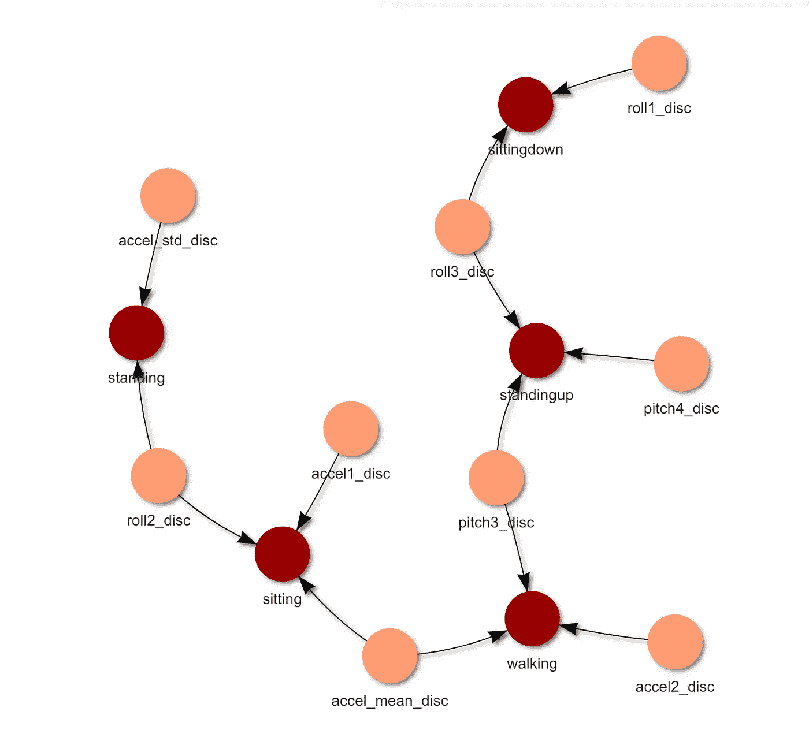

# 环境辅助生活贝叶斯网络

> 原文：<https://medium.com/analytics-vidhya/ambient-assisted-living-bayesian-network-9838fb492659?source=collection_archive---------11----------------------->

作者图片

最近的人口统计分析表明，人口的平均寿命正在延长。这将导致卫生设施用户的增加，对服务质量产生影响。环境辅助生活(AAL)是一个欧洲项目，旨在开发新的非侵入性技术，允许监控老年人在家庭环境中的日常活动，保证延长老年人的生活质量