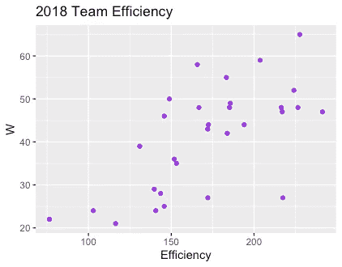
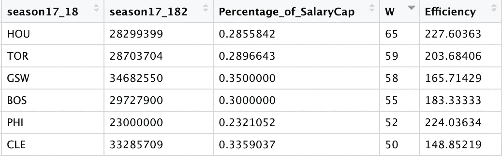
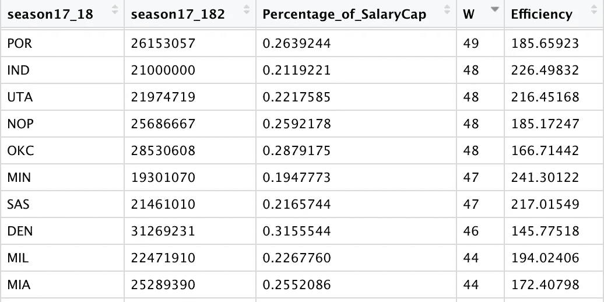
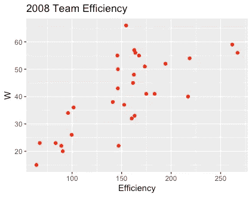
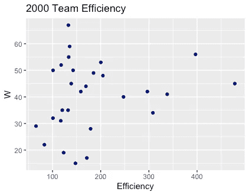
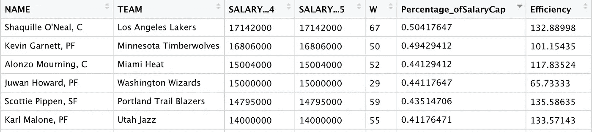
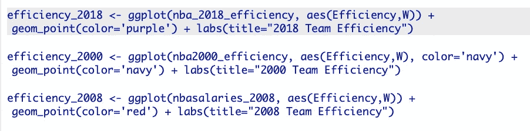
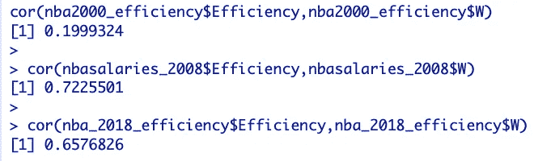
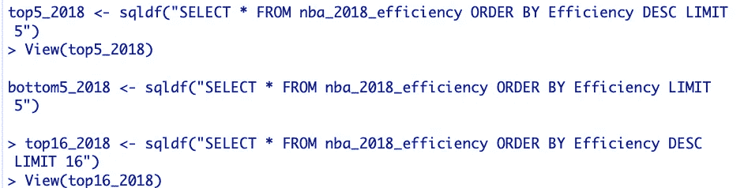

# NBA 工资帽效率分析

> 原文：<https://medium.com/analytics-vidhya/an-analysis-on-nba-salary-cap-efficiency-349a0333e358?source=collection_archive---------12----------------------->

当谈到在国家篮球协会(NBA)中获胜时，是与一个(或两个)超级明星签订最高合同，还是将球队的工资帽分给少数优秀但不是精英的球员，这是更聪明的做法？在给定工资帽分布的情况下，我们如何确定哪些 NBA 球队最有效率获胜？团队效率的历史趋势是什么，这些趋势预示着未来的趋势？

这些是我试图利用现有数据回答的问题。首先，我必须确定一种方法，根据团队的工资单来计算团队的效率。(一个高效的团队是这样一个团队，它赢得了很多比赛，同时尽可能地向他们收入最高的球员支付最少的钱，反之亦然，对于一个低效的团队来说也是如此)。我选定的方法是用一个球队在一个给定的常规赛中赢得的比赛数量除以一个球队中收入最高的球员获得的工资帽的百分比。例如，如果 X 队在一个赛季中赢了 50 场比赛，他们收入最高的球员获得了 X 工资帽的 40(. 4)，那么 X 的团队效率得分(TES)将是 125——得分越高越好。虽然并不完美，但我觉得这种方法可以很好地评估一个超级明星对一个团队的影响，而不是一个薪酬分布更正常的团队——因此也是人才分布更正常的团队。

我用[篮球参考](https://www.basketball-reference.com/contracts/players.html)、 [ESPN](https://www.espn.com/nba/standings/_/season/2018) 、[维基百科](https://en.wikipedia.org/wiki/2018%E2%80%9319_NBA_season)拉数据，还有 Excel 和 SQL 辅助计算和数据清洗。用 R，我画出了每个队的 TES。以下是我的发现:

2017-18 赛季的数据

正如你所看到的，一个球队的 TES 和他们赢得的比赛数量之间有明显的相关性。准确地说，相关系数是 0.66，表明“效率”和“收益”变量是高度相关的。2017–18 赛季效率得分最高的十六支球队中，只有两支球队无缘季后赛(萨克拉门托和芝加哥)。然而，一旦一支球队的 TES 达到 175 左右，他们赢得的额外比赛数量的回报就会递减。这将表明，在一支球队中拥有更正常的人才分布是赢得足够多的比赛以进入季后赛的一个好策略，但想要赢得更大比例比赛的球队应该明智地投资一两个超级巨星，即使以更多的深度为代价。

2017–18 常规赛前 6 名球队

这个理论在上表中是可见的。拥有 6 个最佳战绩的球队名单上都有超级巨星:詹姆斯·哈登、德玛尔·德罗赞*、金州四巨头、凯里·欧文、乔尔·恩比德和勒布朗·詹姆斯。

如果我们看看下面 10 支战绩最好的球队，我们会发现几乎没有一支球队的名单上有一个可以证实的超级巨星；然而，他们中的许多人都有很高的效率分数(超过 200)。这进一步支持了前述理论。

这些发现与过去的季节和时代相比如何？这两种差异有明显的趋势吗？我决定研究 2007-08 和 1999-2000 赛季，以获得跨越三个不同时代的赛季全貌。这是我的发现:

事实证明这里有一个明显的趋势。我们追溯的时间越久远，TES 中位数就越小。2018 年，TES 中位数为 172；2008 年是 157；在 2000 年，这个数字是 145。然而，在所有三个赛季中，胜利的中位数保持大致相同(在 41 和 44 之间)。

这表明效率在当时比现在更不重要。为了证实这一点，我计算了两个图表的相关系数:1999-00 赛季为 0.20，2007-08 赛季为 0.72。换句话说，在 2000 年，工资帽效率和胜率完全不相关，而在 2008 年却有很强的相关性。鉴于 2008 年散点图的线性性质，这是有意义的。

1999-00 赛季前 6 名收入者

那时顶级球员在球队薪资中所占的比例比现在大得多。2000 年，仅沙奎尔·奥尼尔一人就占了湖人工资帽的一半。这个策略得到了回报，湖人最终赢得了 2000 年的 NBA 总冠军。这种策略在经验上也不太明显，因为深度对团队的成功更为重要，这可能是由于当今比赛的节奏更快。2018 年，凯文·杜兰特是所有球队中工资帽最多的球员——35%，比奥尼尔的工资帽减少了 30%。就像沙克的湖人队一样，杜兰特的勇士队最终赢得了 2018 年的冠军。

# 结论

这些趋势清楚地表明，为了赢得足够多的比赛进入季后赛，现在拥有一个平衡的薪水名单比那时重要得多。在你的花名册上有四五个稳定的球员是确保你进入季后赛的明智之举。然而，如果你想让你的球队超越巅峰，你可能需要签一份超级巨星的合同。这加强了我们可能已经知道的东西；NBA 是一个联盟，你几乎总是需要超级明星来赢得很高比例的比赛，因此也赢得冠军。

*我知道很多人不会给德罗赞贴上超级巨星的标签，但是为了这个分析的目的，我对超级巨星的定义更宽松。作为参考，2017-18 赛季德罗赞的 stat 线是 23/7.1/5.2。

在这里看到更多我的作品:[https://github . com/tariqabubakr/NBA-工资帽-效率-分析](https://github.com/tariqabubakr/NBA-Salary-Cap-Efficiency-Analysis)

# **鸣谢**

*   计算球队工资帽效率的一个更好的方法是找出每个球队工资的方差，而不是拿工资最高的球员得到的工资帽的百分比。这样，我就能更好地评估整个团队的资金分配情况，而不是做一个粗略的估计。然而，很难找到所有 NBA 球队的完整工资帽分布，所以我利用我所拥有的。
*   我的 TES 变量在其公式中包含 wins，这意味着独立性假设被违反，因为测量它的 y 轴是 wins 本身。在不考虑成功的情况下计算效率可以解决这个问题，但是我相信结果会是相似的。毕竟，效率直观上是一个团队在限制条件下能够赢得的比赛数量的函数。

# 代码片段

R 绘图代码

计算相关性

SQL 代码的快照