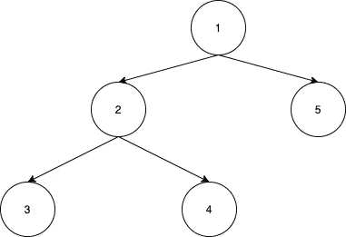
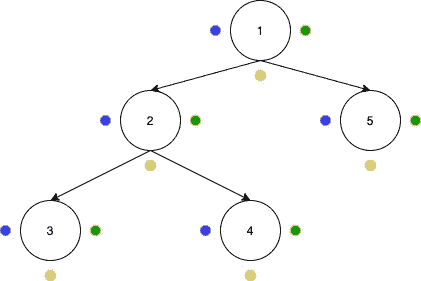
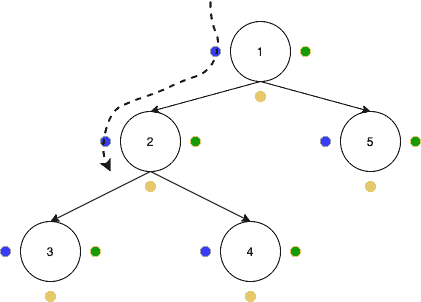
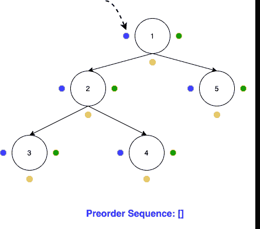
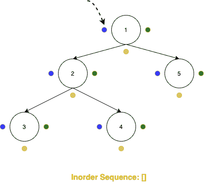
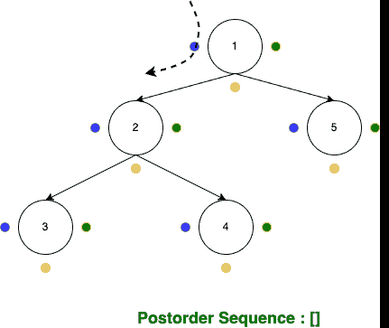

# 一个简单的技巧来获得树遍历结果在一个单一的期待

> 原文：<https://medium.com/analytics-vidhya/an-easy-trick-to-derive-tree-traversal-results-in-a-single-look-8506e83974e4?source=collection_archive---------1----------------------->

这 3 分钟的阅读使人能够用一种技术在一次浏览中遍历二叉树。练习这个令人印象深刻的方法一次，并在你的一生中保持它！！

假设我们要对下图给出的树进行**前序**、**中的**和**后序**遍历:

## 步骤 1:在每个节点周围画 3 个点

如下图所示，在每个节点周围画 3 个点:

## 第二步:开始蛇爬

画完 3 个点后，开始像蛇一样绕着树爬行。从根节点的左侧开始，沿着整个树爬行，到达树的右侧时结束。为了更好地解释，请遵循下图中围绕整个树绘制的虚线:

## 步骤 3a:获得前序遍历的结果

在爬行过程中，当您到达一个“蓝色”点(即位于节点左侧的点)时，记下该节点的值。由所有这些标注的值获得的序列是前序遍历的结果。为了更好的解释，请看下图:

## 步骤 3b:获得顺序遍历的结果

在爬行过程中，当您到达一个“黄色”点(即位于节点底部的点)时，记下该节点的值。由所有这些标注的值获得的序列是顺序遍历的结果。为了更好的解释，请看下图:

## 步骤 3c:获得后序遍历的结果

在爬行过程中，当您到达一个“绿色”点(即位于节点右侧的点)时，记下该节点的值。由所有这些标注的值获得的序列是后序遍历的结果。为了更好的解释，请看下图:

## **结论**

在这个故事中，我们学习了如何查看一棵二叉树，并推导出它的前序、中序和后序遍历。