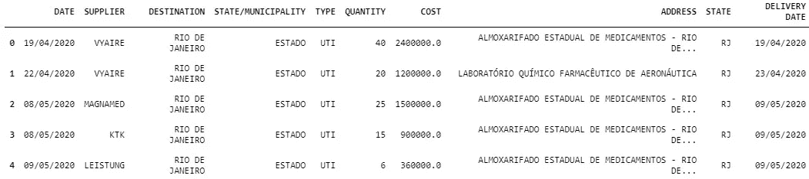
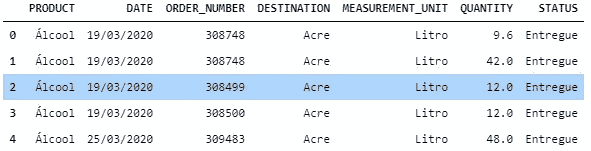
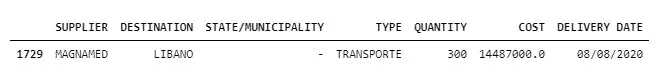
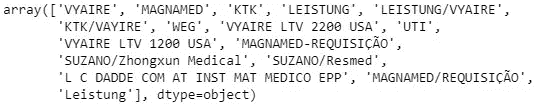
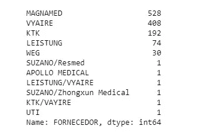
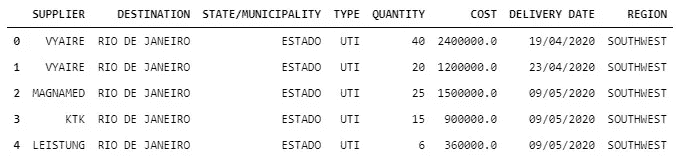

# 巴西新冠肺炎物资分配分析

> 原文：<https://medium.com/analytics-vidhya/an-eda-of-the-distribution-of-supplies-for-covid-19-in-brazil-f0f578ba2b82?source=collection_archive---------22----------------------->

使用 Plotly 和 Datapane 发布交互式绘图


照片由 [cottonbro](https://www.pexels.com/pt-br/@cottonbro?utm_content=attributionCopyText&utm_medium=referral&utm_source=pexels) 在 [Pexels](https://www.pexels.com/pt-br/foto/conceitual-abstrato-cura-solucao-3923156/?utm_content=attributionCopyText&utm_medium=referral&utm_source=pexels) 拍摄

这是我的[原创帖子](https://marianaalm.medium.com/como-o-brasil-distribuiu-insumos-para-o-covid-publicando-uma-eda-com-datapane-66810828c5f8)的葡萄牙语英文版。

# 介绍

**疫情和巴西的公共卫生系统**

新冠肺炎·疫情给巴西医疗保健系统带来了比以往更大的压力。SUS(全民保健系统)负责为 70%以上的巴西人口提供服务，这些人无法享受私人保健系统的服务。

根据 2020 年 3 月公布的 AMIB(巴西重症医学协会)的一项研究，巴西有 45，848 张 ICU 病床，其中约 49% (22，844 张)在公共医疗保健系统中。显然，重症监护室床位的比例并不符合依赖公共系统的人口比例。

截至本文发布之日，巴西因 COVID 导致的死亡人数超过 195，000 人，确诊病例超过 700 万例。计算其中的 70%,大致了解一下疫情对 SUS 造成的压力。

**项目和使用的技术**

该项目旨在对巴西抗击新冠肺炎的物资分配数据进行探索性数据分析。

探索性数据分析是理解数据集的基本步骤。但是，比创建包含大量数据的高效代码更重要的是知道如何交流结果。

[Plotly](https://plotly.com/python/getting-started/) library 协助制作互动且吸引人的图形。这些图形可以直接在 Jupyter 笔记本上查看，也可以在网上发布。

在这篇文章中，我将展示如何使用 [Datapane](https://datapane.com/) 平台发布 plotly 图形。

**数据来源**

关于[机械呼吸机](https://dados.gov.br/dataset/distribuicao-de-respiradores)和[个人防护设备](https://dados.gov.br/dataset/distribuicao-de-equipamentos-de-protecao-individual-e-insumos-covid-19)分布的数据是从[巴西开放数据门户](https://dados.gov.br/)(葡萄牙语链接)收集的。数据收集于 2020 年 12 月。

以下章节的描述是对原始[代码](https://github.com/mlfa03/Data-Science-Projects/blob/main/Health%20Data/Distribution_Equipment_Covid_Brazil/covid-supplies-brazil.ipynb)的总结。

# 安装库/包


照片由[像素](https://www.pexels.com/pt-br/foto/aco-bancada-de-trabalho-chave-inglesa-ferramentas-162553/?utm_content=attributionCopyText&utm_medium=referral&utm_source=pexels)中的 [Pixabay](https://www.pexels.com/pt-br/@pixabay?utm_content=attributionCopyText&utm_medium=referral&utm_source=pexels) 拍摄

第一步是安装用于可视化的 Plotly 库和用于发布报告的 Datapane:

```
!pip install datapane!pip install plotly*#Interactive visualizations*
**import** **plotly.offline** **as** **py**
**import** **plotly.express** **as** **px**
**import** **plotly.graph_objs** **as** **go**
```

要在 Datapane 平台上发布报告:

```
*#Report Publishing*
**import** **datapane** **as** **dp**
```

# 了解数据


Tobias Fischer 在 [Unsplash](https://unsplash.com/s/photos/database?utm_source=unsplash&utm_medium=referral&utm_content=creditCopyText) 上拍摄的照片

用于机械通气机分布的数据集具有 10 个变量，用于 PPE 分布的数据集具有 7 个变量。

翻译完数据集上的信息后，我们有:

**呼吸机数据集分布**



**PPEs 数据集分布**



# 数据清理


照片由 [cottonbro](https://www.pexels.com/pt-br/@cottonbro?utm_content=attributionCopyText&utm_medium=referral&utm_source=pexels) 在 [Pexels](https://www.pexels.com/pt-br/foto/apartamento-descalco-sem-sapato-vassoura-4684372/?utm_content=attributionCopyText&utm_medium=referral&utm_source=pexels) 拍摄

**呼吸机数据集**

*   删除重复数据

```
df_vent.duplicated().sum()491df_vent = df_vent.drop_duplicates()
```

*   目的地显示巴西向黎巴嫩捐赠了 300 台通风机，因此删除了这一行:



*   在有重复的情况下，供应商的名称得到了纠正。对带有少量呼吸机的供应品进行分组，以便改善数据的最终可视化:

```
df_vent['SUPPLIER'].unique()
```



```
df_vent['SUPPLIER'] = df_vent['SUPPLIER'].replace(['MAGNAMED-REQUISIÇÃO', 'MAGNAMED/REQUISIÇÃO', 'VYAIRE LTV 1200 USA', 'VYAIRE LTV 2200 USA', 'L C DADDE COM AT INST MAT MEDICO EPP', 'Leistung' ], ['MAGNAMED', 'MAGNAMED', 'VYAIRE', 'VYAIRE', 'APOLLO MEDICAL', 'LEISTUNG' ])df_vent['SUPPLIER'].value_counts()
```



```
df_vent['SUPPLIER'] = df_vent['SUPPLIER'].replace(['APOLLO MEDICAL', 'KTK/VAYIRE', 'SUZANO/Resmed', 'SUZANO/Zhongxun Medical', 'LEISTUNG/VYAIRE', 'UTI'], 'VÁRIOS')
```

*   按区域划分数据:创建一个字典，其中包含来自目标列的惟一值作为键，区域名作为值。

巴西有 26 个州，分为 5 个主要地区:北部、东北部、西南部、中西部和南部。

按地区显示数据可能会提供关于数据的有力见解，因为该国南部和西南部地区的人类发展指数较高。西南地区是巴西的经济核心，是里约热内卢州和圣保罗州的所在地。北部和东北部更加脆弱，因为这些地区的经济和人类发展指标较低。中西部是一个中间地区。这是这个国家的首都所在地。就人口而言，这个地区不像西南部那样人口稠密，主要的经济活动是农业。

```
df_vent['REGION']=df_vent['DESTINATION'].map(dict)
df_vent.head()
```



*   从交付日期列中提取月份:

```
df_vent['DELIVERY DATE'] = pd.to_datetime(df_vent['DELIVERY DATE'], errors='coerce')df_vent['MONTH'] = pd.DatetimeIndex(df_vent['DELIVERY DATE']).month
```

**PPEs 数据集**

*   重复数据已被删除
*   没有空数据
*   从日期列中提取月份

```
df_ppe['MONTH'] = pd.DatetimeIndex(df_ppe['DATE']).month
```

# 形象化


摄于[像素](https://www.pexels.com/pt-br/foto/abstrair-abstrato-acrilico-aparencias-1395074/?utm_content=attributionCopyText&utm_medium=referral&utm_source=pexels)的[斯蒂夫·约翰森](https://www.pexels.com/pt-br/@steve?utm_content=attributionCopyText&utm_medium=referral&utm_source=pexels)

要发布创建的图，需要执行下面的命令来登录 Datapane 平台。因此，当执行发布图表的命令时，将为其在平台上的发布生成链接:

```
dp.login(token='your_token')
```

当在 Datapane 平台上注册时，将生成一个令牌用于发布。此令牌位于您的个人资料页面。

为了不延长文章的篇幅，生成完整报告的代码将只在最后出现一次。要查看生成图的完整代码，您可以在 [github](https://github.com/mlfa03/Data-Science-Projects/blob/main/Health%20Data/Distribution_Equipment_Covid_Brazil/covid-supplies-brazil.ipynb) 上访问它。

**图 1 —按类型划分的通风机分布**

机械通气机可以适于运送(运送病人)或固定在 ICU 病床上。在下图中，我们可以看到截至 2020 年 12 月每种类型的分发量:

**图 2——按地区划分的每月呼吸机支出**

每个地区每月花费多少钱来购买呼吸机？我们可以在下面的折线图中看到，东南部地区是第一个设备投资达到峰值的地区，其次是北部、中西部、南部和东北部地区。按地区划分的投资额似乎遵循了疫情在整个巴西的传播速度。

值得注意的是，东南部和北部地区在最初几个月出现了病例和死亡高峰。在东南部，由于圣保罗和里约热内卢的病例呈指数增长，出现了高峰。在北部地区，亚马逊州的马瑙斯是巴西所有城市中情况最糟糕的([，也是世界上情况最糟糕的城市之一](https://www.telegraph.co.uk/global-health/science-and-disease/brazils-covid-19-epicentre/))，病例和死亡人数都达到了高峰，而医院则完全爆满，墓地里也排起了长队。

南部和中西部地区的增长在年中达到顶峰:

**图 3——按区域划分的呼吸机总分布**

**图 4 —各地区呼吸机单位成本**

各地区球迷的平均单位成本相差不大，在 55，000 到 51，000 巴西雷亚尔(11，000 到 10，000 美元)之间，北部地区的球迷单位成本最高，东北部地区的球迷单位成本最低。

**图 5 —供应商提供的通风机数量**

巴西医疗设备制造商 Magnamed 是机械呼吸机的主要来源。由于从中国购买的货物没有得到确认，巴西被迫转向当地工业以获得必要的通风设备。

**图 6 —发放的个人防护用品类型和数量**

从下图中我们可以看出，外科口罩是 2020 年发放的主要个人防护装备。

许多医护人员报告说，许多医院缺乏个人防护用品。在由 [Cotrin 及其合作者](https://journals.sagepub.com/doi/full/10.1177/0046958020963711)进行的一项研究中，相当多的护士报告称仅部分拥有必要的个人防护设备，而更多的牙医和医生报告称他们在工作环境中拥有个人防护设备。

**完整报告**

使用下面的代码生成完整的报告:

```
dp.Report(dp.Blocks(dp.Plot(fig2), dp.Plot(fig3), dp.Plot(fig1), columns=2, rows=2), dp.Plot(fig4), dp.Plot(fig5), dp.Plot(fig6), dp.Blocks(dp.Plot(fig7), dp.Plot(fig8), columns=2, rows=1), dp.Plot(fig9), dp.Plot(fig10)).publish(name='Distribution of Supplies for COVID in Brazil - 2020', open=**True**)
```

在此处可以找到研究地块的完整报告[。](https://datapane.com/u/mlfa03/reports/distribution-of-supplies-for-covid-in-brazil-2020/)

感谢你花时间阅读这篇文章！任何意见或建议都将受到欢迎。

要阅读更多我的数据科学帖子，请查看:

[](/ai-in-plain-english/market-segment-analysis-part-1-analyzing-and-clustering-data-7758421fada8) [## 市场细分分析第 1 部分—分析和聚类数据

### k-means 算法和降维技术在信用卡数据中的应用

medium.com](/ai-in-plain-english/market-segment-analysis-part-1-analyzing-and-clustering-data-7758421fada8) [](/analytics-vidhya/practical-ml-part-3-predicting-breast-cancer-with-pytorch-efc469242bfe) [## 实用 ML 第 3 部分:用 Pytorch 预测乳腺癌

### 用神经网络构建分类器预测乳腺癌

medium.com](/analytics-vidhya/practical-ml-part-3-predicting-breast-cancer-with-pytorch-efc469242bfe) [](/analytics-vidhya/practical-ml-part-2-nlp-on-amazon-alexa-reviews-4b0b3a15f4bf) [## 实用 ML 第 2 部分:亚马逊 Alexa 评论的 NLP

### 使用 NLP 技术评估客户评论的项目

medium.com](/analytics-vidhya/practical-ml-part-2-nlp-on-amazon-alexa-reviews-4b0b3a15f4bf) [](/analytics-vidhya/practical-ml-part-1-covid-19-in-brazil-239977d16f95) [## 实用 ML 第 1 部分:巴西的新冠肺炎

### 实施机器学习模型来预测巴西的新冠肺炎死亡人数

medium.com](/analytics-vidhya/practical-ml-part-1-covid-19-in-brazil-239977d16f95)