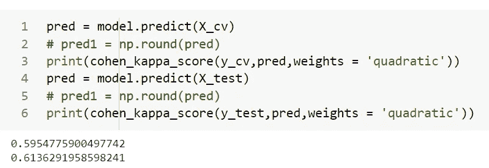

# 人群鲜花搜索结果相关性的端到端案例研究

> 原文：<https://medium.com/analytics-vidhya/an-end-to-end-case-study-on-crowd-flower-search-results-relevance-7229243f4d12?source=collection_archive---------18----------------------->

一个简单的 NLP 数据集，可以让你快速进行文本清理、预处理和训练。


如果你是机器学习的初学者，并且想在一个简单的 NLP 数据集上工作，我绝对推荐你去看看这个 Kaggle [挑战](https://www.kaggle.com/c/crowdflower-search-relevance)，并在进一步阅读之前尝试自己解决它。

在这个挑战中，我接触了清理 HTML 标签、分析直方图、构建自定义 W2V、用于矢量化的 TFIDF-W2V、处理有序目标标签、生成 n 元语法、使用 SVD 进行降维、部署在云服务器中。

## 目录:

1.  引言。
2.  探索性数据分析。
3.  绩效指标。
4.  第一种方法。
5.  文本清理
6.  文本矢量化。
7.  高级特征工程。
8.  建模。

## 1.简介:

为了评估搜索相关性，CrowdFlower 让他们的用户评估了一些电子商务网站的搜索结果。总共生成了 261 个搜索词，CrowdFlower 整理了一个产品及其对应搜索词的列表。人群中的每个评价人被要求给产品搜索词打 1、2、3、4 分，其中 4 分表示该商品完全满足搜索查询，1 分表示该商品不匹配搜索词。给出搜索词以及相应的产品标题和产品描述，如果组合合适，则给出 4 分，否则给出 1 分。

## **2。探索性数据分析:**

比赛中给出的训练数据不到 5MB，有 10156 个数据点。


训练文件样本数据点

***2.1 了解列车数据:***

1. ***Id*** —行的唯一标识符。
2。 ***查询*** —关于查询的文本。
3。 ***产品 _ 标题*** —关于产品标题的文本。
4。 ***产品 _ 描述*** —关于产品描述的文字。
5。***Median _ relevance***—3 位评分者给出的中值关联分数
6。***relevance _ Variance***—这三位评分者给出的相关分数的方差。

让我们将目标值分布可视化:


观察:

*   数据非常不平衡。大多数数据点来自第 4 类。非常少的数据点属于 1 类

***2.2 检查 NAN 值。***

我真的很喜欢 missingo 库，它以可视化的方式识别缺失的值。

```
ax = missingno.matrix(df)
```


在 product_description 列中观察到许多空格，表示缺少值

```
print('Percentage of points that are having missing values',round(sum(df.product_description.isna())/df.shape[0]*100,2),'%')
```

缺失值点的百分比为 24.06 %

```
# I cannot just drop the 24.06% of the points randomly.
# I will fill the missing values with an empty string
df.product_description.fillna('',inplace=True)
```

***2.3 数据分析的功能【查询】***

让我们检查一下查询列中是否有重复的文本:

```
df['query'].value_counts()
```


列查询中的唯一类别

想象查询句子的长度:


*查询文本分析:*

*   总共 261 个独特的类别→我们可以在此列上进行任何分类编码。
*   大多数类别会重复 30-50 次
*   无线鼠标是最常见的查询，在数据中出现了 113 次，玩偶之家浴缸在数据中出现的次数最少，为 8 次

***2.4 特征‘产品 _ 标题’的数据分析***

让我们来看一些关于 product_title 特性的统计数据


想象句子的长度:

```
product_title_len = df.product_title.str.len()
plt.plot(sorted(product_title_len))
```


再深入一步，


句子的长度和目标变量有关系吗？

```
sns.histplot(data = df, x = 'product_title_len', y = 'median_relevance')
```


与查询中的常用词、产品标题、目标分数有关系吗？


*分析*:

*   查询和产品标题之间的常用词越多，获得强评级的机会就越高。
*   我们不能仅基于产品标题长度进行任何分析，因为所有类别都是重叠的。
*   简单的文本数据→我们可以在这个栏目上做 TFIDF，W2V，TFIDF_W2V。

***2.5 EDA 产品描述:***

让我们想象一下句子的长度


再深入一步，

```
start = 99.9
for i in range(10):    
    print('{:.2f}th percentile value is {:.1f}'.format(start,np.percentile(df.product_description_len,start)))
    start+=0.01
out= sum(df.product_description_len>10**3)
print('{} product titles have length>145 i.e greater than 99.96 percentile'.format(out))
```


当我们看到 product_description 和 product_title 中的常用词计数时，即使有超过 40 个常用词，中值相关性也几乎是平均分布的。


> 注意:类别 4 的数据点数非常多，因此只需查看上面的图表，就可以得出结论:product_title 和 product_description 中的常用词越多，相关性就越好，这是不正确的，因为类别之间的计数相差不大。

***2.6 检查 HTML 值:***

```
check_html(df[‘query’])
# Output
Time take to run is 0:00:00.861348
Number of rows with html code 0check_html(df[‘product_title’])
# Output
Time take to run is 0:00:01.067391
Number of rows with html code 0check_html(df[‘product_description’])
# Output 
Time take to run is 0:00:00.730124
Number of rows with html code 94
```

检查文本数据中是否存在 HTML 标记很重要，更重要的是哪一列有 HTML 标记。因此，我们只能从特定的列中删除 HTML 标签。如果您正在处理大型数据集，这肯定会节省一些时间。

**2.7 理解测试数据:**


> Kaggle 给出的测试数据很大，有 22513 个数据点，并且可能有许多在评估过程中被忽略的人为值。测试数据中没有 **relevance_variance** 列。

## **3。绩效指标:**

这里的目标变量本质上是有序的。我们不能使用简单的分类指标，如准确度或 F1 分数。如下图所示:


上述代码的结果

因此，准确性需要更高分数的准确类别标签，因此，即使类别标签接近实际数据，它也会给我们相同的结果。

但是如果预测的类接近实际的训练数据，kappa 分数将给出更好的结果。关于如何实现二次 kappa 评分的更多细节，我推荐查看这个漂亮的 Kaggle [内核](https://www.kaggle.com/carlolepelaars/understanding-the-metric-quadratic-weighted-kappa)。

你可能会想为什么不是 MSE。仅供参考，情况 1 的 MSE 将返回 7.5，情况 2 的 MSE 将返回 1。要提高 Kappa 分数，你可以做两件事:

1.  建立降低 MSE 的回归模型，观察到降低的 MSE 给出更好的 Kappa 分数。训练后，我们可以四舍五入到最接近的整数，以获得类标签。

> *选择阈值:*
> 
> 由于回归可以取从 0 到无穷大的任何值，所以可以说低于 0.5 的值为 0 级，介于 0.5 和 1.5 之间的值为 1 级，介于 1.5 和 2.5 之间的值为 2 级，介于 2.3 和 3.5 之间的值为 3 级，高于 3.5 的值为 4 级。
> 
> 因此，系数是:[0.5，1.5，2.5，3.5]
> 
> 这些系数可能是也可能不是最佳的。请记住，我们正试图获得最佳系数，从而提高评估指标。你可以使用这个[内核](https://www.kaggle.com/c/petfinder-adoption-prediction/discussion/76107)得到最好的系数。

2.直接用 Kappa 评分作为损失函数。(这可能很难做到)

## **4。第一次切割方法:**

现在，我们对数据有了更多的了解。最简单的方法是使用一次性编码将查询转换为向量，将文本数据(product_title 和 product_description)转换为数字形式，并拟合像逻辑回归这样的基线模型。


最简单的训练模型

您也可以尝试线性回归，将结果四舍五入到最接近的整数。

## **5。文本预处理:**

***5.1 清理 HTML***

Beautiful soup 让生活变得简单，只需两行代码就可以从字符串中移除 HTML 标签。

***5.2 字替换:***

意思相近的词用常用词代替，例如:


有相似意思并且将被替换的单词的简短列表。

这个列表摘自本次竞赛的获奖答案，感谢作者花时间在数据中寻找这些细微的差异。

***5.3 去词干、去收缩和去停用词:***

这些是你在任何 NLP 问题中会用到的常用技巧，你可以在下面找到代码:

***5.4 总结加工步骤:***

HTML 标签删除→单词替换→词干提取→去收缩→删除标点符号→停止单词删除

所有预处理步骤

## 预处理有必要吗，会给我们带来什么？

下面是预处理前后查询和标题 100%匹配的数据点的百分比。


> 正如您所注意到的，在没有预处理的情况下，有 41%的数据点在查询中的所有单词都出现在标题中，但是在预处理之后，这一比例增加到 49%(在中值相关度为 4 的数据点中)。

## **6。文本矢量化:**

在开始此步骤之前，请确保您已经正确分割了培训数据。

***6.1 处理查询数据:***

请确保用' _ '替换所有空格，以创建一个类别。

```
# Replacing space with underscore to make it a single word.
df['cleaned_query'] = df.apply(lambda x : x['query'].replace(' ','_'),axis = 1)
```


用下划线替换后

对 *cleaned_query* 列进行一次性编码的代码。

如果没有用下划线替换空格，那么计数矢量器

1.  将每个单词视为一个独特的功能，比如在数据点“无线鼠标”，我们不希望“无线”是一个功能，“鼠标”是单独的一个功能，我们希望组合应该是独特的。

2.不必要地增加了数据的维度。

***6.2 使用 TFIDF 矢量器*** 处理产品标题和产品描述

对于这两个数据点，我们将进行简单的 TFIDF 矢量化，这是 product_title 的代码，您可以遵循 product_description 的相同方法。

***6.3 使用平均 W2V 处理产品 _ 标题和产品 _ 描述:***

在本节中，我们将为我们的文本数据创建一个单词到矢量的模型，预训练的单词嵌入可以从这个[链接](https://nlp.stanford.edu/projects/glove/)下载。

在下面的代码中，我们首先加载 glove 向量，现在对于每个句子中的每个单词，如果单词 embedding 存在于 glove 文件中，则获取向量(model.get( <word>))。基于存在的嵌入数目，我们计算平均值。</word>

> 注意:确保在使用单词到向量时没有做词干处理，因为词干处理会导致单词的不同形式，并且这个单词可能是非英语单词。例如，词干(' batteries ')会给我' batteri '，而这个单词不会出现在单词嵌入文件中。
> 
> 有其他解决方法吗？
> 
> 是的，你可以做词汇化来解决这个问题，因为它返回一个实际的英语单词。

***6.4 使用 TFIDF-W2V 处理文本数据:***

我们将乘以相应的 TFIDF 值，然后取单词嵌入的平均值，而不是取单词嵌入的简单平均值。

## 7.高级特征工程。

设 C —查询、标题和描述的所有组合—(查询、标题)、(标题、描述)、(描述、查询)。

*   每个文本特征中的总字数。
*   c 语言中的常用字数。
*   c #中唯一的常用字数。
*   标准化常用字数-将常用字数除以两列之间的最大字数。

*   C 语言中常见的二元模型计数，唯一的二元模型计数以及 C 语言特性中所有可能的比率。
*   C 中常见的三元组计数，唯一的二元组计数和 C 中所有可能的比率特征。
*   统计查询、描述、查询中的位数。

## 8.建模:

***8.1 基线模型:***

让我们尝试第一种方法:


基线模型的结果。

***型号— 2:***

1.  我使用截断奇异值分解来减少维数，主要是为了避免过度拟合和训练更快。
2.  标准化 SVD 输出。
3.  对标准化数据应用核 SVM(RBF)。



> 我得到了 0.614 作为测试数据的 Kappa 分数，但这个分数可以通过堆叠更复杂的模型来显著提高。

未来工作:

1.  训练更复杂的模型并堆叠它们以克服过度拟合问题。
2.  实现基于距离的特征—余弦相似性、Jaccard 距离、所有组合之间的骰子距离。

博客中使用的所有代码都有清晰的文档记录，可以在这个[资源库](https://github.com/GowthamChowta/30daysofNLP)中找到。也可以在 [LinkedIn](https://www.linkedin.com/in/gauthamchowta/) 上联系我。

**参考文献:**

1.  [本次比赛的第一名方案。](https://github.com/ChenglongChen/kaggle-CrowdFlower/blob/master/Doc/Kaggle_CrowdFlower_ChenglongChen.pdf)
2.  [应用人工智能课程。](https://www.appliedaicourse.com/)
3.  [第二名进场和代码。](https://www.kaggle.com/c/crowdflower-search-relevance/discussion/15299)


如果你觉得这个博客有用，请点击拍手按钮，让我的一天更快乐..:)