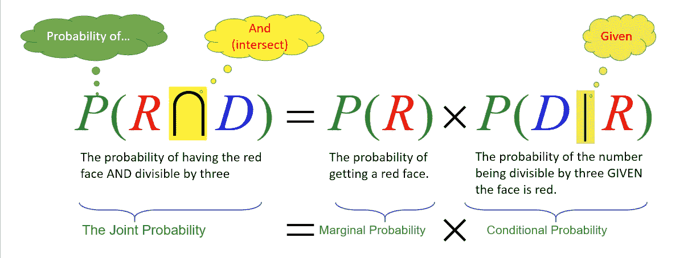
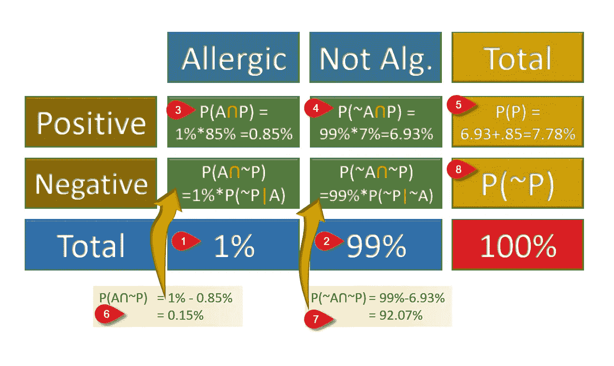

# 贝叶斯定理导论

> 原文：<https://medium.com/analytics-vidhya/an-introduction-to-bayes-theorem-c5d9193fb902?source=collection_archive---------8----------------------->

## *为数据科学学习者简单解释贝叶斯概率定理*

照片由 [Riho Kroll](https://unsplash.com/@rihok?utm_source=unsplash&utm_medium=referral&utm_content=creditCopyText) 在 [Unsplash](https://unsplash.com/?utm_source=unsplash&utm_medium=referral&utm_content=creditCopyText) 上拍摄

在现实生活中，我们可以知道一个事件相对于其他事件的发生次数。例如，让我们掷一个公平的骰子。我们知道每个面都有相等的机会出现，所以我们说得到任何面的理论概率是面的数量的倒数，即 1/6，因为常规骰子有六个面。

作者图片

如果我们把显示奇数质数的脸涂成红色(即 3，5)，我们就有两个红色的脸和四个白色的脸。如果我们掷骰子，出现红脸的概率将是两张脸/总共 6 张脸，2/6=1/3。同样，掷骰子得到白脸的概率是 4/6 或 2/3。

如果有人掷出彩色骰子，得到一张红脸，它被三整除的概率会是多少？回答这个要分成两个顺序问题，第一个得到被红的概率(上一段的 1/3)，被红且能被三整除的概率；换句话说:给定脸是红色的，被 3 整除的概率。红色的脸只有两张脸{3，5}，所以唯一能被三整除的脸是{3}，它是两张脸(一半脸，或 1/2)中的一张。所以，脸变红并能被三整除的概率就是得到数字 3 的概率，数字 3 是六张脸中的一张或 1/6。换句话说，给定脸是红色的，我们可以通过将被红色的概率乘以被 3 整除的概率来获得相同的结果；即 1/3 * 1/2 = 1/6。

我们可以用方程式的形式写出答案如下:

作者图片

请注意联合概率、边际概率和条件概率的名称。此外，我们可以定义运算符“~”，读作“NOT”，因此红色的面不是白色的(~W)，因此我们可以将前面的等式写成

作者图片

作者图片

如果我们换个方式问这个问题会怎么样:得到一个被 3 整除的数和一张红脸的概率是多少？能被三整除的数是{3，6 }；他们的概率是 2/6=1/3，而红脸数是{3，5 }；被三整除给定的红脸概率是{3}/{3，6}=1/2。因此，*P(D∩R)= P(D)*×*P(R | D)= 1/3*×1/2 = 1/6

我们注意到它有相同的结果，即*P(R∩D)*=*P(D∩R)*，从上图可以明显看出。

看起来不错！对吗？

你注意到了什么？什么都没有？没问题。但是托马斯·贝叶斯注意到了一些好的方面！

我们可以重新排列这两个方程，找到一些有趣的东西。

条件概率的贝叶斯定理(图片由作者提供)

让我们用这个公式来解决另一个简单的问题:如果我们掷出彩色骰子，在给定面部颜色为白色(W)的情况下，数字为偶数(E)的概率是多少？如果白脸给偶数的概率是 100%？

我们将使用贝叶斯定理来解决这个问题。

你可以把这个理解为偶数给定白的概率=偶数的边际概率×白面给定偶数的条件概率÷白的边际概率。

我们可以通过构建一些有用的表来获得相同的结果，一个用于事件的计数，一个用于概率:

每个边缘事件(蓝色或黄色)和联合事件(绿色)的计数。[图片由作者提供]

请注意，每行和每列的总和都写在表格的边缘。要将此表转换为概率表，我们应该将每个数字除以出现的总次数，即 6。

作者图片

请注意，红细胞应该始终是 100%。然而，这个表有时被称为[混淆矩阵](https://en.wikipedia.org/wiki/Confusion_matrix)或联合表。概括地说，我们可以将每个盒子的概率名称写成如下:

作者图片

这个表显示了边际概率和联合概率，但是条件概率呢？它嵌入在绿色方框中，如下所示:

作者图片

现在我觉得更清楚了。让我们玩一个更难的问题。

> 如果一个城市的人对某样东西过敏 1%。我们得到了一个测试套件，它给出了 85%的真阳性和 7%的假阳性。那么，测试给出“肯定”结果的概率是多少，这是真的概率是多少？

真阳性意味着测试试剂盒对真正过敏的人给出阳性结果，而假阳性意味着测试对不过敏的人产生阳性结果。同样，您可以定义真阴性和假阴性结果。

现在我们开始构建概率表:

作者图片

这是什么？吉文是什么？

我们有过敏的边际概率， *P(A)* ，是 1%，那么我们也有不过敏的概率， *P(~A)* ，是 100-1= 99%。该测试试剂盒给出 85%的真阳性，这是阳性的概率，假定过敏，或 *P(P|A)=85%* 。此外，我们有 7%的假阳性，这意味着当患者不过敏时阳性结果的概率；即 *P(P|~A)* =7%。让我们把这些结果放在表格里。

填概率表的顺序[图片由作者提供]

正如我们所看到的，我们开始按顺序填写表格，从 *P(A)* =1%开始，然后 *P(~A)* =99%，然后在框#3 中， *P(A)* =1%，以及 *P(P|A)* =85%，然后我们计算 *P(A∩B)* 作为他们的乘积= 0.85%，类似地在框#4 中，然后我们计算 3 和 4 的和如#6 和#7 所示，通过从总计行中减去正行来计算负行。最后，通过减去行或加上列来计算方框 8:100%-7.78% = 0.15%+92.07% = 92.22%。

从这个表中，我们可以很容易地解决这个问题。测试给出结果的概率(阳性)=P(P)=7.78%，其中 0.85%为真，6.93%为假。但如果只判断阳性结果，可以说 0.85/7.78 = 10.92%的阳性结果反映的是真正的阳性！或者，按贝叶斯法则:P(A | P)=[P(A)* P(P | A)]/[P(P)]=[1% * 85%]/[7.78%]= 0.85/7.78 = 10.92%。如你所见，我们从阳性给定过敏的概率计算出过敏给定阳性的概率，这是这个规则的核心。

# 对于培训:

1.  在公园里，我们经常看到烟(30%)，大部分来自像烧烤这样的正常活动。很少发生危险火灾(0.5%)；然而，这些火灾中有 8%是没有烟雾的！如果我们看到一团烟，发生危险火灾的可能性有多大？
2.  我们把 100 个球放在一个盒子里。其中 40 个是塑料的，其余的是玻璃的。这些球不是白色的就是红色的；其中 12 个塑料球是红色的，总共有 70 个白色的球。*两个问题:* a .如果我们随机抽一个球，它是玻璃做的，它是白色的概率是多少？如果我们随机抽取一个球，它是红色的；它的概率是多少，不是塑料？

# 摘要

我们展示了什么是贝叶斯定理以及如何计算边际概率、联合概率和条件概率。

## 关于作者:

*   通过 [LinkedIn](https://www.linkedin.com/in/drnesr/) 联系我
*   跟着我上[研究门](https://www.researchgate.net/profile/Mohammad-Elnesr)。

> 非常欢迎所有的评论、更正和建议

# 参考资料和进一步阅读

 [## 机器学习的贝叶斯定理简介——机器学习掌握

### 贝叶斯定理提供了一种计算条件概率的原则方法。这是一个看似简单的…

machinelearningmastery.com](https://machinelearningmastery.com/bayes-theorem-for-machine-learning/)  [## 贝叶斯定理

### 想知道计算机是如何了解人的吗？在网上搜索“电影自动鞋带”会出现“回到…

www.mathsisfun.com](https://www.mathsisfun.com/data/bayes-theorem.html)  [## 贝叶斯定理的直观(简短)解释

### 贝叶斯定理是一篇详细文章的主题。这篇文章很好，但是超过 15，000 字——这是…

betterexplained.com](https://betterexplained.com/articles/an-intuitive-and-short-explanation-of-bayes-theorem/)