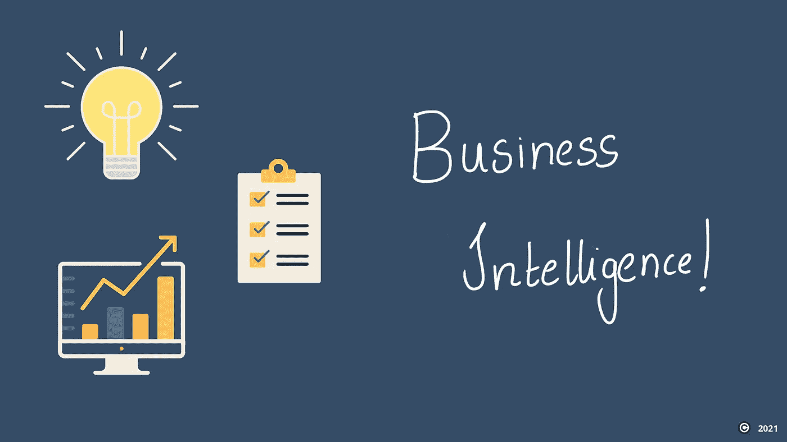

# 商业智能介绍—您需要了解的商业智能角色、职责和流程的基础知识。

> 原文：<https://medium.com/analytics-vidhya/an-introduction-to-business-intelligence-the-basics-of-bi-roles-responsibilities-processes-you-27a288e9617e?source=collection_archive---------1----------------------->

**商业智能到底是什么？**

由 Canva 制成

对于任何业务流程或组织来说，收集数据并使用它来获得有价值且可操作的见解的想法并不新鲜。无论业务的性质/领域如何，组织总是喜欢数据。的…