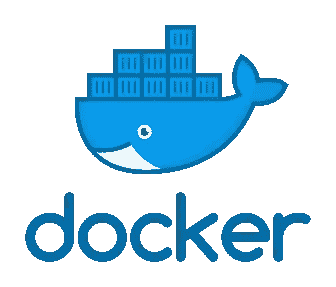

# Docker 简介

> 原文：<https://medium.com/analytics-vidhya/an-introduction-to-docker-be026b002fea?source=collection_archive---------18----------------------->



# docker 是什么？

Docker 是一组平台即服务产品，使用操作系统级虚拟化来交付称为容器的软件包中的软件。容器是相互隔离的，并且捆绑了它们自己的软件、库和配置文件。他们可以通过明确定义的渠道相互交流。

# 我们为什么使用它？

它允许我们轻松地创建、部署和运行我们的代码/应用程序。Docker 提供了灵活性，并潜在地减少了所需的系统数量，因为有一些组件叫做**映像、容器和注册表。**

## 图像

Docker 映像是一个只读模板，包含一组用于创建可以在 Docker 平台上运行的容器的指令。它提供了一种方便的方法来打包应用程序和预配置的服务器环境，您可以将其用于自己的私人用途，或者与其他 Docker 用户公开共享。

## 容器

容器是图像的可运行实例。您可以使用 Docker API 或 CLI 创建、启动、停止、移动或删除容器。您可以将容器连接到一个或多个网络，为其附加存储，甚至基于其当前状态创建新的映像。

## 登记处

Docker 注册表是命名 Docker 映像的存储和分发系统。注册中心允许 Docker 用户从本地获取图像，也可以将新图像推送到注册中心(如果有足够的访问权限)。

# 安装:

首先，在 docker hub 中创建一个 id，然后安装 docker 桌面。或者您可以在**码头游乐场进行以下操作。**

# 操作

让我们用图像和容器在 docker 中执行一些操作。

## 提取图像


docker 中的图像

通常在 docker hub 中有超过 3000 张图片，我们可以为我们的项目提取任何我们需要的图片。这里我拉的是 ubuntu 图片。

```
docker pull ubuntu
```

## 检查图像

查看我们应该使用的图像列表

```
docker images
```

检查图像的细节

```
docker inspect <image_name>
```

## 删除图像

```
docker rmi <image_name>
```

用于力移除

```
docker rmi -f <image_name>
```

## 创建容器

为了创建一个容器，我们可以使用一个现有的图像，或者我们可以直接从 docker 中提取它。

```
docker run <image_name or image_id>
```

默认情况下容器名称会被自动定义，如果你想给**起一个特定的名字**你可以参考下面的命令

```
docker run -- name <name> <image_name or id>
```

如果我们的容器是像 ubuntu 这样的操作系统，我们应该使用

```
docker run -- name <name> -it <image_name or id> 
docker run -it <image_name or id> --> without name
```

> I→互动模式
> 
> t→终端

## 检查集装箱

检查容器是否正在运行

```
docker ps
```

检查所有的集装箱，不考虑运行中的集装箱

```
docker ps -a
```

## 启动和停止特定容器

```
docker start <container_name or Id>
docker stop <container_name or Id>
```

对于强制停止，我们使用 kill 命令

```
docker kill <container_name or Id>
```

## 移除容器

这里我们使用 rm 而不是 rmi

```
docker rm <container_name or Id>
```

## 暂停和恢复容器

```
docker pause <container_name or Id>
docker unpause <container_name or Id>
```

那时你的容器将暂停而不是停止，你可以随时恢复它。

今天到此为止。希望你明白一切，感谢你的阅读。