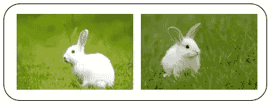
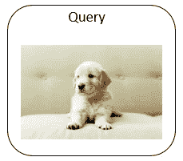
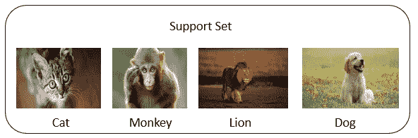

# 少数镜头学习导论

> 原文：<https://medium.com/analytics-vidhya/an-introduction-to-few-shot-learning-a7613ca5f2a?source=collection_archive---------4----------------------->

在这篇文章中，我将简单介绍一下少投学习。少量学习意味着基于非常少的样本进行分类或回归。在开始之前，我们先玩个游戏。

考虑上面的支持集。左边的两幅图像是犰狳，右边的两幅图像是穿山甲。你可能从未听说过犰狳或穿山甲，但这没关系。你只是想注意它们的不同，试着区分这两种动物。如果你不知道
的区别，我可以给你一些提示。看他们的耳朵和鳞片的大小。现在我给你一个查询图片。

你以为是犰狳还是穿山甲？现在，你可以说这是一只穿山甲。人类只需要 4 个训练样本就可以学会区分这两种动物。对于一个人来说，基于 4 个训练样本进行预测并不难。但是计算机也能做到这一点吗？如果一个类只有两个样本，计算机能做出正确的预测吗？这比标准的分类问题更难。

样本数量太少，无法训练深度神经网络。这就是少投学习发挥作用的地方。

# 目录

1.少量学习

2.支持集与训练集

3.元学习

4.少数镜头学习与监督学习

5.少数镜头学习中的术语

6.少镜头学习的预测精度

7.少镜头学习背后的基本思想

8.少镜头学习的应用

9.用于少量学习的数据集

# 1.少量学习

少量学习是基于有限数量的样本进行预测的问题。少数镜头学习不同于标准的监督学习。少镜头学习的目标不是让模型识别训练集中的图像，然后推广到测试集中。相反，目标是学习。**【学会学习】**听起来难以理解。你可以这样想。

我在一个大型训练装置上训练模型。训练的目标不是知道什么是大象，什么是老虎。相反，目标是了解
物体之间的相似性和差异。

训练结束后，你可以把这两个图像给模特看，问这两个是不是同一种动物。模型在对象之间有相似性和差异性。因此，该模型能够辨别出两幅图像中的内容是相同种类的对象。再看一下我们的训练数据。

训练数据具有不包括松鼠类的 5 个类。因此，该模型无法识别松鼠。当模型看到这两个图像时，它不知道它们是松鼠。然而，模型知道他们看起来很像。模型可以很有信心地告诉你，它们是同一类物体。

[来源](https://www.google.com/search?q=rabbit&tbm=isch&ved=2ahUKEwjEwfDzj6bwAhWrCrcAHfxvCwMQ2-cCegQIABAA&oq=rabbit&gs_lcp=CgNpbWcQA1CDnhBYqaYQYIy1EGgAcAB4AIABAIgBAJIBAJgBAKABAaoBC2d3cy13aXotaW1nwAEB&sclient=img&ei=zwyMYISeKquV3LUP_N-tGA&bih=696&biw=1366)

同样的道理，模特在训练的时候也没见过兔子。所以，它不知道这两个图像是兔子。但是模型知道事物之间的
相似性和差异性。模型知道两个图像的内容非常相似。因此，模型可以判断出它们是同一个对象。

然后我把上面两张图片给模特看。而模特从来没有见过穿山甲和狗。模型知道这两种动物看起来很不一样。模型认为它们是不同的对象。

# 2.支持集与训练集

支持集是元学习的行话。标记图像的小集合被称为支持集合。请注意训练集和支持集之间的差异。训练集很大。训练集中的每个类都有许多样本。训练集足够大，可以学习深度神经网络。相比之下，支持集很小。每个班最多有几个样本。在训练集中，如果每个类只有一个样本，就不可能训练出一个深度神经网络。支持集只能在测试时提供附加信息。以下是少投学习的基本思路。

我们不使用大的训练集来训练大的模型。我们不是训练模型来识别训练集中的特定对象，如老虎和大象，而是训练模型来了解对象之间的相似性和差异。

# 3.元学习

让我们看看什么是少射学习和元学习。

你可能听说过元学习。少击学习是元学习的一种。元学习不同于传统的监督学习。传统的监督学习要求模型识别训练数据，然后推广到看不见的测试数据。不同的是，元学习的目标是学习。

## 如何理解学会学习？

你带一个小孩去动物园。他很兴奋地看到水中的毛绒动物，这是他从未见过的。他问你，这是什么？虽然他从来没有见过这种动物，但它是一个聪明的盖子，可以自学。现在，你给这孩子一套卡片。每张卡片上都有一种动物和它的名字。这孩子从未见过水里的动物。他也从未见过卡片上的动物。但是这个小孩非常聪明，通过看所有的卡片，他知道水里的动物。水里的动物和卡片上的动物最相似。教孩子自己学习叫做**元学习**。

在去动物园之前，这个小孩已经能够自己学习了。他知道动物之间的相似和不同。在元学习中，未知动物被称为**查询**。你给他一张卡，让他自学。这套卡是**支持套**。由
自己学会学习被称为元学习。如果每个物种只有一张卡片，那么孩子只需用一张卡片就能学会识别。这就叫**一次性
学习**。

# 4.少数镜头学习与监督学习

在这里，我比较了传统的监督学习和少量学习。传统的监督学习是用一个大的训练集来训练一个模型。
模型训练完成后，我们可以使用该模型进行预测。我们向模型展示一个测试样本，它就能识别它。少量学习是一个不同的问题。这个查询示例是前所未见的。查询样本来自未知类。这是与传统监督学习的主要区别。

# 5.少数镜头学习中的术语

让我们看看几个重要的术语。

**k 路**表示支持集有 k 个类。

**n-shot** 表示每个类有 n 个样本。

支撑组称为 **k 型和 n 型**。

# 6.少镜头学习的预测精度

在进行少镜头学习时，预测精度取决于路数和镜头数。

随着路数的增加，预测精度下降。

你可能会问为什么会这样？

让我们看同一个例子。现在，孩子给了三张卡片，并要求从三张中选择一张。这是一次三向学习。如果给孩子 6 张牌会怎么样？这将是一次 6 向学习。你认为 3 路和 6 路哪个更容易？

显然，3 路比 6 路容易。三选一比六选一容易。

因此，三向比六向具有更高的精度。

随着镜头数量的增加，预测精度提高。这个现象很容易解释。样本越多，预测就越容易。因此，2 杆比 1 杆容易。

# 7.少镜头学习背后的基本思想

少镜头学习的基本思想是训练一个预测相似性的函数。

用 sim(x，x’)表示相似性函数。

它测量两个样本 x 和 x '之间的相似性。

如果两个样本相同，相似性函数返回 1。即 sim(x，x’)= 1

如果样本不同，则返回 0。即 sim(x，x’)= 0

在训练之后，所学习的相似性函数可以用于对看不见的查询进行预测。我们可以使用相似性函数将查询与支持集中的每个样本进行比较，并计算相似性得分。然后，找出相似度得分最高的样本，作为预测。

现在，我演示了少次学习如何做出预测。

[来源](https://www.rd.com/wp-content/uploads/2021/01/GettyImages-588935825.jpg)

[来源](https://www.google.com/search?q=different+types+of+animals&tbm=isch&ved=2ahUKEwjdotLWkabwAhWVB3IKHbQYCj0Q2-cCegQIABAA&oq=different+types+of+anima&gs_lcp=CgNpbWcQARgAMgUIABCxAzICCAAyAggAMgIIADICCAAyAggAMgIIADICCAAyAggAMgIIADoECAAQQzoICAAQsQMQgwE6BwgAELEDEENQ-I4IWLPDCGDG0ghoAHAAeACAAf0CiAH2I5IBCDAuNS4xMS4zmAEAoAEBqgELZ3dzLXdpei1pbWfAAQE&sclient=img&ei=qw6MYJ2hD5WPyAO0sajoAw&bih=696&biw=1366)

给定查询图像，我想知道图像是什么。

我们可以将查询与支持集中的每个样本进行比较。

将查询与 cat 进行比较，相似性函数输出相似性分数 0.6

查询和猴子之间的相似性得分是 0.4

同样，对狮子来说是 0.2，对狗来说是 0.9

在这些相似性得分中，0.9 是最大的。因此，模型预测查询是一只狗。可以通过这种方式进行一次性学习。给定一个支持集，我们可以计算查询和支持集中每个样本之间的相似性，以找到最相似的样本。

# 8.少镜头学习的应用

少镜头学习在数据科学的趋势领域有着广泛的应用，如计算机视觉、机器人等。它们可用于字符识别、图像识别和分类方法。它们在自然语言处理的一些应用中表现良好，如翻译、文本分类、情感分析等。在机器人学中，它们可以用来用少量的训练集训练机器人。

# 9.用于少量学习的数据集

如果你研究元学习，那么你需要数据集来评估你的模型。

这里我介绍两个在研究论文中最广泛使用的数据集。

Omniglot 是最常用的数据集。这是一个手写的数据集。你可以在这里得到

另一个常用的数据集是迷你图像网。[迷你影像网](https://www.kaggle.com/whitemoon/miniimagenet)

# 结束注释

我确信，到现在为止，你已经有了少量学习和元学习的概念。提出问题，应用到代码中，并从中寻找乐趣。保持
练习！

*原载于 2021 年 5 月 1 日 https://www.analyticsvidhya.com***。**