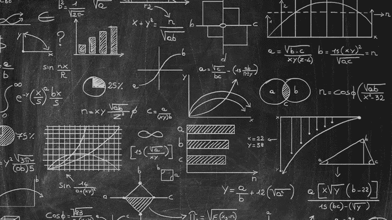

# 线性代数导论

> 原文：<https://medium.com/analytics-vidhya/an-introduction-to-linear-algebra-4de5474d65a9?source=collection_archive---------30----------------------->

# 什么是线性代数

线性代数是数学的一个分支，它让你简明地描述高维空间中平面的坐标和相互作用，并对它们进行运算。

可以把它看作是代数(处理未知数)向任意维数的扩展。线性代数是关于线性方程组的工作(线性回归就是一个例子:y = Ax)。我们不再使用标量，而是开始使用矩阵和向量(向量实际上只是一种特殊类型的矩阵)。

# 协调

x =水平
y =垂直

# 向量

在 CS 中，向量通常被描述为一个数组，数组中包含一些值。对于一个二维向量，x 为 2，y 为 1，它看起来像这样:[2，1]。

# 向量加法

假设我们有一个向量[2，1]，然后第二个向量是[4，-3]。如果我们想把这两个向量加在一起，我们将把彼此对应的值加在一起(即。x 和 x 相加，y 和 y 相加)。所以在这种情况下，我们的加法会得到[6，-2]。有时，如果我们在图形上形象化这一点，我们可以从原点(通常是[0，0])开始绘制第一组[2，1]，然后从[4，-3]的第二个值开始绘制，就好像它是图形上[2，1]的延续。结果仍然是一样的，就好像你已经得到了你的最终值[6，-2]并绘制出来。现在我们才能够看到图表是如何通过每个值前进的(如果需要的话)。

# 标量

这包括取一个向量的值，然后乘以传递给它的任何值。这就是所谓的缩放。我们用来相乘的数字本身是一个标量

# 纯量乘法

以下是一些例子:

**v = [2，1]**

*我们的向量的 x 坐标是 2，y 坐标是 1。*

**2v = [4，2]**

*这里我们基本上是把[2，1]乘以 2。这样我们就可以在图上画出[4，2]。*

**-1.8v = [-3.6，-1.8】**

*这里我们取[2，1]，首先在轴上翻转[2，1]，然后进行乘法运算，就好像-1.8 现在实际上是 1.8。这使我们接近[-3.6，-1.8]。因此，为了简化操作，我们可以考虑，如果我们试图乘以一个负值，我们可以将向量中的值从正值转换为负值(或从负值转换为正值)，然后将初始负值视为正值。*

**1/3v = [0.66，0.33]**

*这里我们取[2，1]并将其减少到其值的三分之一，因此我们将在 out 图上绘制[0.66，0.33]。*

# XY 坐标系

对于向量，我们可以把每个向量值看作一个在 xy 坐标系上操作的标量。在 xy 坐标系中，有两个非常特殊的向量:一个在原点右侧，即“I ”,另一个与原点垂直，即“j”。这两个值都是 1。这些就是我们可以称之为坐标系的‘基础’。

现在，我们可以看看两个向量值[2，1]，并把它们看作是一个标量，沿着它们的轴拉伸 I 和 j。所以现在我们有 2i 和 1j。然后我们可以将这两个缩放后的向量相加。这看起来像(2)i + (1)j。

任何时候我们缩放两个向量并把它们加在一起，就叫做“线性组合”。

需要记住的一点是，如果我们愿意，理论上我们可以使用不同的基向量。因此，如果我们的基向量实际上运行在值 2 处，而不是' I '和' j '运行在值 1 处，我们的原始向量[2，1]将不再绘制在我们图形的相同位置。它实际上会变成[4，2]。

# 线性变换及其与矩阵的关系

转型基本上只是意味着功能。一个接受输入并返回输出的函数。所以一个转换会接收一个向量并返回另一个向量。

使用“变形”这个词是因为它有助于表示运动。因此，这就像看着输入向量从它的位置移动到它的新位置(输出向量)。

形象地说，如果一个变换有两个性质，它就是线性的:1。所有行必须保持行；2.原点必须保持固定。所以如果一条线弯曲，它不是线性变换。

如果我们记得向量的值实际上可以用于沿 I 和 j 缩放，例如:v = 2i + 1j，我们可以执行转换，属性和网格线仍然保持均匀间隔。v 降落的位置仍然是 2i + 1j。

所以我们可以变换我们的向量(这意味着 I 和 j 也被变换)，我们仍然得到相同的线性组合。这意味着我们可以只根据 I 和 j 落在哪里来推断 v 必须去哪里。

# 可视化线性变换

我们可以尝试想象一下，如果我们有一个网格，上面有一个矢量，我们可以想象，如果矢量的位置保持不变，但我们实际上旋转了网格本身，矢量现在会在一个新的位置，但它如何到达那里的计算将保持不变，即使 I，j 和 v 的值会不同。

请记住，我们不必简单地通过旋转轴进行变换。如果我们愿意的话，我们可以把 I 和 j 的位置拉长，比如说，I 现在是以前的两倍长，而 j 是它现在对应的任何值。

因此，如果我们有 I 和 j，然后逆时针旋转网格 90 度，我会从[1，0]移动到[0，1]。j 将从[0，1]旋转到[-1，0]。我们可以获取这些值(无论是之前的值还是新旋转的值)并从中创建 2x2 矩阵。它看起来会是这样的*(想象方括号实际上是一个大的水平方向，而不是两个小的水平方向相互重叠)*:
【0-1】
【1 0】

每次看到矩阵，都可以认为是空间的线性变换。

关于变换，值得记住的是，我认为这只有在网格变换仍然占用和以前一样的表面积时才有效。有些东西叫做旋转，它们旋转，有些东西叫做剪切，它们变换(即拉伸)，但是我到目前为止看到的图表仍然占据了相同的空间。

因此，旋转可能会将网格旋转 90 度，而剪切可能会将矩形网格空间拉伸成平行四边形。有时这种旋转和剪切的新变换叫做“合成”。

# 矩阵乘法

矩阵乘法表示一个接一个地应用变换。
转变的顺序也很重要，因为它对结果有影响。

# 函数符号

因为我们把函数写在变量的左边。每当我们需要构造两个函数时，我们都是从右向左读。
假设支架实际上跨越了整个高度，而不是一个叠一个:
【a b】【e f】=【AE+BG af+BH】
【c b】【g h】【ce+DG cf+DH】